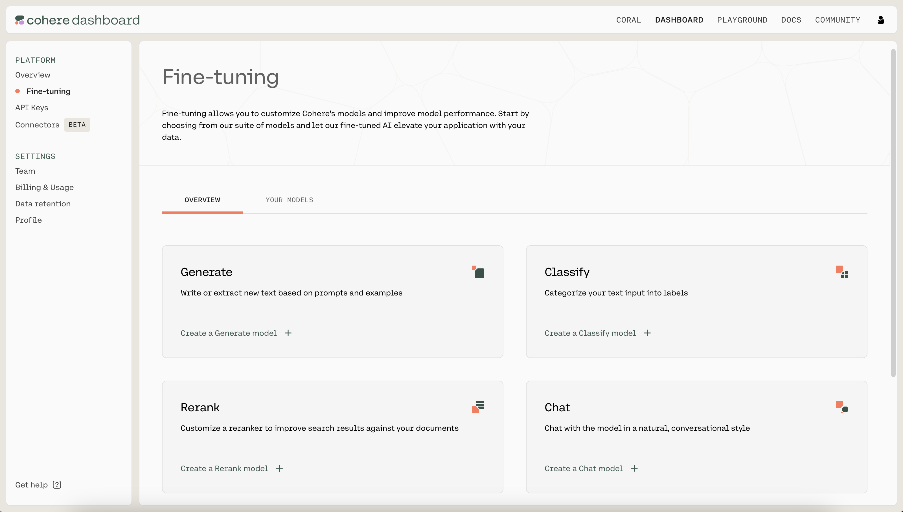
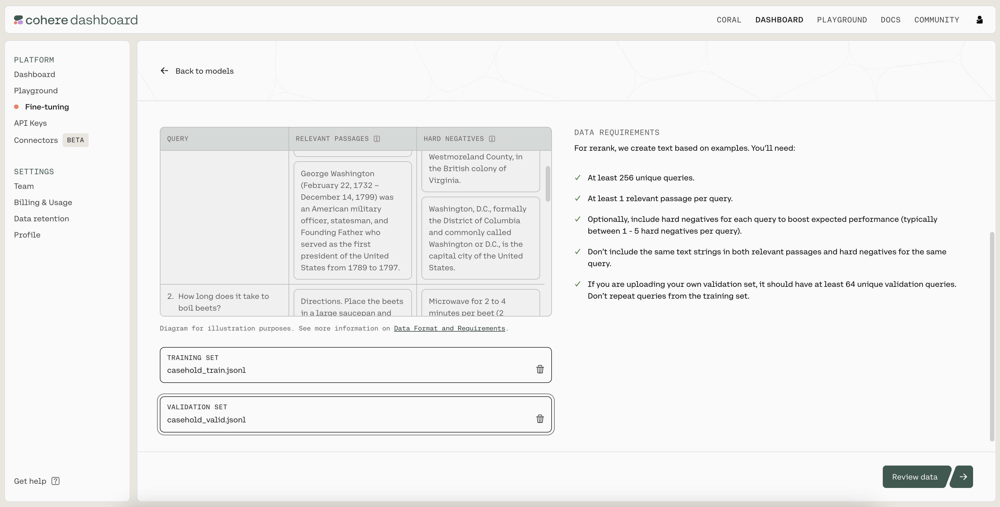
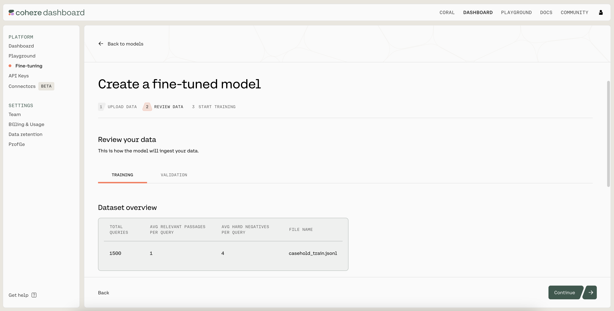
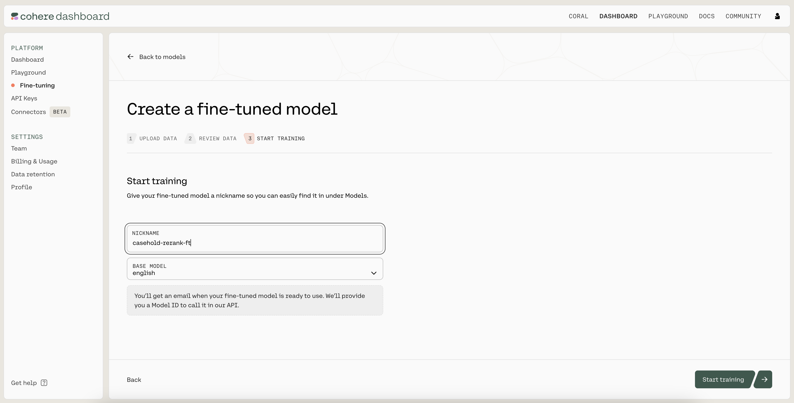
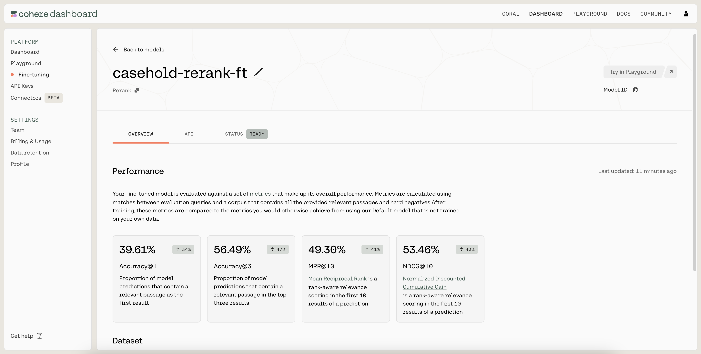
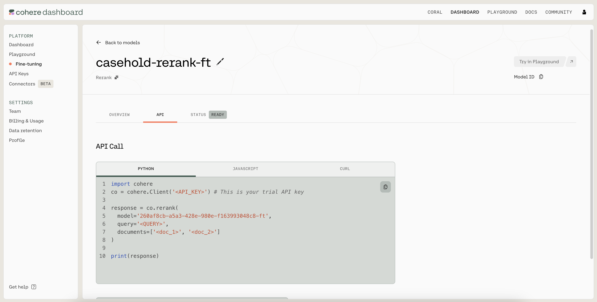

{/* [skip-file-snippets] Reason: requires other notebook */}
We’ll use [Cohere’s Dashboard](https://dashboard.cohere.com/) for the code examples. Follow along in [this notebook](https://github.com/cohere-ai/cohere-developer-experience/blob/main/notebooks/llmu/Fine_Tuning_for_Rerank.ipynb).

Cohere's Rerank endpoint is a sophisticated semantic relevance scoring and ranking system that optimizes search results by evaluating the contextual relationship between queries and passages.

However, complex domains are special challenge due to their intricate terminology, context, and domain-specific knowledge requirements. These domains include legal documents, medical research papers, scientific literature, technical manuals, developer documentation, code, financial reports, and other fields that demand a deep understanding of specific jargon and intricate concepts. These domains often necessitate fine-tuning on custom data to ensure the models capture the nuances and expertise essential for accurate comprehension.

To understand the importance of domain-specific training, we will work with a code example utilizing a dataset in the legal domain. You'll see how fine-tuning can dramatically increase model accuracy.

## Step-by-Step Guide

### Setup

We'll start by importing the tools we'll need.

```python PYTHON
import os
import cohere
import json
import jsonlines
import pandas as pd
from sklearn.model_selection import train_test_split
from datasets import load_dataset
```

Next, we'll instantiate a Cohere client. 

```python PYTHON
# Paste your API key here. Remember to not share publicly
co = cohere.Client("COHERE_API_KEY")
```

### Step 1: Prepare the Dataset

We'll work with [the CaseHOLD dataset](https://huggingface.co/datasets/casehold/casehold) from Hugging Face. CaseHOLD is a multiple choice Q&A task consisting of legal decisions referencing other decisions as precedents, called a holding statement. It's a challenging task that demands specialized legal expertise to solve. The following image shows an example data point.


We'll work with an [IterableDataset](https://huggingface.co/docs/datasets/en/about_mapstyle_vs_iterable) and load only a small fraction of examples at a time to avoid loading the entire dataset in memory.

```python PYTHON
iterable_dataset = load_dataset(
    "casehold/casehold",
    split="train",
    streaming=True,
    trust_remote_code=True,
)
```

For this example, we'll use a subset of only 420 data points, to be split across training, validation and test sets. 

The data is stored in a Pandas DataFrame `df` with 5 columns:

- `"query"` - The search query or question (in the image above, this corresponds to the "citing text" or "prompt")
- `"docs"` - A list of five documents, where only one correctly answers the query (in the image above, all five "holding statements")
- `"label"` - The index of the document that correctly answers the query (in the example in the image above, would be "0", corresponding to holding statement 0)
- `"relevant_passages"` - The document that correctly answers the query
- `"hard_negatives"`- The four documents that don't correctly answer the query

```python PYTHON
# Size of data subset
num_examples = 420

# Labels for columns containing the 5 documents in raw dataset file
all_labels = ["holding_" + s for s in ["0", "1", "2", "3", "4"]]

# Instantiate list containing the data
d = []

# Store each dataset entry as dictionary within Python list
for example in iterable_dataset.take(num_examples):
    selected_passage_idx = "holding_{}".format(example["label"])
    hard_negatives_idx = [
        x for x in all_labels if x != selected_passage_idx
    ]
    d.append(
        {
            "query": example["citing_prompt"],
            "docs": [example.get(key) for key in all_labels],
            "label": int(example["label"]),
            "relevant_passages": [example[selected_passage_idx]],
            "hard_negatives": [
                example.get(key) for key in hard_negatives_idx
            ],
        }
    )

# Convert list to Pandas dataframe, preview the dataframe
df = pd.DataFrame(d)
```

We next split the data into training (in `df_train`), validation (in `df_valid`), and test (in `df_test`) sets.

```python PYTHON
# Set number of examples for train-valid-test split
train_num = 256
valid_num = 154
test_num = 10

# Do train-validation-test split
df_train = df[:train_num].copy()
df_valid = df[train_num : train_num + valid_num].copy()
df_test = df[train_num + valid_num :].copy()
```

### Step 2: Assess the Pre-Trained Model

We'll now check the test accuracy of the pre-trained model. The `get_prediction()` function looks at a test example and uses the pre-trained model to predict the index of the document that it believes correctly answers the query.

To get predictions, we'll use the [`rerank()` method](/reference/rerank-1) of the Cohere client and supply four arguments:

- `model` - We will use [`rerank-english-v3.0`](/docs/rerank), Cohere's newest and most powerful pre-trained model for re-ranking English language documents
- `query` - The search query or question
- `documents` - List of documents to choose from
- `top_n` - Number of documents to return

```python PYTHON
# Predict index of document that corrrectly answers query
def get_prediction(item, model="rerank-english-v3.0"):
    response = co.rerank(
        model=model,
        query=item["query"],
        documents=item["docs"],
        top_n=1,
    )
    prediction = response.results[0].index
    return prediction
```

We apply this function to every row in the test set and save the predictions in new column `"baseline_prediction"`. Then, to calculate the test accuracy, we compare the predictions to the ground truth labels in the `"label"` column.

```python PYTHON
# Calculate pre-trained model's test accuracy
df_test["baseline_prediction"] = df_test.apply(get_prediction, axis=1)
print(
    "Baseline accuracy:",
    sum(df_test["baseline_prediction"] == df_test["label"])
    / len(df_test),
)
```

The pre-trained model gets 60% accuracy, which isn't bad!  But we can do better with fine-tuning.

### Step 3: Fine-Tune the Model

To prepare for fine-tuning with the Rerank endpoint, we'll need to convert the data to jsonl format, where each row is an example with three items:

- `"query"` - The search query or question
- `"relevant_passages"` - The document that correctly answers the query
- `"hard_negatives"`- The four documents that incorrectly answer the query

We do this separately for training and validation data. You can learn more about preparing the Rerank fine-tuning data in [the documentation](/docs/rerank-preparing-the-data).

```python PYTHON
# Arranges the data to suit Cohere's format
def create_rerank_ft_data(query, relevant_passages, hard_negatives):
    formatted_data = {
        "query": query,
        "relevant_passages": relevant_passages,
        "hard_negatives": hard_negatives,
    }
    return formatted_data


# Creates jsonl file if does not already exist
def create_jsonl_from_list(file_name, df):
    path = f"{file_name}.jsonl"
    if not os.path.isfile(path):
        with open(path, "w+") as file:
            for idx, row in df.iterrows():
                formatted_data = create_rerank_ft_data(
                    row["query"],
                    row["relevant_passages"],
                    row["hard_negatives"],
                )
                file.write(json.dumps(formatted_data) + "\n")
            file.close()


# Create training and validation jsonl files
create_jsonl_from_list("casehold_train", df_train)
create_jsonl_from_list("casehold_valid", df_valid)
```

The first couple lines of the training jsonl file looks as follows.

```
{'query': 'other circuits which indicate that the failure to provide such notice is reversible error, as the parties may have engaged in a different trial strategy had they known of the jury\'s advisory capacity. See Thompson v. Parkes, 963 F.2d 885, 888 (6th Cir.1992) (examining the plain language of the rule and policy considerations of trial tactics and concluding "the rule requires that the court’s initiative in ordering a trial to an advisory jury must occur, and the parties be made aware of it, before the case is submitted”); Bereda v. Pickering Creek Indus. Park, Inc., 865 F.2d 49, 53 (3d Cir.1989) (requiring a district court to "notify both sides of a jury\'s advisory status no later than the time at which the jury selection has begun”); Pradier v. Elespuru, 641 F.2d 808, 811 (9th Cir.1981) (<HOLDING>); cf. Merex A.G. v. Fairchild Weston Sys.,', 'relevant_passages': ['recognizing that there are frequently significant tactical differences in presenting a case to a court as opposed to a jury the parties are entitled to know at the outset of the trial whether the decision will be made by the judge or the jury'], 'hard_negatives': ['recognizing the right to waive a jury trial', 'recognizing that a district attorney must have reasonable latitude in fairly presenting a case to the jury and that the trial judge must have reasonable discretion in deciding whether the bounds of propriety have been exceeded', 'holding that where the meaning of the jurys verdict was not clear in light of the trial courts jury instructions the court of appeals erred in directing entry of judgment for respondent the case should have been remanded to the trial judge who was in the best position to pass upon the question of a new trial in light of the evidence his charge to the jury and the jurys verdict', 'holding that the trial judge rather than the jury makes the determination of whether the defendant violated the implied consent law']}
{'query': 'Raye Ellen Stiles appeals pro se from the district court’s summary judgment in her action alleging, among other claims, housing discrimination. We have jurisdiction under 28 U.S.C. § 1291. We review de novo and may affirm the district court on any ground supported by the record. Crowley v. Nevada, 678 F.3d 730, 733-34 (9th Cir.2012). We affirm. Summary judgment on Stiles’ claims for intentional infliction of emotional distress, aggravation of preexisting conditions, and public humiliation was proper because she already litigated these claims in Arizona state court, and, thus, res judicata precludes her from bringing such claims in federal court. See Sunkist Growers v. Fisher, 104 F.3d 280, 283-84 (9th Cir.1997) (<HOLDING>). Summary judgment on Stiles’ federal claims', 'relevant_passages': ['holding that under arizona law a litigant may not bring a claim identical to one she has previously litigated'], 'hard_negatives': ['holding that a person has standing to bring suit under the civil rights act if she or he can show that she or he was punished for trying to vindicate the rights of minorities', 'holding that plaintiff had standing to bring a rico conspiracy claim despite his inability to bring a substantive rico claim', 'holding that while parents may not bring a title ix claim as individuals they may bring such claim on behalf of a deceased child', 'holding that plaintiffs may bring a section 1983 claim for damages to vindicate their rights under idea']}
```

We kick off a fine-tuning job by navigating to the fine-tuning tab of the Dashboard. Under "Rerank", click on "Create a Rerank model".



Next, upload the .jsonl files you just created as the training and validation sets by clicking on the "TRAINING SET" and "VALIDATION SET" buttons. When ready, click on "Review data" to proceed to the next step.



Then, you'll see a preview of how the model will ingest your data. If anything is wrong with the data, the page will also provide suggested changes to fix the training file. Otherwise, if everything looks good, you can proceed to the next step.



Finally, you'll provide a nickname for your model. We used `casehold-rerank-ft` as the nickname for our model. This page also allows you to provide custom values for the hyperparameters used during training, but we'll keep them at the default values for now.



Once you have filled in a name, click on "Start training" to kick off the fine-tuning process. This will navigate you to a page where you can monitor the status of the model. A model that has finished fine-tuning will show the status as `READY`.



### Step 4: Evaluate the Fine-Tuned Model

Once the model has completed the fine-tuning process, it’s time to evaluate its performance.

Navigate to the API tab of the fine-tuned model. There, you'll see the model ID that you should use when calling `co.rerank()`.



In the following code, we calculate the test accuracy of the fine-tuned model. We use the same `get_prediction()` function as before, but now just need to pass in the fine-tuned model ID.

```python PYTHON
# Calculate fine-tuned model's test accuracy
df_test["ft_prediction"] = df_test.apply(
    get_prediction,
    model="9f22e08a-f1ab-4cee-9524-607dcb08c954-ft",
    axis=1,
)
print(
    "Fine-tune accuracy:",
    sum(df_test["ft_prediction"] == df_test["label"]) / len(df_test),
)
```

The fine-tuned model has test accuracy 80%, which is a meaningful improvement over the pre-trained model's accuracy of 60%. 

## Conclusion

In this chapter, you learned how to fine-tune a model for the Rerank endpoint on a custom dataset in the legal domain. As described in [the documentation](/docs/rerank-fine-tuning), you learned how to prepare the fine-tuning data, start a fine-tuning job, and understand the results.

For simplicity, we've worked with just a small example here. You're encouraged to use the process detailed here to fine-tune the Rerank endpoint on a larger dataset.
