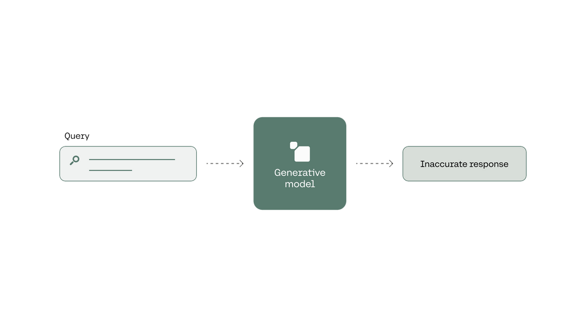
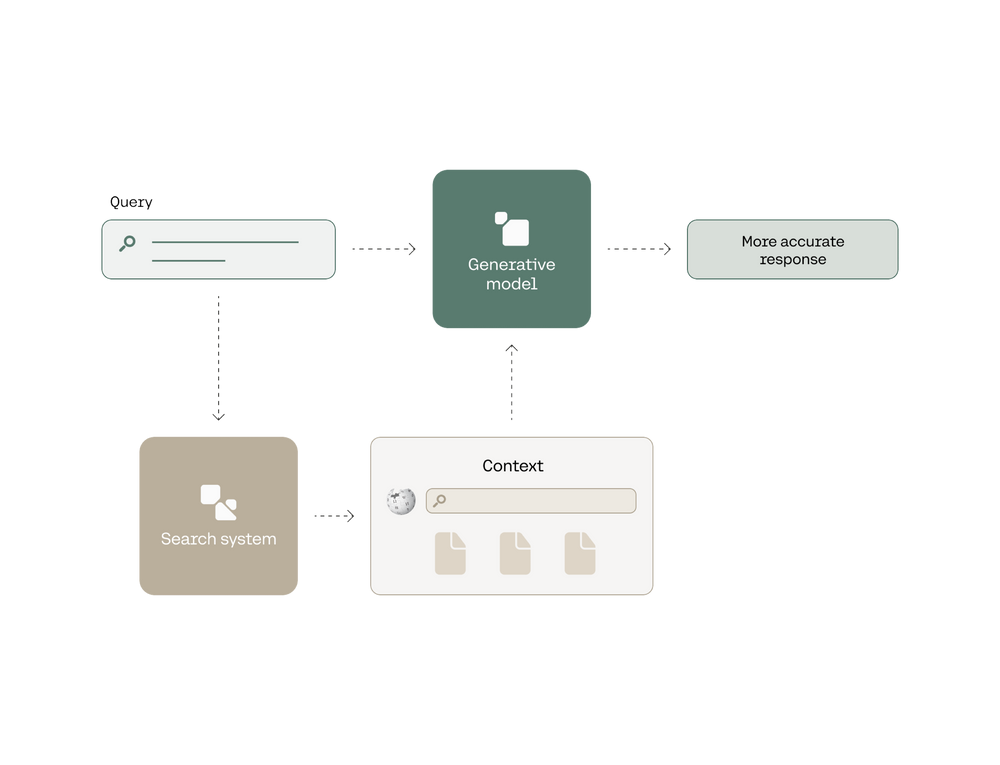

### Introduction

In this module, you’ve learned how to search and retrieve information from large databases in very effective ways. In this chapter, you’ll learn how to combine this with a generative model, in order to get an answer in sentence format, instead of a list of search results.

Large Language Models, as you know, are very good at answering questions, but they are prone to some limitations, such as incorrect information, or even hallucinations. A good way to fix this is to enhance an LLM with a search mechanism.

In short, this combination is done in the following way:  
Given a query, the search mechanism retrieves one or more documents containing the answer.  
These documents are given to the large language model, and it is instructed to generate an answer based on that information.

I like to imagine this the following way. If I have a question about thermodynamics, I can pick a random friend of mine, and ask them that question. They may or may not get the answer wrong. But if I go and search a few chapters in books about thermodynamics, I give them to my friend, and then I ask them to answer the question based on that, they are much more likely to answer the question correctly.

In this chapter, we'll compare two ways a large language model can answer a question. The first one is by feeding the question to the generative model, and obtaining an answer. This will generate an answer that could be correct, but it may not. This is equivalent to asking your friend a thermodynamics question.




The second one starts by using a search system to retrieve documents where the answer to the query is likely to appear. Then we feed the question and the documents to a generative model, and prompt it to answer the question using these documents. This yields a more accurate response.




### Colab Notebook

This chapter uses the same [Colab notebook](https://colab.research.google.com/github/cohere-ai/notebooks/blob/main/notebooks/llmu/End_To_End_Wikipedia_Search.ipynb), as the previous chapter, and we encourage you to follow it along as you read the chapter.

### Generating Answers (Without Search)

Let’s first use a generative model to answer a slightly harder question — without search. We are trying to find out how many people won more than one Nobel prize. So, we ask the model the following query.

**Query:** “How many people have won more than one Nobel prize?”

The answer to this question is five: _Marie Curie, Linus Pauling, John Bardeen, Frederick Sanger, and Karl Barry Sharpless_.

The way to ask this to the model is with the following line of code, which calls the `co.chat` endpoint.

```python PYTHON
prediction_without_search = [
    co.chat(
        message=query,
        max_tokens=50,
    ) for _ in range(5)
]
```

We call the endpoint five times to get five responses. The `max_tokens` parameter determines the length of the answer (which is why some answers appear truncated).

**Responses:**

- Marie Skłodowska-Curie, a Polish and naturalized French physicist and chemist, won the Nobel Prize twice. She received the Nobel Prize in Physics in 1903 along with her husband Pierre Curie and Henri Becquerel for their pioneering work
- Marie Skłodowska-Curie, a Polish physicist and chemist, won the Nobel Prize twice: once in physics and once in chemistry. She was awarded the Nobel Prize in Physics in 1903 along with her husband, Pierre Curie, and
- Marie Skłodowska-Curie, a Polish and naturalized French physicist and chemist, won the Nobel Prize in Physics in 1903 and the Nobel Prize in Chemistry in 1911. She is the only person to have won multiple
- Marie Skłodowska-Curie, a Polish and naturalized French physicist and chemist, won the Nobel Prize twice. She received the Nobel Prize in Physics in 1903 along with her husband, Pierre Curie, and Henri Becquerel for their
- Marie Skłodowska-Curie, a Polish and naturalized French physicist and chemist, is the only person to have won multiple Nobel prizes. She won the Nobel Prize in Physics in 1903 and the Nobel Prize in Chemistry in 19

These answers sound like they could be correct, but they’re all wrong. One reason for this is that transformers are good at talking and understanding sentiment and nuisances of the language, etc., but not so good at storing information. As a matter of fact, storing information inside the nodes of the neural network is not something that we can (or should!) fully trust.

Instead, let’s first search for the answer using what we’ve learned in the previous sections of this post.

### Searching Answers

In order to find the answer to this question in the Wikipedia dataset (the one we’ve been working with throughout this post), we can use the same `dense_retrieval` function that we used before. For simplicity, we will only use dense retrieval without Rerank, but we invite you to add it to the lab and see how the results improve!

```python PYTHON
responses = dense_retrieval(query, num_results=20)
```

This retrieves the top 20 articles, with their corresponding paragraphs. Here are the top three (remember that the search is done by finding the most similar paragraphs to the query, so some articles may appear several times with different paragraphs).

**Responses:**

- [Nobel Peace Prize](https://en.wikipedia.org/wiki?curid=26230922): “_, the Peace prize has been awarded to 110 individuals and 27 organizations …_”
- [Nobel Prize](https://en.wikipedia.org/wiki?curid=21201): “_The strict rule against awarding a prize to more than three people is also controversial …_”
- [Nobel Prize](https://en.wikipedia.org/wiki?curid=21201): “_The prize ceremonies take place annually …_”

Next, we’ll feed these 20 paragraphs to a generative model, and instruct it to answer the question in sentence format.

### Generating an Answer from the Search Results

In order to get the generative model to answer a question based on a certain context, we need to create a prompt. And in this prompt, we need to give it a command and a context. The context will be the concatenation of all the paragraphs retrieved in the search step, which we can obtain using this line of code:

```python PYTHON
context = [r['text'] for r in responses]
```

The array `context` contains a lot of text, and, given the good results we’ve been obtaining with search mechanisms, we are fairly confident that somewhere in this text lies the answer to our original question. Now, we invoke the `Chat` endpoint. The prompt we’ll use is the following.

```python PYTHON
prompt = f"""
Use the information provided below to answer the questions at the end. If the answer to the question is not contained in the provided information, say "The answer is not in the context".
---
Context information:
{context}
---
Question: How many people have won more than one Nobel prize?
"""
```

In other words, we’ve prompted the model to answer the question, but only from information coming from the `context` array. And if the information is not there, we are prompting the model to state that the answer is not in the context. The following line of code will run the prompt. As before, we generate 5 answers, and `max_tokens` controls the length of each answer.

```python PYTHON
prediction_with_search = [
    co.chat(
        message=prompt,
        max_tokens=50)
    for _ in range(5)]
```

The five responses we get are the following (just like before, they are truncated):

- Five people have won multiple Nobel prizes, according to the information provided. However, the source also states that another individual, Lê Đức Thọ, refused to accept the prize, and is therefore not counted among the winners. This brings the total number of multiple
- Five people have won multiple Nobel prizes, according to the information provided. However, the source also states that another individual, Lê Đức Thọ, refused to accept the prize, and is therefore not counted among the winners. This brings the total number of multiple
- Five people have won multiple Nobel prizes, according to the information provided. However, the source also states that another individual, Lê Đức Thọ, refused to accept the prize, and is therefore not counted among the winners. This brings the total number of multiple
- Five people have won multiple Nobel prizes, according to the information provided. However, the source also states that another individual, Linus Pauling, was awarded two prizes but these were of different types, in different years. Marie Curie is the only person to
- Five people have won multiple Nobel prizes, according to the information provided. However, the source also states that another individual, Lê Đức Thọ, refused to accept the prize, and is therefore not counted among the winners. This brings the total number of multiple

As you can see, this improved the quality of the answer. It got the right number of people who received more than one Nobel prize, which is 5.

### Conclusion

Generative models are prone to hallucinations. For example, when asked a question, they may answer with an incorrect answer. In this chapter you learned to power a generative model with search, in order to generate more accurate answers and reduce the chance of hallucinations.

### Original Source

This material comes from the post [Using LLMs for Search with Dense Retrieval and Reranking](https://txt.cohere.com/using-llms-for-search/).
