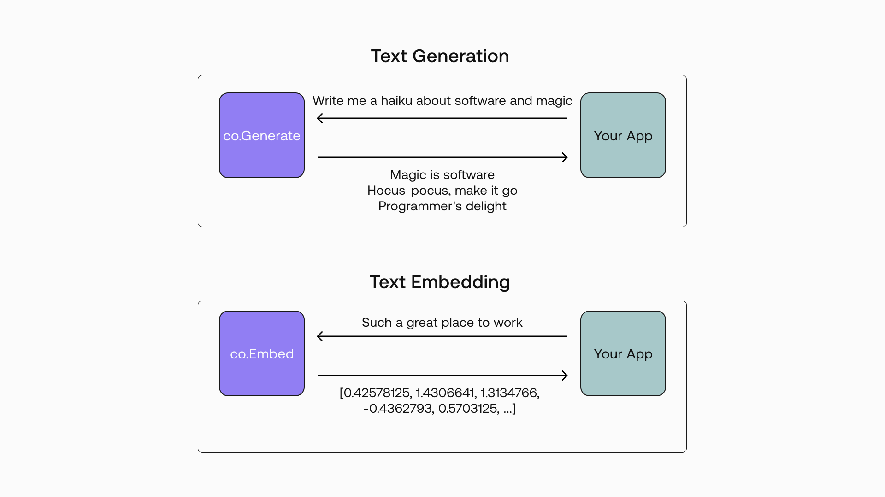
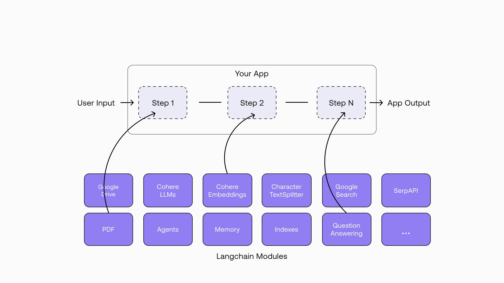
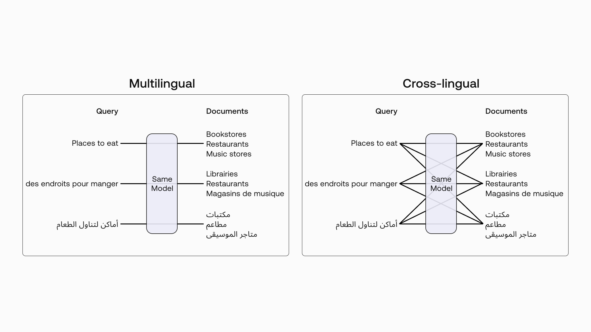
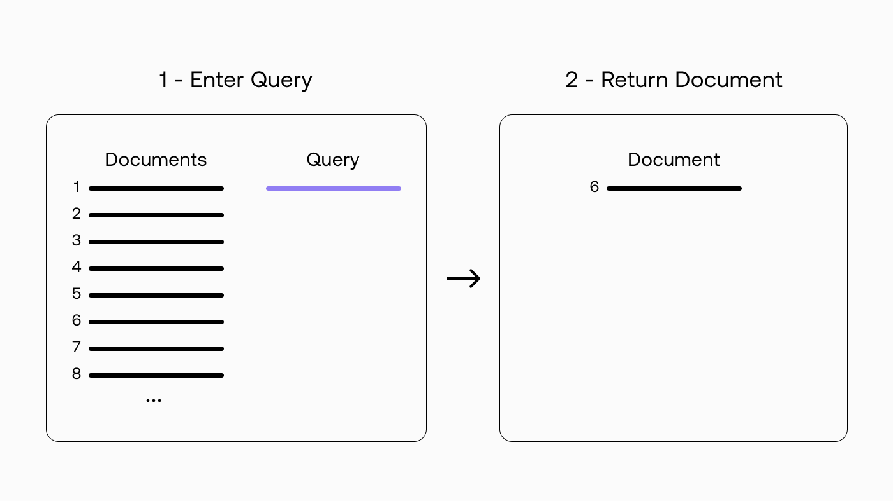
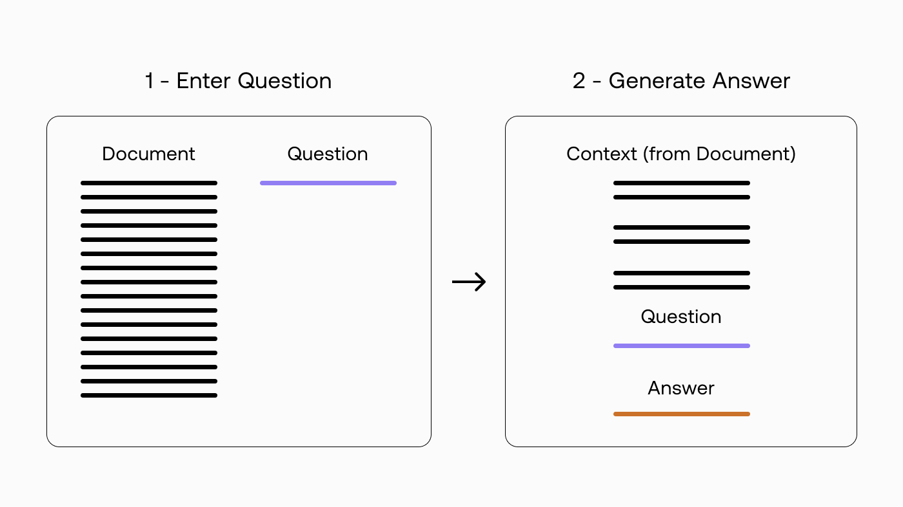
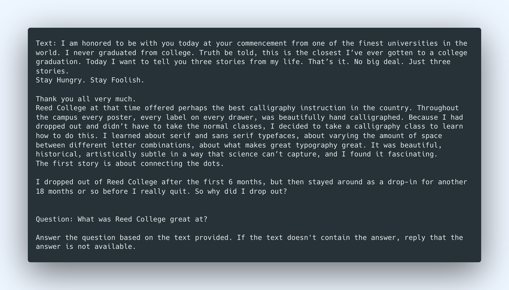

# Introduction and Codelab

This lab looks at how we can use the Cohere Platform and Langchain to build end-to-end pipelines for multilingual semantic search. We start with a basic semantic search example where we import a list of documents, turn them into text embeddings, and return the most similar document to a query. Then we build a more complex application that can answer questions about a long-form document, such as an article.

This chapter is accompanied by a [codelab](https://colab.research.google.com/github/cohere-ai/cohere-developer-experience/blob/main/notebooks/Multilingual_Search_with_Cohere_and_Langchain.ipynb?ref=txt.cohere.com) which we encourage you to follow along as you read the chapter.

The summary above was generated by Cohere’s new Summarize Beta endpoint, with minor editing. Learn more about [the endpoint here](/reference/summarize-2?ref=txt.cohere.com&__hstc=14363112.89f2baed82ac4713854553225677badd.1682345384753.1682611655483.1682709019083.16&__hssc=14363112.1.1682709019083&__hsfp=2014138109).

# Introduction

The Cohere Platform provides an API for developers and organizations to access cutting-edge LLMs without needing machine learning know-how. The platform handles all the complexities of curating massive amounts of text data, model development, distributed training, model serving, and more. This means that developers can focus on creating value on the applied side rather than spending time and effort on the capability-building side.

There are two key types of language processing capabilities that the Cohere Platform provides — [text generation](https://cohere.com/blog/search-cohere-langchain/#:~:text=Cohere%20Platform%20provides%20%E2%80%94-,text%20generation,-and%20text%20embedding) and [text embedding](/reference/embed?ref=txt.cohere.com&__hstc=14363112.89f2baed82ac4713854553225677badd.1682345384753.1682611655483.1682709019083.16&__hssc=14363112.1.1682709019083&__hsfp=2014138109) — and each is served by a different type of model.

With text generation, we enter a piece of text, or prompt, and get back a stream of text as a completion to the prompt. One example is asking the model to write a haiku (the prompt) and getting an originally written haiku in return (the completion).

With text embedding, we enter a piece of text and get back a list of numbers that represents its semantic meaning (we’ll see what “semantic” means in a section below). This is useful for use cases that involve “measuring” what a passage of text represents, for example, in analyzing its sentiment.




# Overview of Langchain

To create true value to end users, these models in isolation are often not enough. A truly powerful app emerges when you are able to combine them with other sources of computation or knowledge. This is where [Langchain](https://langchain.readthedocs.io/en/latest/?ref=txt.cohere.com) comes into the picture. It is an open source library that provides abstractions for building LLM-based applications. Langchain makes it easy and fast to put together an end-to-end application via its wide range of modules. Think Lego blocks for LLM applications.

In this article, we’ll explain how to use Langchain’s Chains and Indexes modules to build end-to-end pipelines with very few lines of code.




# Overview of Multilingual Semantic Search

Our focus in this article is multilingual semantic search.

In module 2 of this couse, you've learned what semantic search is, but here is a recap.

Semantic search provides search capabilities based on the contextual meaning of a passage of text. It solves the limitation of the alternative method, which is keyword search.

Here’s an example. Let’s take a query: “places to eat”. A semantic search system would be able to associate this to “restaurants” because their meanings are similar. It’s not possible to do that with keyword search because the results will be limited to the keywords “places,” “to,” and “eat.”

And what is multilingual search?

It is a search capability not limited to one language in the query and the results. To build such systems, traditionally, you would have to build individual pipelines for each language, meaning your system will be bloated, costly, and inefficient. But with Cohere’s multilingual embedding model, you need just one embedding model to handle 100+ languages.

When talking about multilingual models, there are two types of searches: multilingual and cross-lingual.

Multilingual search happens when the query and the result are of the same language, for example, an English query of “places to eat” returning an English result of “Bob's Burgers.”

Cross-lingual search happens when the query and the result are of a different language, for example, a Hindi query of “खाने की जगह” (places to eat) returning an English result of “Bob's Burgers.”




With Cohere’s multilingual embedding model, we can do both multilingual and cross-lingual searches using one single model. Let’s dive in and see how it works.

# Example 1: Basic Multilingual Search




In this first example, we’ll create a semantic search pipeline for searching the most relevant documents from a list of documents. An example application is a recommendation system for podcasts or articles.

We’ll compare a query with a list of documents from a questions dataset, and then return the documents that are the most similar to the query.

While the documents are in English, we’ll see how good the model is at cross-lingual search. We’ll enter queries in five languages and see if the results match our expectations.

## Step 1: Import a List of Documents

First we import a dataset containing a list of questions from the Text REtrieval Conference (TREC) Question Classification dataset. We can take the dataset from the publicly available Tensorflow Datasets library.

```
import tensorflow_datasets as tfds
dataset = tfds.load('trec', split='train')
texts = [item['text'].decode('utf-8') for item in tfds.as_numpy(dataset)]
```

This dataset contains 5,452 documents. Here are a few sample documents from the dataset, where each document is a question:

```
What is the starting salary for beginning lawyers ?
Where did Bill Gates go to college ?
What task does the Bouvier breed of dog perform ?
What are the top boy names in the U.S. ?
What is a female rabbit called ?
```

## Step 2: Embed the Documents and Store Them in an Index

Next is where the magic happens. We turn each document into a text embedding, which are number representations of text that captures its context and meaning. Then we put these embeddings in a vector database (also called “index”) so our system can perform the search in a scalable and efficient way.

With Langchain, we can do that with just two lines of code.

The first defines the embeddings model, where we initialize the _CohereEmbeddings_ object with the multilingual model _multilingual-22-12_.

The second turns the documents into text embeddings and indexes them in a vector database.  Several vector database options are available; in our case, we use Chroma, an open-source embedding database library.

Optionally we can add metadata to the index, and here we included the item ID.

```
# Define the embeddings model
embeddings = CohereEmbeddings(model = "multilingual-22-12")

# Embed the documents and store in index
docsearch = Chroma.from_texts(texts, embeddings, metadatas=[{"source": f"{i}"} for i in range(len(texts))])
```

## Step 3: Enter a Query

We enter a new search query: “How to get in touch with Bill Gates”

Now, looking at the documents, three items contain the term “Bill Gates”:

```
What is Bill Gates of Microsoft E-mail address ?
Where did Bill Gates go to college ?
How many square feet is Bill Gates ' home ?
```

None of these contains exactly the term we are looking for with the same keyword. A traditional keyword search would fail to distinguish the most relevant document between these three.

However, with semantic search, we should expect to get the document “What is Bill Gates of Microsoft email address ?” as the most similar query, because “get in touch” and “email address” imply a similar intent.

But let’s not stop there. The multilingual model can also perform well at cross-lingual tasks. So we’ll enter the same query in three other languages: French, Hindi, and Indonesian.

```
queries = ["How to get in touch with Bill Gates",
           "Comment entrer en contact avec Bill Gates",
           "बिल गेट्स से कैसे संपर्क करें",
           "Cara menghubungi Bill Gates"]

queries_lang = ["English", "French", "Hindi", "Indonesian"] 
```

Let’s see how the model performs.

## Step 4: Return the Document Most Similar to the Query

Now we take the query and pass through the _similarity_search_ method to get the document most similar to the query. Here we take the _page_content_ attribute of the top-most document, hence the [0] index.

```
answers = []
for query in queries:
  docs = docsearch.similarity_search(query)
  answers.append(docs[0].page_content)
```

And below are the results for the query in the four different languages: English, French, Hindi, and Indonesian. The search engine successfully finds the most semantically similar document to the query.

```
Query language: English
Query: How to get in touch with Bill Gates
Most similar existing question: What is Bill Gates of Microsoft E-mail address ?
-------------------- 

Query language: French
Query: Comment entrer en contact avec Bill Gates
Most similar existing question: What is Bill Gates of Microsoft E-mail address ?
-------------------- 

Query language: Hindi
Query: बिल गेट्स से कैसे संपर्क करें
Most similar existing question: What is Bill Gates of Microsoft E-mail address ?
-------------------- 

Query language: Indonesian
Query: Cara menghubungi Bill Gates
Most similar existing question: What is Bill Gates of Microsoft E-mail address ?
-------------------- 
```

In this example, we saw how we can leverage Langchain to build a semantic search system with just a few lines of code; faster than if you were to build it from scratch. This theme continues in the following example.

# Example 2: Search-Based Question Answering




In this second example, we’ll use semantic search to answer questions about a long-form document, such as an article. Here, we take a question from the user, search for the most relevant passages in the document, and use these to generate an answer. An example application is the search bar for a documentation website.

This time, we’ll add a text generation model to the pipeline so we can perform the answer generation part.

And to keep it simple, we’ll look at an all-English example, from the query to the text generation. Having said that, we can use the same _multilingual-22-12_ model for the embedding part since it is a multilingual model.

## Step 1: Add an Article and Chunk It into Smaller Passages

We’ll use a single long-form article as an example, which is [Steve Jobs’ Stanford University 2005 commencement address](https://news.stanford.edu/2005/06/12/youve-got-find-love-jobs-says/?ref=txt.cohere.com).

The first step is to chunk the text into smaller pieces so we can embed each piece later. Here we can use Langchain’s built-in split_text method from the CharacterTextSplitter module. We can define the chunk size in characters (we choose 300) and if we want the chunks to overlap by a certain number of characters (we choose 0).

```
with open('steve-jobs-commencement.txt') as f:
    text = f.read()
text_splitter = CharacterTextSplitter(chunk_size=300, chunk_overlap=0)
texts = text_splitter.split_text(text)
```

## Step 2: Embed the Passages and Store Them in an Index

This step is the same as in the first example, where we turn each chunk into a text embedding, using the same multilingual model, and index these embeddings in a vector database.

```
embeddings = CohereEmbeddings(model = "multilingual-22-12")
docsearch = Chroma.from_texts(texts, embeddings, metadatas=[{"source": f"{i}"} for i in range(len(texts))])
```

## Step 3: Enter a Question

Next, we enter a list of questions that we’d like to get answers for. Below are the five questions we’ll ask. The first three are questions that require factual answers. The fourth is more of an opinion-based question with no one correct answer. Finally, the fifth question asks about factual information we know is not available in the context.

```
questions = [
           "What did the author liken The Whole Earth Catalog to?",
           "What was Reed College great at?",
           "What was the author diagnosed with?",
           "What is the key lesson from this article?",
           "What did the article say about Michael Jackson?",
           ]
```

Let’s see if we can get the answers we’re expecting.

## Step 4: Answer the Question Based on the Most Relevant Passages

We need to take two steps to get answers to the questions.

The first step is to find the chunks of text most relevant to the question. We use the same _similarity_search_ method to get the passage most similar to the query. But this time, instead of just the top result, we want to get the top-four results (a default number you can change).

Why is this so? The bigger the context, the more information becomes available to the text generation model, which we’ll use in the next step.

The second step is to use these passages as the context to answer the question. Here, we’ll use Cohere’s text generation model _command-xlarge-nightly_ to generate the answer.

To generate the answer, we need to provide  the following as a prompt to the text generation model:

An instruction of what we want it to generate  
The context, which are the chunks of text that are the most relevant to the question  
The question  
With Langchain, we can use the _load_qa_chain_ method to pack the whole thing together: creating the prompt and calling the text generation model.

The method comes with a predefined prompt, but we can modify it using the _PromptTemplate_ module. I found that modifying the prompt for this particular example returns better results, and here’s what it looks like:

```
prompt_template = """Text: {context}

Question: {question}

Answer the question based on the text provided. If the text doesn't contain the answer, reply that the answer is not available."""


PROMPT = PromptTemplate(
    template=prompt_template, input_variables=["context", "question"]
)
```

And here’s what the code looks like:

```
chain = load_qa_chain(Cohere(model="command-xlarge-nightly", temperature=0), chain_type="stuff", prompt=PROMPT)

for question in questions:
  docs = docsearch.similarity_search(question)
  answer = chain.run(input_documents=docs, question=question)
```

And below are the answers we get. They seem to be spot on!

The first three are factual answers, which the system extracts from the text. The fourth is an open-ended question, in which the system provides a reasonable answer based on passages in the text. And the fifth question is answered correctly, where there is no information from the text to answer the question.

```
Question: What did the author liken The Whole Earth Catalog to?
Answer: The Whole Earth Catalog was like Google in paperback form, 35 years before Google came along.
-------------------- 

Question: What was Reed College great at?
Answer: Calligraphy instruction
-------------------- 

Question: What was the author diagnosed with?
Answer:  cancer
-------------------- 

Question: What is the key lesson from this article?
Answer: Stay Hungry. Stay Foolish.
-------------------- 

Question: What did the article say about Michael Jackson?
Answer: The article didn't contain the answer to the question.
```

If you are curious about what the complete prompt looks like with the context appended, below is an example, which is the prompt for the second question on the list: “What was Reed College great at?”




# Conclusion

In this chapter, we looked at two key things.

The first is the power of using a single multilingual embedding model to efficiently build a search application that requires multilingual support, a common need these days. There is no need to build complex interfaces and pipelines to support different languages, but instead, we can use one pipeline to cover 100+ languages.

The second is the ease and efficiency of building such applications when paired with the Langchain library, simplifying the process of building end-to-end pipelines via its modules such as Chains, Indexes, and more.

This is quite a powerful combination. It means you can now build and tinker with multilingual semantic search applications (and beyond) with the least friction. The more efficient you are, the more experiments you can make, and the faster you get to that app that truly makes a difference.
