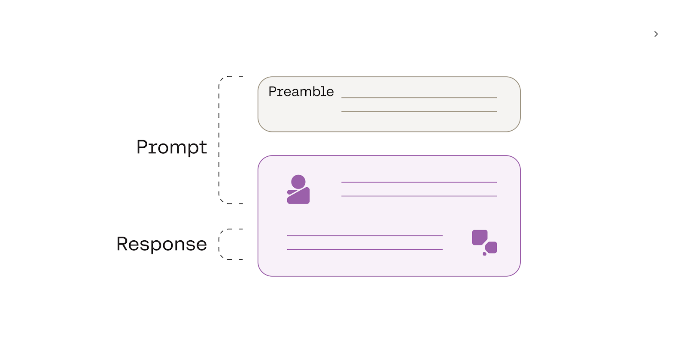
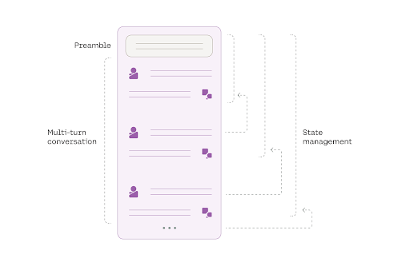

We’ll use [Cohere’s Python SDK](/reference/about?ref=txt.cohere.com#python) for the code examples. Follow along in [this notebook](https://github.com/cohere-ai/cohere-developer-experience/blob/main/notebooks/llmu/Building_a_Chatbot.ipynb). 

Understanding [text generation (Chapter 1)](/docs/introduction-to-text-generation) is the first step to creating your own chatbot, but the real learning takes place when you start building one from scratch. In this chapter, you’ll learn how to use Cohere’s Chat endpoint to build a simple chatbot that can respond to user messages and maintain the context of the conversation.

Additionally, [the API reference](/reference/chat?ref=txt.cohere.com) page contains a detailed description of the Chat endpoint’s input parameters and response objects.

## Step-by-Step Guide

### Step 1: Quickstart

To set up, we first import the Cohere module and create a client.

```python PYTHON
import cohere

co = cohere.Client("COHERE_API_KEY")  # Your Cohere API key
```

At its most basic, we only need to pass to the Chat endpoint the user message using the `message` parameter – the only required parameter for the endpoint.


Here’s an example. We call the endpoint with "Hello" as the user message. In our case, we also use the `model` parameter to specify the underlying chat model we want to use. For this, we pick Command A, Cohere's newest large language model.

Right now, we’re interested in the main content of the response, which is stored in the `text` value of the response.

```python PYTHON
response = co.chat(message="Hello", model="command-a-03-2025")
print(response.text)
```

```
# RESPONSE

Hello! How can I help you today?
```

### Step 2: Defining a Preamble

A conversation starts with a system message, or a preamble, to help steer a chatbot’s response toward certain characteristics. For example, if we want the chatbot to adopt a formal style, the preamble can be used to encourage the generation of more business-like and professional responses.



In the quickstart example, we didn’t have to define a preamble because a default one was used. We can, however, define our own preamble using the `preamble` parameter.

Here’s an example. We added a preamble telling the chatbot to assume the persona of an expert public speaking coach. As a result, we get a response that adopts that persona.

```python PYTHON
response = co.chat(
    message="Hello",
    model="command-a-03-2025",
    preamble="You are an expert public speaking coach. Don't use any greetings.",
)
print(response.text)
```

```
# RESPONSE

How can I help you with your public speaking today?
```

### Step 3: Streaming the Chatbot Response

Our examples so far generate responses in a non-streamed manner. This means that the endpoint would return a response object only after the model has generated the text in full. The longer the text is, the longer it takes to get back the response. If you are building an application, this directly impacts the user’s perception of the application’s latency.

The Chat endpoint solves this problem by supporting streamed responses. In a streamed response, the endpoint would return a response object for each token as it is being generated. This means you can display the text incrementally without having to wait for the full completion.

To activate it, use `co.chat_stream()` instead of `co.chat()`.

In streaming mode, the endpoint will generate a series of objects. To get the actual text contents, we take objects whose `event_type` is `text-generation`.

If you have not already, make your own copy of the Google Colaboratory notebook and run the code in this section to see the same example with streamed responses activated.

```python PYTHON
stream = co.chat_stream(
    message="Hello. I'd like to learn about techniques for effective audience engagement",
    model="command-a-03-2025",
    preamble="You are an expert public speaking coach",
)

for event in stream:
    if event.event_type == "text-generation":
        print(event.text, end="")
```

```
# RESPONSE (Streamed)

Sure! Here are some techniques for effective audience engagement:

- **Make eye contact:** Look at different individuals in the audience and try to maintain eye contact for a few seconds at a time. This helps create a sense of connection and makes your speech more intimate.

- **Use gestures:** Incorporate hand gestures and body language to emphasize your points and add variety to your delivery. This helps keep your audience engaged and can also help you appear more confident and passionate about your topic.

- **Vary your tone and volume:** Avoid monotone delivery by varying your pitch, pace, and volume. Emphasize important points by raising your volume or slowing down your pace. This helps to create emphasis and keeps your audience interested.

- **Ask questions:** Pose rhetorical questions to your audience to get them thinking about your topic. You can also directly ask for their opinions or input, either by a show of hands or by inviting them to share their thoughts. This creates a dialogue and makes your speech more interactive.

- **Tell stories:** Use anecdotes and personal stories to illustrate your points and create a connection with your audience. Stories are memorable and help your audience relate to you and your message.

- **Use humor:** Appropriate humor can help to lighten the mood, engage your audience, and make your speech more enjoyable. However, be careful to avoid offensive or inappropriate jokes, and ensure your humor is relevant to your topic.

- **Incorporate multimedia:** Use slides, videos, or props to enhance your presentation. Visual aids can help to break up your speech, provide additional information, and keep your audience focused.

- **Encourage interaction:** If appropriate, include activities that involve your audience. This could be a group exercise, a poll, or a Q&A session. This helps to create a more engaging and interactive experience for your audience.

- **Be passionate:** Show your enthusiasm for your topic. Audiences are more likely to engage if they sense your passion and authenticity. Let your personality shine through and speak from the heart.

- **Practice and adapt:** Rehearse your speech and pay attention to your delivery. Practice in front of a mirror, record yourself, or seek feedback from others. This will help you refine your technique and improve your audience engagement skills.

Remember, effective audience engagement is about creating a connection and making your speech memorable. By using these techniques and adapting them to your own style and personality, you can deliver a compelling presentation that resonates with your audience.
```

### Step 4: Building the Chat History

At the core of a conversation is a multi-turn dialog between the user and the chatbot. This requires the chatbot to have a “memory” of all the previous turns to maintain the state of the conversation.

#### Option 1: Using the Conversation History Persistence Feature

The Chat endpoint supports state management by persisting the conversation history. As a conversation progresses, the endpoint continuously updates the conversation history. This means developers don’t have to deal with the complexity and inconvenience of managing conversation history in their application.




To use this feature, use the `conversation_id` parameter, which is a unique string you assign to a conversation. We'll use the `uuid` library to do this.

Putting everything together, let’s now build a simple chat interface that takes in a user message, generates the chatbot response, automatically updates the conversation history, and repeats these steps until the user quits the conversation. 

As described before, in streaming mode, the Chat endpoint generates a series of objects. To get the conversation history, we take the object with `event_type` of `"stream-end"` and save it as a new variable `chat_history`.

```python PYTHON
import uuid

# Create a conversation ID
conversation_id = str(uuid.uuid4())

# Define the preamble
preamble = "You are an expert public speaking coach"

print('Starting the chat. Type "quit" to end.\n')

while True:

    # User message
    message = input("User: ")

    # Typing "quit" ends the conversation
    if message.lower() == "quit":
        print("Ending chat.")
        break

    # Chatbot response
    stream = co.chat_stream(
        message=message,
        model="command-a-03-2025",
        preamble=preamble,
        conversation_id=conversation_id,
    )

    print("Chatbot: ", end="")

    for event in stream:
        if event.event_type == "text-generation":
            print(event.text, end="")
        if event.event_type == "stream-end":
            chat_history = event.response.chat_history

    print(f"\n{'-'*100}\n")
```

```
# RESPONSE (Streamed)

Starting the chat. Type "quit" to end.

User: Hello
Chatbot: Hello! How can I help you today?
----------------------------------------------------------------------------------------------------

User: I'd like to learn about techniques for effective audience engagement
Chatbot: Sure! Here are some techniques for effective audience engagement:

- Make eye contact with your audience and use hand gestures to emphasize your points.
- Use a clear and concise language that your audience can easily understand.
- Vary your tone and volume to keep your audience interested.
- Use visual aids such as slides, props, or demonstrations to help illustrate your points.
- Tell stories or anecdotes to help your audience connect with your message on a personal level.
- Ask questions to involve your audience and encourage them to think about your topic.
- Use humor appropriately to keep your audience entertained and engaged.
- Be enthusiastic and passionate about your topic to show your audience that you care about what you're talking about.
- Connect with your audience by showing that you understand their interests and concerns.
- End your speech with a call to action that encourages your audience to take action on your topic.

Remember, effective audience engagement is about creating a connection with your audience and making your speech memorable and enjoyable for them.
----------------------------------------------------------------------------------------------------

User: Could you elaborate on the third point?
Chatbot: Sure! Varying your tone and volume is an important technique for keeping your audience engaged. Here are some tips:

- Use a varied tone of voice to express different emotions and emphasize certain words or phrases. For example, you might use a serious tone to convey the importance of a particular issue, or an excited tone to show your enthusiasm for a new idea.
- Change your volume to highlight important points or to create a sense of drama. Speaking loudly can help to emphasize a particular word or phrase, while speaking softly can create a sense of intimacy or seriousness.
- Avoid monotony by varying your pitch and pace. A monotone delivery can be boring and make it difficult for your audience to stay focused. Try to vary your pitch and pace to keep your audience engaged.
- Practice your speech or presentation beforehand to get a feel for how your tone and volume can impact your delivery. Experiment with different tones and volumes to see what works best for your style and your message.

By varying your tone and volume, you can add interest and emphasis to your speech, and keep your audience engaged and responsive.
----------------------------------------------------------------------------------------------------

User: quit
Ending chat.
```

Next, we print the full conversation history.

```python PYTHON
for chat in chat_history:
    print(chat)
```

```
role='USER' message='Hello' generation_id='b4146b59-0884-4aa3-a573-bb6bd4948511' response_id='b72e9f29-ac13-41e2-8892-b6529f9547f2'
role='CHATBOT' message='Hello! How can I help you today?' generation_id='3a002415-0213-49b9-8d4b-b7c24eba95f8' response_id='b72e9f29-ac13-41e2-8892-b6529f9547f2'
role='USER' message="I'd like to learn about techniques for effective audience engagement" generation_id='fee7fbf4-fd93-4477-b987-bd2765694962' response_id='520e2329-979b-4e4b-9cdc-b2e4b49c3612'
role='CHATBOT' message="Sure! Here are some techniques for effective audience engagement:\n\n- Make eye contact with your audience and use hand gestures to emphasize your points.\n- Use a clear and concise language that your audience can easily understand.\n- Vary your tone and volume to keep your audience interested.\n- Use visual aids such as slides, props, or demonstrations to help illustrate your points.\n- Tell stories or anecdotes to help your audience connect with your message on a personal level.\n- Ask questions to involve your audience and encourage them to think about your topic.\n- Use humor appropriately to keep your audience entertained and engaged.\n- Be enthusiastic and passionate about your topic to show your audience that you care about what you're talking about.\n- Connect with your audience by showing that you understand their interests and concerns.\n- End your speech with a call to action that encourages your audience to take action on your topic.\n\nRemember, effective audience engagement is about creating a connection with your audience and making your speech memorable and enjoyable for them." generation_id='2cc3d664-587f-4f1c-8c45-4ac658bb1668' response_id='520e2329-979b-4e4b-9cdc-b2e4b49c3612'
role='USER' message='Could you elaborate on the third point?'
role='CHATBOT' message='Sure! Varying your tone and volume is an important technique for keeping your audience engaged. Here are some tips:\n\n- Use a varied tone of voice to express different emotions and emphasize certain words or phrases. For example, you might use a serious tone to convey the importance of a particular issue, or an excited tone to show your enthusiasm for a new idea.\n- Change your volume to highlight important points or to create a sense of drama. Speaking loudly can help to emphasize a particular word or phrase, while speaking softly can create a sense of intimacy or seriousness.\n- Avoid monotony by varying your pitch and pace. A monotone delivery can be boring and make it difficult for your audience to stay focused. Try to vary your pitch and pace to keep your audience engaged.\n- Practice your speech or presentation beforehand to get a feel for how your tone and volume can impact your delivery. Experiment with different tones and volumes to see what works best for your style and your message.\n\nBy varying your tone and volume, you can add interest and emphasis to your speech, and keep your audience engaged and responsive.'
```

#### Option 2: Managing the Conversation History Yourself

If you opt not to use the endpoint’s conversation history persistence feature, you can use the `chat_history` parameter to manage the conversation history yourself.

The chat history is a list of multiple turns of messages from the user and the chatbot. Each item is a `cohere.ChatMessage` object containing the `role`, which can be either `”USER”` or `”CHATBOT”`, and the `message` containing the message string. The following is an example of a chat history.

```python PYTHON
from cohere import ChatMessage

chat_history = [
    ChatMessage(role="USER", message="What is 2 + 2"),
    ChatMessage(role="CHATBOT", message="The answer is 4"),
    ChatMessage(role="USER", message="Add 5 to that number"),
    ChatMessage(role="CHATBOT", message="Sure. The answer is 9"),
    ...,
]
```

The following modifies the previous implementation by using `chat_history` instead of `conversation_id` for managing the conversation history.

```python PYTHON
# Initialize the chat history
chat_history = []

# Define the preamble
preamble = "You are an expert public speaking coach"

print('Starting the chat. Type "quit" to end.\n')

while True:

    # User message
    message = input("User: ")

    # Typing "quit" ends the conversation
    if message.lower() == "quit":
        print("Ending chat.")
        break

    # Chatbot response
    stream = co.chat_stream(
        message=message,
        model="command-a-03-2025",
        preamble=preamble,
        chat_history=chat_history,
    )

    chatbot_response = ""
    print("Chatbot: ", end="")

    for event in stream:
        if event.event_type == "text-generation":
            print(event.text, end="")
            chatbot_response += event.text
    print("\n")

    # Add to chat history
    chat_history.extend(
        [
            ChatMessage(role="USER", message=message),
            ChatMessage(role="CHATBOT", message=chatbot_response),
        ]
    )
```

```
# RESPONSE (Streamed)

Starting the chat. Type "quit" to end.

User: Hello
Chatbot: Hello! How can I help you today?

User: I'd like to learn about techniques for effective audience engagement
Chatbot: Sure! Here are some techniques for effective audience engagement:

- Make eye contact with your audience and use hand gestures to emphasize your points.
- Use a clear and concise language that your audience can easily understand.
- Vary your tone and volume to keep your audience interested.
- Use stories, examples, and analogies to illustrate your points and make your message more memorable.
- Ask questions to involve your audience and encourage them to think about your topic.
- Use humor appropriately to lighten the mood and engage your audience.
- Use visuals, such as slides, photos, or props, to break up your speech and add interest.
- Move around the stage or room to change your position and keep your audience focused.
- Use pauses to emphasize important points and give your audience time to absorb your message.
- Finally, be passionate and enthusiastic about your topic. Your enthusiasm will be contagious and will help to engage your audience.

Remember, effective audience engagement is about connecting with your audience and making your message memorable. By using these techniques, you can deliver a speech that is both informative and engaging.

User: Could you elaborate on the fourth point?
Chatbot: Certainly! 

Using stories, examples, and analogies is a powerful technique to engage your audience and help them understand and remember your message. Here's how:

- Stories: Sharing a relevant story or anecdote can make your speech more personal and engaging. Stories have the power to evoke emotions and create a deeper connection with your audience. For example, if you're speaking about the importance of perseverance, you could share a story about a time when you faced a challenge and how you overcame it. 
- Examples: Providing concrete examples helps to illustrate your points and makes abstract concepts more tangible. For instance, if you're explaining a complex technical process, you could use an example to simplify and break down the information for your audience. 
- Analogies: Using analogies is a way to explain something unfamiliar by comparing it to something familiar. Analogies can help your audience understand and remember your message by creating a mental link between two concepts. For example, if you're describing a new technology, you could compare it to something your audience is already familiar with. 

When using stories, examples, and analogies, make sure they are relevant to your topic and concise. You don't want to lose your audience's attention by rambling or veering off-topic. Also, try to use vivid details and sensory information to create a more engaging and memorable narrative. 

By incorporating these techniques, you can make your speech more interesting, relatable, and easier for your audience to understand and retain.

User: quit
Ending chat.
```

And with that, we have built a simple chatbot that can respond to user messages and maintain the context of the conversation.

## Conclusion

This chapter showed how to build a simple chatbot using the Chat endpoint and how to configure the chatbot, such as overriding the preamble, building the chat history, streaming the response, and modifying the parameters.
