In the previous chapters, we have explored all things generative AI with the Cohere Platform. We looked at prompting models, generating use case ideas, working with the Generate endpoint, and creating custom models. However, in all of our examples so far, they are by and large simple, one-step actions — we input one piece of prompt and get the response on the other end.

As we start to build actual applications that solve a specific problem end-to-end, our solution will likely involve a pipeline of steps. These steps can take different forms, for example:

- Pre-processing raw text inputs before calling the API
- Post-processing the API outputs, refining them further
- Chaining multiple prompts to achieve a desired format and quality in the generated text

On the last point, the need to chain multiple prompts, and API calls in general, is quite common when building applications with LLMs. When you see demo or production applications, they likely consist of a series of API calls in the backend. In this article, we’ll zoom in on this topic and see it in action.

### Brainstorming Story Ideas

In this final part of the Generative AI series, we’ll go through an example of brainstorming in story generation. We’ll follow a method called Hierarchical Story Generation as demonstrated in the paper, <a target="_blank" href="https://arxiv.org/abs/2209.14958?ref=txt.cohere.com">Co-Writing Screenplays and Theatre Scripts with Language Models: An Evaluation by Industry Professionals (Mirowski, et al.)</a>. Most of the prompts we use is taken from this paper as well.

In a nutshell, here’s what we are going to do. We’ll enter a short summary of what we want our story to be all about and then get the application to generate the rest of the information, including characters, story beats, locations, and the final result: a draft of the complete dialog. This draft forms a rough version of the storyline, which can be used for brainstorming purposes.

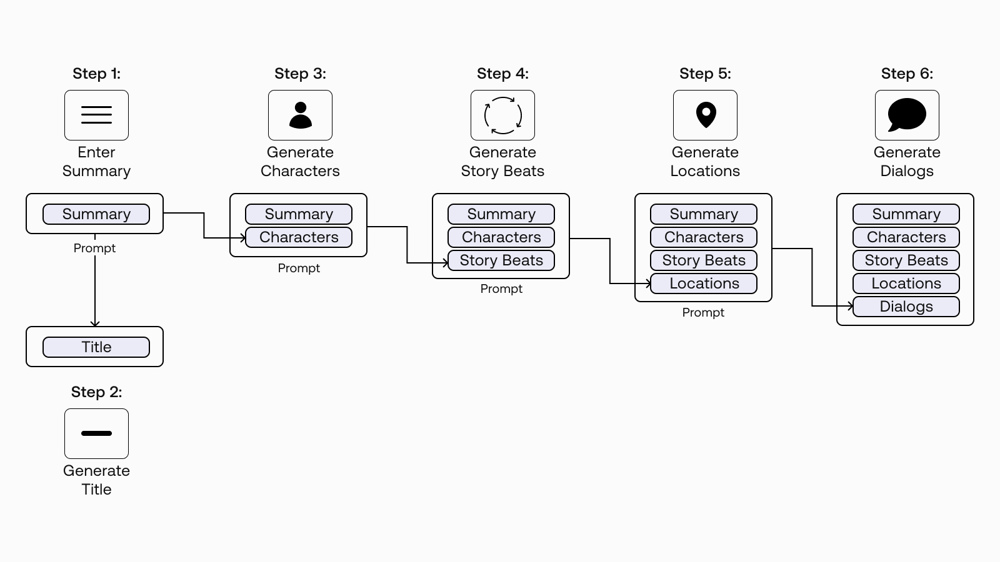


### Why Multi-Step Generation?

As you can see from the diagram above, we’ll break this application into multiple generation steps. You may wonder, why not just take one step to do them all? Depending on your use case, the reasons vary. For our story generation case, there are two main reasons.

The first is the context length. Large language models have a limit on how many tokens they can generate in one call, and at the time of writing, for the Generate endpoint, it is 2048 tokens. So, we will not be able to fit the whole story in one generation.

The other reason is to have greater control over the output quality. When writing stories, we typically go through a number of phases, such as the character development, environment setting, and the story arc. So, it’s good to be able to step in between key phases and make modifications.

With that, let’s get with writing our story!

### The Approach

We’ll try to replicate the method mentioned in the paper by going through the following steps.

- Step 1: Enter a Short Summary
- Step 2: Generate Title Suggestions
- Step 3: Generate Characters and Descriptions
- Step 4: Generate Story Beats
- Step 5: Generate Location Descriptions
- Step 6: Generate Dialog for Scenes

### Colab Notebook

For brevity, we’ll show only snippets of code in this article, but the full source code is available at <a target="_blank" href="https://colab.research.google.com/github/cohere-ai/notebooks/blob/main/notebooks/Brainstorming_Story_Ideas_with_Cohere_and_Stable_Diffusion.ipynb">this Colab notebook</a>. Note: this notebook is experimental in nature, so outputs may vary.

For the setup, please refer to the <a target="_blank" href="/docs/setting-up">Setting Up</a> chapter.

Bonus: We’ll not talk about it in this article, but the notebook also covers text-to-image generation using stable diffusion (Dreamstudio), such as for visualizing the characters. Try it out!

One of the key ideas mentioned in the paper is the “log line.” It is a single, user-provided summary of the central dramatic conflict. The image below highlights the log line that we’ll implement in this notebook. As we progress through the steps, the log line is appended with new information that is newly generated, which is then used in the next generation step.

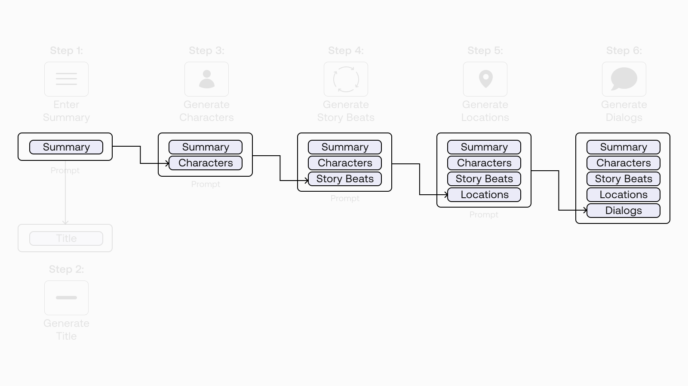


### Step 1: Enter a Short Summary

The first step is to write a short summary of what we want the story to be about. In fact, with this method, this summary is all we have to write. In the subsequent steps, we will rely on the model to generate the rest of the text we need.

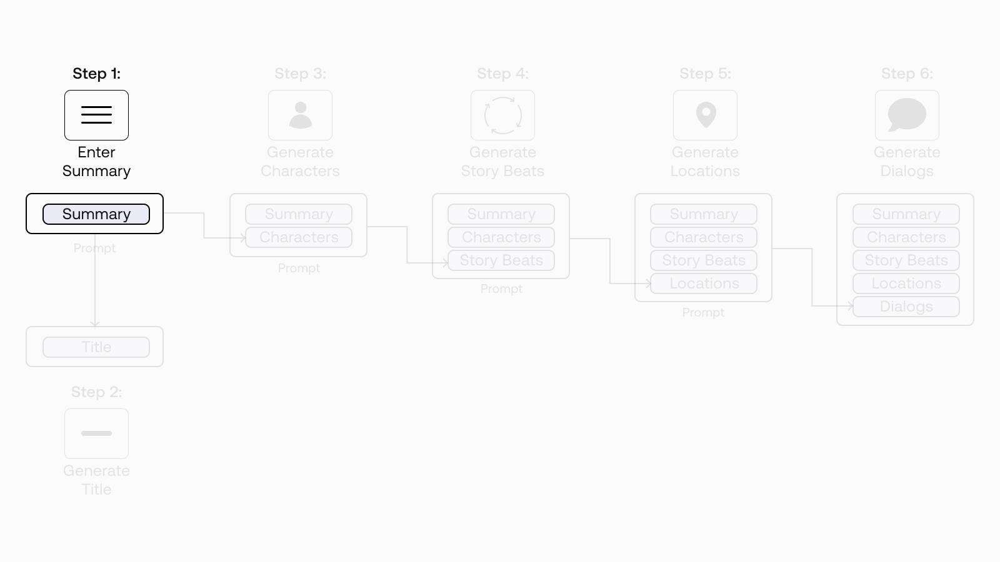


Let’s use this paragraph as our working example.

```
Scifi cyberpunk story about two hackers who find themselves both  
the targets of a cyber intelligence agent who suspects them of  
stealing $3.5 million worth of Bitcoin. The two do not know each  
other, and neither of them recalls stealing the sum.
```

### Step 2: Generate Title Suggestions

Now, we come to our first text generation call. Here, we want to get some title suggestions. So we create a prompt to the `base` model for generating some title suggestions.

Note: most of the examples in this chapter use the `base` model, the pre-trained model that has not been instruction-tuned like the `command` model. However, if you like, you can also experiment with the `command` model.

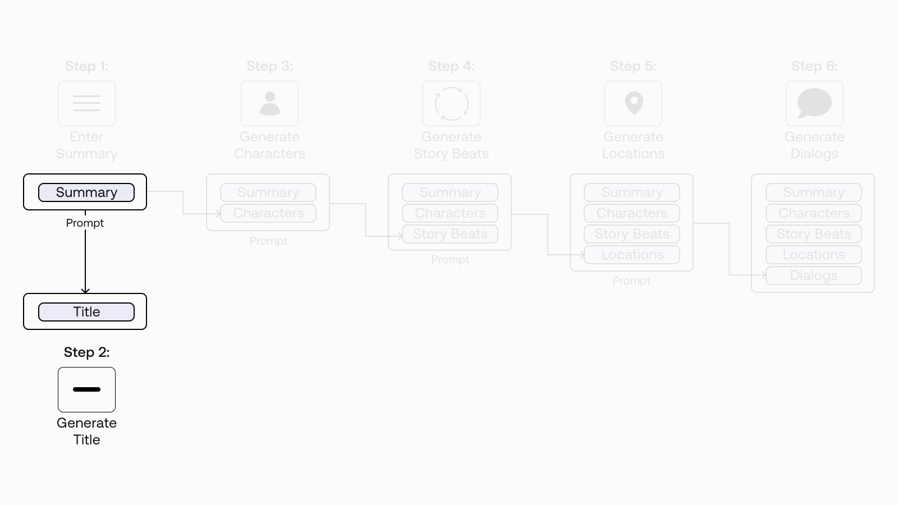


The prompt contains two examples of a summary and its corresponding title, which is then appended with the summary we created.

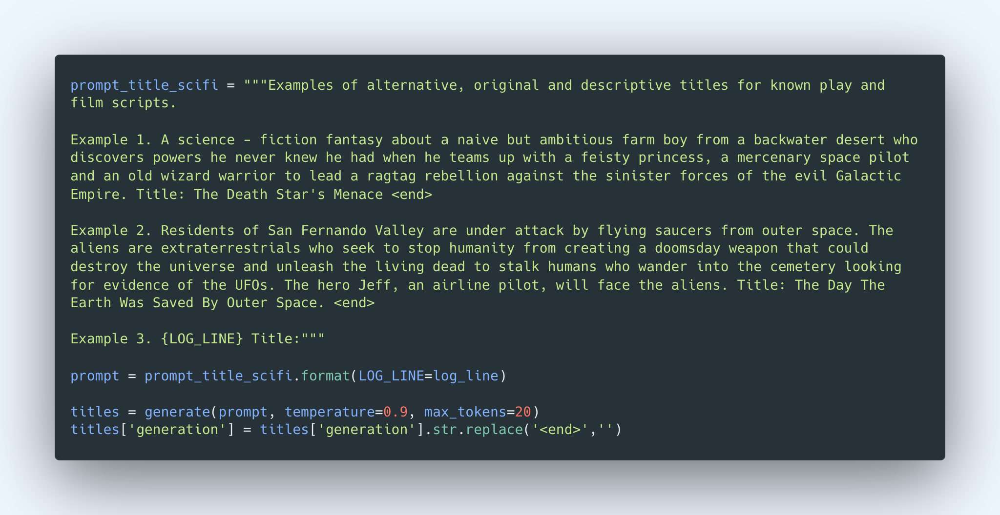
We set the number of generations to be five and sort them by likelihood in descending order.

And here are some title suggestions from the model.

```
| No. |                generation | likelihood |
|  0  |         The Bitcoin Heist |  -6.221337 |
|  1  | The Cryptocurrency Heist. |  -8.922848 |
|  2  |             A Web Of Lies | -12.809743 |
|  3  |          The Bigger Fool. | -17.252610 |
|  4  |  Data Miner Strikes Back. | -19.474931 |
```

### Step 3: Generate Characters and Descriptions

Now that the title part is done, let’s move on to the main path of our story generation, which eventually ends with the screenplay dialog generation. Here is where we take a step-by-step approach, starting with the characters in the story. We’ll generate a few characters and create descriptions for each of them.

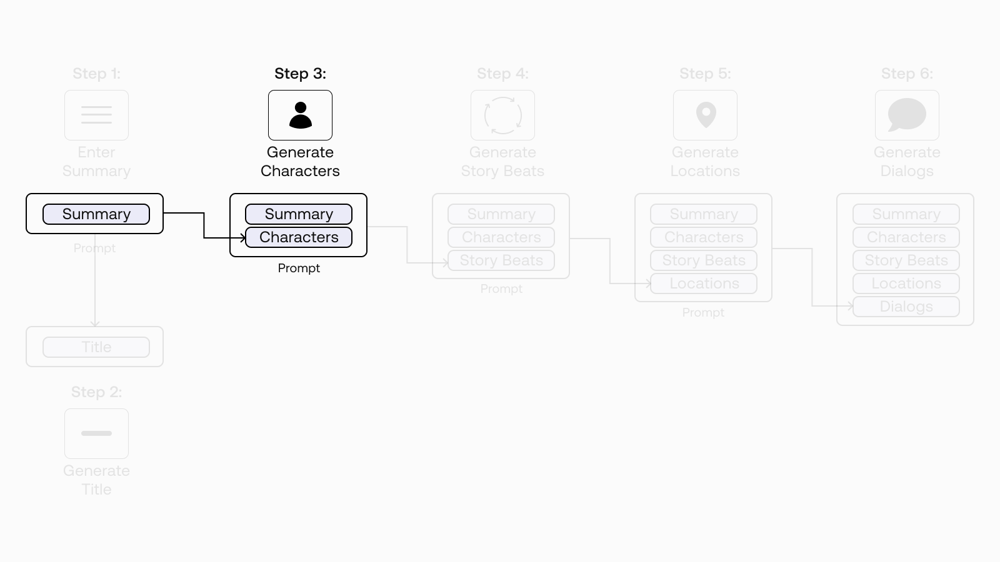


To do this, we create a prompt to the `base` model consisting of one example of a summary and the associated character descriptions (we use the Star Wars movie). To complete the prompt, we append the story summary that we’ve created earlier. This story summary makes up the first entry to our log line, which we’ll keep on adding to as we progress.

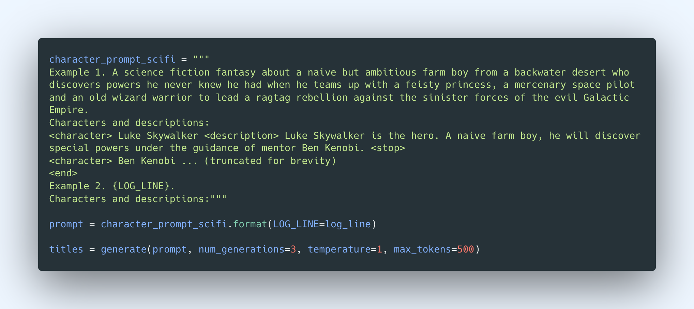
And here’s the generated text.

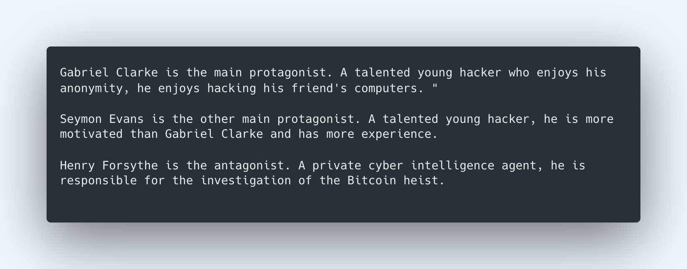
### Step 4: Generate Story Beats

In this step, we’ll use the output from the previous API call as one of the inputs to this step. This time, we are generating the story beats for our story.

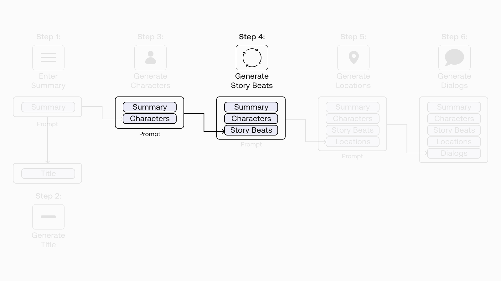


In a nutshell, story beats are the key points in a narrative that moves the story forward or changes the direction of the story. Overall, they form the narrative structure that takes a story from start to finish.

As an example, the paper used two types of narrative structure: Gustav Freytag’s pyramid and the Hero’s Journey.

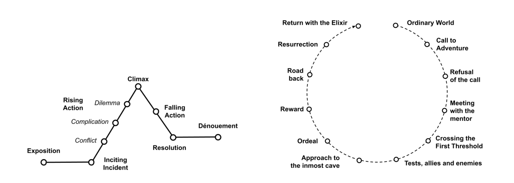


To keep our example brief, we’ll use a simplified version of the Hero’s Journey for our narrative structure. They consist of six story beats:

- The Ordinary World
- Call to Adventure
- Refusal of the Call
- Crossing the First Threshold
- The Approach to the Inmost Cave
- The Ordeal and The Reward

We create a prompt for the `base` model for generating a short description of these six story beats. Here, we provide one example of a summary, character descriptions, and story beats (including the locations and descriptions of the events), and we then append our story’s summary and character descriptions.

This is the first time we are taking the output of one prompt (generating character descriptions) and chaining it to another prompt (generating story beats). This is reflected in the log line, now consisting of the summary and character descriptions as the prompt.

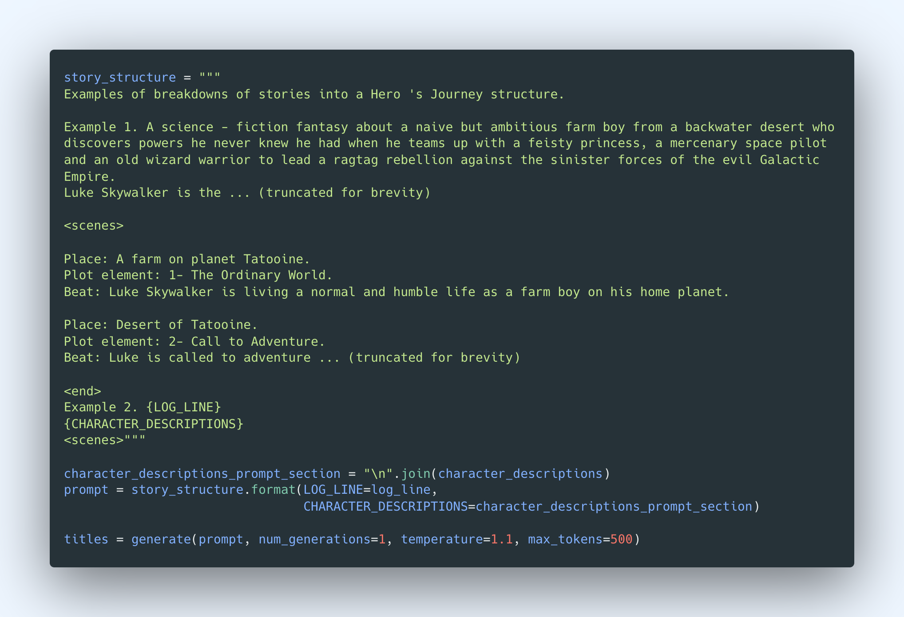
And here’s the generated text:

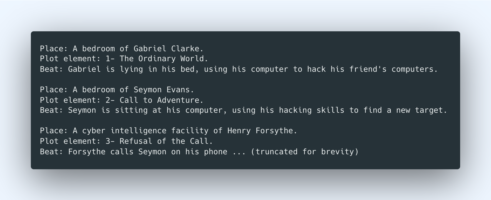
### Step 5: Generate Location Descriptions

In the previous step, we started establishing this pattern of chaining multiple prompts. And in the current step, we are just going to continue that and generate the location descriptions.

Recall that in the previous step, we have already generated the locations where each beat takes place. But having more descriptive location descriptions that are more expansive and detailed can go a long way to providing a good context to the dialog generation step (next step). So let’s now add these to our log line.

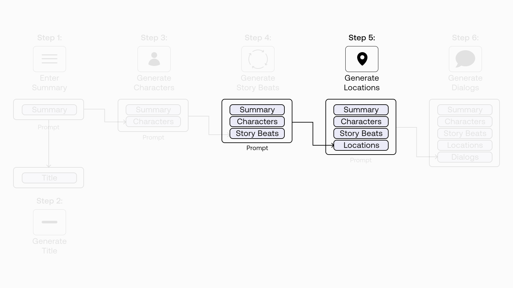


We know the drill by now. We create a prompt for the `base` model to generate the location descriptions. Here we provide a few examples of a context, location, and the location description. Then we append our current log line to the prompt. Finally, we generate the new location descriptions by iterating over the list of places we generated in the previous step.

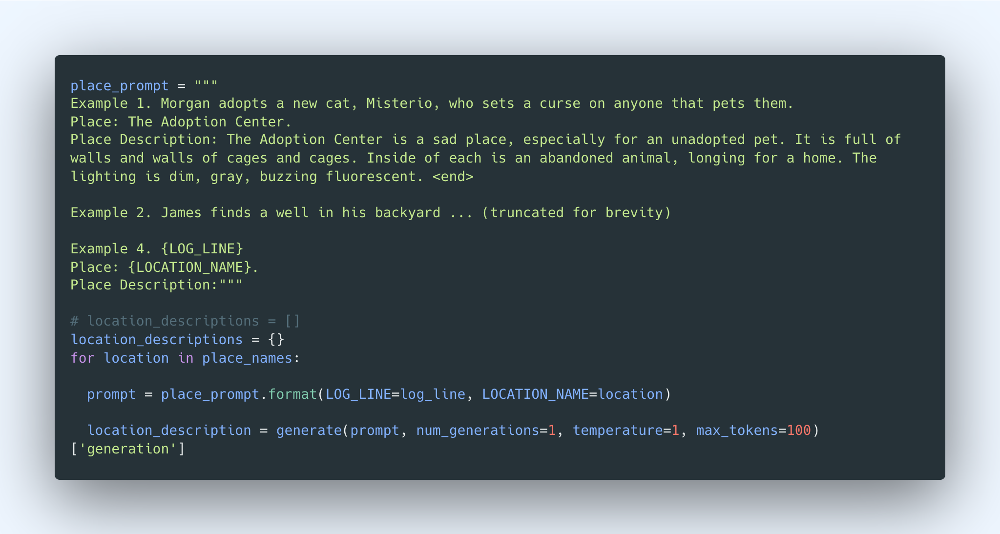
And here’s the generated text:

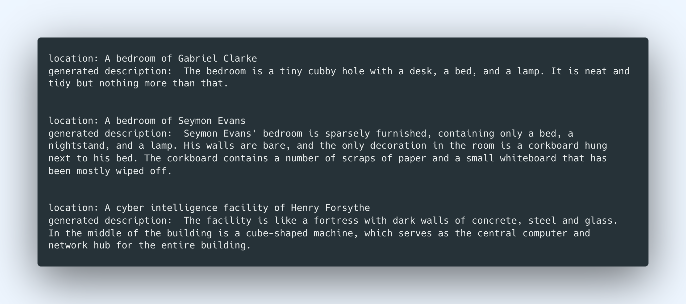
### Step 6: Generate Dialog for Scenes

Finally, here’s the part we’ve been waiting for! We’ve now built up a good body of context in our log line, and we can now fully use it to generate the dialog.

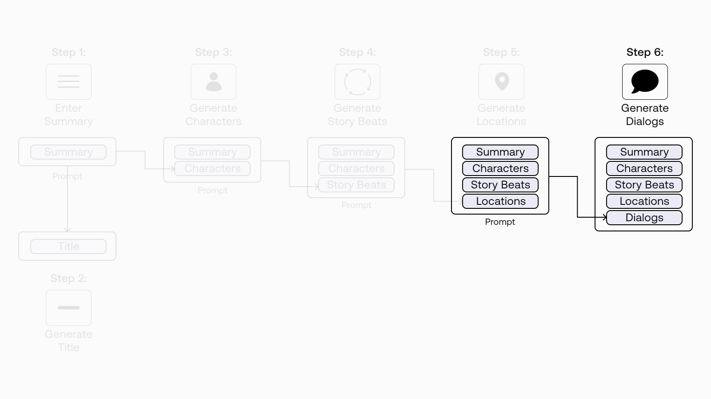


We've found that the `command` model works better for this task. So let's switch the model to use `command` instead of `base`.

We create a prompt for the model for generating the location. For each story beat, we start with an instruction (“Given Example 1, write the dialog for Example 2 using the same structure”) and provide one example consisting of the place, location description, character descriptions, plot element, summary, the previous beat, the current beat, and the screenplay dialog for the current beat.

We then append our current log line as the prompt to the dialog we want to generate, following the same pattern as the example. And finally, we generate the dialog.

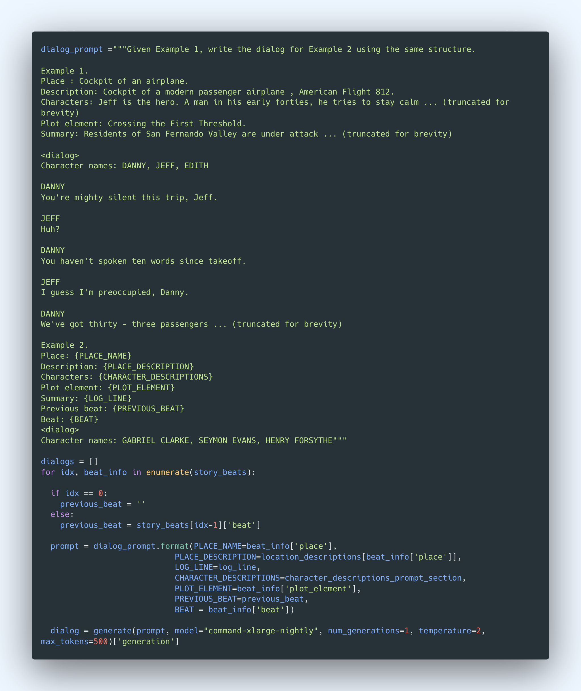
We repeat this for each of our six story beats.

The dialog is too long to show here, but here’s a snippet of how it looks:

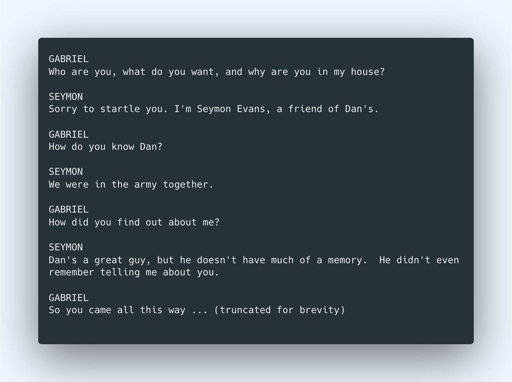
And that’s it! We have generated the dialog for the whole story, progressing through the narrative structure over six story beats.

There’s still so much we can do to make the final outcome better. For example, we could explore training a custom model, particularly for the dialog generation step. We used a baseline model throughout, but as we saw in the previous chapter, custom models can give a step up in output quality.

### Conclusion

In this story generation example, we have seen how to chain multiple prompts together — a technique that can prove to be handy, even magical, in building generative AI applications.

This demonstration has also shown how some of the topics we have discussed in this generative AI series can come together, to name a few: designing prompts, modifying model parameters, getting multiple generations, using likelihood to rank outputs, and more. I hope it has helped to illustrate how to apply these concepts in practical applications.

In this chapter, we used an example of chaining <a target="_blank" href="/reference/generate">Generate</a> calls since text generation is our focus for the module. But depending on the use case, chances are you might also need to throw other endpoints into the mix, such as <a target="_blank" href="/reference/embed">Embed</a> and <a target="_blank" href="/reference/classify">Classify</a>. You can see some examples of chaining multiple endpoints in <a target="_blank" href="https://txt.cohere.com/llm-use-cases-p2/#getting-the-best-out-of-the-cohere-api">this blog post</a>.

### Original Source

This material comes from the post <a target="_blank" href="https://txt.cohere.com/generative-ai-part-5/">Generative AI with Cohere: Part 5 - Chaining Prompts</a>
