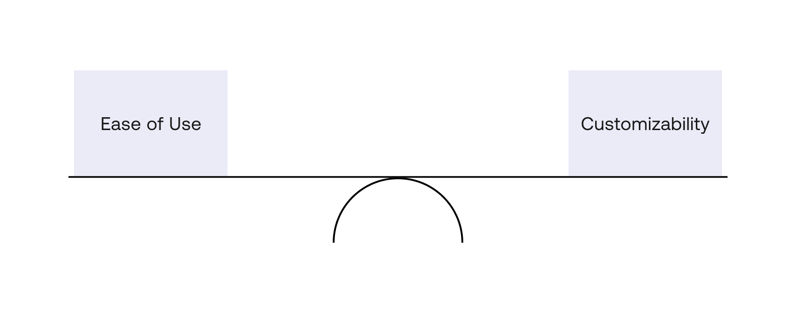
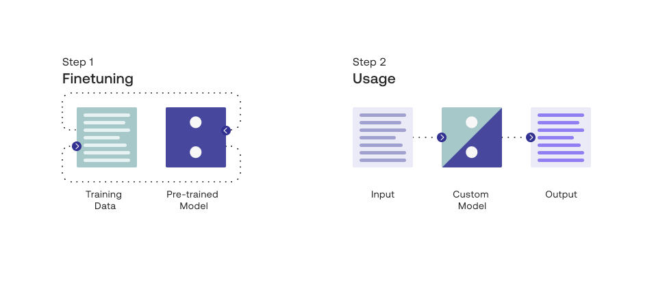
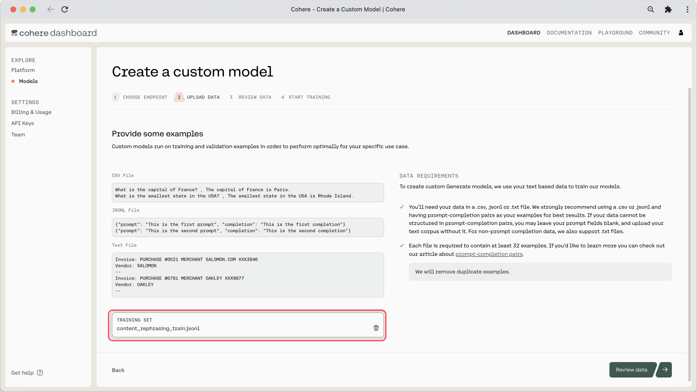
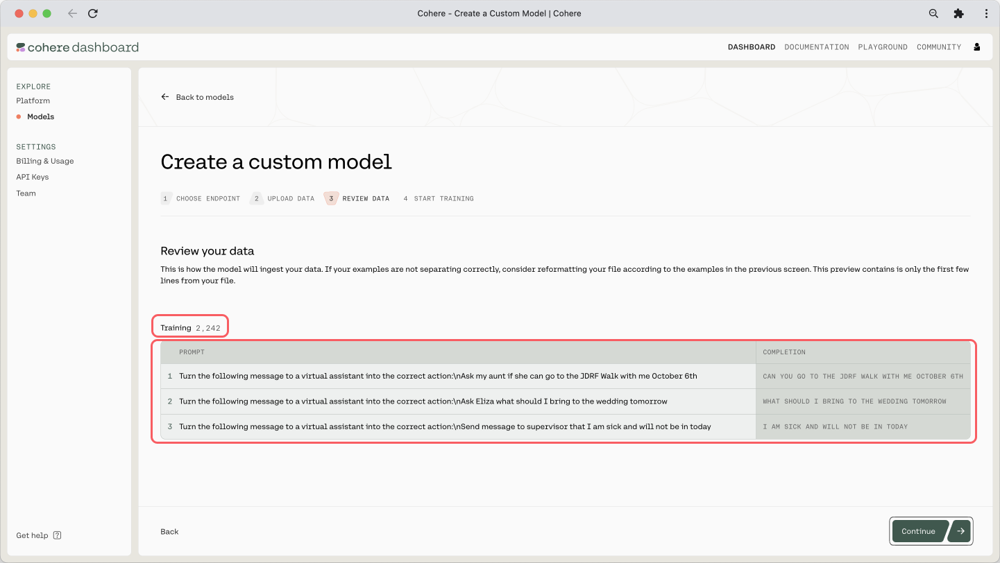
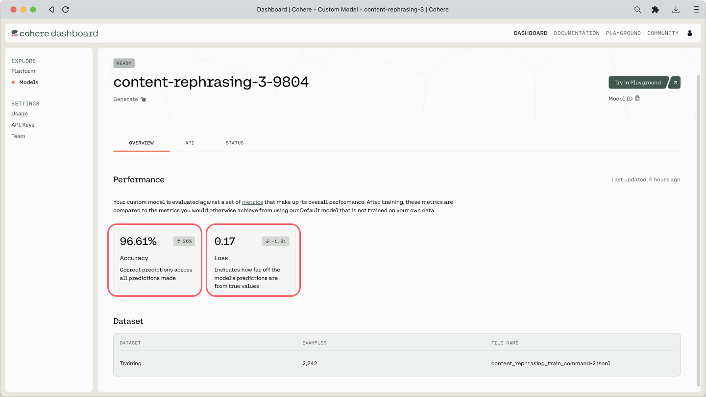

In the previous chapter, we explored the Generate endpoint and used it to experiment with prompts. We tried a range of parameter values to understand the combinations that best serve our goals. The next question is then: can we make the model perform even better at a given task?

The answer is yes, and we can do that via custom models. In this chapter, we’ll look at how we can take the baseline generative model and train our own model on top of it, all without having to have machine learning skills.

This option provides a nice balance —  while the Cohere API makes it easy for you to interface with large language models (LLMs) minus all the complexities, you still have the ability to customize a model to your specific task.




In this chapter, we will cover the following:

- What are custom models?
- Training a custom model
  - Prepare your dataset
  - Initiate training
- Evaluating a custom model
  - Check metrics
  - Make sample calls

But first, let’s see why, and when, you might want to create your own custom models.

A generative model is already trained on a huge volume of data, making it great at capturing patterns of information on a broad scale. But sometimes, your task contains nuances that are highly specific to that scenario. Here are some examples:

- **Specific styles:** Generating text with a certain style or voice, e.g., when generating product descriptions that represent your company’s brand
- **Specific formats:** Parsing information from a unique format or structure, e.g., when extracting information from specific types of invoices, resumes, or contracts
- **Specific domains:** Dealing with text in highly specialized domains such as medical, scientific, or legal, e.g., when summarizing text dense with technical information
- **Specific knowledge:** Generating text that closely follows a certain theme, e.g., when generating playing cards that are playable, like what we did with <a target="_blank" href="https://cohere.com/blog/urzas-ai/">Magic the Gathering</a>

In these cases, with enough examples in the prompt, you might still be able to make the generation work. But there is an element of unpredictability — something you want to eliminate when looking to deploy your application beyond a basic demo.

In these kinds of scenarios, you may want to experiment with custom models and compare how they perform against the baseline model, and then decide on the best option.

### What are Custom Models?

To understand what a custom model is and how it works, it’s good to know a couple of terms commonly used in LLMs: pre-training and finetuning.

Pre-training is the process of training a language model on a large amount of text data to learn the general patterns and structures of language. By doing this, the model is able to learn how to generate text that is coherent.

Finetuning, on the other hand, involves taking a pre-trained language model and training it on a smaller, more specific dataset to adapt it to a particular task. Finetuning allows the model to be customized for a specific use case, which can result in better performance on that task.

If you think of this as the process of building a house, pre-training can be compared to the process of building its foundation and basic building blocks. Just as a strong foundation is necessary for a house to stand, pre-training is necessary to build a solid foundation for a language model. Finetuning, on the other hand, focuses on customizing that house with specific features, which can differ based on a person's exact needs and preferences.

At Cohere, we refer to our pre-trained models as baseline models and finetuned models as custom models.




### Training a Custom Model

The finetuning feature runs on the `command` model family, trained to follow user commands and to be instantly useful in practical applications.

The finetuning format takes JSONL files. We provide for each training example a formatted prompt, alongside a completion. Here is what the file should look like:

```json JSON
{"prompt": "This is example prompt #1", "completion": "This is the completion example #1"}
{"prompt": "This is example prompt #2", "completion": "This is the completion example #2"}
...
...
{"prompt": "This is example prompt #N", "completion": "This is the completion example #N"}
```

We will put all these examples in a `JSONL`file and most importantly, we need to include a lot of examples.

How many examples are needed? There’s no one-size-fits-all answer to that question as it depends on the type and complexity of your task. You can get started with as few as 32 examples (the minimum the platform accepts) but for the best performance, try experimenting in the region of hundreds or thousands of examples if you have access to the data needed.

### Colab Notebook

This article comes with a corresponding <a target="_blank" href="https://colab.research.google.com/github/cohere-ai/cohere-developer-experience/blob/main/notebooks/Evaluating_Custom_Models.ipynb?ref=txt.cohere.com">Colab notebook</a> and we encourage you to follow it along as you read the chapter.

For the setup, please refer to the <a target="_blank" href="/docs/setting-up">Setting Up</a> chapter.

**Note:** Recent changes on the model may affect the results you get on this colab, so they may differ from those in this chapter.

#### Prepare Your Dataset

Let’s start with the problem we want to solve. Here, our task is to take a request coming from a human and rephrase it into the most accurate utterance that an AI virtual assistant should use.

We’ll use the <a target="_blank" href="https://dl.fbaipublicfiles.com/rephrasing/rephrasing_dataset.tar.gz?ref=txt.cohere.com">dataset</a> from the <a target="_blank" href="https://aclanthology.org/2020.emnlp-main.414.pdf?ref=txt.cohere.com">paper</a>, Sound Natural: Content Rephrasing in Dialog Systems (Einolghozati, et al.). We’ll take the `train.tsv` portion containing 2,243 examples.

The dataset table contains a number of columns, but to keep our example simple, we’ll need just the first (the human’s request) and last (the virtual assistant’s utterance) columns. Here is one example:

**First column (the request):**  
_Send message to supervisor that I am sick and will not be in today_

**Last column (the utterance):**  
_I am sick and will not be in today_

The dataset comes in `tsv` format, so we’ll need to do some pre-processing steps to get it to the `JSONL` format that we need. We also need to create a command-style text in the prompt, which we'll transform the dataset to fit our need. With the earlier example, it becomes this (note that there is no one right way to phrase the command):

**Prompt:**  
_Turn the following message to a virtual assistant into the correct action:  
Send message to supervisor that I am sick and will not be in today_

**Completion:**  
_I am sick and will not be in today_

The finetuning dataset (which you [can get here](https://github.com/cohere-ai/cohere-developer-experience/blob/main/notebooks/data/content_rephrasing_train.jsonl)) contains 2,243 examples altogether. Here are the first few examples:

```
{"prompt":"Turn the following message to a virtual assistant into the correct action:\\nAsk my aunt if she can go to the JDRF Walk with me October 6th","completion":"can you go to the jdrf walk with me october 6th"}
{"prompt":"Turn the following message to a virtual assistant into the correct action:\\nAsk Eliza what should I bring to the wedding tomorrow","completion":"what should I bring to the wedding tomorrow"}
{"prompt":"Turn the following message to a virtual assistant into the correct action:\\nSend message to supervisor that I am sick and will not be in today","completion":"I am sick and will not be in today"}
...
```

#### Initiate Training

We can now begin training our own custom model. We can do this easily via <a target="_blank" href="https://dashboard.cohere.ai/models?ref=txt.cohere.com&amp;__hstc=14363112.fb39cf5aec47995e64cd26603e2e04d9.1682489949734.1683571482981.1683573460217.34&amp;__hssc=14363112.3.1683573460217&amp;__hsfp=3887566761">the dashboard</a>, and there is a comprehensive step-by-step guide <a target="_blank" href="https://docs.cohere.ai/docs/training-a-generative-model?ref=txt.cohere.com&amp;__hstc=14363112.fb39cf5aec47995e64cd26603e2e04d9.1682489949734.1683571482981.1683573460217.34&amp;__hssc=14363112.3.1683573460217&amp;__hsfp=3887566761">in our </a> documentation.

Because of this, we’ll not cover those steps in this article. We’ll only look at a couple of screenshots that show the steps with our actual dataset applied.

Here is the step where we upload the `JSONL` file:




And here is the preview of the training dataset and its count:



The training will take some time, and once it’s done, you will receive an email mentioning that it is deployed and ready. If you’ve reached this point, congratulations!

### Evaluating a Custom Model

Using a custom model is as simple as substituting the baseline model with the model ID (replace the ID shown below with your model ID, which you can get from the dashboard).

```python PYTHON
import cohere 

co = cohere.Client("<YOUR_API_KEY>")

response = co.generate(
    model="26db2994-cf88-4243-898d-31258411c120-ft",  # REPLACE WITH YOUR MODEL ID
    prompt="""Turn the following message to a virtual assistant into the correct action:
	Send a message to Alison to ask if she can pick me up tonight to go to the concert together""",
)
```

But of course, we need to know if this model is performing better than the baseline in the first place. For this, there are a couple of ways we can evaluate our model.

#### Check Metrics

When you go to the custom model’s page, you can see two metrics shown: `Accuracy` and `Loss`. Here are the definitions of what they mean, taken from our documentation.

- **Accuracy** — This measures how many predictions the model made correctly out of all the predictions in an evaluation. To evaluate Generate models for accuracy, we ask it to predict certain words in the user uploaded data.
- **Loss** — This measures how bad or wrong a prediction is. Accuracy may tell you how many predictions the model got wrong, but it will not describe how incorrect the wrong predictions are. If every prediction is perfect, the loss will be 0.

An indication of a good model is where the `Accuracy` increases and the `Loss` decreases. And in our case, where `Accuracy` is 96.61% and `Loss` is 0.17, which is not bad!

Do note that these metrics ultimately serve as indications only. Evaluating the output of generative models is highly dependent on the context and use case. In most cases, evaluation from actual human feedback provides the most insight into a model's capabilities on a particular task.




#### Make Sample Calls

The previous metrics are a good first indication of the model’s performance, but it’s good to make some qualitative assessments as well. So what we can do now is to make a few calls to both the baseline and custom models, and compare the results. For this, we can reuse the prompt experimentation code we created in the previous chapter.

Let’s take an example. We’ll run the following request through a range of `temperature` values and see what the utterances look like. This comes from the test dataset, which the model has not seen before.

```
Turn the following message to a virtual assistant into the correct action:
Send a message to Alison to ask if she can pick me up tonight to go to the concert together
```

And the ground truth utterance for this, provided in the test dataset, is the following.

```
can you pick me up tonight to go to the concert together
```

##### Response Generation

We run the following code for each of the baseline (`command`) and the finetuned (using the model ID) models. We make API calls for the two models through four temperature values (0.0, 0.5, 1.0, and 1.5) and three generations each:

```python PYTHON
# Create a function to call the endpoint
def generate_text(prompt, temperature, num_gens):
    response = co.generate(
        model="command",  # Repeat with the custom model
        prompt=prompt,
        temperature=temperature,
        num_generations=num_gens,
        stop_sequences=["\n\n"],
    )
    return response


# Define the prompt
prompt = """Turn the following message to a virtual assistant into the correct action:
Send a message to Alison to ask if she can pick me up tonight to go to the concert together"""

# Define the range of temperature values and num_generations
temperatures = [x / 10.0 for x in range(0, 20, 5)]
num_gens = 3

# Iterate generation over the range of temperature values
print(f"Temperature range: {temperatures}")
for temperature in temperatures:
    response = generate_text(prompt, temperature, num_gens)
    print("-" * 10)
    print(f"Temperature: {temperature}")
    print("-" * 10)
    for i in range(3):
        text = response.generations[i].text
        print(f"Generation #{i+1}")
        print(f"Text: {text}\n")
```

Here are the responses.

##### Baseline Model: Responses

```
Temperature range: [0.0, 0.5, 1.0, 1.5]
----------
Temperature: 0.0
----------
Generation #1
Text: 
Hey, Alison. Can you pick me up tonight to go to the concert together?

Generation #2
Text: 
Hey, Alison. Can you pick me up tonight to go to the concert together?

Generation #3
Text: 
Hey, Alison. Can you pick me up tonight to go to the concert together?

----------
Temperature: 0.5
----------
Generation #1
Text: 
Message: Alison, can you pick me up tonight to go to the concert together?

Generation #2
Text: 
Hey Alison, can you pick me up tonight to go to the concert together?

Generation #3
Text: 
Message: Hi Alison, can you pick me up tonight to go to the concert together?

----------
Temperature: 1.0
----------
Generation #1
Text: 
Hey Alison, can you pick me up tonight to go to the concert together?

Generation #2
Text: 
Hey, Alison. Can you pick me up tonight to go to the concert together?

Generation #3
Text: 


----------
Temperature: 1.5
----------
Generation #1
Text: 
Hey Alison, can you pick me up tonight to go to the concert together?

Generation #2
Text: 


Generation #3
Text: 
"Hey, Alison, can you pick me up tonight to go to the concert together?"
```

##### Custom Model: Responses

```
Temperature range: [0.0, 0.5, 1.0, 1.5]
----------
Temperature: 0.0
----------
Generation #1
Text: can you pick me up tonight to go to the concert together

Generation #2
Text: can you pick me up tonight to go to the concert together

Generation #3
Text: can you pick me up tonight to go to the concert together

----------
Temperature: 0.5
----------
Generation #1
Text: can you pick me up tonight to go to the concert together

Generation #2
Text: can you pick me up tonight to go to the concert together

Generation #3
Text: can you pick me up tonight to go to the concert together

----------
Temperature: 1.0
----------
Generation #1
Text: can you pick me up tonight to go to the concert together

Generation #2
Text: can you pick me up tonight to go to the concert together

Generation #3
Text: can you pick me up tonight to go to the concert together

----------
Temperature: 1.5
----------
Generation #1
Text: can you pick me up tonight to go to the concert together

Generation #2
Text: can you pick me up tonight to go to the concert together

Generation #3
Text: can you pick me up tonight to go to the concert together
```

With the baseline models, the output gets the correct response at lower temperature values, but as we start to bring it higher, it gets inconsistent. Whereas with the custom models, it gets the response correct even at higher temperatures.

This indicates that the custom model option has greater predictability and can produce quality outputs consistently, something that’s much needed when deploying applications out there.

### Conclusion

Custom models are a powerful concept when working with the Cohere Platform. You get that nice balance of the abstracted complexity of a managed LLM, but you still retain a degree of flexibility when elevating its performance for a specific task. Even if you are experimenting with basic demos, and especially if you are considering moving up to production, this is a useful option.
