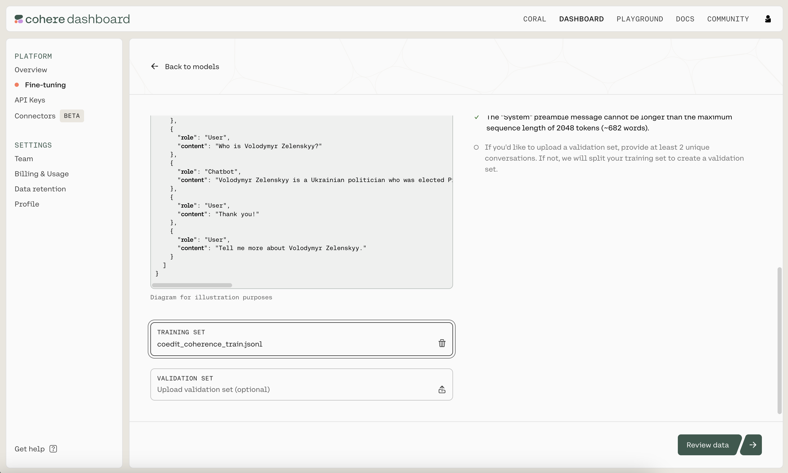
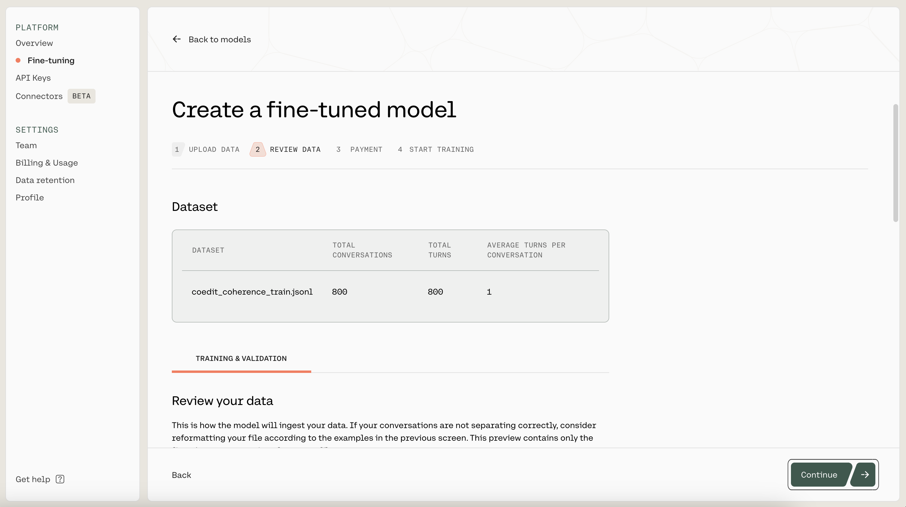
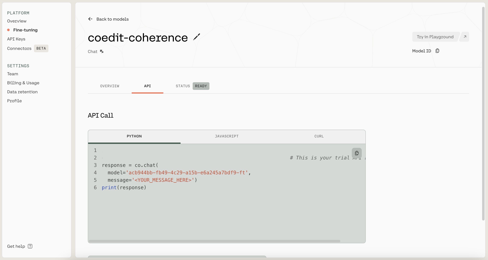

We’ll use [Cohere’s Dashboard](https://dashboard.cohere.com/) for the code examples. Follow along in [this notebook](https://github.com/cohere-ai/cohere-developer-experience/blob/main/notebooks/llmu/Fine_Tuning_for_Chat.ipynb).

Cohere’s large language models (LLMs) have been trained to be useful in practical business applications. Using the [Chat endpoint](https://cohere.com/chat?ref=txt.cohere.com), you can leverage a pre-trained LLM to build a chatbot that performs tasks ranging from summarization to copywriting to question answering.

Depending on the use case you have in mind, you might want to amend how the chatbot generates its output. For instance, if your task uses highly technical data or you want to change the chatbot’s output format, you often need to perform another round of training on additional data to ensure the best performance. This extra training is referred to as fine-tuning.

Fine-tuning is also recommended when you want to incorporate your company's unique knowledge base. For example, if you are aiming to use a model to draft responses to customer-support inquiries, fine-tuning on old conversations with customers can improve the quality of the output.

## Step-by-Step Guide

### Step 1: Prepare and Validate the Dataset

We will work with the [CoEdIT dataset](https://huggingface.co/datasets/grammarly/coedit) of text editing examples (Raheja, et al). In each example, the user asks a writing assistant to rewrite text to suit a specific task (editing fluency, coherence, clarity, or style) and receives a response. Below, you can see some examples from the raw dataset.

```
{
 "_id": "57241", 
 "task": "coherence", 
 "src": "Make the text more coherent: It lasted for 60 minutes. It featured the three men taking questions from a studio audience.", 
 "tgt": "Lasting for 60 minutes, it featured the three men taking questions from a studio audience."
}

{
 "_id": "69028", 
 "task": "clarity", 
 "src": "Make the sentence clearer: URLe Lilanga (1934 27 June 2005) was a Tanzanian painter and sculptor, active from the late 1970s and until the early years of the 21st century.", 
 "tgt": "URLe Lilanga (1934 27 June 2005) was a Tanzanian painter and sculptor, active from the late 1970s and until the early 21st century."
}
```

We will use the `src` and `tgt` fields from each example, which correspond to the user’s prompt and the writing assistant’s response, respectively.  Instead of using the full dataset, we will use a subset focused on making text coherent: 927 total conversations.

To format the dataset for the Python SDK, we create a `.jsonl` where each JSON object is a conversation containing a series of messages.

- A `System` message in the beginning, acting as the preamble that guides the whole conversation
- Multiple pairs of `User` and `Chatbot` messages, representing the conversation that takes place between a human user and a chatbot

For more detail on best practices for formatting your dataset, check out [the documentation](/docs/chat-preparing-the-data#chat-customization-best-practices) . Here is a preview of the prepared dataset:

```
{'messages': 
 [{'role': 'System',
   'content': 'You are a writing assistant that helps the user write coherent text.'
  },
  {'role': 'User',
   'content': 'Make the text more coherent: It lasted for 60 minutes. It featured the three men taking questions from a studio audience.'
  },
  {'role': 'Chatbot',
   'content': 'Lasting for 60 minutes, it featured the three men taking questions from a studio audience.'
  }
 ]
}
```

### Step 2: Fine-Tune the Model

We kick off a fine-tuning job by navigating to the [fine-tuning tab of the Dashboard](https://dashboard.cohere.com/fine-tuning) . Under "Chat", click on "Create a Chat model".


Next, upload the `.jsonl` file you just created as the training set by clicking on the "TRAINING SET" button. When ready, click on "Review data" to proceed to the next step.




Then, you'll see a preview of how the model will ingest your data. It shows the total number of conversations, the total number of turns, and the average number of turns per conversation. If anything is wrong with the data, the page will also provide suggested changes to fix the data file. Otherwise, if everything looks good, you can proceed to the next step.




Next, you'll see an estimated cost of fine-tuning, followed by a page where you'll provide a nickname to your model. We used `coedit-coherence` as the nickname for our model. This page also allows you to provide custom values for the hyperparameters used during training, but we'll keep them at the default values for now.


Once you have filled in a name, click on "Start training" to kick off the fine-tuning process. This will navigate you to a page where you can monitor the status of the model. A model that has finished fine-tuning will show the status as `READY`.


### Step 3: Evaluate the Fine-Tuned Model

Once the model has completed the fine-tuning process, it’s time to evaluate its performance.

#### With Test Data

When you're ready to use the fine-tuned model, navigate to the API tab. There, you'll see the model ID that you should use when calling`co.chat()`.




In the following code, we supply a message from the test dataset to both the pre-trained and fine-tuned models for comparison.

```python PYTHON
user_message = "Make the text coherent: Pimelodella kronei is a species of three-barbeled catfish endemic to Brazil. Discovered by the German naturalist Sigismund Ernst Richard Krone, Pimelodella kronei was the first troglobitic species described in Brazil, but several others have been described later."

# Desired response: Pimelodella kronei is a species of three-barbeled catfish endemic to Brazil. Discovered by the German naturalist Sigismund Ernst Richard Krone, it was the first troglobitic fish described in Brazil, but several others have been described later.

preamble = "You are a writing assistant that helps the user write coherent text."

# Get default model response
response_pretrained = co.chat(
    message=user_message,
    preamble=preamble,
)

# Get fine-tuned model response
response_finetuned = co.chat(
    message=user_message,
    model="acb944bb-fb49-4c29-a15b-e6a245a7bdf9-ft",
    preamble=preamble,
)

print(f"Default response: {response_pretrained.text}", "\n-----")
print(f"Fine-tuned response: {response_finetuned.text}")
```

For this example, the output appears as follows:

```
Default response: The three-barbeled catfish, Pimelodella kronei, is exclusive to Brazil. It was Sigismund Ernst Richard Krone, a German naturalist, who first discovered this remarkable species. Notably, P. kronei was also the initial troglobitic species to be identified in Brazil, though other such species have since been uncovered. 

Would you like to know more about the discovery of this species or its natural habitat? 
-----
Fine-tuned response: Pimelodella kronei, a species of three-barbeled catfish endemic to Brazil, was discovered by the German naturalist Sigismund Ernst Richard Krone. It was the first troglobitic species described in Brazil, but several others have been described later.
```

In this example, both models provide reasonable answers that are an improvement over the user’s original text. However, the fine-tuned model’s response better matches the style of the fine-tuning data, because it is more succinct: both the fine-tuned model’s response and the desired response have 36 words, whereas the response from the pre-trained model is about 25% (10 words) longer. 

This is just one example, but you can compare responses to more prompts in the Google Colaboratory notebook.

#### In the Chat Context

We have demonstrated that the fine-tuned model can provide good answers to individual questions. But it is also a competent participant in longer, multi-turn conversations.

To see this, we will borrow from the code in the [Building a Chatbot chapter](/docs/building-a-chatbot) to build a simple chat interface. The only change we need to make is to supply the model nickname when using `co.chat_stream()` to ensure that we are chatting with the model we just fine-tuned.

```python PYTHON
# Create a conversation ID
import uuid

conversation_id = str(uuid.uuid4())

print('Starting the chat. Type "quit" to end.\n')

while True:

    # User message
    message = input("User: ")

    # Typing "quit" ends the conversation
    if message.lower() == "quit":
        print("Ending chat.")
        break

        # Chatbot response
        stream = co.chat_stream(
            message=message,
            model="acb944bb-fb49-4c29-a15b-e6a245a7bdf9-ft",
            preamble=preamble,
            conversation_id=conversation_id,
        )

        print("Chatbot: ", end="")

    for event in stream:
        if event.event_type == "text-generation":
            print(event.text, end="")

        print("\n", "-" * 50)
```

We can use the code above to have a conversation with the fine-tuned model.

```
Starting the chat. Type "quit" to end.

User: Hello
Chatbot: Hello, how can I help you today?
--------------------------------------------------

User: I'm fine.  Can I ask you for help with some tasks?
Chatbot: I am happy to help you with any tasks that you need help with.  I can also provide information about any topic that you would like to know more about.
--------------------------------------------------

User: Make this more coherent: Manuel now has to decide-will he let his best friend be happy with her Prince Charming. Or will he fight for the love that has kept him alive for the last 16 years?
Chatbot: Manuel now has to decide-will he let his best friend be happy with her Prince Charming, or will he fight for the love that has kept him alive for the last 16 years?
--------------------------------------------------

User: Help me with this one - She left Benaras. Conditions back home were bad.
Chatbot: She left Benaras because conditions back home were bad.
--------------------------------------------------

User: What's a good time to visit London
Chatbot: A good time to visit London is in the spring or fall, when the weather is mild and the city is not too crowded.  The best time to visit London depends on what you want to see and do.  If you want to see the sights and do some shopping, a good time to visit London is in the spring, when the weather is mild and the city is not too crowded.  If you want to see the sights and do some sightseeing, a good time to visit London is in the fall, when the weather is mild and the city is not too crowded.
--------------------------------------------------

User: Could you help with this please: Make the text coherent: Critically the album has not been as well received as other Browne recordings. It remains his only album to date to reach number 1 on the Billboard chart. 
Chatbot: Critically the album has not been as well received as other Browne recordings, but it remains his only album to date to reach number 1 on the Billboard chart.
--------------------------------------------------

User: quit
Ending chat.
```

Note the fine-tuned model is still able to respond to prompts like “Hello”, “I’m fine. Can I ask you for help with some tasks?”, and “What’s a good time to visit London” instead of strictly following the fine-tuning objective of editing text.

The model also did a good job with context switching; it can hold a conversation when the user switches from friendly greetings, to a request for writing help, to travel planning, and finally back to writing assistance. It can also infer when the user is asking for help with making a text coherent, even if it is not explicitly stated (e.g., “Help me with this one”) or if the request is buried slightly (e.g., with “Could you help me with this please”).

We encourage you to use the Google Colaboratory notebook to have your own conversation with the model. If you’re interested in further improving model performance, explore refining data quality or iterating on hyperparameters, as described in [the documentation](/docs/chat-improving-the-results).

## Conclusion

In this chapter, you learned how to fine-tune a model for the Chat endpoint on a custom dataset. You saw how fine-tuning allows you to tailor a chatbot to a specific use case and give it a particular style. As described in [the documentation](/docs/chat-fine-tuning), you learned how to prepare the fine-tuning data, start a fine-tuning job, and understand the results.

<br />
