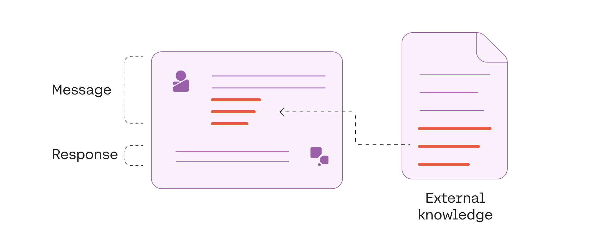
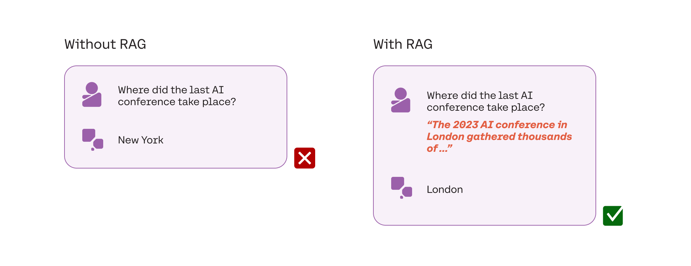
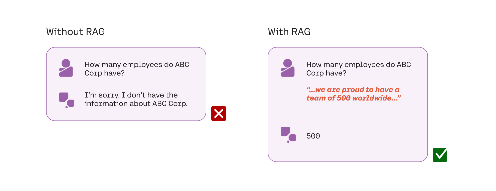
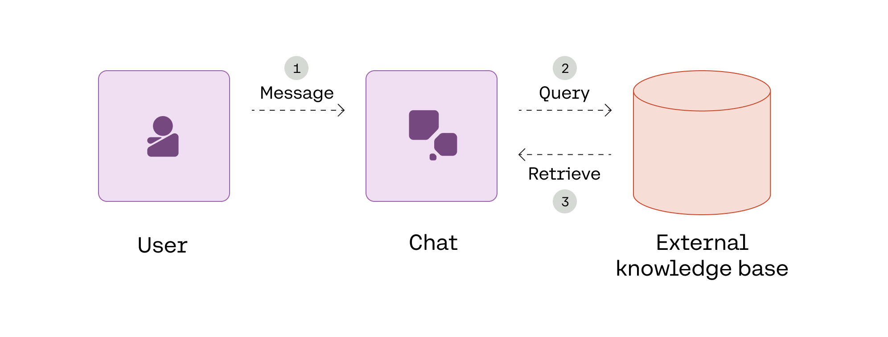
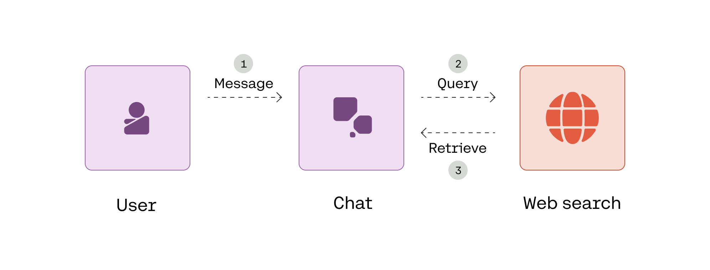
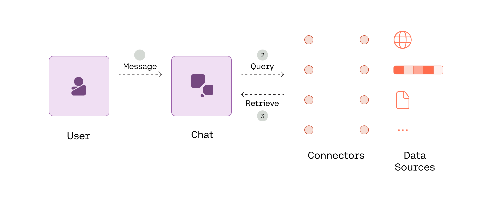
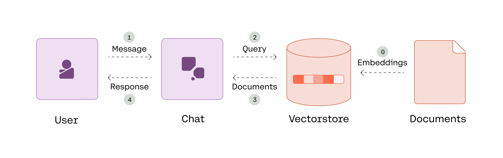
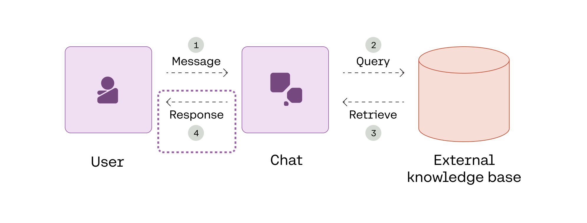

_Note: This chapter covers an introduction to retrieval-augmented generation (RAG). If you want to explore this topic further and learn how to implement RAG with the Cohere API, we have a dedicated [module on RAG](/docs/module-8-chat-and-retrieval-augmented-generation-rag)._

In this module on text generation, we have so far explored LLM chatbots that only have access to the data they have been trained on, or their internal knowledge. In many applications, particularly for enterprise use, a chatbot needs to also be able to access external knowledge for it to be useful.

Cohere’s [Chat endpoint](/reference/chat) comes with a [retrieval-augmented generation (RAG)](/docs/retrieval-augmented-generation-rag) feature that makes it possible to connect to external knowledge bases and deliver more accurate responses.

## What is RAG?

To understand RAG, we will work with the example of a company that wants to deploy a chatbot as an intelligent knowledge assistant. For the chatbot to be useful, it will need to be connected to the company’s knowledge base.

This allows the chatbot to have the correct context when responding to requests, such as summarizing a meeting transcript, extracting information from the company wiki, and assisting a customer support agent in responding to a customer inquiry. Without access to the company’s knowledge base, the chatbot will not be able to perform these types of tasks successfully.

The company will also likely need the chatbot to respond to time-sensitive prompts and provide up-to-date answers. For example, suppose an employee asks the chatbot about a recent public event. A baseline LLM is trained with data that is current up to a certain cut-off time. Without accessing external data, the model relies on the most recent information it has been trained on (assuming the specific information is available in the training data). In this situation, the lack of recency in the training data would produce an inadequate answer.

RAG consists of two parts: a **retrieval system** and an **augmented generation system**. Let’s take a look at how they work.

## Retrieval

The first part of RAG is to retrieve the right information needed to respond to a user query. Given a user message (1), the Chat endpoint queries an external knowledge base with the relevant queries (2), and finally retrieves the query results (3).

Retrieval applies to any system that can fetch relevant documents based on a user message. Cohere offers two ways to build RAG systems with the Chat endpoint: **connectors mode** and **documents mode**.

### Connectors Mode

As the name implies, connectors are ways of connecting to data sources. These data sources could be internal documents, document databases, the broader internet, or any other data source which can inform the model’s replies. When the Chat endpoint is called in connectors mode, it connects to the associated data sources and automatically handles document retrieval. 

Developers can leverage pre-built connectors to various data sources or even build their own. Also, there is a web search connector managed by Cohere which runs searches against a browser in safe mode. Developers can use it immediately without any additional configuration or deployment.

For example, suppose we are working with a RAG system that uses Cohere’s managed web search connector, and say you input this query: “Who was the keynote speaker at the AI conference last week?”. Given that the response requires a fact from a recent event, the chatbot triggers a retrieval of this information using the web search API. It gets back the information it requires, such as a few website snippets containing the details about the conference.

In an enterprise setting, data is distributed across multiple platforms and datastores.  With connectors mode, you can use multiple connectors at the same time to get the system to retrieve and synthesize information from various data sources.

### Documents Mode

With documents mode, a developer directly provides the model with source documents that it can use to ground its replies.  In this case, these documents first need to be ingested. Typically, this involves chunking large documents into smaller chunks, turning these chunks into [text embeddings](https://cohere.com/embed?ref=txt.cohere.com) (also called vectors), and storing these embeddings in a vector store.

Connectors mode automatically handles document ingestion and is excellent for those who prefer a more hands-off approach. However, documents mode allows developers to customize the RAG stack's components to fit specific needs.

## Augmented Generation

The second part of RAG is augmented generation. Here, the prompt is augmented with the information retrieved from the retrieval step. The prompt is now grounded with the best information to provide the user with an accurate and helpful response.

The chatbot responds to the user query, now having the augmented prompt as its context.

Cohere’s Chat endpoint also provides citations to indicate the parts of the retrieved documents on which the response was grounded.

Citations provide a critical benefit by delivering the generated content with verifiable references, enhancing the credibility and trustworthiness of the presented information, and allowing users to further explore responses for a deeper understanding.

## Conclusion

In this chapter, we looked at enhancing LLM chatbots with RAG, a key component of the Chat endpoint that makes it possible to connect the API to external data for augmented generation. To continue your learning, we encourage you to take a look at LLMU’s [Retrieval-Augmented Generation (RAG) module](/docs/module-8-chat-and-retrieval-augmented-generation-rag) to learn how to build your own RAG systems.
