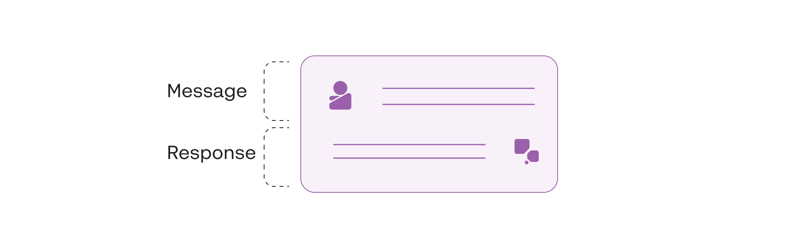
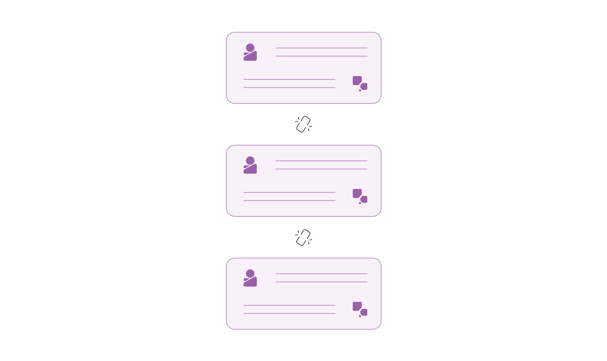
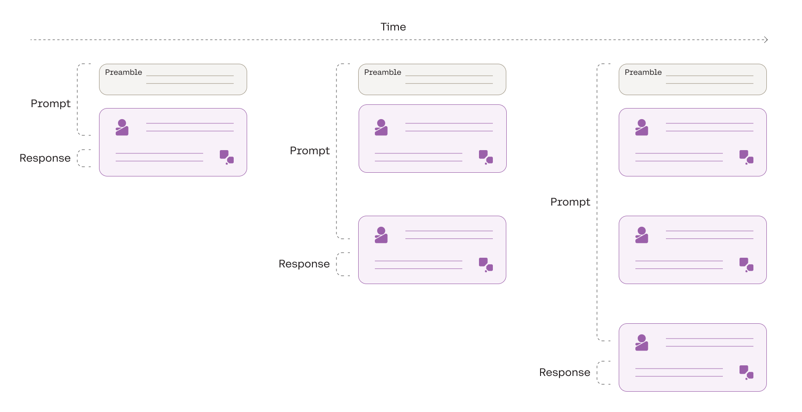
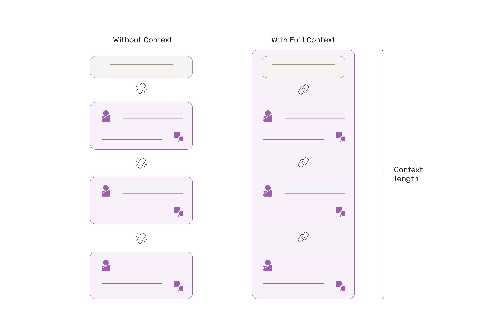
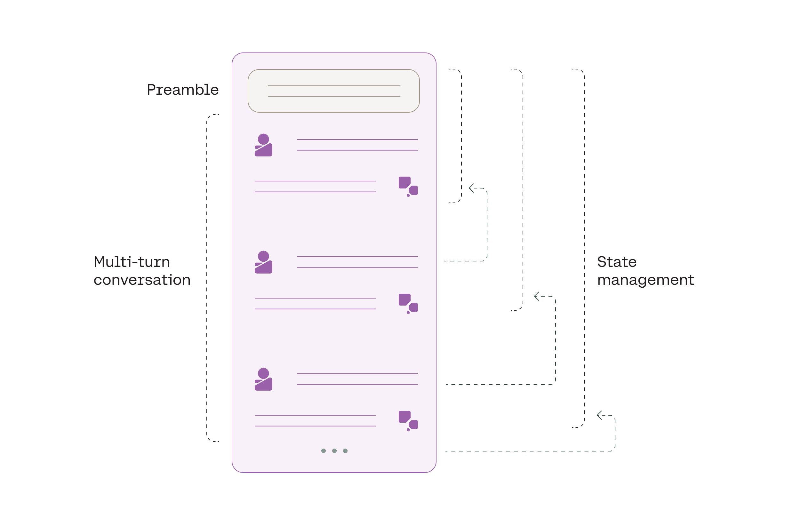

Chatbots brought large language models (LLMs) into the mainstream. LLMs have been around for a few years, but their adoption was largely limited to the AI community. The launch of AI-powered consumer chatbots has made LLMs accessible to the everyday user, and now they're a hot topic in tech and enterprise circles alike.

This text generation module teaches you how to build LLM chatbots using Cohere’s Chat endpoint.

## Command Model

[Command](https://cohere.com/models/command) is Cohere’s flagship LLM. It generates a response given a prompt or message from a user. It is trained to follow user commands and to be instantly useful in practical business applications, like summarization, copywriting, extraction, and question answering.

Command has been trained with a large volume of multi-turn conversations to ensure that it excels at the various nuances associated with conversational language. It ranks at the top of the [Holistic Evaluation of Language Models](https://crfm.stanford.edu/helm/latest/) (HELM) benchmark, an evaluation leaderboard comparing large language models on a wide number of tasks (March ‘23 results).

### Command R and Command R+ Models

Command R and Command R+ are designed to be the market leading family of models in the ‘scalable’ category that balance high efficiency with strong accuracy to enable enterprises to move from proof of concept into production-grade AI.

Here are some key features of Command R:

- **High-performance RAG**: Retrieval-augmented generation (RAG) enables enterprises to give the model access to private knowledge that it otherwise would not have.
- **Access to tools**: Tool use enables enterprise developers to turn Command R into an engine for powering the automation of tasks and workflows that require using internal infrastructure like databases and software tools, as well as external tools like CRMs, search engines, and more. Command R+ supports Multi-Step Tool Use which allows the model to combine multiple tools over multiple steps to accomplish difficult tasks.
- **Low latency and high throughput**: Command R targets the “scalable” category of models that balance high performance with strong accuracy, enabling companies to move beyond proof of concept and into production.
- **128k context length and lower pricing**: Command R features a longer context length, supporting up to 128k tokens in its initial release.
- **Strong capabilities across 10 key languages**: The model excels at 10 major languages for global business: English, French, Spanish, Italian, German, Portuguese, Japanese, Korean, Arabic, and Chinese.
- **Model weights available for research and evaluation**: [Cohere For AI](https://cohere.com/research) is releasing the weights for this version of [Command R publicly](https://huggingface.co/CohereForAI/c4ai-command-r-v01), so that it can be used for research purposes.

## How an LLM Chatbot Works

To understand how LLM chatbots work, it’s important to develop an understanding of their building blocks. This section focuses on how to build the generative part of a chatbot by looking at how to use a foundational model and added layers of context to generate answers in a conversation style.

### The Foundation of an LLM Chatbot

The foundation of an LLM chatbot is an LLM that has been fine-tuned to follow instructions. It can generate a response given a prompt or message from a user. This type of model is tuned to follow instructions and questions, such as “Write a headline for my homemade jewelry product” or “What is the capital of Canada?”.

However, the LLM’s context is limited to only the last message it receives, and it does not consider any previous messages and responses.

Yet, chatbots are characterized by their ability to maintain a conversation with a user, which takes place over multiple interactions.

The goal of a chatbot is to solve this problem by linking a sequence of interactions into a single instance, allowing the chatbot to hold an ongoing conversation. In doing so, the model’s response can keep a memory of all the previous interactions instead of having to start from scratch every time.

### How to Build a Chatbot's Memory

Working off of the baseline generation model above, we can layer together multiple interactions into a single prompt and create a memory of the entire conversation.

First, we add a system-level prompt called a _preamble_. A preamble contains instructions to help steer a chatbot’s response toward specific characteristics, such as a persona, style, or format. For example, if we want the chatbot to adopt a formal style, the preamble can be used to encourage the generation of more business-like and professional responses. The preamble could be something like "You are a helpful chatbot, trained to assist human users by providing responses in a formal and professional tone."

Then, we append the current user message to the preamble, which becomes the prompt for the chatbot’s response. Next, we append the chatbot response and the following user message to the prompt.

We can repeat this step for any number of interactions until we reach the model’s maximum **context length**. Context length is the total number of tokens taken up by the prompt and response, and each model has a maximum context length that it can support.

This multi-turn framework is what gives chatbots the ability to hold the full context of conversation from start to finish.

However, building on top of a baseline LLM alone is not sufficient.

Chatbots need to perform well in a wide range of scenarios. To create a robust chatbot that consistently generates high-quality and reliable output, the baseline LLM needs to be adapted specifically to conversations. This means taking the baseline model and fine-tuning it further with a large volume of conversational data.

This is what forms the foundation of [Cohere’s Chat endpoint](https://cohere.com/chat?ref=txt.cohere.com) — let’s take a closer look.

## Cohere's Chat Endpoint

Improving LLM chatbot performance starts with how the baseline LLM is trained. The model powering the Chat endpoint is Cohere’s [Command model](https://cohere.com/models/command), trained with a large volume of multi-turn conversations. This ensures that the model will excel at the various nuances associated with conversational language and perform well across different use cases.

Beyond training, fine-tuning a baseline LLM for conversations requires adding a standardized interface on top of the prompt formatting system. The Chat endpoint provides a consistent, simplified, and structured way of handling the prompt formatting that defines how the prompt inputs should be organized, making it easier for developers to build chatbot applications. This added layer includes a fixed abstraction and schema, providing more stability to scale and build applications on top of the foundation model.

The Chat endpoint includes all the elements required for an LLM chatbot (as discussed in the previous sections), exposing a simple interface for developers. It consists of the following key components:

- **Preamble management**: Developers can opt to use the endpoint’s default preamble or override it with their own preambles.
- **Multi-turn conversations**: The Chat endpoint builds upon the Command model by enabling multi-turn conversations.
- **State management**: State management preserves the conversation memory. Developers can either leverage the endpoint’s conversation history persistence feature or manage the conversation history themselves.
- **Fully-managed conversation**: The abstraction layer of the Chat endpoint means there’s only one item to send to the API: the user message. Everything else is managed automatically. At the same time, developers who want greater control over a chatbot’s configuration can still do so.

## Conclusion

Cohere's Command model and Chat endpoint offer powerful tools for developers looking to harness the potential of LLMs in their applications. Command's capabilities, coupled with the Chat endpoint's developer-friendly interface, allow developers to build text generation applications across diverse business applications.
