Throughout the following 5 chapters, you'll learn all the ins and outs of prompt engineering. Here is what we’ll cover throughout them:

- Prompt Engineering (this chapter)
- Use Case Ideation
- The Generate Endpoint
- Creating Custom Models

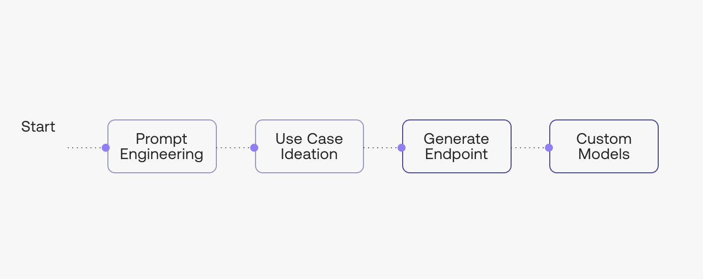


In this Chapter, we will cover the following topics regarding model prompting:

- Getting Started with the Cohere Playground
- Prompting the Models
- Controlling the Model Output
- Saving and Sharing Your Prompts

### Getting Started with the Cohere Playground

Throughout the following chapters, we will cover the full spectrum of working with generative AI to enable you to build applications with it. But to start with, let’s take the no-code route: we’ll show you how AI text generation works, and how you can experiment with it in the <a target="_blank" href="https://docs.cohere.ai/docs/playground-overview?ref=txt.cohere.com&amp;__hstc=14363112.fb39cf5aec47995e64cd26603e2e04d9.1682489949734.1683512904818.1683517385804.31&amp;__hssc=14363112.109.1683517385804&amp;__hsfp=3640182760">Cohere Playground</a>.

First, <a target="_blank" href="https://dashboard.cohere.ai/welcome/register?ref=txt.cohere.com&amp;__hstc=14363112.fb39cf5aec47995e64cd26603e2e04d9.1682489949734.1683512904818.1683517385804.31&amp;__hssc=14363112.109.1683517385804&amp;__hsfp=3640182760">sign up for a Cohere account</a> and then visit the <a target="_blank" href="https://dashboard.cohere.com/playground?ref=txt.cohere.com&amp;__hstc=14363112.fb39cf5aec47995e64cd26603e2e04d9.1682489949734.1683512904818.1683517385804.31&amp;__hssc=14363112.109.1683517385804&amp;__hsfp=3640182760">Playground</a>.

The Playground UI consists of a few sections. The main window is where you enter your prompt and where the output, or response, is generated. A menu of saved prompts, or _presets_, is shown in the left-hand pane, and model parameter controls are located in the right-hand pane.

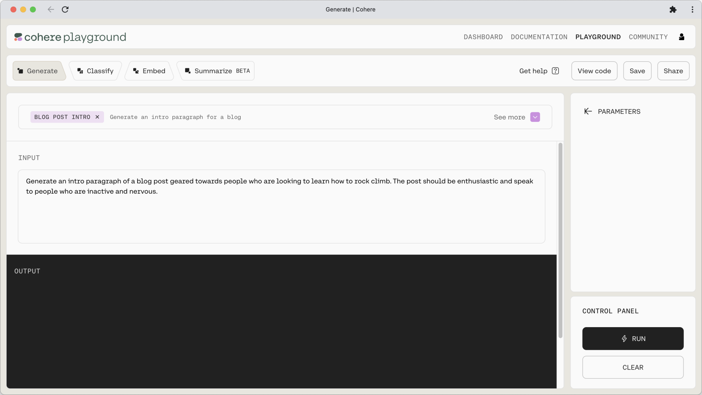


We’ll cover presets and parameters later in this article, but now, let’s start with the fun part: prompt design.

### Prompting the Models

#### Prompt Design

Prompting is at the heart of working with LLMs. The prompt provides a context for the text that we want the model to generate. The prompts we create can be anything from simple instructions to more complex pieces of text, and they are used to encourage the model to produce a specific type of output.

Coming up with a good prompt is a bit of both science and art. On the one hand, we know the broad patterns that enable us to construct a prompt that will generate the output that we want. But on the other hand, there is so much room for creativity and imagination in coming up with prompts that can get the best out of a model.

With that, let’s now dive into how you can design effective prompts.

#### Prompting the Command model by Instruction

The best way to design prompts is to tell a model like `Command` what you need it to do like you’re giving the model a command or an instruction. One way to do this is by using imperative verbs to tell the model what to do, for example: generate, write, list, provide, and other variations.

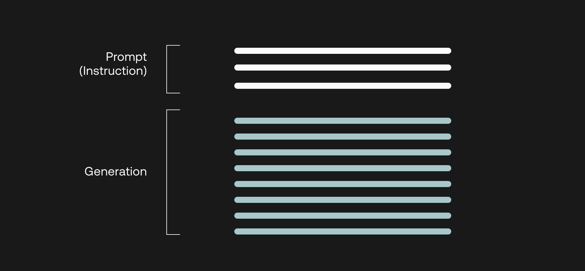


##### A Basic Prompt

Let’s say that we are creating the product description copy for a wireless earbuds product. We can write the prompt as follows.

```
Generate a concise product description for the product: wireless earbuds.
```

At this point, ensure that you select `command` in the `MODEL` dropdown on the right pane. Then, click on `Run`.

This generates the following output.

_[Preset link](https://dashboard.cohere.ai/playground/shared-preset?ref=Product-Description---Basic-mh416g)_

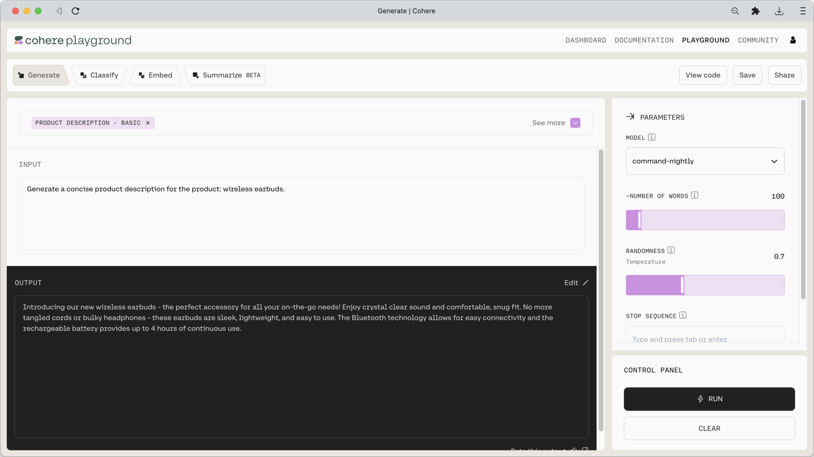


That’s not bad. With a simple, one-line prompt, we already have a piece of product description that can make a digital marketer proud!

But perhaps we want to be more specific regarding what we want the output to look like. For this, we can layer additional instructions onto the model in the prompt.

Let’s say we want the model to write the product description in a particular format with specific information. In this case, we can append this specific instruction in the following prompt. 

_[Preset link](https://dashboard.cohere.ai/playground/shared-preset?ref=Product-Description---Specific-Format-j50nvz)_

```
Generate a concise product description for the product: wireless earbuds.
Use the following format: Hook, Solution, Features and Benefits, Call to Action.
```

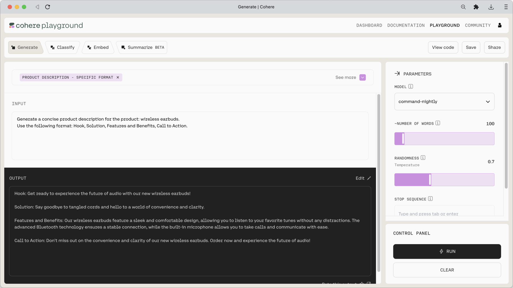


The model duly returns an output following the format that we wanted.

##### Adding Context to a Prompt

The prompt can also be constructed as a combination of an instruction and some context. Let’s see this in action with another example: emails. We can create a simple instruction to write an email as follows.

_[Preset link](https://dashboard.cohere.ai/playground/shared-preset?ref=Email-Composer-y35acc)_

```
Write an email thanking your team members for successfully organizing a community meetup.
```

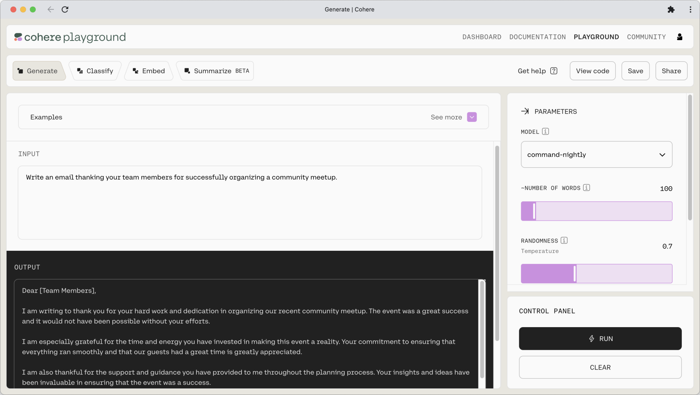


Or we can create another prompt to summarize that email, which now becomes part of the prompt, acting as the context.

Note: For summarization tasks, Cohere also provides a more streamlined <a target="_blank" href="https://dashboard.cohere.ai/playground/summarize?__hstc=14363112.fb39cf5aec47995e64cd26603e2e04d9.1682489949734.1683512904818.1683517385804.31&amp;__hssc=14363112.109.1683517385804&amp;__hsfp=3640182760">Summarize (beta) endpoint</a>.

_[Preset link](https://dashboard.cohere.ai/playground/shared-preset?ref=Email-Summarizer-bcfp49)_

```
Summarize this email in one sentence.

Dear [Team Members],

I am writing to thank you for your hard work and dedication in organizing our recent community meetup. The event was a great success and it would not have been possible without your efforts.

I am especially grateful for the time and energy you have invested in making this event a reality. Your commitment to ensuring that everything ran smoothly and that our guests had a great time is greatly appreciated.

I am also thankful for the support and guidance you have provided to me throughout the planning process. Your insights and ideas have been invaluable in ensuring that the event was a success.

I am confident that our community will benefit greatly from this event and I am excited to see the positive impact it will have.

Thank you again for your hard work and dedication. I am looking forward to working with you on future events.

Sincerely,
[Your Name]
```

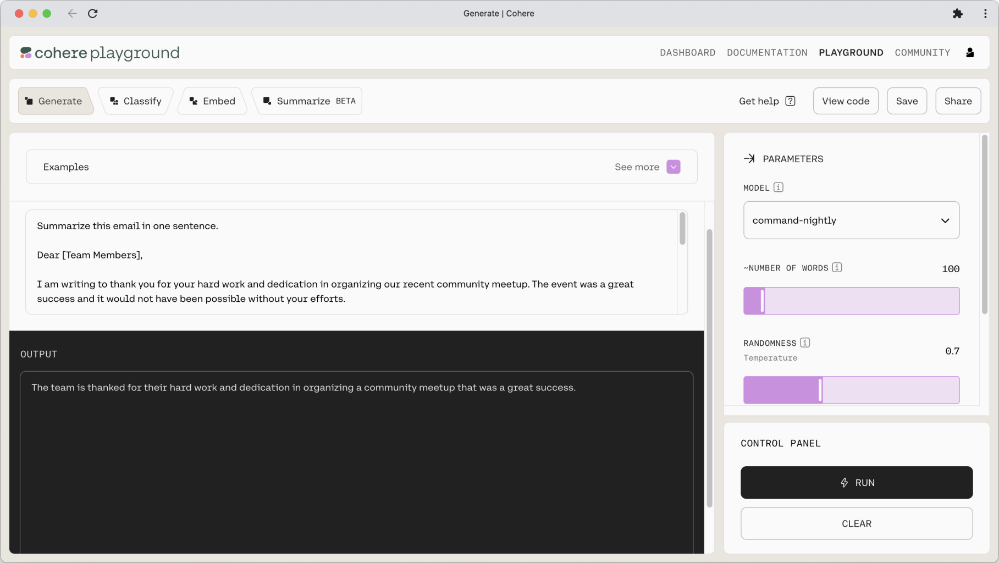


This instruction–context prompt format is extremely useful as it means we can insert additional information into the context to help ground the model's output. One such example is a question answering system for, let's say, a company's knowledge base. Given a question (the instruction), the model will only be able to provide accurate answers if provided with the knowledge base (the context).

Let's move to another example—an extraction task, which is another type of task that a generative model can do very well. Given a context, which in this case is a description of a movie, we want the model to extract the movie title. Here's the prompt.

_[Preset link](https://dashboard.cohere.ai/playground/shared-preset?ref=Movie-Title-Extraction-t5vegd)_

```
Extract the movie title from the text below.

Deadpool 2 | Official HD Deadpool's "Wet on Wet" Teaser | 2018
```

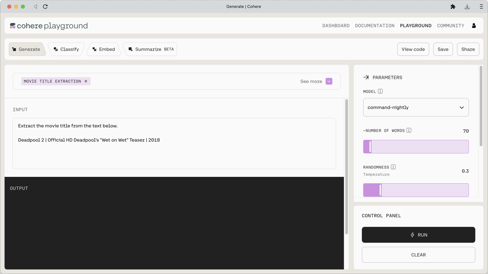


The model is also effective at tasks that involves taking a piece of text and rewriting it into another format that we need. 

Here's an example. We have a one-line instruction followed by the context, which in this case is a blog excerpt. The instruction is to generate a list of frequently asked questions (FAQ) based on the passage, which involves a mixture of several tasks such as extraction and rewriting. Here's the prompt.

_[Preset link](https://dashboard.cohere.ai/playground/shared-preset?ref=FAQ-Generator-8h3w9a)_

```
Given the following text, write down a list of potential frequently asked questions (FAQ), together with the answers.

The Cohere Platform provides an API for developers and organizations to access cutting-edge LLMs without needing machine learning know-how. The platform handles all the complexities of curating massive amounts of text data, model development, distributed training, model serving, and more. This means that developers can focus on creating value on the applied side rather than spending time and effort on the capability-building side.

There are two key types of language processing capabilities that the Cohere Platform provides — text generation and text embedding — and each is served by a different type of model.

With text generation, we enter a piece of text, or prompt, and get back a stream of text as a completion to the prompt. One example is asking the model to write a haiku (the prompt) and getting an originally written haiku in return (the completion).

With text embedding, we enter a piece of text and get back a list of numbers that represents its semantic meaning (we’ll see what “semantic” means in a section below). This is useful for use cases that involve “measuring” what a passage of text represents, for example, in analyzing its sentiment.
```

And the result is a nice list of FAQs about the blog excerpt.


By now we can see how versatile our model is at performing various forms of tasks—not just freeform text generation, but also following instructions, working with contextual information, summarizing long passages, extracting information, rewriting text into different forms, and more.

This is just a taste of what kinds of prompts you can design. You can keep layering your instructions to be as specific as you want, and see the output generated by the model. And there is really no right or wrong way to design a prompt. It’s really about applying an idea and continuing to iterate the prompt until you get the outcome you are looking for.

### Controlling the Model Output

Other than the prompt design, there is another way to control the kind of output we want, that is, by adjusting the model parameters. These parameters are available on the right pane of the Playground. They are applicable to both types of prompting we discussed earlier.

Let’s now see what we can do with these parameters.

#### When to Stop

There are a couple of parameters that let you decide when the model should stop.

- `NUMBER OF WORDS` — The model will stop generating text once it reaches the maximum number of words specified by this parameter. Note: the model treats words as `tokens`. One word is about three tokens.
- `STOP SEQUENCE` — You can define any character or sequence of characters to tell the model when to stop. This is useful when you are showing the model a few generation examples and you want to show exactly where one example ends. For examples, you can use “--” to split the examples, or simply a new line (`\n` character) or a period character to tell the model to stop once it finishes a sentence.

#### Being Creative vs. Predictable

Probably the most useful set of parameters are the ones that we can tune to control the randomness of the output. The beauty of working with LLMs is, for the same prompt, the next generated token will not be the same every time. Rather, it is sampled from a long list of possible tokens. This is where the creative aspect of LLM comes from, allowing us to generate a variety of outputs, given the exact same prompt.

But depending on your application, you may want to reduce, or increase, this level of randomness. You can do this by adjusting a number of parameters.

But before looking at the parameters, it’s worth taking the time to understand how the model selects the next token to generate. It does this by assigning a `likelihood` number to each of all possible next tokens. The model would see that the token `cookies` has a much higher likelihood than `chair` for appearing after the phrase `I like to bake`.

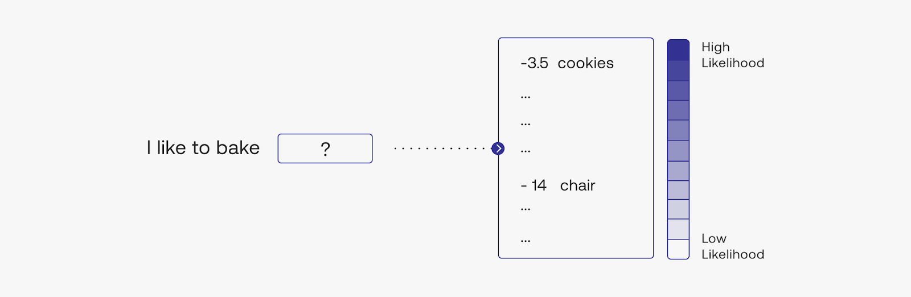


During text generation, there’s still a probability that `chair` would appear, but the probability is much lower than `cookies`. The parameters we are going to see now can change this behavior.

There are two parameters we can adjust for this.

- `RANDOMNESS` — is how the model chooses from its next choice of tokens. Adjusting this changes the model's _temperature_ value. Lower temperature values will cause the model to output text that is more predictable, while higher temperature values mean that the output will be more creative and less grounded if you're using [retrieval augmented generation](/docs/retrieval-augmented-generation-rag). It is a number between 0 and 2, and in most cases, somewhere between 0 and 1 works fine.
- `TOP-K` (under `Advanced Parameters`) — is the list from which the model can make its choices. The default is 0, which means the model will consider all possible next tokens out of the thousands of possible tokens. If you change to any other number, of say, 100, the model will only consider the top 100 most probable tokens.

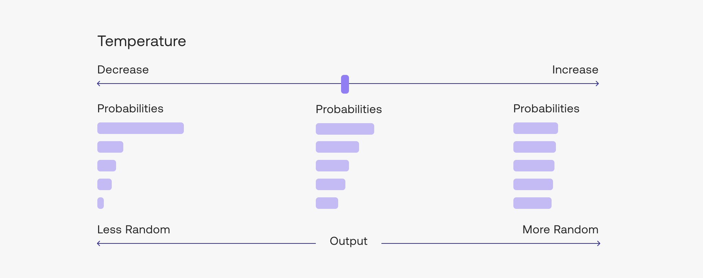


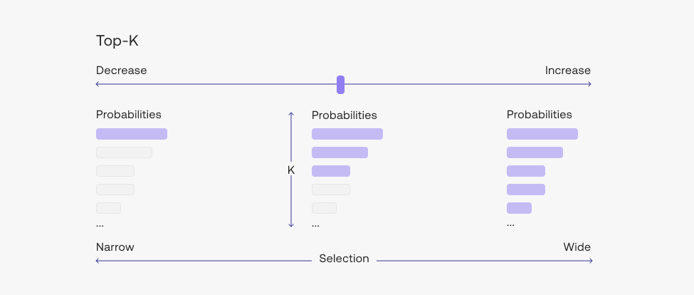


### Saving and Sharing Your Prompts

You can save the prompts that you have created by clicking on the `Save` button on the top right of the Playground. Once you have saved a prompt, it will appear as a preset on the Playground.

You can also share these prompts with others. To do this, click on the `Share` button on the top right of the Playground. You will get a link that you can share with anyone!

### Conclusion

In this chapter, we covered how to prompt a model — probably the most important and definitely the most fun part of working with large language models. If you’d like to dive deeper into it, here are some resources you can go to for further reading:

- Documentation on <a target="_blank" href="https://docs.cohere.ai/prompt-engineering-wiki?ref=txt.cohere.com&amp;__hstc=14363112.fb39cf5aec47995e64cd26603e2e04d9.1682489949734.1683512904818.1683517385804.31&amp;__hssc=14363112.109.1683517385804&amp;__hsfp=3640182760">designing a prompt</a>
- Documentation on <a target="_blank" href="https://docs.cohere.ai/docs/command-beta?ref=txt.cohere.com&amp;__hstc=14363112.fb39cf5aec47995e64cd26603e2e04d9.1682489949734.1683512904818.1683517385804.31&amp;__hssc=14363112.109.1683517385804&amp;__hsfp=3640182760">text generation</a>
- The <a target="_blank" href="https://docs.cohere.ai/generate-reference?ref=txt.cohere.com&amp;__hstc=14363112.fb39cf5aec47995e64cd26603e2e04d9.1682489949734.1683512904818.1683517385804.31&amp;__hssc=14363112.109.1683517385804&amp;__hsfp=3640182760">Generate API reference</a>

In the next chapter, we will explore the range of use cases and areas where generative AI in language can be applied. And along the way, we’ll see how a prompt can be designed.

### Original Source

This material comes from the post <a target="_blank" href="https://txt.cohere.com/generative-ai-part-1/">Generative AI with Cohere: Part 1 - Model Prompting</a>
