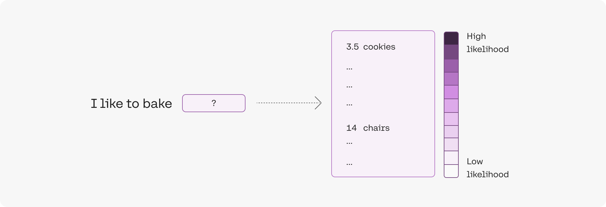
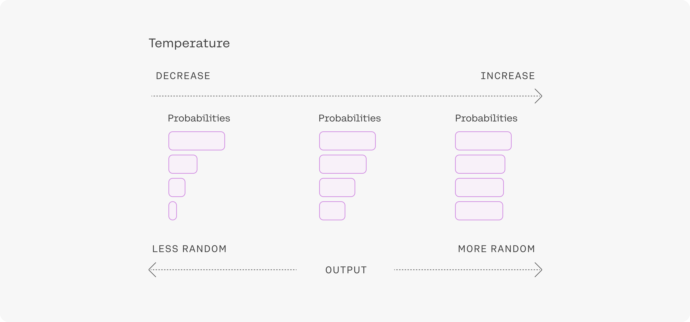

We’ll use [Cohere’s Python SDK](/reference/about?ref=txt.cohere.com#python)  for the code examples. Follow along in [this notebook](https://github.com/cohere-ai/cohere-developer-experience/blob/main/notebooks/llmu/Parameters_for_Controlling_Outputs.ipynb). 

The Chat endpoint is a versatile tool that empowers developers with an extensive array of options and parameters.

As you’ll learn, the Command model has many variations to select from, where each has been carefully crafted to suit different needs. Additionally, you will see how to use parameters to control the creativity of model responses.

## Setup

To set up, we first import the Cohere module and create a client.

```python PYTHON
import cohere

co = cohere.Client("COHERE_API_KEY")  # Your Cohere API key
```

## Model Type

With the [Chat endpoint](/reference/chat) , you can choose from several variations of the [Command model](https://cohere.com/models/command) . Different models may produce different output profiles, so you may want to experiment with different models to get the best output for your use case. 

[See the documentation](/docs/models#command)  for the most updated list of available Cohere models. These models include:

- `[command-A](/docs/command-a)`: The most powerful LLM, capable of Tool Use, Multilinguality, Structured Outputs and more. 
- `[command-r7b](/docs/command-r7b)`: A smaller, cheaper variant of `command`.

Use the `model` parameter to select a variation that suits your requirements. In the code cell, we select `command-r`.

```python PYTHON
response = co.chat(message="Hello", model="command-a-03-2025")
print(response.text)
```

```
# RESPONSE 
Hello! How can I help you today?
```

## Randomness

Often, you’ll need to control the level of randomness of the model. There are a number of factors to keep in mind when tuning model randomness, including:

- **Task type**: You’ll likely want to decrease the randomness of the model when performing structured tasks that have a correct answer, like for question answering or summarization, or for generating technical text. In these cases, we want the model to yield a safe and predictable response. On the other hand, if you’re generating poetry or brainstorming ideas, you might want to increase the randomness to produce more diverse and creative responses.
- **Model behavior**: We likely need to increase the randomness of the model if it gets stuck in a loop and starts repeating itself, or if it is producing overly generic phrases. Increasing the randomness will expand the set of words that the model can use when generating responses.
- **Controlling style and tone**: If generating text that needs to have a specific tone or style, like for a company blog post or customer support responses, a low level of randomness might be desirable, to keep the model from generating unusual words.

Modifying the [temperature](/docs/temperature) parameter changes the extent to which the model considers incorporating unlikely [tokens](/docs/tokens) (can be words, parts of words, or punctuation) in its response, which can make the output more random and creative.   

To understand this, we’ll look at an example. The model would likely predict that the token `cookies` has a much higher likelihood than `chair` for appearing after the phrase `I like to bake`.



Before these likelihoods can be used to select the next token, they first need to be converted to probabilities. The temperature parameter controls how this conversion is done.

- At **low** temperature, low likelihood tokens are assigned very low probabilities, and high likelihood tokens are assigned very high probabilities.
- At **high** temperature, the probabilities will look roughly similar for each token, with high likelihood tokens assigned only slightly higher probability.



Building off the example above,

- At **low** temperature, there’s a probability that `chair` is selected, but the probability is significantly lower than `cookies`.
- At **high** temperature, the probability that `chair` is selected is only slightly lower than `cookies`. 

The temperature parameter is a value between 0 and 1. As you increase the temperature, the model gets more creative and random. Temperature can be tuned for different problems, and most people will find that the default temperature of 0.3 is a good starting point.

Let’s look at a code example, where we suggest that the model generate alternative names for a blog post. Prompting the endpoint five times when the temperature is set to 0 yields the same output each time.

```python PYTHON
message = """Suggest a more exciting title for a blog post titled: Intro to Retrieval-Augmented Generation. \
Respond in a single line."""

for _ in range(5):
    response = co.chat(
        message=message, temperature=0, model="command-a-03-2025"
    )
    print(response.text)
```

```
# RESPONSE

The Future of AI: Unlocking the Power of Retrieval-Augmented Generation
The Future of AI: Unlocking the Power of Retrieval-Augmented Generation
The Future of AI: Unlocking the Power of Retrieval-Augmented Generation
The Future of AI: Unlocking the Power of Retrieval-Augmented Generation
The Future of AI: Unlocking the Power of Retrieval-Augmented Generation
```

However, if we increase the temperature to the maximum value of 1, the model gives different proposals.

```python PYTHON
message = """Suggest a more exciting title for a blog post titled: Intro to Retrieval-Augmented Generation. \
Respond in a single line."""

for _ in range(5):
    response = co.chat(
        message=message, temperature=1, model="command-a-03-2025"
    )
    print(response.text)
```

```
# RESPONSE

Unleashing the Power of Retrieval-Augmented Generation: A Comprehensive Guide
The Exciting Future of AI: How Retrieval-Augmented Generation Will Transform the Way We Interact With Machines
The Magic of AI: Unlocking the Power of Retrieval-Augmented Generation
The Future of AI: Unlocking the Power of Retrieval-Augmented Generation
"Unleashing the Power of AI: The Rise of Retrieval-Augmented Generation."
```

## Conclusion

In this chapter, you learned how to call different variations of the Command model when using the Chat endpoint. You worked with a code example using the temperature parameter to control the Command model’s level of randomness.
