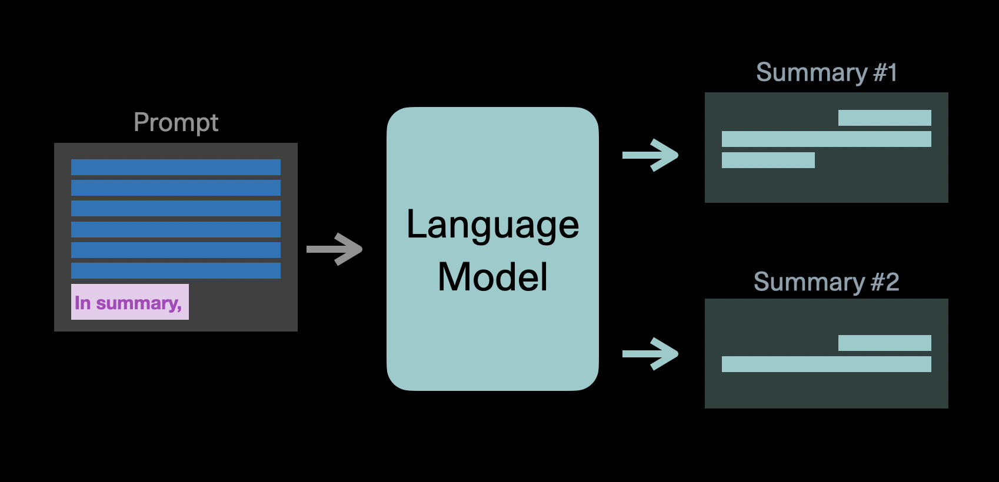

# TODO:

Luis to write this chapter based on the codelab.

### Introduction and Codelab

In this chapter you'll learn a simple way of using Cohere's generation models to summarize text.

### ### Colab Notebook
This chapter comes with a corresponding <a target="_blank" href="https://github.com/cohere-ai/notebooks/blob/main/notebooks/Basic_Summarization_Notebook.ipynb">Colab notebook</a>, and we encourage you to follow it along as you read the chapter.

For the setup, please refer to the <a target="_blank" href="/docs/setting-up">Setting Up</a> chapter at the beginning of this module.

### The prompt

We're going to use the `command` model to summarize a sentence. The sentence we want it to summarize is:

`Killer whales have a diverse diet, although individual populations often specialize in particular types of prey.`

In order to teach the model how to summarize, we'll give it two examples of pieces of text, together with its sentence summaries. Thus, we'll be giving the model 3 prompts: The two examples, and the sentence to summarize.

Each prompt to the model will have two parts: the input text and the summary.

The two examples we'll use are the following:

**Example 1**

- Input text: `The killer whale or orca (Orcinus orca) is a toothed whale belonging to the oceanic dolphin family, of which it is the largest member`
- Summary: `The killer whale or orca is the largest type of dolphin`

**Example 2**

- Input text: `It is recognizable by its black-and-white patterned body`
- Summary: `Its body has a black and white pattern`

The following is the prompt we'll input to the model. The two first prompts are the two examples and the third one gives it the new sentence to summarize.

```
prompt = '''
"The killer whale or orca (Orcinus orca) is a toothed whale belonging to the oceanic dolphin family, of which it is the largest member"
In summary: "The killer whale or orca is the largest type of dolphin"
---
"It is recognizable by its black-and-white patterned body" 
In summary:"Its body has a black and white pattern"
---
"Killer whales have a diverse diet, although individual populations often specialize in particular types of prey" 
In summary:"
'''
```

### Hyperparameters

The following lines of code will create the summary.

```
n_generations = 5

prediction = co.generate(
    model='command',
    prompt=prompt,
    return_likelihoods = 'GENERATION',
    stop_sequences=['"'],
    max_tokens=50,
    temperature=0.7,
    num_generations=n_generations,
    k=0,
    p=0.75)
```

In the code above, you can see that we are using the `command` model. Here are some of the other hyperparameters of the generation endpoint.

It's worth spending some time learning the various hyperparameters of the generation endpoint. For example, temperature tunes the degree of randomness in the generations. Other parameters include top-k and top-p as well as frequency_penalty and presence_penalty which can reduce the amount of repetition in the output of the model. See the API reference of the generate endpoint for more details on all the parameters.

- `temperature`: This tunes the degree of randomness in the generations. A low temperature will give more predictable answers, while a high temperature will explore more.

See the [Generate Endpoint Chapter](/docs/the-generate-endpoint) or the API reference

The response is the following:

`"Killer whales have a diverse diet."`
