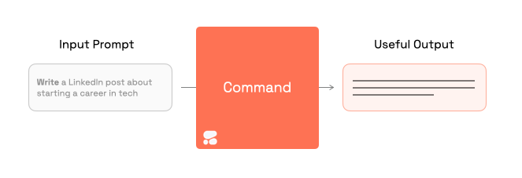
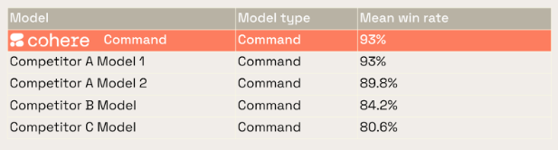
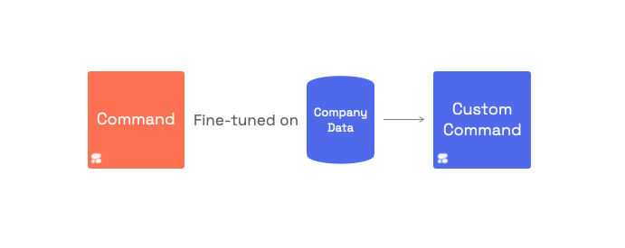
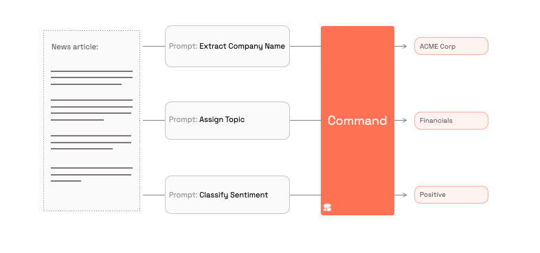
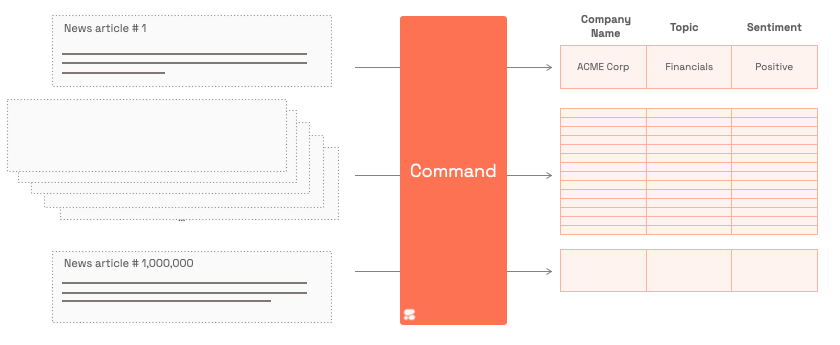

In this chapter, we'll give you an overview of the new Command model for generation, and its uses.

_Command_ is Cohere’s flagship text generation model. It is trained to follow user commands and to be instantly useful in practical business applications.

### Cutting-edge performance

Command ranks at the top of the HELM benchmark, an evaluation leaderboard comparing large language models on a wide number of tasks (March ‘23 results). HELM is the [Holistic Evaluation of Language Models](https://crfm.stanford.edu/helm/latest/) from Stanford University.

## Why Command

** 1- Continuously improving**

Future-proof your language model technology by relying on a model that keeps improving over time. [Join the Discord](https://discord.gg/co-mmunity) to keep learning about the latest releases.

** 2- Trained on practical use cases**

We especially train Command on data that aids reliable business applications, like summarization, copywriting, extraction, and question answering. 

**3- Optimized for business priorities**

We are SOC 2 compliant and care deeply about [security](https://cohere.com/security), [privacy](https://cohere.com/privacy), and [Responsible AI](https://cohere.com/responsibility).

## Customize it to your data and advanced use cases

Command can instantly perform many tasks by default. But if you need to incorporate company-specific language or more advanced use cases, then Command can be customized to hyperfocus on your use case.

## Example use cases

### Collaborate With a Helpful Co-Author

Command can [write product descriptions](https://dashboard.cohere.ai/playground/shared-preset?ref=Product-Description-h4eh4j), help [draft emails](https://dashboard.cohere.ai/playground/shared-preset?ref=Cold-Outreach-Email-jdgn1g), [suggest example press release copy](https://dashboard.cohere.ai/playground/shared-preset?ref=Investment-press-release-kkhcx7), and [much more](https://cohere.com/examples).

### In-depth analysis of documents

Ask Command multiple questions about a document in order to assign a category to the document, extract a piece of information, or answer a general question about the document.

### Millions of answers, at your command

Where answering a few questions about a document can save you a few minutes, doing it for thousands of documents can save a company years.

### Power the next generation of intelligent systems

Integrating Command into your products unlocks a world of possibilities. Dedicate your time to product innovation, while Cohere handles model improvement and deployment for you.
