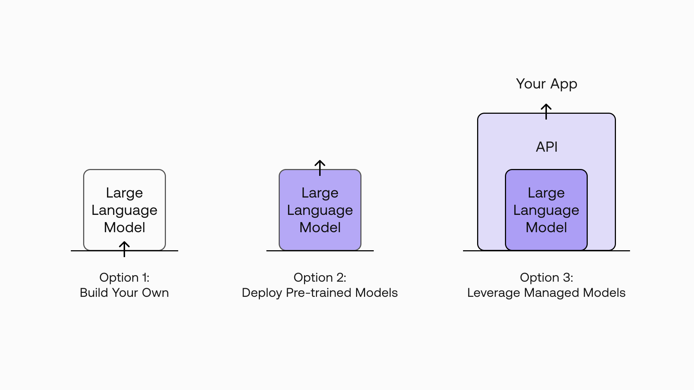
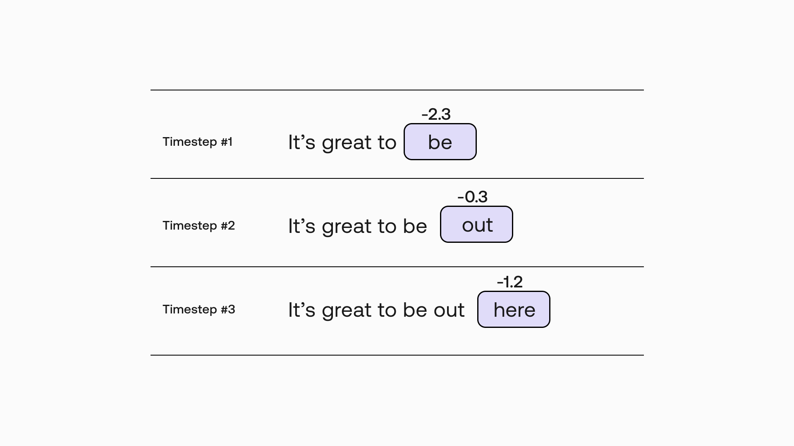
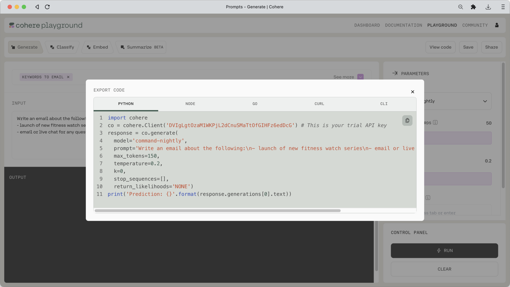
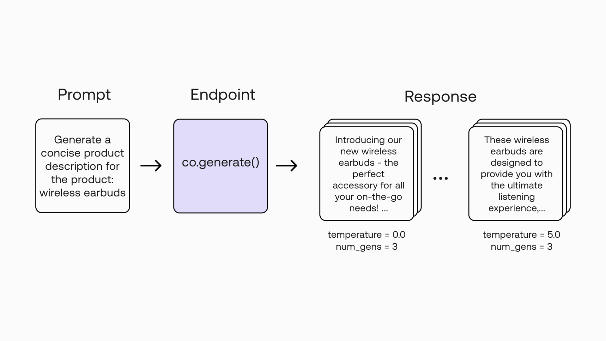

In the previous two chapters, we looked at how we can use the Playground to experiment with ideas in text generation. And let’s say we have now found that idea which we want to build on, so what’s next?  In this chapter, we will begin our exploration of the <a target="_blank" href="https://docs.cohere.ai/reference/generate?ref=txt.cohere.com&amp;__hstc=14363112.fb39cf5aec47995e64cd26603e2e04d9.1682489949734.1683517385804.1683567328678.32&amp;__hssc=14363112.3.1683567328678&amp;__hsfp=3887566761">Cohere Generate endpoint</a>, one of the endpoints available from the <a target="_blank" href="https://docs.cohere.ai/reference/about?ref=txt.cohere.com&amp;__hstc=14363112.fb39cf5aec47995e64cd26603e2e04d9.1682489949734.1683517385804.1683567328678.32&amp;__hssc=14363112.3.1683567328678&amp;__hsfp=3887566761">Cohere API</a>. We’ll move from the Playground to code, in this case via the Python SDK, and learn how to use the endpoint.

### Colab Notebook

This article comes with a <a target="_blank" href="https://colab.research.google.com/github/cohere-ai/cohere-developer-experience/blob/main/notebooks/Working_With_the_Generate_Endpoint.ipynb?ref=txt.cohere.com">Google Colaboratory notebook</a> for reference.

Here’s a quick look at how to generate a piece of text via the endpoint. It’s quite straightforward.

We enter a prompt:

```python PYTHON
response = co.generate(
    model="command",
    prompt="Generate a social ad copy for the product: Wireless Earbuds.",
    max_tokens=100,
)
print(response.generations[0].text)
```

And we get a response:

```
Get ready to cut the cord with our new Wireless Earbuds! No more tangled wires, no more hassle - just pure, crystal clear sound.
```

Of course, there are more options available for you to define your call in a more precise way. In this chapter, we will cover that and more, including:

- An overview of the Generate endpoint
- Setting up
- Making the first API call
- Understanding the response
- Turning Playground prompts into code
- Selecting the model
- Understanding the other parameters
- Experimenting with a prompt

But before going further, let’s take a quick step back and reflect on what this all means.

Looking at the code snippet above, it’s easy to miss what’s at play here. There are many options out there for leveraging large language models (LLMs), from building your own models to deploying available pre-trained models. But with a managed LLM platform like Cohere, what you get is a simple interface to language technology via easy-to-use endpoints.

What this means is that you are free to focus solely on building applications instead of having to worry about getting the underlying technology to work. You don’t have to worry about the complexities, resources, and expertise required to build, train, deploy, and maintain these AI models.



Now let’s dive deeper into the Generate endpoint.

### Overview of the Generate Endpoint

The Cohere platform can be accessed via the Playground and SDK. In this article, we’ll learn how to work with the Python SDK.

With the API, you can access a number of endpoints, such as Generate, Embed, and Classify. Different endpoints are used for different purposes and produce different outputs. For example, you would use the Classify endpoint when you want to perform text classification.

Our focus for this series is, of course, text generation, so we’ll work with the Generate endpoint.

### Setting Up

First, if you haven’t done so already, you can <a target="_blank" href="https://dashboard.cohere.ai/welcome/register?ref=txt.cohere.com&amp;__hstc=14363112.fb39cf5aec47995e64cd26603e2e04d9.1682489949734.1683517385804.1683567328678.32&amp;__hssc=14363112.3.1683567328678&amp;__hsfp=3887566761">register for a Cohere account</a> and get a trial API key, which is free to use. There is no credit or time limit associated with a trial key but API calls are rate-limited. Read more about <a target="_blank" href="https://docs.cohere.ai/docs/going-live?ref=txt.cohere.com&amp;__hstc=14363112.fb39cf5aec47995e64cd26603e2e04d9.1682489949734.1683517385804.1683567328678.32&amp;__hssc=14363112.3.1683567328678&amp;__hsfp=3887566761">using trial keys</a> in our documentation.

Next, you need to install the Python SDK. You can install the package with this command:

```shell SHELL
pip install cohere
```

### Making the First API Call

Now, to get a feel of what the Generate endpoint does, let’s try it with the code snippet we saw earlier.

Import the Cohere package, define the Cohere client with the API key, and add the text generation code, like so.

```python PYTHON
import cohere

co = cohere.Client("your_api_key")

response = co.generate(
    model="command",
    prompt="Generate a concise product description for the product: wireless earbuds.",
    max_tokens=100,
)

print(response.generations[0].text)
```

We defined a number of parameters.

- `model` — We selected `command`.
- `prompt` — The prompt, which is an instruction to write a social ad copy.
- `max_tokens` — The maximum number of tokens to be generated. One word is about three tokens.

The complete list of parameters can be found on the [Generate API Reference](/reference/generate) page.

Run it on a Python interpreter and you get the response:

```
These wireless earbuds are designed for comfort and convenience, with a secure fit and easy-to-use controls. They're perfect for when you're on the go, and provide clear sound and reliable connectivity.
```

And that’s our first API call!

### Understanding the Response

Let’s understand what we get from the API response.

The Generate endpoint accepts a text input, that is the prompt, and outputs a Generation object.


Here’s an example response, with the text generated:

```
[cohere.Generation {
	id: 3d3ecb76-6435-4665-a323-6650eefc2429
	prompt: Generate a concise product description for the product: wireless earbuds.
	text: 
These wireless earbuds are designed for comfort and convenience, with a secure fit and easy-to-use controls. They're perfect for when you're on the go, and provide clear sound and reliable connectivity.
	likelihood: None
	token_likelihoods: None
}]
```

The response contains:

- `id` — A unique ID for the generation
- `prompt` — The prompt provided by the user
- `text` — The generated text, given the input
- `likelihood` — The average likelihood of all generated tokens (one English word roughly translates to 1-2 tokens)
- `token_likelihoods` — The likelihood of each token

If you want to keep it simple, you just need to get the text output and you’re good to go, like what we have done so far: `response.generations[0].text`. Here, we defined the index of the generation (index 0, representing the first item) because the endpoint can actually generate more than one output in one go. We’ll cover how to get multiple generations later in this article.

In some scenarios, we may want to evaluate the quality of our output. This is where we can use the `likelihood` and `token_likelihoods` outputs.

We covered what likelihood is in the [Prompt Engineering](/docs/model-prompting#being-creative-vs-predictable) chapter. Now let's look at an example to understand `likelihood` and `token_likelihoods`.

Say our text input is, “It’s great to” and the generated text is, “be out here”. These three output words map directly to three individual tokens, which we can check using the `Tokenize` endpoint.

```python PYTHON
co.tokenize("be out here")
```

Response:

```
cohere.Tokens {
	tokens: [894, 558, 1095]
	token_strings: ['be', ' out', ' here']
}
```

So, back to the Generate endpoint output, let’s say we get the following likelihood values for each token:

- `be`: - 2.3
- `out`: -0.3
- `here`: -1.2



So, the average likelihood of all generated tokens, in this case, is the average of the three tokens, which equals -1.3.

Note that you need to enable the `return_likelihoods` parameter to return either `GENERATION` (output only) or `ALL` (output and prompt), otherwise, you will get `None` for the `likelihood` and `token_likelihoods` outputs.

```python PYTHON
response = co.generate(
    model="command",
    prompt="Generate a concise product description for the product: wireless earbuds.",
    max_tokens=100,
    return_likelihoods="GENERATION",
)
print(response)
```

Response:

```
[cohere.Generation {
	id: bccb41a7-cc67-45de-a6cb-59200c0b7ff7
	prompt: Generate a concise product description for the product: wireless earbuds.
	text: 
These wireless earbuds provide crystal clear sound and a comfortable fit, making them perfect for your on-the-go lifestyle. The earbuds feature a Bluetooth connection, so you can easily connect to your favorite devices.
	likelihood: -0.31602517
	token_likelihoods: [TokenLikelihood(token='\n', likelihood=-2.9636725e-05), TokenLikelihood(token='These', likelihood=-0.93044), TokenLikelihood(token=' wireless', likelihood=-0.1625166), TokenLikelihood(token=' earbuds', likelihood=-0.00023237972), TokenLikelihood(token=' provide', likelihood=-1.7594767), TokenLikelihood(token=' crystal', likelihood=-0.30630827), TokenLikelihood(token=' clear', likelihood=-0.006674145), TokenLikelihood(token=' sound', likelihood=-0.031797588), TokenLikelihood(token=' and', likelihood=-0.021826616), TokenLikelihood(token=' a', likelihood=-0.045265503), TokenLikelihood(token=' comfortable', likelihood=-0.0037292854), TokenLikelihood(token=' fit', likelihood=-0.035238348), TokenLikelihood(token=',', likelihood=-0.47499913), TokenLikelihood(token=' making', likelihood=-0.096061766), TokenLikelihood(token=' them', likelihood=-0.00057715003), TokenLikelihood(token=' perfect', likelihood=-0.0413739), TokenLikelihood(token=' for', likelihood=-3.8103353e-05), TokenLikelihood(token=' your', likelihood=-1.022666), TokenLikelihood(token=' on', likelihood=-0.057791833), TokenLikelihood(token='-', likelihood=-9.401318e-05), TokenLikelihood(token='the', likelihood=-8.176345e-06), TokenLikelihood(token='-', likelihood=-1.022884e-06), TokenLikelihood(token='go', likelihood=-7.1481794e-05), TokenLikelihood(token=' lifestyle', likelihood=-0.09184248), TokenLikelihood(token='.', likelihood=-0.00914639), TokenLikelihood(token=' The', likelihood=-0.69395995), TokenLikelihood(token=' earbuds', likelihood=-0.92923546), TokenLikelihood(token=' feature', likelihood=-0.78148234), TokenLikelihood(token=' a', likelihood=-0.35010356), TokenLikelihood(token=' Bluetooth', likelihood=-2.1289418), TokenLikelihood(token=' connection', likelihood=-0.18478136), TokenLikelihood(token=',', likelihood=-0.3644204), TokenLikelihood(token=' so', likelihood=-0.19117455), TokenLikelihood(token=' you', likelihood=-0.00013502566), TokenLikelihood(token=' can', likelihood=-0.0006682836), TokenLikelihood(token=' easily', likelihood=-0.1432187), TokenLikelihood(token=' connect', likelihood=-1.1377978), TokenLikelihood(token=' to', likelihood=-0.17181365), TokenLikelihood(token=' your', likelihood=-0.008168794), TokenLikelihood(token=' favorite', likelihood=-0.3145811), TokenLikelihood(token=' devices', likelihood=-0.6555098), TokenLikelihood(token='.', likelihood=-0.11885719)]
}]
```

### Turning Playground Prompts into Code

Recall that in the previous chapter, we went through a number of prompt ideas, where each comes with its own preset link. You might have come up with some ideas and saved them as presets. The question is, how do you turn those into code?

It’s easy. If you go back to the Playground and open up a preset, you will see a `View Code` button on the top right. Click on that button and you will get the code version of that preset in the language of your choice (the screenshot below shows a Python example).



You can simply copy and paste this code into the Python interpreter to get the response.

### Selecting the Model

We have only used one model so far: `command`. But there are a few other types of models available with the endpoint. Here are the available models at the time of writing:

- Default versions: `command` and `command-light`
- Experimental versions: `command-nightly` and `command-light-nightly`

The presence of the term `light` in the names represent models with smaller parameter sizes. So, which one do you choose? It depends on your use case, but as a rule of thumb, smaller models are faster, while larger models are generally more fluent and coherent.

### Understanding the Other Parameters

While defining just the model is enough to get started, in reality, you will likely need to specify other parameters as well, so the model’s output will match your intended output as closely as possible.

We covered some of these parameters in the <a target="_blank" href="/docs/model-prompting">model prompting chapter</a> but not the exhaustive list. So, now is probably a good time to visit the <a target="_blank" href="https://docs.cohere.ai/reference/generate?ref=txt.cohere.com&amp;__hstc=14363112.fb39cf5aec47995e64cd26603e2e04d9.1682489949734.1683517385804.1683567328678.32&amp;__hssc=14363112.3.1683567328678&amp;__hsfp=3887566761#4-generate-text">Generate endpoint docs</a> and learn more about all the available parameters, for example, their default values, their value ranges, and more.

### Experimenting with a Prompt

If you have a prompt idea that you really want to take to the next step, you may want to experiment extensively with it, for example, by trying out different parameter combinations and finding that ideal combination that fits your needs.

You can do that with the Playground, but since you’ll have to manually adjust the settings after each generation, it’s probably not going to be very efficient. That’s when the SDK comes in.

In the following example, we’ll take a prompt (product description) and create a small function to automatically iterate over different text generations. This way we can evaluate the generations in a much faster way.

In particular, we’re going to use the following parameters:

- `temperature` (same as `RANDOMNESS` in the Playground)— we’ll iterate over a range of values to arrive at a value that fits our use case
- `num_generations` — we can use this parameter to get five generations in one go instead of one
- `return_likelihoods` — we’ll set this to GENERATIONS and use this to evaluate the randomness of our text output




And here’s what the code looks like:

```python PYTHON
# Function to call the Generate endpoint
def generate_text(prompt, temperature, num_gens):
    response = co.generate(
        model="command",
        prompt=prompt,
        temperature=temperature,
        num_generations=num_gens,
        return_likelihoods="GENERATION",
    )
    return response


# Define the prompt
prompt = "Generate a concise product description for the product: wireless earbuds."

# Define the range of temperature values and num_generations
temperatures = [x / 10.0 for x in range(0, 60, 10)]
num_gens = 3

# Iterate over the range of temperature values
print(f"Temperature range: {temperatures}")
for temperature in temperatures:
    response = generate_text(prompt, temperature, num_gens)
    for i in range(3):
        text = response.generations[i].text
        likelihood = response.generations[i].likelihood
        print(f"Generation #{i+1}")
        print(f"Text: {text}\n")
        print(f"Likelihood: {likelihood}\n")
```

You can run the code in the notebook and get the full generation. Here, we are showing a few example outputs, as the full generation is quite long (view the notebook to see the full generation).

```
Temperature range: [0.0, 1.0, 2.0, 3.0, 4.0, 5.0]
----------
Temperature: 0.0
----------
Generation #1
Text: 
These wireless earbuds are perfect for anyone who wants a stylish and convenient way to listen to music, podcasts, and calls on the go. They feature a comfortable and secure fit, and provide clear and reliable sound. The wireless design makes it easy to take them with you wherever you go, and the built-in microphone allows you to take calls without having to reach for your phone.

Likelihood: -0.24169345

Generation #2
Text: 
These wireless earbuds are perfect for anyone who wants a stylish and convenient way to listen to music, podcasts, and calls on the go. They feature a comfortable and secure fit, and provide clear and reliable sound. The wireless design makes it easy to take them with you wherever you go, and the built-in microphone allows you to take calls without having to reach for your phone.

Likelihood: -0.24174544

Generation #3

--- [TRUNCATED FOR BREVITY]
```

### Conclusion

In this blog post, we made our first foray into the Generate endpoint using the Python SDK. We got familiarized with how to get text generations via the API, and we created a simple function to help us experiment with a prompt idea.

We have only covered the basics, though. In upcoming articles, we’ll look at how we can integrate the endpoint into proper applications, such as adding user interfaces, working with other endpoints in tandem, and more.

### Original source

This material comes from the post <a target="_blank" href="https://txt.cohere.com/generative-ai-part-3/">Generative AI with Cohere: Part 3 - The Generate Endpoint</a>.
