Large language models (LLMs) are versatile. Their general purpose nature makes them adept at handling a wide range of tasks. However, for the same reason, sometimes it may not be immediately obvious as to how to apply LLMs for specific tasks.

If you are thinking about the next thing you want to build with LLMs, this chapter can help you get up and running with generating use case ideas.

In the previous chapter, we looked at how to get started with text generation. In particular, we looked at two ways you can influence the output of a model: via prompts and model parameters. We also looked at a few examples, such as generating ad copy, summarizing emails, writing haikus, and more.

In this chapter, we’ll continue our exploration of the use cases in generative AI. We’ll first look into an ideation framework that was specifically designed for LLMs, and then look at some specific examples.

While the applications of LLMs are broad, the key to ideating a new one is to get specific about what you want to achieve. And to be able to do that, it’s helpful to understand where and how LLMs can be applied.

There are a number of ways that you can look at it, and here we propose three:

- **Goal:** The “why” — the problems for which LLMs are well-suited
- **Task:** The “how” — the tasks LLMs can perform, or how you get to the goal
- **Domain:** The “what” — the domains or industries in which LLMs can be applied

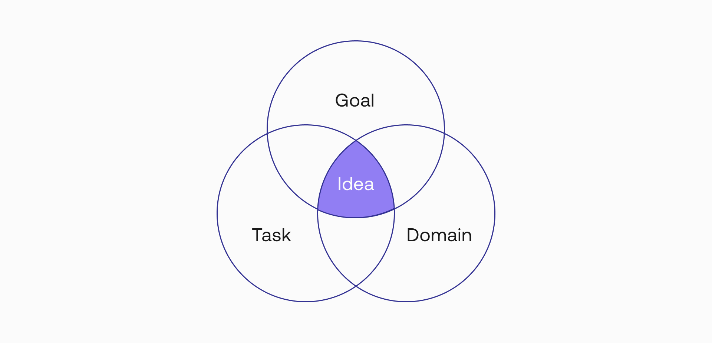

Getting specific in each of these areas can help you crystalize your target use case. The idea that you are looking for is probably sitting at the intersection of these three areas. Let’s now go deeper into each.

### Goal

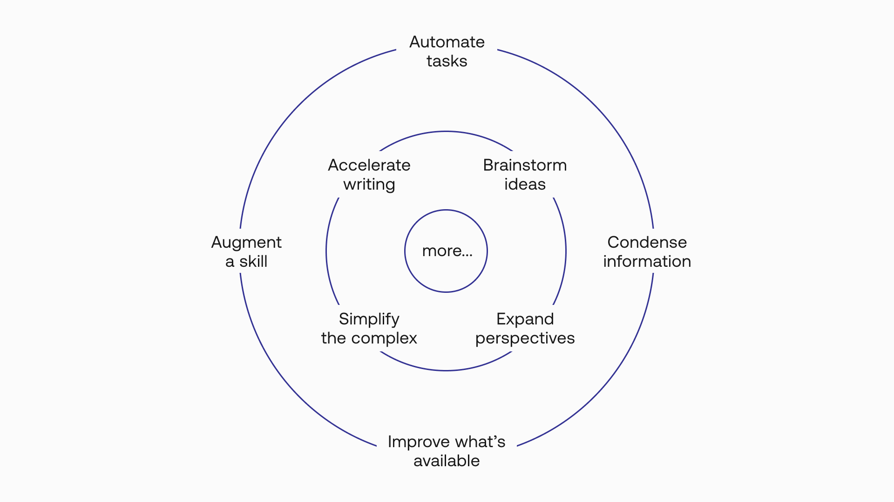

Before going into prompt creation, a good place to start is to identify the goal, that is the problem you want to solve. Focusing our attention on the problem to solve brings clarity to the potential use cases to be developed.

At the same time, not all problems can be solved by LLMs. So, it’s useful to understand the kinds of problems and goals well-suited for LLMs.

The following are some example areas where LLMs are especially helpful:

- **Automate repetitive tasks:** Producing outputs on a consistent basis with a certain format and quality. Example use cases: producing ad copy, creating product descriptions, extracting phone numbers from text.
- **Accelerate writing:** Writing down the first draft, or even the final version of a piece of text. Example use cases: composing emails, writing blog posts, providing customer chat responses.
- **Brainstorm ideas:** Generating a skeleton of a bigger piece to be worked on, instead of working off a blank canvas. Example use cases: generating article outlines, finding business ideas, writing story plots.
- **Augment a skill:** Augmenting the skill of a writer who might not have sufficient proficiency. Example use cases: writing poems, writing fiction stories, formulating product pitches.
- **Condense information:** Getting a summarized version of a document that strips it to its essence. Example use cases: summarizing reports, articles, and podcast transcripts.
- **Simplify the complex:** Rewriting a piece of text into a simpler, more accessible way. Example use cases: simplifying technical explanations, understanding complex text, extracting key concepts from a passage.
- **Expand perspectives:** Adding variety to the voice and idea beyond just the person writing. Example use cases: generating opinions in essays, constructing arguments in debating, adding variety in speech scripts.
- **Improve what’s available:** Turning a piece of text into a better version. Example use cases: correcting spelling errors, making a passage more coherent, rewriting podcast transcripts.

### Task

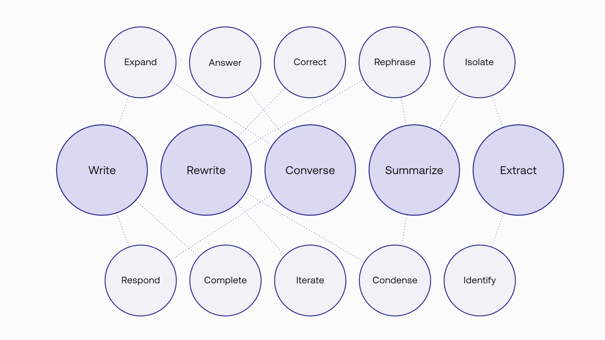

While the previous section looks at the kinds of goals you can achieve with LLMs, now we’ll look at how LLMs can help you achieve those goals.

The following are the different kinds of tasks that LLMs can perform in the generative AI space.

- **Write:** We start with the most obvious category, which covers most of the generative AI use cases out there. We can further break down this category into a few ways that you can leverage large language models. For example, an LLM can:
  - Continue on a piece of text that you have provided as a prompt (see Prompting by Example in the previous chapter). 
  - Respond to an instruction, be it a command to write something or a question that asks for an answer (see Prompting by Instruction in the previous chapter). 
  - Expand a set of keywords or sentences into a longer piece of text.
- **Rewrite:** While writing is about generating something from scratch, with rewriting, the model can take an existing piece of text and generate an alternative version. We can further break down this category into a few areas, such as rephrasing a piece of text, correcting errors found, or removing certain information from text.
- **Converse:** This category is about using LLMs to generate conversations. One example is creating a chatbot that answers questions, and another is writing screenplay dialogue. Earlier, we talked about LLMs providing answers to questions, but here the context is slightly different. With conversations, the context expands to the previous few lines of a dialogue, and it’s not just a one-off question-answering scenario.
- **Summarize:** This is similar to rewriting in the sense that there is an existing body of text to be worked on. In this case, it’s about generating a shorter version of the original text while maintaining the essence of the message.
- **Extract:** Similar to rewriting and summarization, extraction also is applied on existing pieces of text. Here, the goal is identify certain types of information available in the text, for example, a date from an invoice or the names of the people involved in a story.

### Domain

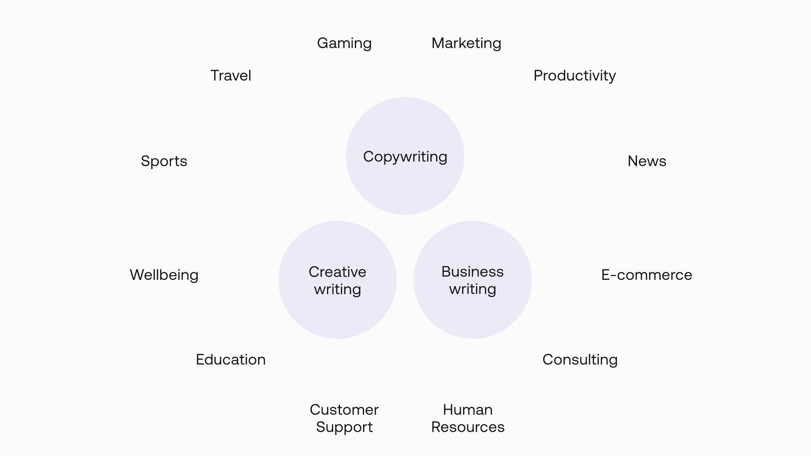

So, we’ve looked at why you want to use LLMs and how to achieve those goals. Now, we look at the final piece, which is the what — the domains where you can apply them.

LLMs are making an impact in the generative AI space across many industries. But at a high level, there are a few broad themes emerging:

- **Copywriting:** Copywriting is the act of writing text for the purpose of advertising or other forms of marketing. The text is designed to persuade the reader or listener to take some form of action, such as making a purchase or subscribing to a service.
- **Business Writing:** Business writing refers to the skills and conventions of writing in the business context. It covers anything related to writing in the workplace and includes documents, memos, letters, and emails. The format and style of writing could differ depending on the situation, such as with clients, vendors, customers, or colleagues.
- **Creative Writing:** Creative writing is any form of writing that expresses thoughts, feelings, and ideas in an imaginative way. It is a way to express oneself creatively and can be used for entertainment or as a form of self-expression. Creative writing can be used to tell stories, create characters, or explore new ideas.

You can also go into specific verticals or industries, each presenting huge opportunities for applying LLMs. For example: Marketing, Productivity, Gaming, Education, Wellbeing, Customer Support, Human Resources, News, Healthcare, E-commerce, Travel, Consulting, Sports, and more.

### Example Use Cases

A use case would typically emerge at the intersection of the three areas we’ve looked at. Let’s look at a few examples.

These examples are screenshots from the [Cohere Playground](<>). Each example comes with a preset link, which you can experiment with for yourself.

This list is not exhaustive, but it is meant to illustrate the breadth of areas we discussed in the previous sections.

#### Turning Product Features into Benefits

This is an example of a copywriting use case. Try the <a target="_blank" href="https://dashboard.cohere.ai/playground/shared-preset?ref=Product-Feature-to-Benefit-kddeaq&amp;__hstc=14363112.fb39cf5aec47995e64cd26603e2e04d9.1682489949734.1683512904818.1683517385804.31&amp;__hssc=14363112.111.1683517385804&amp;__hsfp=3640182760">preset here</a>.

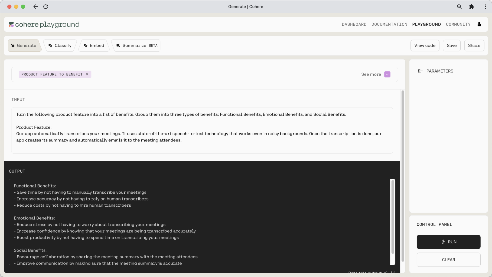

#### Generating a Product Pitch

This is an example of a brainstorming and business writing use case. Try the <a target="_blank" href="https://dashboard.cohere.ai/playground/shared-preset?ref=Product-Pitch-8n7dkb&amp;__hstc=14363112.fb39cf5aec47995e64cd26603e2e04d9.1682489949734.1683512904818.1683517385804.31&amp;__hssc=14363112.111.1683517385804&amp;__hsfp=3640182760">preset here</a>.

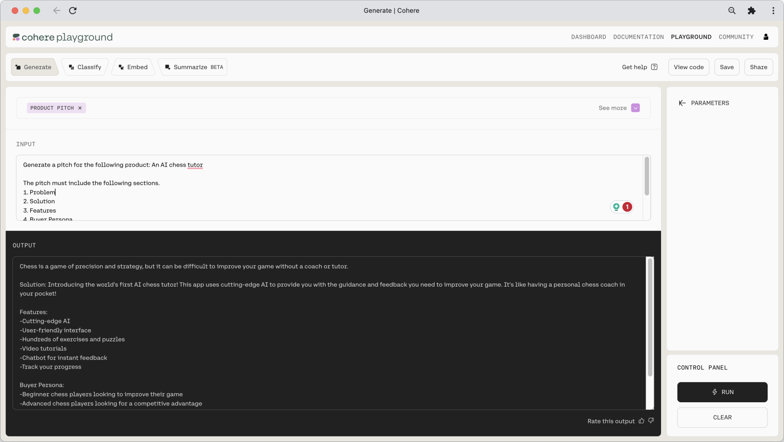

#### Creating a Business Model Canvas

This is an example of a brainstorming and business writing use case. Try the <a target="_blank" href="https://dashboard.cohere.ai/playground/shared-preset?ref=Business-Model-Canvas-55np7x&amp;__hstc=14363112.fb39cf5aec47995e64cd26603e2e04d9.1682489949734.1683512904818.1683517385804.31&amp;__hssc=14363112.111.1683517385804&amp;__hsfp=3640182760">preset here</a>.

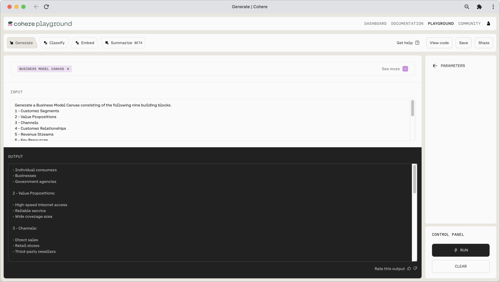

#### Extracting Keywords from Emails

This is an example of an extraction use case. Try the <a target="_blank" href="https://dashboard.cohere.ai/playground/shared-preset?ref=Email-Keyword-Extraction-5ghcwn&amp;__hstc=14363112.fb39cf5aec47995e64cd26603e2e04d9.1682489949734.1683512904818.1683517385804.31&amp;__hssc=14363112.111.1683517385804&amp;__hsfp=3640182760">preset here</a>.

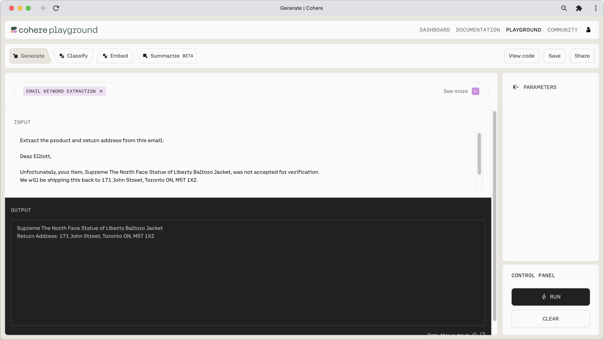

#### Simplifying Technical Concepts

This is an example of a rewriting use case in the education vertical. Try the <a target="_blank" href="https://dashboard.cohere.ai/playground/shared-preset?ref=Simplify-Technical-Concepts-tcjifr&amp;__hstc=14363112.fb39cf5aec47995e64cd26603e2e04d9.1682489949734.1683512904818.1683517385804.31&amp;__hssc=14363112.111.1683517385804&amp;__hsfp=3640182760">preset here</a>.

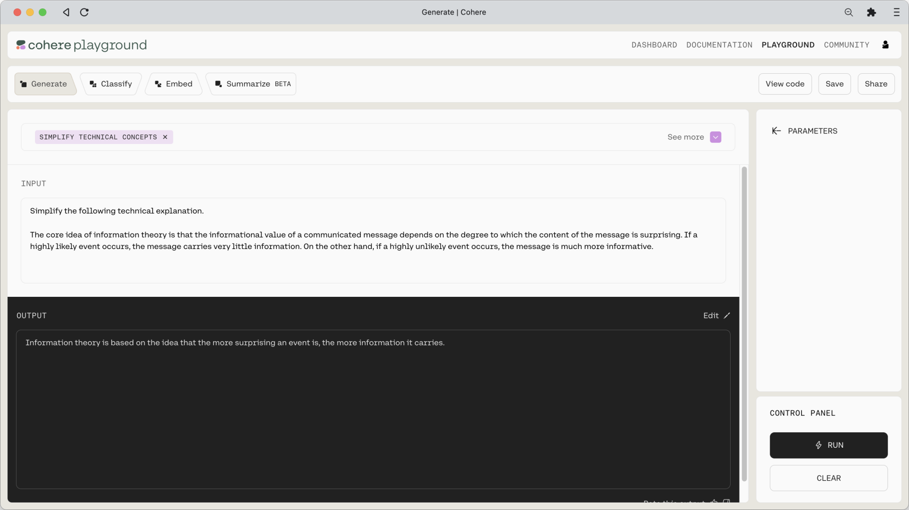

#### Composing an Email

This is an example of a business writing use case. Try the <a target="_blank" href="https://dashboard.cohere.ai/playground/shared-preset?ref=Keywords-to-Email-egyyi5&amp;__hstc=14363112.fb39cf5aec47995e64cd26603e2e04d9.1682489949734.1683512904818.1683517385804.31&amp;__hssc=14363112.111.1683517385804&amp;__hsfp=3640182760">preset here</a>.

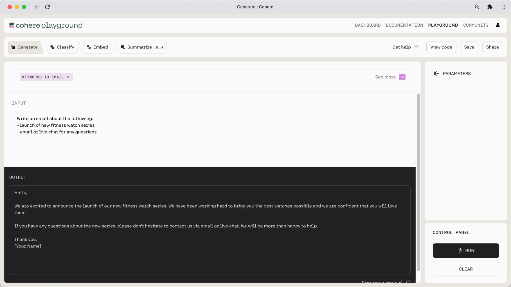

#### Writing in a Victorian Style

This is an example of a creative writing use case. Try the <a target="_blank" href="https://dashboard.cohere.ai/playground/shared-preset?ref=Victorian-Style-Writing-1zgye4&amp;__hstc=14363112.fb39cf5aec47995e64cd26603e2e04d9.1682489949734.1683512904818.1683517385804.31&amp;__hssc=14363112.111.1683517385804&amp;__hsfp=3640182760">preset here</a>.

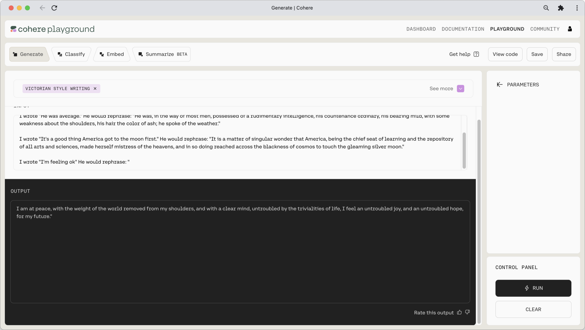

If you are looking for more examples, [visit this page](https://cohere.com/examples) to get more use case ideas.

### Conclusion

The use of text generation AI has the potential to revolutionize a wide range of industries and applications. From generating personalized content and responses for customer service, to creating unique and engaging marketing materials, the possibilities are endless.

### Original Source

This material comes from the post <a target="_blank" href="https://txt.cohere.com/generative-ai-part-2/">Generative AI with Cohere: Part 2 - Use Case Ideation</a>
