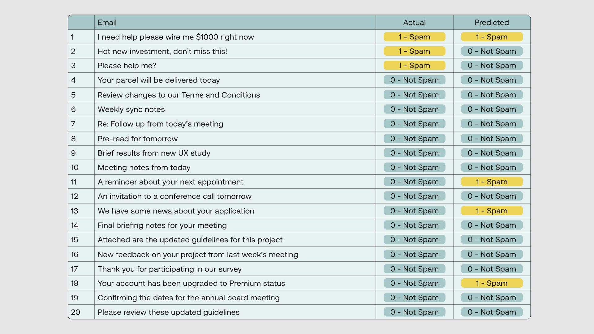
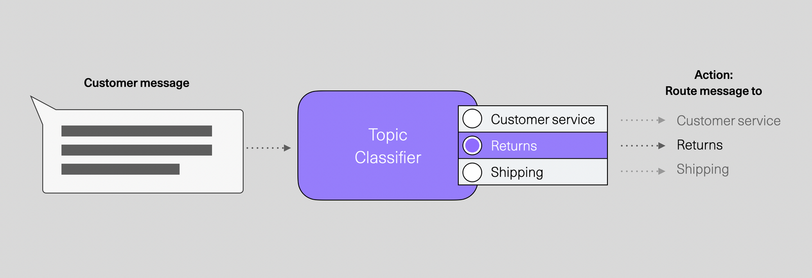
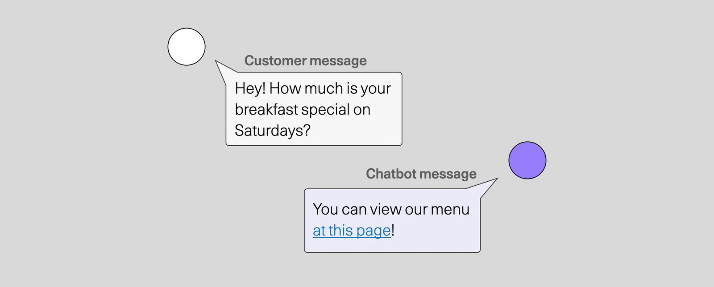
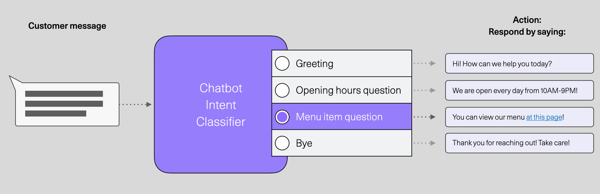
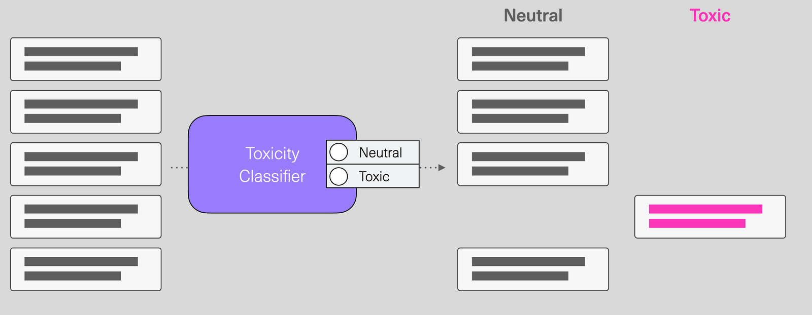
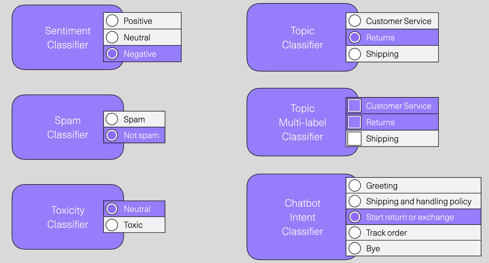

Large language models are used to solve all kinds of language tasks. Text classification is one of the leading tasks these models are often deployed to solve. For developers new to classification, a text classifier can be thought of as a piece of software that looks at a piece of text and assigns it a class label.

A classification task can fall under one of these two categories:- 
- **Binary classification**, where the number of classes is two. For example, the email spam classification that we saw earlier.
- **Multi-class classification**, where the number of classes is more than two. For example, classifying eCommerce inquiry emails into three types: shipping, returns, or tracking. 

We’ll begin with a binary classification example. Let’s stick with the spam email classification, where our task is to classify a list of emails into one of two classes: Spam or Not Spam. We’ll represent Spam with the integer 1 (or Positive) and Not Spam with 0 (or Negative). Here we have a dataset containing 20 email titles. We put each data point through a binary classifier to get the predicted class and then compare it with its actual class. The classifier returns the following outcome:

With this knowledge, we can look around and think about how this capability can enhance the systems we build. Let's look at two examples: Customer service and content moderation.

### Customer Service

Improving customer service systems is one of the most active areas for deploying language understanding systems. Let’s look at a couple of examples where text classifiers improve these systems.

#### Topic classification and message routing

For businesses that deal with a large volume of inbound communication, a lot of time and effort can be saved by automatically routing customer messages to the people who can resolve them.

This routing can either be actually forwarding an email or integrating with Customer Service software (like Zendesk or Freshdesk) that assigns the relevant person to look at the ticket.

A more advanced system is one that can automatically answer frequently asked questions instead of routing them to agents to answer them repeatedly. This is a common use case for chatbots to handle.

#### Chatbots and intent classification

Modern chatbots can be used to answer commonly asked user questions.

Text classification is a cornerstone of how these systems work. More specifically, most chatbots employ a classifier that detects the intent behind the user’s message. Intents are broader than topic classifiers as they include intents like “greeting” that enable them to react when a user says “hi” or “bye”, for example.

Chatbots tend to pair intent classifiers with entity extractors – another language processing functionality to extract the “breakfast special” from a menu item question so the system knows exactly which item the user is asking about.

#### Content Moderation

A significant portion of human interaction now happens online through social media, online forums, and group chats (like Discord or Slack). More often than not, these online communities <a target="_blank" href="https://cohere.com/blog/cohere-for-content-moderation/">need moderation to keep their communities safe</a> from different types of online harm. Language understanding systems can empower moderation teams in combating toxic, abusive, and hateful language.

A content filter can classify texts as either neutral or toxic:

In ["Content Moderation with Classify"](https://cohere.com/blog/content-moderation-classify), we show how you can build such a classifier with the Cohere [Classify endpoint](https://docs.cohere.com/v1/reference/classify). It's also possible to finetune a model on your labeled data so the classifier can specialize to solve this problem, which you can [read about here](https://docs.cohere.com/v1/docs/classify-fine-tuning).

### Other text classification problems

Building the best classifier and evaluating it for a specific dataset is a deep topic with a rich history and plenty of ongoing work. But for a developer just approaching the topic, this article aims to communicate the intuition of how to think of text classification as a language understanding capability that can improve software systems that handle text and communication.

If you're able to map real-world problems to text classification problems, that's a good first step to start your path in creating language processing systems.

### Conclusion

In this chapter you learned what a classification model is, and how they can be used for numerous applications.

<a target="_blank" href="https://cohere.com/blog/text-classification-use-cases/">https\://txt.cohere.com/text-classification-use-cases/</a>

### Original Source

This material comes from the posts <a target="_blank" href="https://cohere.com/blog/text-classification-use-cases/">Text Classification Intuition for Software Developers</a> and <a target="_blank" href="https://cohere.com/blog/classification-eval-metrics/">Classification Evaluation Metrics: Accuracy, Precision, Recall, and F1 Visually Explained</a>.
