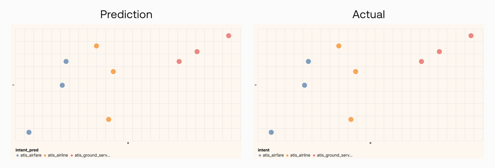

### Colab Notebook

This chapter uses the same [notebook](https://github.com/cohere-ai/notebooks/blob/main/notebooks/llmu/Visualizing_Text_Embeddings.ipynb) as the previous chapter.

For the setup, please refer to the <a target="_blank" href="/docs/setting-up">Setting Up</a> chapter at the beginning of this module.

### Using Embeddings to Classify Text

In the <a target="_blank" href="/docs/clustering-using-embeddings">previous chapter</a>, we looked at clustering, which is a task of grouping documents when the groups are not defined beforehand. Now, what if we already know the kinds of groups, or classes, that we want to group our dataset into?

While clustering is an "unsupervised learning algorithm" where we don’t know the number of classes and what they are, classification is a "supervised learning algorithm" where we do know them.

Text classification enables many possible applications, and one example is helping content moderators automatically flag toxic content on their platforms. Rather than having to manually go through every post and comment, they can have a system take in text, turn them into embeddings, and classify them based on the level of toxicity.

Another example is intent classification for customer support, where we build a system that takes in a customer inquiry and classifies the right intent so the inquiry can be routed to the right places.

And this happens to be what the dataset we’re using is all about. It contains a class feature called intent, and to demonstrate a classification task, we’ll bring it in this time. We’ll keep to the same 9 data points, but our task now is to predict the class of each data point out of three options—Airfare, Airline, and Ground Service (Note: the original dataset has more other classes but here we use just three for simplicity).

We’ll use `sklearn` to train a classifier with some training data. Implementation-wise, we take a set of training data to train a Support Vector Machine (SVM) model. If you'd like to learn more about this type of model, please check out this <a target="_blank" href="https://www.youtube.com/watch?v=Lpr__X8zuE8">SVM video</a>.

```python
# Train the classifier with Support Vector Machine (SVM) algorithm

# import SVM classifier code
from sklearn.svm import SVC
from sklearn.pipeline import make_pipeline
from sklearn.preprocessing import StandardScaler


# Initialize the classifier
svm_classifier = make_pipeline(StandardScaler(), SVC())

# Prepare the training features and label
features = df_train['query_embeds'].tolist()
label = df_train['intent']

# Fit the support vector machine
svm_classifier.fit(features, label)
```

Once that is done, we’ll take the embeddings of the 9 data points, put them through the trained model, and get the class predictions on the other side. And with this small test dataset, we get all predictions correct.

```python
# Predict with test data

# Prepare the test inputs
df_test = df_test.copy()
inputs = df_test['query_embeds'].tolist()

# Predict the labels
df_test['intent_pred'] = svm_classifier.predict(inputs)

# Compute the score
score = svm_classifier.score(inputs, df_test['intent'])
print(f"Prediction accuracy is {100*score}%")
```

**Output:** Prediction accuracy is 100.0%

Here we can see that all predictions match the actual classes:




### Conclusion

As you can see, there are different ways to use the endpoints to do classification! As you learned before, you can use the Classify endpoint, but you can also use the Embed endpoint and train a simple classifier on the resulting data. Since embeddings capture context so well, the job of the classifier is vastly simplified, and this is why we could train a simple SVM.

### Original Source

This material comes from the post <a target="_blank" href="https://txt.cohere.com/text-embeddings/">Text Embeddings Visually Explained</a>

