We’ll use [Cohere’s Python SDK](/reference/about?ref=txt.cohere.com#python) for the code examples. Follow along in [this notebook](https://colab.research.google.com/github/cohere-ai/cohere-developer-experience/blob/main/notebooks/guides/Analyzing_Hacker_News_with_Six_Language_Understanding_Methods.ipynb).

### Exploring large amounts of text with clustering

In a previous chapter, you learned to use embeddings and clustering in order to get insights on a text dataset. In this chapter, you'll do that and much more. You'll study a large dataset of 10,000 Hacker News posts, and you'll be able to perform the following tasks:

- Given an existing post title, retrieve the most similar posts (nearest neighbor search using embeddings)
- Given a query that we write, retrieve the most similar posts
- Plot the archive of articles by similarity (where similar posts are close together and different ones are far)
- Cluster the posts to identify the major common themes  
  Extract major keywords from each cluster so we can identify what the cluster is about

Check out this interactive <a target="_blank" href="https://assets.cohere.ai/blog/text-clustering/hn10k_clustered.html?ref=txt.cohere.com&amp;__hstc=14363112.fb39cf5aec47995e64cd26603e2e04d9.1682489949734.1683512904818.1683517385804.31&amp;__hssc=14363112.98.1683517385804&amp;__hsfp=3640182760">map</a> of the dataset.

This chapter demonstrates a common NLP use case often referred to as document clustering or topic modeling. It's the exercise of analyzing a large amount of text information and grouping documents (or headlines in our case) into groups. These can be:

- Analyzing news articles to group similar articles (like how Google News groups articles about the same event)
- Analyzing customer emails to identify common requests and themes
- Exploring financial filings and earning

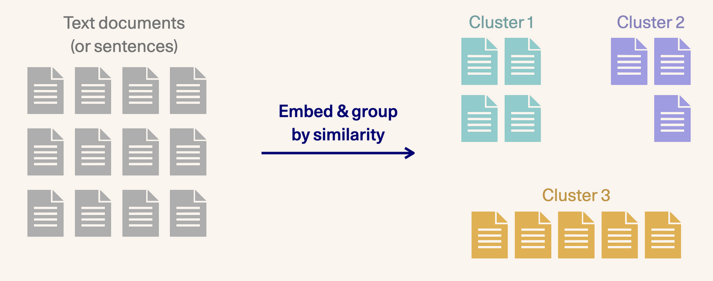
### How it was built

The map was built using language models and a collection of NLP tools. It revolves around embedding post titles and turning each one into a vector embedding using Cohere’s Embed endpoint. I’ve uploaded the embeddings so you can download and experiment with them.

So how do you make sense of ten thousand pieces of text without reading them individually?

### Getting the dataset

The Hacker News archive is available as a public dataset on BigQuery. Once you configure your credentials, you can retrieve posts or comments with a SQL query. This is the query you can use to get the top scoring HN posts of all time:

```sql
SELECT *
FROM `bigquery-public-data.hacker_news.full`
WHERE TYPE = 'story'
AND score > 10
ORDER BY score DESC
LIMIT 10000
```

### Getting meaningful text representations with Embed()

The next step is to embed these titles so we can examine the dataset based on the meanings of the titles and not just the tokens they contain.

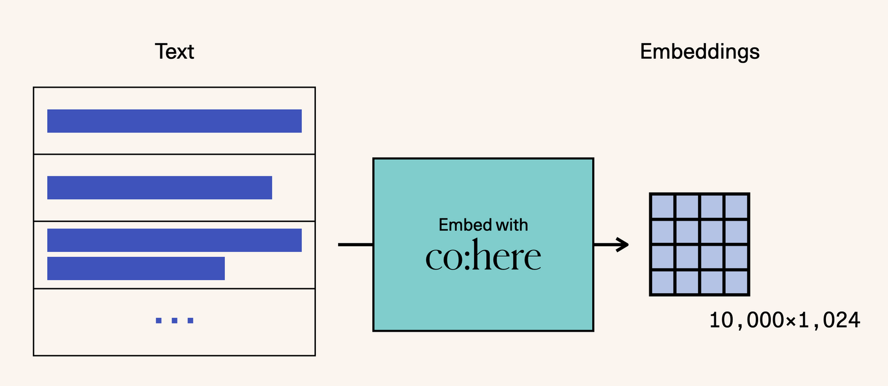

As you've seen before, Cohere’s <a target="_blank" href="https://docs.cohere.ai/embed-reference?ref=txt.cohere.com&amp;__hstc=14363112.fb39cf5aec47995e64cd26603e2e04d9.1682489949734.1683512904818.1683517385804.31&amp;__hssc=14363112.98.1683517385804&amp;__hsfp=3640182760">embed endpoint</a> gives us vector representations from a large embedding language model specifically tuned for text embedding (as opposed to word embedding or text generation).

```python PYTHON
import cohere 

co = cohere.ClientV2("<YOUR_API_KEY>")

embeds = co.embed(
    texts=list_of_posts, model="small", truncate="LEFT"
).embeddings
```

### Plotting

Next, we’ll reduce the embeddings down to two dimensions so we can plot them and explore which posts are similar to each other. We use <a target="_blank" href="https://umap-learn.readthedocs.io/en/latest/?ref=txt.cohere.com">UMAP</a> for this dimensionality reduction.

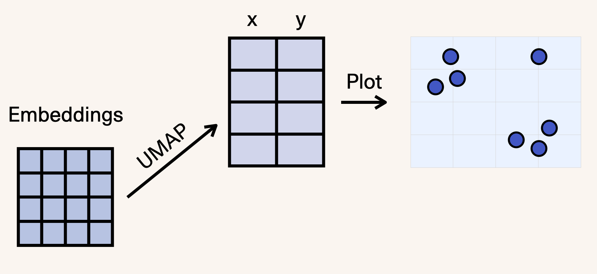

The UMAP call looks like this:

```python PYTHON
import umap

reducer = umap.UMAP(n_neighbors=100)
umap_embeds = reducer.fit_transform(embeds)
```

Which creates a map that looks like this:

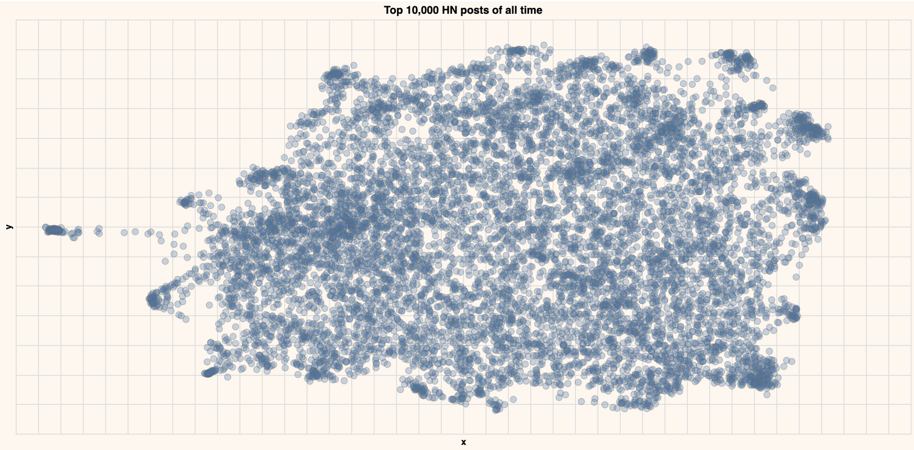

The semantic search guide walks you through how to build such a figure for your data. Now let's highlight some of the regions of the map where the title contains the following particular strings.

**Ask HN**

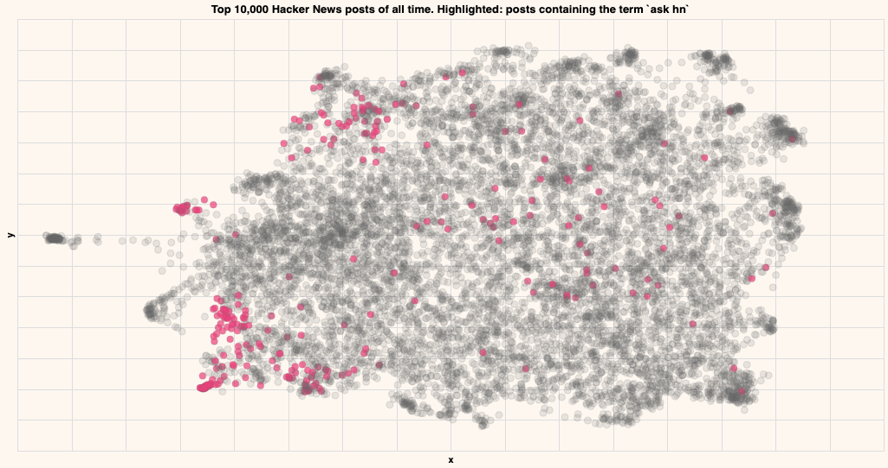

**Show HN**

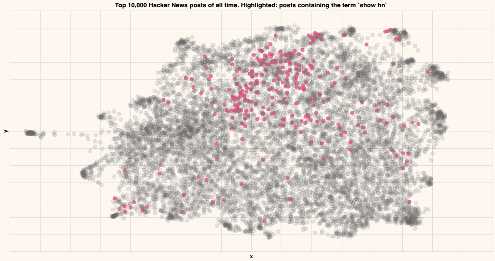

**Startup**

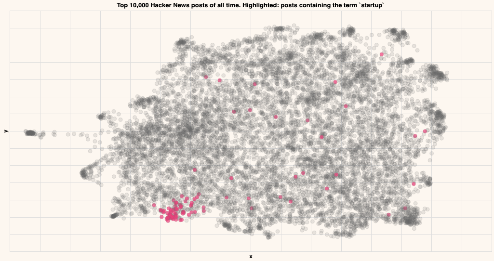

**Google**

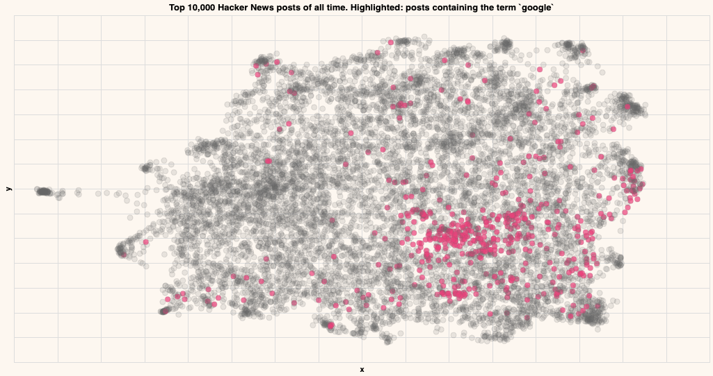

**Covid**

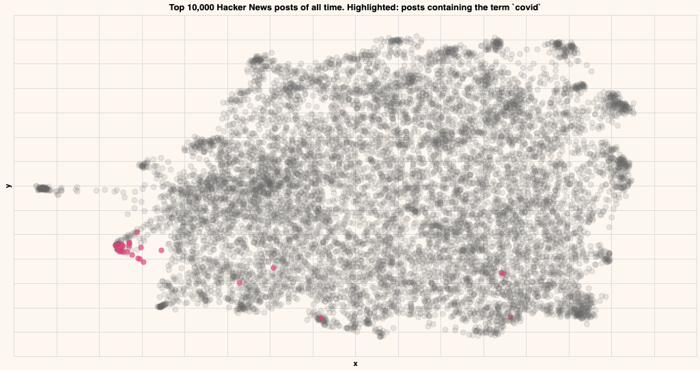

**Database**

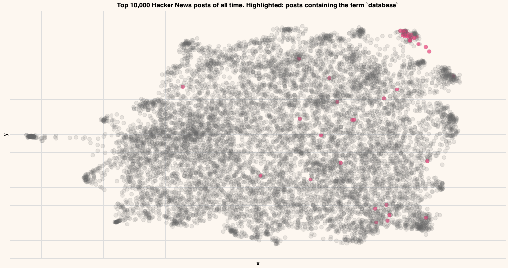

**Postgres**

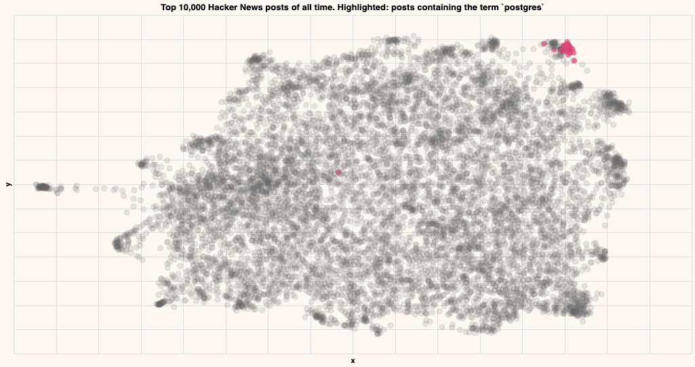

As you can see, the posts containing particular strings tend to be close by in the embedding, indicating that that particular topic lives in that region.

#### Zooming into Ask HN

In order to explore this dataset more, let's make a new query to get the top 3K Ask HN posts of all time. Also, let's remove the “Ask HN:” string from the titles before embedding these titles as a way to focus the model on the important part of the title (whatever comes after 'ask hn:').

```sql
SELECT \*  
FROM `bigquery-public-data.hacker_news.full`
WHERE TYPE = 'story'
AND score > 10
AND CONTAINS_SUBSTR(title, "ask hn")
ORDER BY score DESC
LIMIT 3000
```

Plotting this batch absolutely validates that this is where a lot of the most fascinating threads reside.

#### Showing More Information With Clustering

Let’s now cluster these posts to understand their overall hierarchy. The goal here is to add more visual information instead of relying on hovering over points to reveal their contents.

Just like we did in a previous chapter, we can use <a target="_blank" href="https://scikit-learn.org/stable/modules/clustering.html?ref=txt.cohere.com#k-means">K-Means clustering</a> on the original embeddings to create eight clusters (more on K-Means clustering on <a target="_blank" href="https://www.youtube.com/watch?v=QXOkPvFM6NU">this video</a>).

```python PYTHON
from sklearn.cluster import KMeans

# Pick the number of clusters
n_clusters = 8

# Cluster the embeddings
kmeans_model = KMeans(n_clusters=n_clusters)
classes = kmeans_model.fit_predict(embeds)
```

Which can then be plotted to look like this:

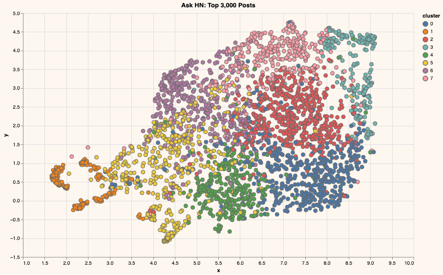

Conceptually, this is what we've done so far:

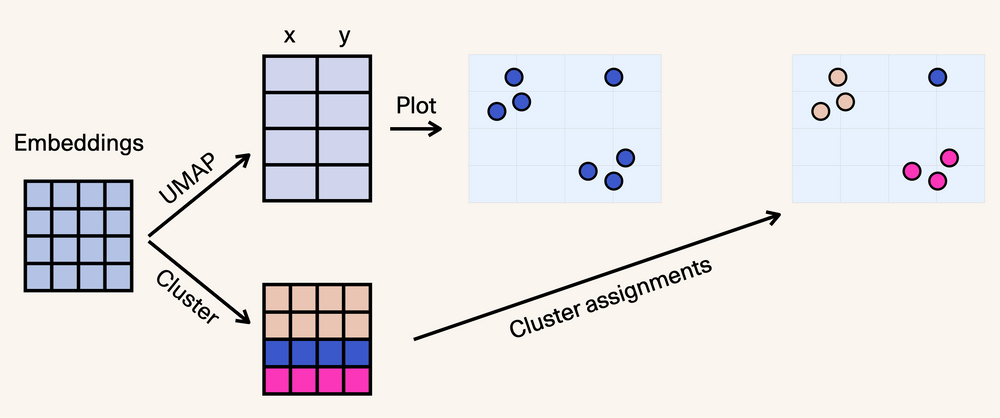

To extract the main keywords for each cluster, we can use the <a target="_blank" href="https://maartengr.github.io/BERTopic/api/ctfidf.html?ref=txt.cohere.com">cTFIDF</a> algorithm from the awesome <a target="_blank" href="https://maartengr.github.io/BERTopic/index.html?ref=txt.cohere.com">BERTopic</a> package. That results in these being the main keywords for each cluster:

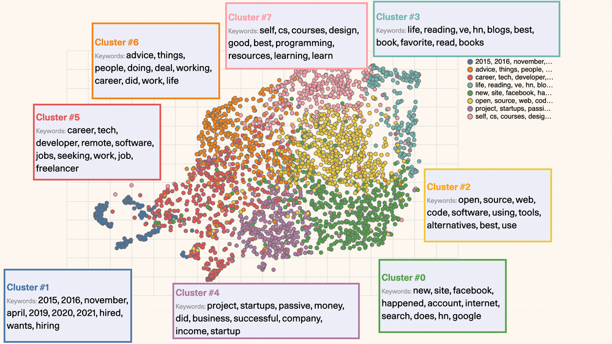

#### Understanding the hierarchy of the topics

We can use a hierarchical plot to better understand the hierarchy of the clusters. It’s useful that KMeans produces a centroid for each cluster - a point in 1024-dimensional space that we can use to represent the cluster.

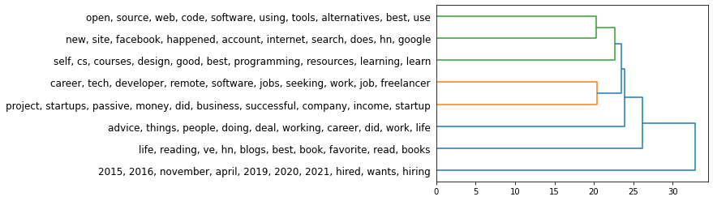

For this plot, we use the hierarchy package from scipy:

```python PYTHON
Z = hierarchy.linkage(kmeans_model.cluster_centers_, "single")
dn = hierarchy.dendrogram(Z, orientation="right", labels=label_list)
```

Here’s how we can read this hierarchy (scanning it from right to left):

- The first main branching is between the posts for hiring/seeking posts and the remainder of Ask HN. If we’re to break Ask HN into only two clusters, those would be the clearest two clusters.
- From the large cluster (everything except hiring/seeking posts), cluster #3 (life, reading, hn, blogs, books) is the next more distinct cluster we can peel off the big group.
- Imagine a vertical line slicing the tree at a certain value on the X-axis, and that would show you the resulting clusters.

### Back to the 10K HN dataset

Let us go back to the bigger dataset and see how it would look if we cluster the entire top 10K HN posts in the same way. Because it's a bigger dataset, let's break it down into 15 clusters:

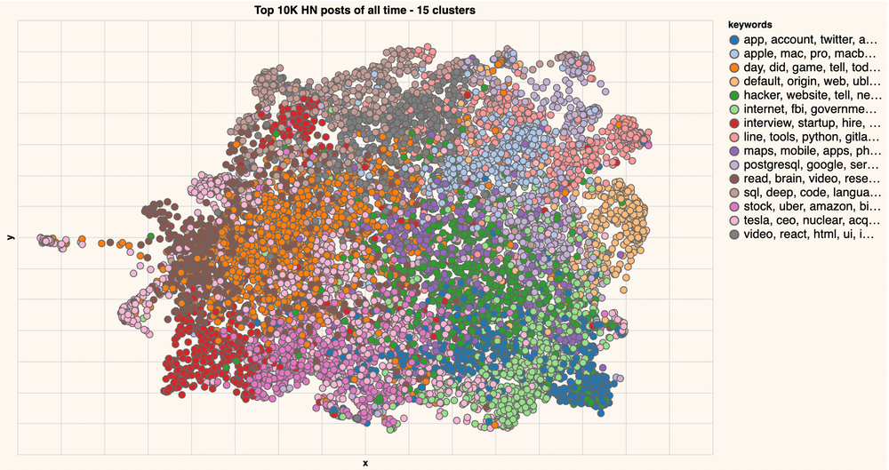

If you know how KMeans works, you might be surprised why one cluster can be in two different places. Which is why it's important to note that we are clustering the embeddings (1024 dimensions), and not the coordinates (2 dimensions obtained with UMAP). This is because the embeddings contain so much more information about each post than can be held in simply two dimensions. In fact, for industrial use-cases, you can ramp it up with larger embedding models (At the time of writing, large-20220425 is a much larger model which will produce 4,096 dimensional embeddings -- capturing even more information from the text).

We can also examine the hierarchy of the clusters:

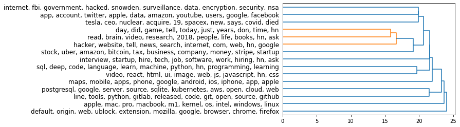

### Next steps after topic modeling

Topic modeling reveals a lot about a text archive. The insights revealed by topic modeling can often be built into a system in ways such as:

- **Classifying new pieces of text** into the same topic modeling developed in the exploration (if the topics or clusters are broad like "Sports" / "Technology")
- **Updating the topic model periodically** (So different articles about a news event can start to have their own topic/cluster)
- **Building a classifier to identify a certain topic or type of document/text**. Examples here are content recommendation and content moderation (where the dataset is the archive of a Discord channel, for example, and the community guidelines don't allow for a specific type of comment). 

### Takeaways

Here are some takeaways from looking more closely at this process:

- **Text is computable**: Language models enable truly fascinating applications of computing, organizing, and retrieving text. We haven't yet scratched the surface in terms of what's possible. We have a visual introduction to language models to help you catch up to this kind of technology. You can get started and access these models right now.
- **NLP Methods**: There's a lot of value in complementing language models with other NLP methods like TF-IDF -- not necessarily only as feature extractors as they've traditionally been used, but in other places in the pipeline as well. Clusters like Cluster #0 lend themselves to entity extraction to identify the companies mentioned.
- **Clustering Methods**: There are many clustering options to consider and each with many parameters to play with. What we used here was KMeans. We also used hierarchical clustering of the KMeans centroids, but it can be applied on the whole dataset as well. BERTopic uses HDBSCAN which allows clustering without choosing a certain number of clusters (the flip side is sometimes a large "non-clustered" cluster, likely addressable with certain parameter experimentation).
- **Number of Clusters**: When exploring a dataset, I find that it’s more intuitive to break the dataset into a small number of clusters at first (say five to eight clusters) then increase the number as you become more familiar with the space.
- **Zooming into a Cluster**: In addition to simply increasing the number of clusters, it's often handy to zoom into a specific cluster alone exclusive of the remainder of the dataset. With UMAP, running the dimensionality reduction again on that cluster alone produces a better plot for that cluster.
- **Topic Modeling**: A common way of doing topic modeling is using Linear Discriminant Analysis (LDA). One property of that approach is that it assigns each document a certain percentage of membership in each topic. If that's a desirable property for a use case, then it would be interesting to experiment with soft-clustering methods like <a target="_blank" href="https://scikit-learn.org/stable/modules/mixture.html?ref=txt.cohere.com#gmm">Gaussian Mixture Models</a>, for example.

### Conclusion

In this post, you harnessed the power of embeddings and clustering methods in order to analyze a large dataset of Hacker News titles. We encourage you to continue playing with the codelab, and get more insights on the data!

### Original Source

This material comes from the post <a target="_blank" href="https://cohere.com/blog/combing-for-insight-in-10-000-hacker-news-posts-with-text-clustering/">Combing For Insight in 10,000 Hacker News Posts With Text Clustering</a>

