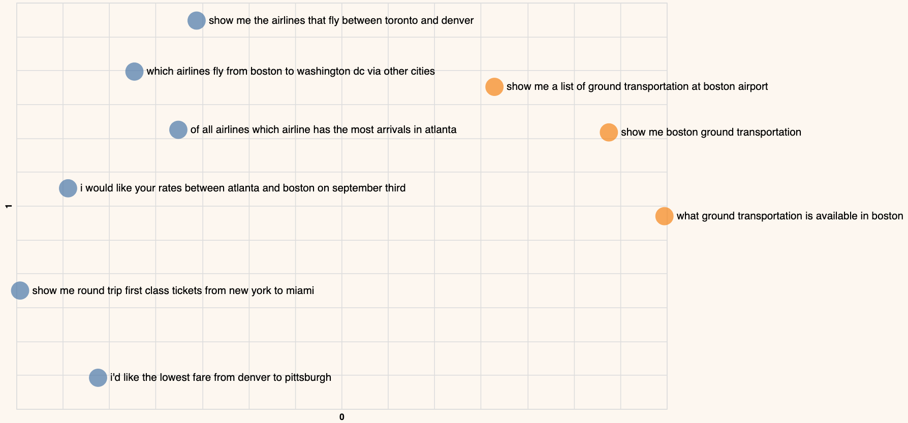

This chapter uses the same [notebook](https://github.com/cohere-ai/cohere-developer-experience/blob/main/notebooks/llmu/Introduction_Text_Embeddings.ipynb) as the previous chapter.

As the amount of unstructured text data increases, organizations will want to be able to derive an understanding of its contents. One example would be to discover underlying topics in a collection of documents so we can explore trends and insights. Another could be for businesses to segment customers based on preferences and activity.

These kinds of tasks fall under a category called clustering. In machine learning, clustering is a process of grouping similar documents into clusters. It is used to organize a large number of documents into a smaller number of groups. And it lets us discover emerging patterns in a collection of documents without us having to specify much information beyond supplying the data.

In this chapter, you will learn how to use embeddings to partition a text dataset into distinct clusters of semantically related sentences.

## Step-by-Step Guide

Let’s look at an example using the same 9 data points.

```
- which airlines fly from boston to washington dc via other cities
- show me the airlines that fly between toronto and denver
- show me round trip first class tickets from new york to miami
- i'd like the lowest fare from denver to pittsburgh
- show me a list of ground transportation at boston airport
- show me boston ground transportation
- of all airlines which airline has the most arrivals in atlanta
- what ground transportation is available in boston
- i would like your rates between atlanta and boston on september third
- which airlines fly between boston and pittsburgh
```

### Step 1: Embed the Text for Clustering

We embed the documents using the same `get_embeddings()` function as before, but now we set `input_type="clustering"` because we'll use the embeddings for clustering.

```python PYTHON
# Embed the text for clustering
df["clustering_embeds"] = get_embeddings(
    df["query"].tolist(), input_type="clustering"
)
embeds = np.array(df["clustering_embeds"].tolist())
```

### Step 2: Cluster the Embeddings

Implementation-wise, we use the K-means algorithms to cluster these data points (if you'd like to learn more about it, please check out [this video](https://www.youtube.com/watch?v=QXOkPvFM6NU) about the K-means algorithm). 

Other than providing the embeddings, the only other key information we need to provide for the algorithm is the number of clusters we want to find. This is normally larger in actual applications, but since our dataset is small, we’ll set the number of clusters to 2.

```python PYTHON
# Pick the number of clusters
n_clusters = 2

# Cluster the embeddings
kmeans_model = KMeans(n_clusters=n_clusters, random_state=0)
classes = kmeans_model.fit_predict(embeds).tolist()

# Store the cluster assignments
df_clust = df_pc2.copy()
df_clust["cluster"] = list(map(str, classes))
```

### Step 3: Visualize the Results in a 2D Plot

The plot below shows the clusters that the algorithm returned. It looks to be spot on, where we have one cluster related to airline information and one cluster related to ground service information.




## Conclusion

In this chapter, you learned how to cluster a dataset of sentences, and you observed that each cluster corresponds to a particular topic.

