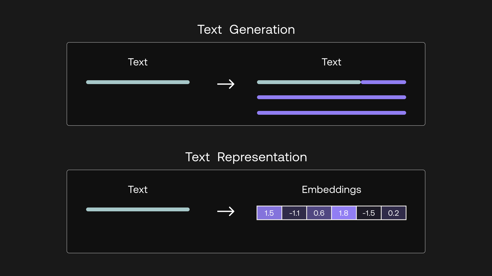
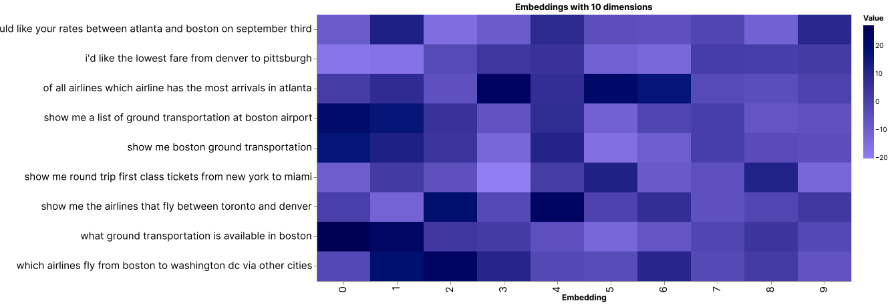

### Colab Notebook

We encourage you to follow this chapter along with the [notebook](https://github.com/cohere-ai/cohere-developer-experience/blob/main/notebooks/llmu/Visualizing_Text_Embeddings.ipynb) where all these examples are implemented.

For the setup, please refer to the <a target="_blank" href="/docs/setting-up">Setting Up</a> chapter at the beginning of this module.

### A More in Depth Look at Embeddings

When you hear about large language models (LLM), probably the first thing that comes to mind is the text generation capability, such as writing an essay or creating a marketing copy.

Another thing you can get is text representation: a set of numbers that represent what the text means and capture the semantics of the text. These numbers are called text embeddings.




Text embeddings give you the ability to turn unstructured text data into a structured form. With embeddings, you can compare two or more pieces of text, be it single words, sentences, paragraphs, or even longer documents. And since these are sets of numbers, the ways you can process and extract insights from them are limited only by your imagination.

What does this bring? It opens up many possible use cases that apply in the real world today. Embeddings power applications we interact with on a daily basis, such as modern search engines, eCommerce product recommendations, social media content moderation, email spam filtering, customer support conversational agents, and many more.

In this chapter, we take a visual approach to understand the intuition behind text embeddings. In the following chapter, we'll see what use cases they are good for, and how we can customize them via finetuning.

### Intuition

There’s no better way to understand text embeddings than by looking at examples. Throughout this article, we'll use a subset of the [Airline Travel Information System (ATIS) intent classification dataset](https://www.kaggle.com/datasets/hassanamin/atis-airlinetravelinformationsystem?select=atis_intents_train.csv) as an example \[[Source](https://aclanthology.org/H90-1021/)]. This dataset consists of inquiries coming to airline travel inquiry systems. Here are a few example data points:

```
1 - which airlines fly from boston to washington dc via other cities
2 - show me the airlines that fly between toronto and denver
3 - show me round trip first class tickets from new york to miami
4 - i'd like the lowest fare from denver to pittsburgh
5 - show me a list of ground transportation at boston airport
6 - show me boston ground transportation
7 - of all airlines which airline has the most arrivals in atlanta
8 - what ground transportation is available in boston
9 - i would like your rates between atlanta and boston on september third
```

The first thing we need to do is to turn each article's text into embeddings. We do this by calling Cohere’s <a target="_blank" href="https://docs.cohere.ai/embed-reference?ref=txt.cohere.com&amp;__hstc=14363112.fb39cf5aec47995e64cd26603e2e04d9.1682489949734.1683512904818.1683517385804.31&amp;__hssc=14363112.72.1683517385804&amp;__hsfp=3640182760">Embed endpoint</a>, which takes in texts as input and returns embeddings as output.

The endpoint comes with a few model-size options. Larger models have a higher number of dimensions. Each dimension stores one additional piece of information about the text, so as the number of dimensions increases, the representational power increases.

For our example, here are the first few dimensions given by the `embed-english-v3.0` model for "show me boston ground transportation":

```
[0.20641953, 0.35582256, 0.6058123, -0.058944624, 0.8949609, 1.2956009, 1.2408538, -0.89241934, -0.56218493, -0.5521631, -0.11521566, 0.9081634, 1.662983, -0.9293592, -2.3170912, 1.177852, 0.35577637, ... ]
```

Let’s get some visual intuition about this by plotting these numbers on a heatmap. What we can do is compress the dimension to a much lower number, say 10. We can do this via a technique called <a target="_blank" href="https://en.wikipedia.org/wiki/Principal_component_analysis?ref=txt.cohere.com">Principal Component Analysis (PCA)</a>, which reduces the number of dimensions in an embedding while retaining as much information as possible.

We’ll use the 9 data point above as examples and display their compressed embeddings on a heatmap. We have each data point on the y-axis and its corresponding set of 10 embedding values on the x-axis, which looks like this:




There are some patterns emerging. To see this, let’s look at a smaller number of examples.

Take these three for example. They are all inquiries about ground transportation in Boston. And by visual inspection, we can see that their embedding patterns are very similar.


Now, compare them to the other kinds of inquiries, such as those related to airline information (see two examples below). Notice that while the embeddings about ground transportation inquiries look very similar to each other, they are distinctive from the rest.


Here, the model was able to capture the context and meaning of each piece of text and it then represents them as embeddings. Each dimension of an embedding, called a feature, represents a certain universal characteristic of text according to how the model understands it.

How is this possible? A large language model has been pre-trained with a vast amount of text data, where the training objective is set up in such a way as to encourage the model to extract contextual information about a piece of text and store it as embeddings.

We can investigate this further by compressing the embeddings to two dimensions and plotting them on a scatter plot. What we would expect is that texts of similar meaning would be closer to each other, and vice versa.

Do note that as we compress the embeddings to lower dimensions, the information retained becomes lesser. However, humans can only visualize in 2D or 3D, and it turns out this is still a good enough approximation to help us gain intuition about the data.


By visual inspection, we can see that texts of similar meaning are indeed located close together. We see inquiries about tickets on the left, inquiries about airlines somewhere around the middle, and inquiries about ground transportation on the top right.

So now that we’ve seen how embeddings can represent text, in the following chapters we'll see the kinds of use cases that they enable.

### Original Source

This material comes from the post <a target="_blank" href="https://cohere.com/llmu/text-embeddings/">Text Embeddings Visually Explained</a>
