In the previous chapter you learned what classification models are, and some of their many useful applications. Like all machine learning models, classification models need to be evaluated in order to improve and measure their performance. In this chapter you'll learn about 4 of the most important ways to evaluate classification models, which are the following:

- Accuracy
- Precision
- Recall
- F1

Let's look at them with some numerical examples!

### Binary Classification

A classification task can fall under one of these two categories:

- Binary classification, where the number of classes is two. For example, the email spam classification that we saw earlier.
- Multi-class classification, where the number of classes is more than two. For example, classifying eCommerce inquiry emails into three types: shipping, returns, or tracking.

We’ll begin with a binary classification example. Let’s stick with the spam email classification, where our task is to classify a list of emails into one of two classes: Spam or Not Spam. We’ll represent Spam with the integer 1 (or Positive) and Not Spam with 0 (or Negative).

Here we have a dataset containing 20 email titles. We put each data point through a binary classifier to get the predicted class and then compare it with its actual class.

The classifier returns the following outcome:

### Accuracy

The most straightforward way to measure a classifier’s performance is using the Accuracy metric. Here, we compare the actual and predicted class of each data point, and each match counts for one correct prediction.

Accuracy is then given as the number of correct predictions divided by the total number of predictions. From the spam classifier output above, we have 15 correct predictions and 5 incorrect predictions, which gives us an Accuracy of 75%.

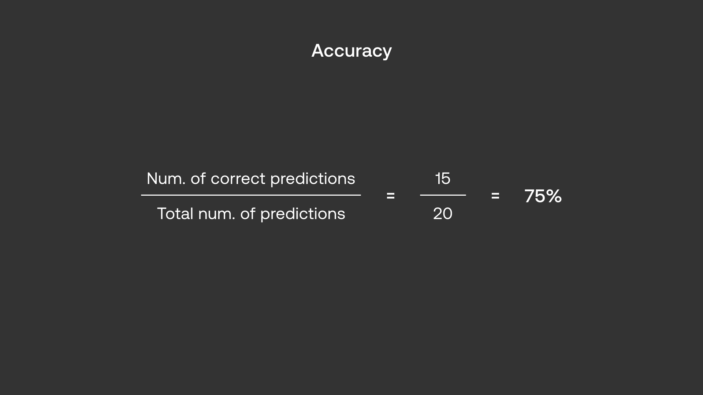

Accuracy is often used as the measure of classification performance because it is simple to compute and easy to interpret. However, it can turn out to be misleading in some cases.

This is especially true when dealing with imbalanced data, a scenario when certain classes contain way more data points than the others.

Let's go back to our dataset to understand this. Notice that if the classifier had not been learning anything and was simply classifying all the outputs to be 0 (Not Spam), we would get 17 out of 20 correct classifications, which translates to a very high Accuracy of 85%! Clearly, something isn’t right.

If you haven’t noticed yet, our dataset is indeed imbalanced. We have way more emails that are not spam than emails that are spam.

The issue of imbalanced datasets is common in the real wo­­rld.­ For this, there must be a better way to measure a classifier’s performance than using Accuracy alone.

### Confusion Matrix

The other three metrics can provide a more balanced view of a classifier’s true performance. But before we can see them in action, we need to first understand the Confusion Matrix.

The Confusion Matrix takes the classification results and groups them into four categories:

- True Positive (TP): when both the actual and predicted values are 1.
- True Negative (TN): when both the actual and predicted values are 0.
- False Positive (FP): when the actual value is 0 but the predicted value is 1.
- False Negative (FN): when the actual value is 1 but the predicted value is 0.

Recall that in our case, we refer to the event we want to capture (1 - Spam) as Positive and non-event (0 - Not Spam) as Negative.

The Confusion Matrix for binary classification is a 2-by-2 matrix, where each column represents one class, as follows:

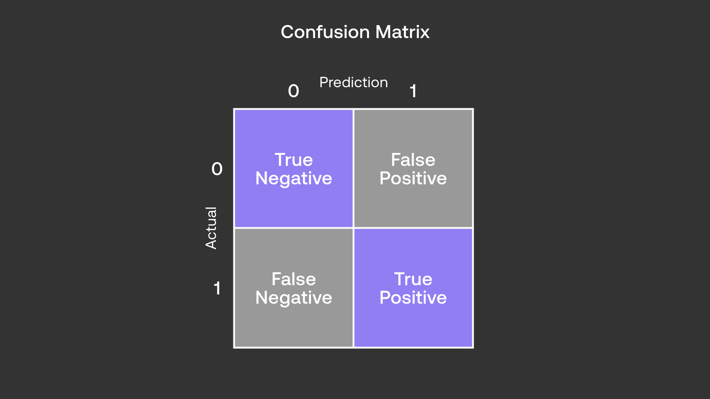

Applied to our dataset, we get the following values:

- True Positive (TP): 1
- True Negative (TN): 14
- False Positive (FP): 3
- False Negative (FN): 2

We can populate these values in the Confusion Matrix, as follows:

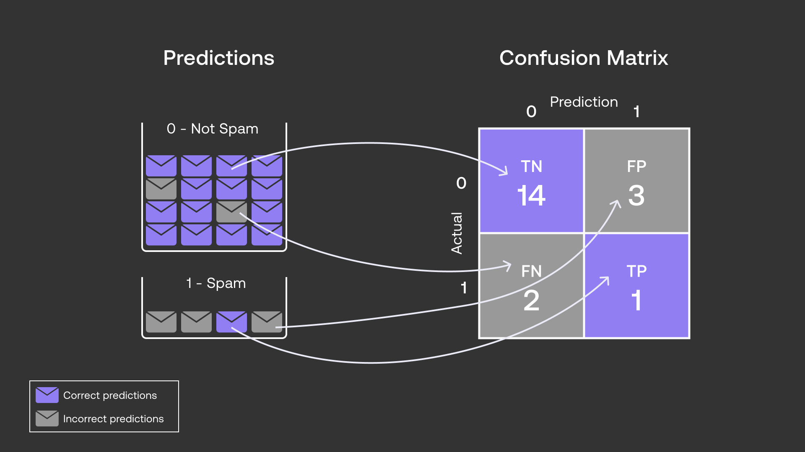

We can also map the Confusion Matrix to the Accuracy formula that we saw earlier, as follows:

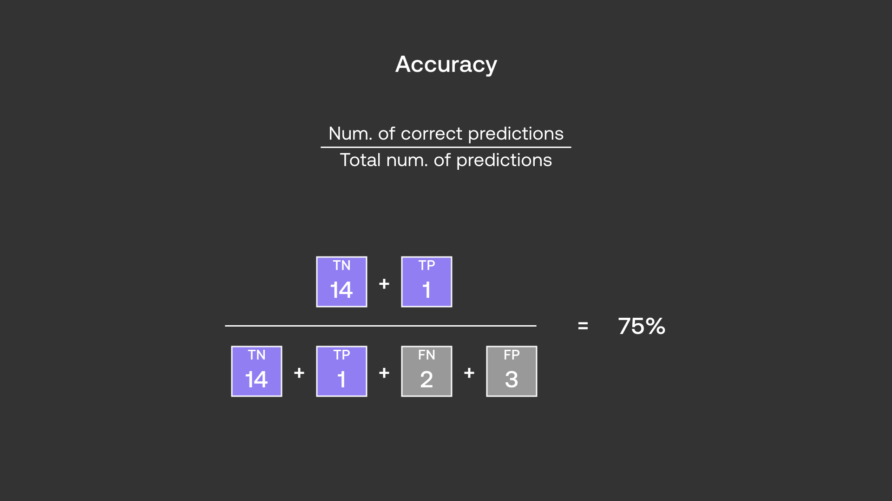

We can now see via this matrix why Accuracy can sometimes hide the nuance of imbalanced datasets. The reason is in these kinds of datasets, the True Negative category dominates, diluting the effect of the rest.

So even if the classifier were to perform poorly in the other three categories, its Accuracy will still look good, masking its deficiencies.

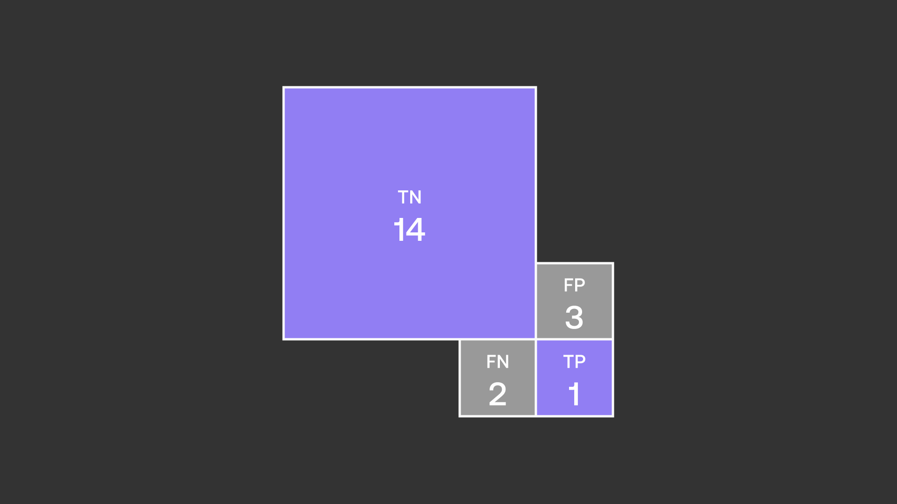

### Precision

Let’s now see how the other three metrics can provide a more balanced view of a classifier’s performance. Let’s start with Precision.

Precision is calculated as follows:

Notice what just happened? Now, the True Negatives are not even part of the calculation. Precision focuses on the True Positives and False Positives, therefore providing a representation that may be missed via Accuracy. Whereas Accuracy looked impressive at 75% earlier, we now see that Precision is quite far off at 25%.

### Recall

Recall uses the same principle as Precision, except the focus is now on the False Negatives instead of the False Positives. Again, the True Negatives are not part of the consideration.

Recall is calculated as follows:

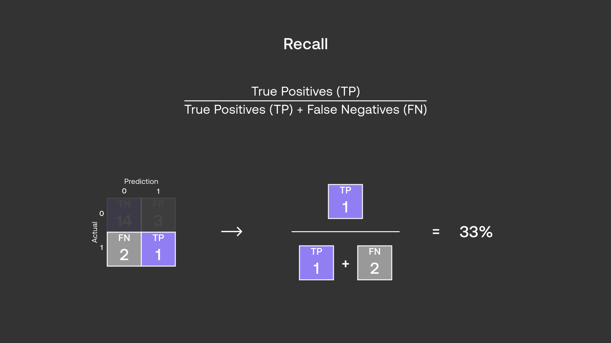

Between Precision and Recall though, there is a tradeoff. It is hard to optimize for both simultaneously as optimizing for the False Positives (thereby improving Precision) comes at the expense of the False Negatives (thereby deteriorating Recall), and vice versa.

Which then brings the question: which metric should you prioritize—Precision or Recall?

The answer is that it depends on the nature of your task. Let’s see why.

Suppose the spam classifier achieved high Precision and low Recall (Scenario A). This would result in fewer non-spam emails flagged as spam (False Positive). But this would also mean more of the actual spam emails went undetected (False Negative).

Conversely, if the classifier achieved high Recall and low Precision (Scenario B), there would be fewer undetected spam emails (False Negative), but it comes at the expense of more non-spam emails being flagged as spam (False Positive).

For a spam classification task, it’s probably more desirable to avoid important emails being moved into the spam folder than to have the occasional spam emails going into the inbox. So for this task, we will want to prioritize Precision over Recall.

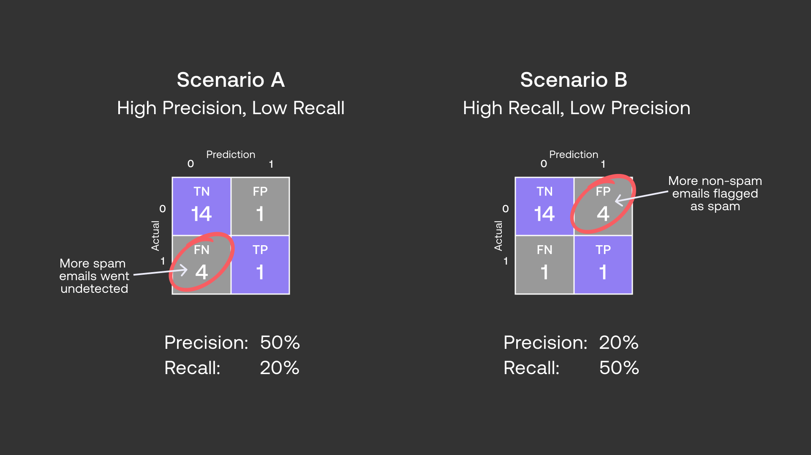

### F1 Score

What if both Precision and Recall are important to you and you need the classifier to do well in both? The answer is, to use the final metric of the four—F1.

F1 takes into consideration both Precision and Recall. It is calculated as follows:

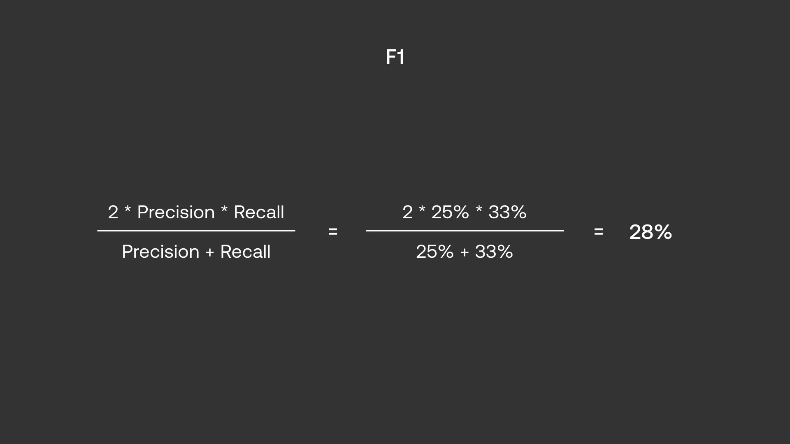

F1 provides the balance between Precision and Recall. Now, there are different versions of the ‘F-score’ family if you want to go for it, for example assigning bigger weight to either Precision or Recall, but F1 is a good enough option to get started.

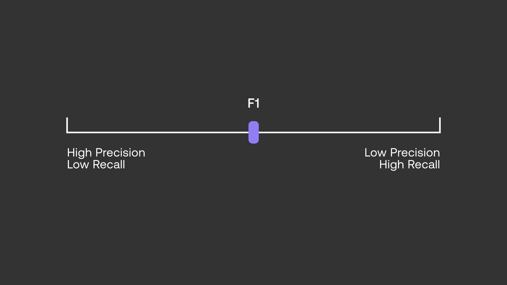

### Multi-Class Classification

So we have seen how the four metrics work in a binary classification case. But how do we compute them when the number of classes is more than two i.e. multi-class classification? They follow the same principle with some slight tweaks.

Let’s say we have the task of classifying a list of eCommerce customer emails into one of three classes: Shipping, Returns, and Tracking. We’ll represent each class with integer values of 0, 1, and 2 respectively.

Here we have a dataset containing 15 email titles. We put each data point through a multi-class classifier to get the predicted class and then compare it with its actual class.

The classifier returns the following outcome:

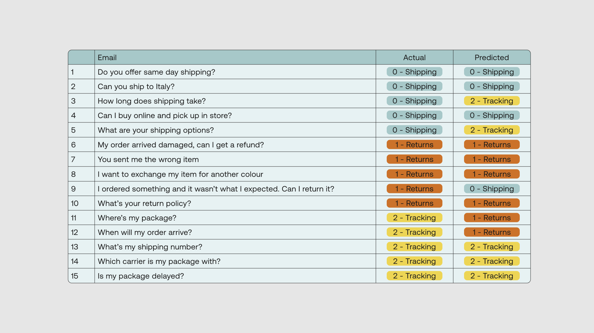

First, Accuracy. The calculation is the same as we did with binary classification— the number of correct predictions divided by the total number of predictions. For our dataset, there are 10 correct predictions and 5 incorrect predictions, which give us an Accuracy of 67%.

Next, to compute Precision, Recall, and F1, we’ll build the Confusion Matrix.

Since we have three classes, the matrix now becomes a 3-by-3 matrix, each column representing one class. Applied to our dataset, we get the following matrix:

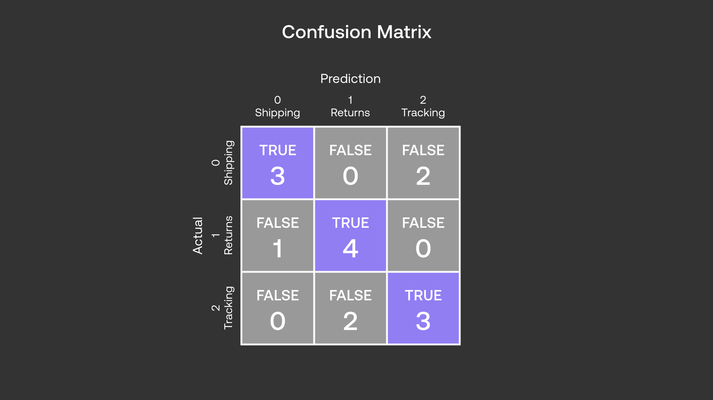

Precision and Recall are calculated in the same way as we did with binary classification. The only difference now is each class will have its own set of Precision and Recall values.

Let’s take class 0 (Shipping) as an example. Here, we use Positive to refer to the Shipping class and Negative to refer to all the other classes (Not Shipping).

Precision for class 0 (Shipping) is then calculated as follows:

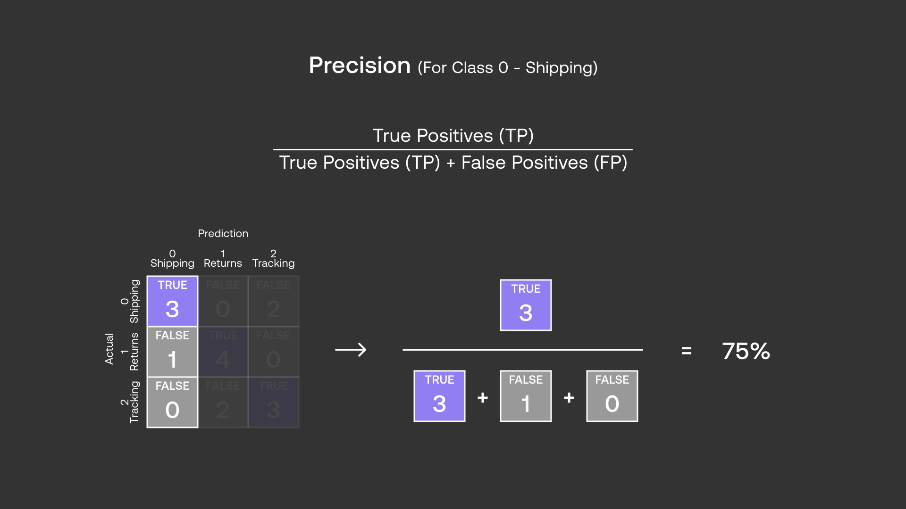

And Recall for class 0 (Shipping) is calculated as follows:

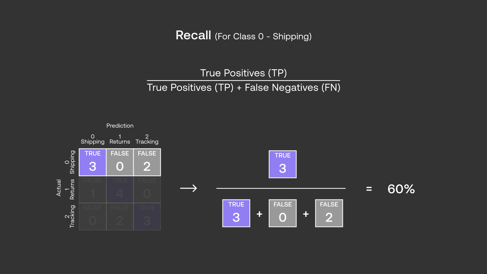

Each class will have its own F1 too. F1 for class 0 (Shipping) is calculated as follows:

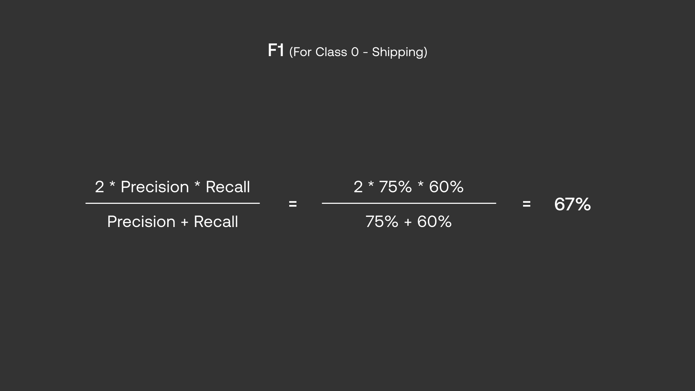

Going through all classes in our dataset, this is what Recall, Precision, and F1 look like:

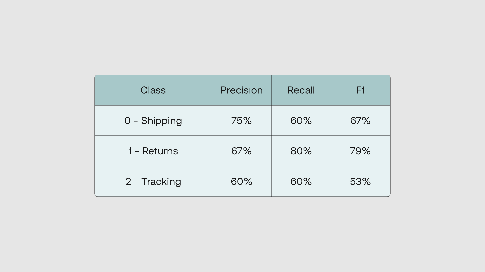

Now, what if the number of classes started to get really big? This table would become huge and it will be harder to get a snapshot of the performance. So we may want to still have a single value for each of these metrics.

There are a few approaches we can take, and one common option is to take the average of all the classes. This is also called the Macro-Average, and we apply it to each of Precision, Recall, and F1 as follows:

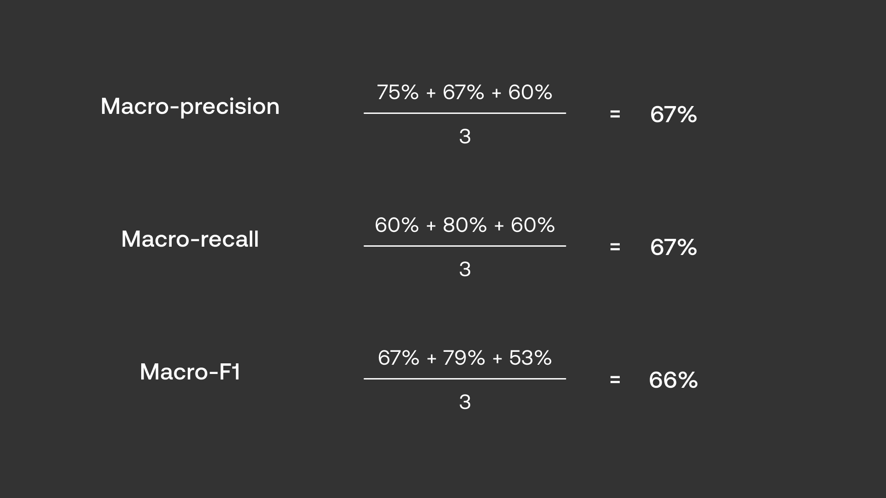

### Conclusion

In this chapter, you took a deep dive into the metrics used for evaluating classification models, which are accuracy, precision, recall, and F1-score. These will be necessary to successfully build classification models in the future.

### Original Source

This material comes from the post <a target="_blank" href="https://txt.cohere.com/classification-eval-metrics/">Classification Evaluation Metrics: Accuracy, Precision, Recall, and F1 Visually Explained</a>.
