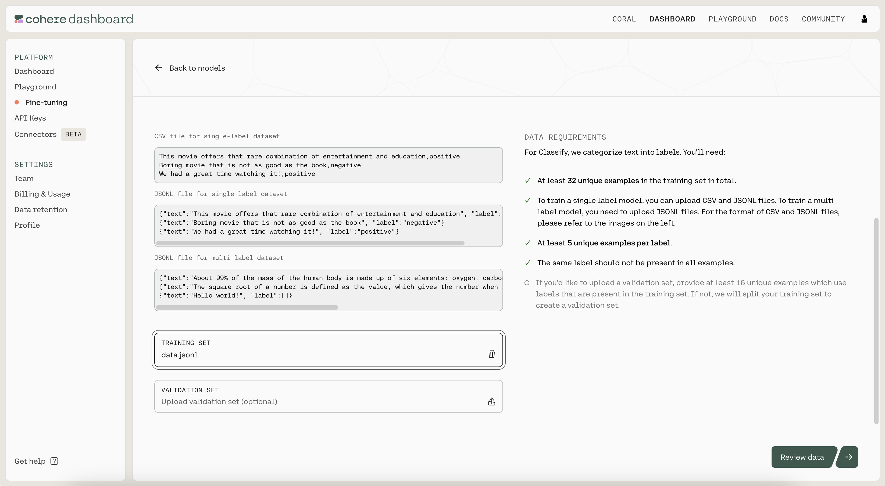
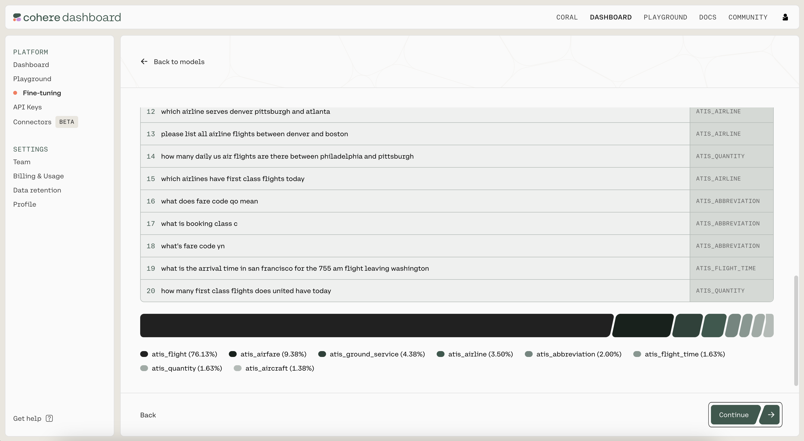
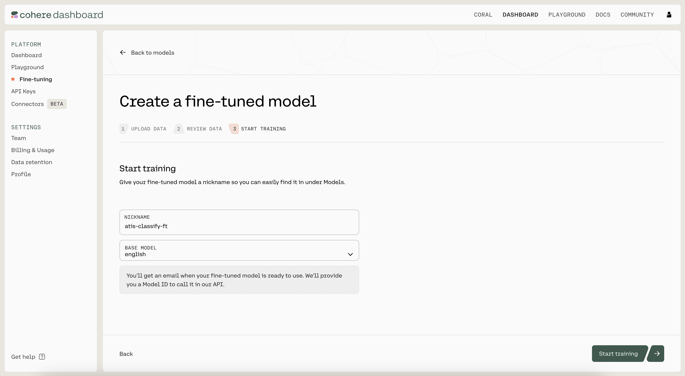
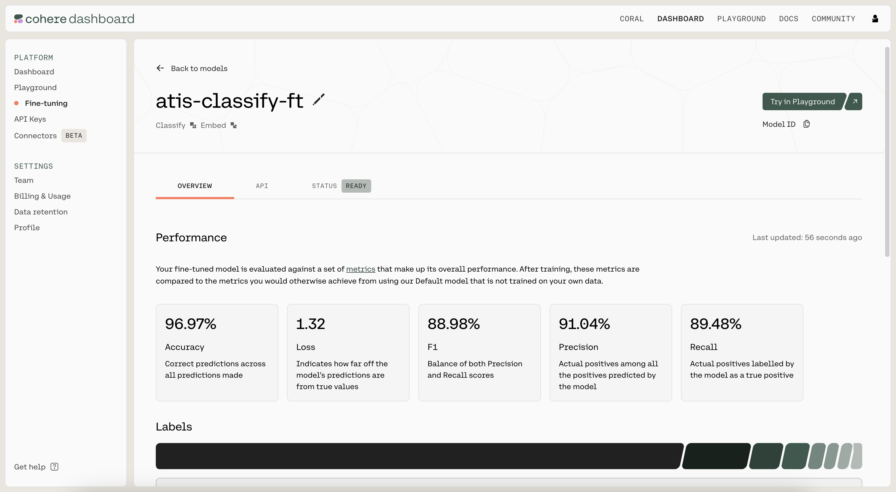
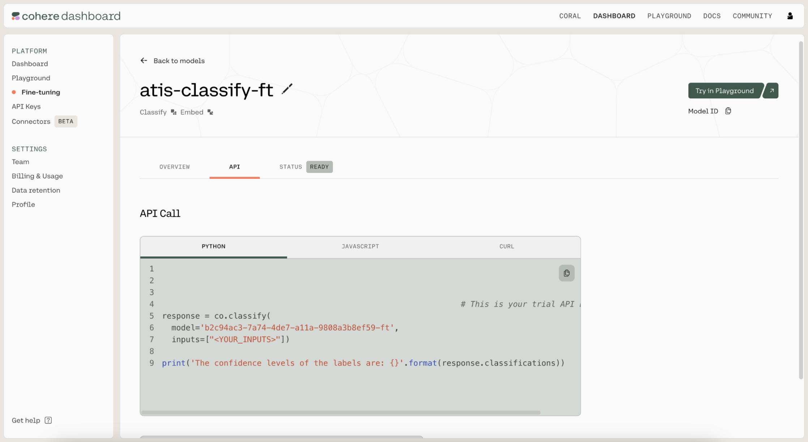

We’ll use [Cohere’s Python SDK](/reference/about?ref=txt.cohere.com#python) for the code examples. Follow along in [this notebook](https://github.com/cohere-ai/notebooks/blob/main/notebooks/llmu/Fine_Tuning_for_Classify.ipynb).

In the previous chapter, you used few-shot classification for a sentiment analysis task and got decent results with a small dataset.

Let’s say you actually have a decent amount of training dataset at your disposal. Then, you can leverage these additional data points to build a potentially better-performing classifier through a process known as fine-tuning.

Fine-tuning is a powerful concept, and here’s the reason. With fine-tuning, you can actually alter the model itself and customize it according to your task. This means that what you get is a custom model that’s fine-tuned to excel at a specific task, and potentially can outperform the few-shot approach from the previous chapter. 

In this chapter, you'll learn how to fine-tune a model for classification.

## Step-by-Step Guide

To set up, we first import several tools. 

```python
import os
import json
import numpy as np
import pandas as pd
from cohere import ClassifyExample
from sklearn.model_selection import train_test_split
from sklearn.metrics import accuracy_score
from sklearn.metrics import f1_score
```

We also import the Cohere module and create a client.

```python
import cohere
co = cohere.Client("COHERE_API_KEY") # Your Cohere API key
```

### Step 1: Prepare the Dataset

We'll use the [Airline Travel Information System (ATIS)](https://www.kaggle.com/datasets/hassanamin/atis-airlinetravelinformationsystem?select=atis_intents_train.csv) intent classification dataset \[[source](https://aclanthology.org/H90-1021/)]. For demonstration purposes, we’ll take just a small portion of the dataset: 1,000 data points in total.

```python
# Load the dataset to a dataframe
df = pd.read_csv('https://raw.githubusercontent.com/cohere-ai/notebooks/main/notebooks/data/atis_subset.csv', names=['query','intent'])
```

 The first thing we need is to create a training dataset, to be used for building the classifier, and a test dataset, to be used for testing the classifier performance. We will use 800 and 200 data points for these datasets, respectively.

```python
# Split the dataset into training and test portions
df_train, df_test = train_test_split(df, test_size=200, random_state=21)
```

Our goal is to train the classifier so it can predict the class of a new customer inquiry out of eight classes, as follows:

```
['atis_flight', 
 'atis_airfare', 
 'atis_ground_service', 
 'atis_flight_time', 
 'atis_airline', 
 'atis_quantity', 
 'atis_abbreviation', 
 'atis_aircraft']
```

We transform the data to JSONL format to match the style expected by the Classification endpoint ([documentation](/docs/classify-preparing-the-data)).

```python
def create_classification_data(text, label):
    formatted_data = {
        "text": text,
        "label": label
    }
    return formatted_data

if not os.path.isfile("data.jsonl"):
    print("Creating jsonl file ...")
    with open("data.jsonl", 'w+') as file:
        for row in df_train.itertuples():
            formatted_data = create_classification_data(row.query, row.intent)
            file.write(json.dumps(formatted_data) + '\n')
        file.close()
        print("Done")
else:
    print("data.jsonl file already exists")
```

The JSONL file has a row for each example.  Each example has "text" and "label" fields.

```
{"text": " what flights go from newark to boston after 5 pm", "label": "atis_flight"}
{"text": " can you show me economy class one way fares for flights from oakland to dallas on december sixteenth", "label": "atis_airfare"}
{"text": " show me the latest flight from salt lake city to phoenix", "label": "atis_flight"}
{"text": " pittsburgh to denver", "label": "atis_flight"}
{"text": " show me all flights from san francisco to atlanta", "label": "atis_flight"}
...
```

### Step 2: Fine-Tune the Model

We kick off a fine-tuning job by navigating to the [fine-tuning tab of the Dashboard](https://dashboard.cohere.com/fine-tuning).  Under "Classify", click on "Create a Classify model".


Next, upload the `.jsonl` file you just created as the training set by clicking on the "TRAINING SET" button. When ready, click on "Review data" to proceed to the next step.



Then, you'll see a preview of how the model will ingest your data. If anything is wrong with the data, the page will also provide suggested changes to fix the training file. Otherwise, if everything looks good, you can proceed to the next step.



Finally, you'll see a page where you'll provide a nickname to your model. We used `atis-classify-ft` as the nickname for our model. Under "BASE MODEL", ensure "english" is selected.



Then click on "Start training" to kick off the fine-tuning process. This will navigate you to a page where you can monitor the status of the model. A model that has finished fine-tuning will show the status as `READY`.



### Step 3: Use/Evaluate the Fine-Tuned Model

Once the model has finished fine-tuning, it’s time to evaluate its performance. Navigate to the API tab of the fine-tuned model. There, you'll see the model ID that you should use when calling `co.classify()`.



We fill in the model ID to generate test predictions.

```python
# Generate classification predictions on the test dataset using the finetuned model

# Classification function
def classify_text_finetune(texts):
    classifications = co.classify(
        model='b2c94ac3-7a74-4de7-a11a-9808a3b8ef59-ft',
        inputs=texts,
        examples=None
    ).classifications
    return [c.predictions[0] for c in classifications]

# Create batches of texts and classify them
BATCH_SIZE = 90 # The API accepts a maximum of 96 inputs
y_pred = []
for i in range(0, len(df_test), BATCH_SIZE):
    batch_texts = df_test["query"][i:i+BATCH_SIZE].tolist()
    y_pred.extend(classify_text_finetune(batch_texts))
```

Next, we calculate the model's test accuracy and F1 score.

```python
# Compute metrics on the test dataset
accuracy = accuracy_score(df_test["intent"], y_pred)
f1 = f1_score(df_test["intent"], y_pred, average='weighted')

print(f'Accuracy: {100*accuracy:.2f}')
print(f'F1-score: {100*f1:.2f}')
```

```
Accuracy: 98.00
F1-score: 98.05
```

<br />

Not bad! 

## Conclusion

In this chapter, you saw that fine-tuning is an alternative to [few-shot classification](/docs/few-shot-classification) that allows you to have more control over the model's training. It is generally preferred if you have a larger dataset and need superior performance.
