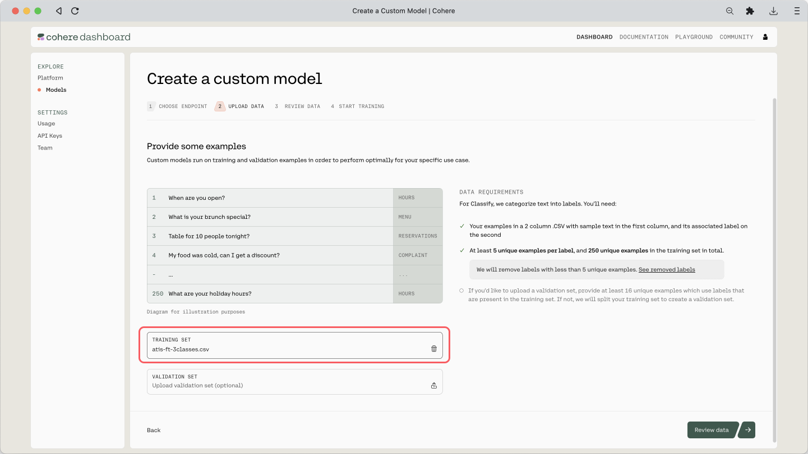
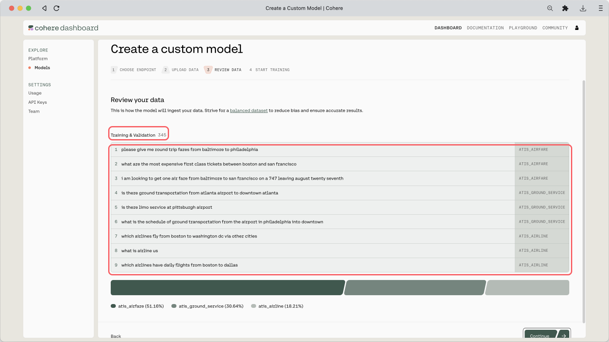
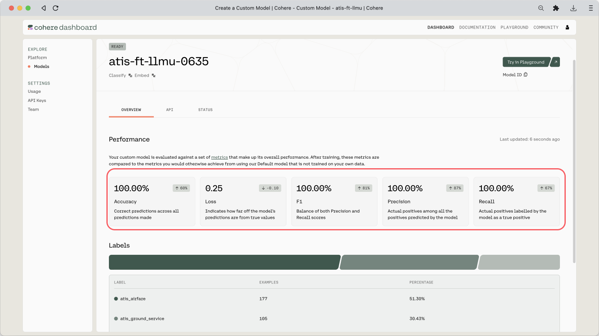

### Colab Notebook

This chapter uses the same <a target="_blank" href="https://colab.research.google.com/github/cohere-ai/cohere-developer-experience/blob/main/notebooks/Visualizing_Text_Embeddings.ipynb#scrollTo=EAo5Z9TUhee1">Colab notebook</a>, as the previous chapter.

For the setup, please refer to the <a target="_blank" href="/docs/setting-up">Setting Up</a> chapter at the beginning of this module.

### Overview

In practical applications, you will likely need to customize the model to your task, and in particular, the kind of data you are dealing with. Taking the content moderation example, not all online platforms define toxicity in the same way. A gaming platform, an online community for kids, and a social media platform would all have different definitions of toxicity, and their users likely talk in very different ways.

This is where fine-tuning comes in. A baseline model already comes pre-trained with a huge amount of text data. But finetuning can further build on that by taking in and adapting to your own data. The result is a fine-tuned model that produces outputs that are more attuned to the task you have at hand.

Fine-tuning representation model for the Classify endpoint follow the same steps since these endpoints are powered by the same underlying models. 

As an example, let’s see how finetuning affects the 9 data points we saw in the previous chapters.

### Fine-tuning Models

The first step we need to do is to prepare a dataset for finetuning. Finetuning requires a minimum of 250 data points, which we’ll take a portion of the rest of the original dataset. With Cohere, this step is a simple one where you upload the dataset on the <a target="_blank" href="https://dashboard.cohere.ai/models?__hstc=14363112.fb39cf5aec47995e64cd26603e2e04d9.1682489949734.1683512904818.1683517385804.31&amp;__hssc=14363112.87.1683517385804&amp;__hsfp=3640182760">Dashboard</a> and start the finetuning process from there.

The complete step-by-step guide for training custom models <a target="_blank" href="/docs/training-a-representation-model">can be found here</a>.

Because of this, we’ll not cover those steps in this article. We’ll only look at a couple of screenshots that show the steps with our actual dataset applied.

The finetuning dataset (you can [get it here](https://github.com/cohere-ai/cohere-developer-experience/blob/main/notebooks/data/atis-ft-3classes.csv))  contains 344 examples , consisting of three classes. Here are a few examples:

| query                                                                            | intent              |
| :------------------------------------------------------------------------------- | :------------------ |
| please give me round trip fares from baltimore to philadelphia                   | atis_airfare        |
| is there ground transportation from atlanta airport to downtown atlanta          | atis_ground_service |
| what are the most expensive first class tickets between boston and san francisco | atis_airfare        |
| which airlines fly from boston to washington dc via other cities                 | atis_airline        |
| ...                                                                              | ...                 |

Here is the step where we upload the CSV file:




And here is the preview of the training dataset and its count:




The training will take some time, and once it’s done, you will receive an email mentioning that it is deployed and ready. If you’ve reached this point, congratulations!

When you go to the custom model’s page, you can see a few evaluation metrics shown: Accuracy, Loss, F1, Precision, and Recall. We covered what these metrics are [earlier in this module](/docs/evaluation-metrics).




### Using Custom Models

Once finetuning is complete, we’ll re-generate the embeddings, now using the finetuned model.

```python PYTHON
# Embedding API call
def get_embeddings(texts,model):
  output = co.embed(
                model=model,
                texts=texts)
  return output.embeddings

# The finetuned model ID (replace with your own model ID)
atis_ft_v1 = "ccc2a8dd-bac5-4482-8d5e-ddf19e847823-ft"

# Embed the documents using the finetuned model
df_ft['query_embeds'] = get_embeddings(df_ft['query'].tolist(), model=atis_ft_v1)
```

Now let's see what has changed. The resulting embeddings, compressed to 2 dimensions and plotted on a chart, are as below.

With a baseline model, which is what we’ve been using before (left), we can already get a good separation between classes, which shows that it can perform well in this task.

But with a finetuned model (right), the separation becomes even more apparent. Similar data points are now pushed even closer together and further apart from the rest. This indicates that the model has adapted to the additional data it receives during finetuning, hence is more likely to perform even better in this task.


### Conclusion

Throughout the last few chapters you learned how powerful embeddings are, and how many applications they have in language models. Humans simply don’t have the capacity to manually handle the ever-growing unstructured text data coming at us. But with the help of Language AI techniques such as text embeddings, we can close that gap and make the data we have useful and actionable.
