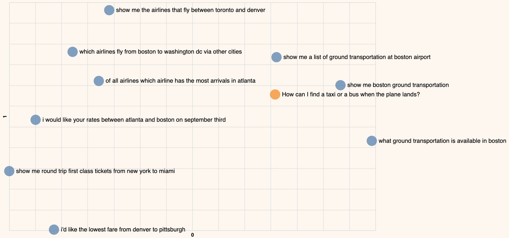

This chapter uses the same [notebook](https://github.com/cohere-ai/notebooks/blob/main/notebooks/llmu/Introduction_Text_Embeddings.ipynb) as the previous chapter.

_Note: This chapter covers the basics of semantic search. If you want to explore this topic further, we have a dedicated [LLMU module on semantic search](/docs/intro-semantic-search)._

We deal with unstructured text data on a regular basis, and one of the common needs is to search for information from a vast repository. A common approach is keyword-matching, but the problem with this is that the results are limited to the exact query entered. 

This is where we can utilize text embeddings. As you learned in the previous chapter, embeddings can capture the meaning of a piece of text beyond keyword-matching. 

In this chapter, you'll learn how to use embeddings to build a search capability that surfaces relevant information based on the semantic meaning of a query.

## Step-by-Step Guide

Let’s use the same 9 data points from the previous chapter and pretend that those make up a list of Frequently Asked Questions (FAQ). Whenever a new query comes in, we want to match that query to the closest FAQ so we can provide the most relevant answer. Here is the list again:

```
- which airlines fly from boston to washington dc via other cities
- show me the airlines that fly between toronto and denver
- show me round trip first class tickets from new york to miami
- i'd like the lowest fare from denver to pittsburgh
- show me a list of ground transportation at boston airport
- show me boston ground transportation
- of all airlines which airline has the most arrivals in atlanta
- what ground transportation is available in boston
- i would like your rates between atlanta and boston on september third
- which airlines fly between boston and pittsburgh
```

Let’s say a person enters the query “How can I find a taxi or a bus when the plane lands?”. Note that the “taxi” and "bus" keywords don't exist anywhere in our FAQ, so let’s see what results we get with semantic search.

Implementation-wise, there are many ways we can approach this. And in our case, we use cosine similarity to compare the embeddings of the search query with those from the FAQ and find the most similar ones.

### Step 1: Embed the Search Query

We embed the query using the same `get_embeddings()` function as before, but now we set `input_type="search_query"` because we're embedding a search query that we want to compare to the embedded documents.

```python
# Define new query
new_query = "How can I find a taxi or a bus when the plane lands?"

# Get embeddings of the new query
new_query_embeds = get_embeddings([new_query], input_type="search_query")[0]
```

### Step 2: Compare to Embedded Documents

We define and use a function `get_similarity()` that employs cosine similarity to determine how similar the documents are to our query.

```python
# Calculate cosine similarity between the search query and existing queries
def get_similarity(target, candidates):
    # Turn list into array
    candidates = np.array(candidates)
    target = np.expand_dims(np.array(target),axis=0)

    # Calculate cosine similarity
    sim = cosine_similarity(target, candidates)
    sim = np.squeeze(sim).tolist()
    sort_index = np.argsort(sim)[::-1]
    sort_score = [sim[i] for i in sort_index]
    similarity_scores = zip(sort_index,sort_score)

    # Return similarity scores
    return similarity_scores

# Get the similarity between the search query and existing queries
similarity = get_similarity(new_query_embeds, embeds[:sample])
```

We'll then view the documents in decreasing order of similarity.

```python
# View the top 5 articles
print('Query:')
print(new_query,'\n')

print('Most Similar Documents:')
for idx, sim in similarity:
    print(f'Similarity: {sim:.2f};', df.iloc[idx]['query'])
```

Below are the results, showing the FAQs with their similarity score (ranging from 0 to 1; higher scores are better). The top-3 ranked FAQs we get are inquiries about ground transportation, which are very relevant considering the other options. Notice that they don't contain the keywords “taxi” or "bus", and the search query doesn't contain the keywords “ground transportation”. But they are the most similar in meaning compared to the rest, and their embeddings capture this.

```
Query:
How can I find a taxi or a bus when the plane lands? 

Most Similar Documents:
Similarity: 0.37;  show me a list of ground transportation at boston airport
Similarity: 0.36;  what ground transportation is available in boston
Similarity: 0.33;  show me boston ground transportation
Similarity: 0.27;  show me the airlines that fly between toronto and denver
Similarity: 0.25;  which airlines fly from boston to washington dc via other cities
Similarity: 0.24;  of all airlines which airline has the most arrivals in atlanta
Similarity: 0.18;  i'd like the lowest fare from denver to pittsburgh
Similarity: 0.17;  show me round trip first class tickets from new york to miami
Similarity: 0.17;  i would like your rates between atlanta and boston on september third
```

### Step 3: Visualize the Results in a 2D Plot

We can also plot this new query on a 2D plot as we did earlier. And we see that the query is located closest to the FAQs about ground transportation.




## Conclusion

In this chapter you learned how to use embedding and similarity to build a semantic search model. There are many more applications of embeddings, which you'll learn in the following chapters!
