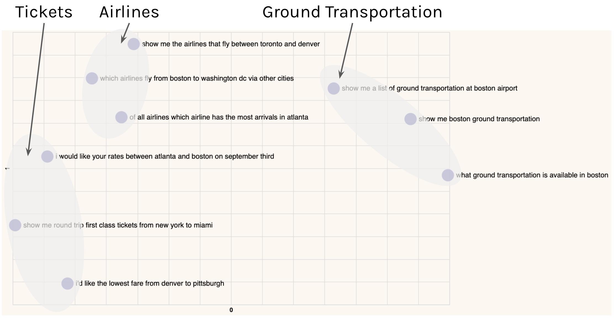

We’ll use [Cohere’s Python SDK](/reference/about?ref=txt.cohere.com#python) for the code examples. Follow along in [this notebook](https://github.com/cohere-ai/notebooks/blob/main/notebooks/llmu/Introduction_Text_Embeddings.ipynb).

When you hear about large language models (LLMs), probably the first thing that comes to mind is the text generation capability, such as writing an essay or creating marketing copy.

Another thing you can get is text representation: a set of numbers that represent what the text means and capture the semantics of the text. These numbers are called text embeddings.


Text embeddings give you the ability to turn unstructured text data into a structured form. With embeddings, you can compare two or more pieces of text, be it single words, sentences, paragraphs, or even longer documents. And since these are sets of numbers, the ways you can process and extract insights from them are limited only by your imagination.

What does this bring? It opens up many possible use cases that apply in the real world today. Embeddings power applications we interact with on a daily basis, such as modern search engines, eCommerce product recommendations, social media content moderation, email spam filtering, customer support conversational agents, and many more.

In this chapter, we take a visual approach to understand the intuition behind text embeddings. 

## Step-by-Step Guide

To set up, we first import several tools. We'll use the same notebook for the next several chapters, and we'll import everything we need here.

```python
import pandas as pd
import numpy as np
import altair as alt
from sklearn.decomposition import PCA
from sklearn.metrics.pairwise import cosine_similarity
from sklearn.cluster import KMeans
```

We also import the Cohere module and create a client.

```python
import cohere
co = cohere.Client("COHERE_API_KEY") # Your Cohere API key
```

### Step 1: Prepare the Dataset

We'll work a subset of the [Airline Travel Information System (ATIS) intent classification dataset](https://www.kaggle.com/datasets/hassanamin/atis-airlinetravelinformationsystem?select=atis_intents_train.csv) \[[Source](https://aclanthology.org/H90-1021/)]. The following code loads the dataset into a pandas Dataframe `df` with a single column `"queries"` containing 91 inquiries coming to airline travel inquiry systems. 

```python
# Load the dataset to a dataframe
df_orig = pd.read_csv('https://raw.githubusercontent.com/cohere-ai/notebooks/main/notebooks/data/atis_intents_train.csv', names=['intent','query'])

# Take a small sample for illustration purposes
sample_classes = ['atis_airfare', 'atis_airline', 'atis_ground_service']
df = df_orig.sample(frac=0.1, random_state=30)
df = df[df.intent.isin(sample_classes)]
df_orig = df_orig.drop(df.index)
df.reset_index(drop=True,inplace=True)

# Remove unnecessary column 
intents = df['intent'] #save for a later need
df.drop(columns=['intent'], inplace=True)
```

Here are a few example data points:

```
- which airlines fly from boston to washington dc via other cities
- show me the airlines that fly between toronto and denver
- show me round trip first class tickets from new york to miami
- i'd like the lowest fare from denver to pittsburgh
- show me a list of ground transportation at boston airport
- show me boston ground transportation
- of all airlines which airline has the most arrivals in atlanta
- what ground transportation is available in boston
- i would like your rates between atlanta and boston on september third
- which airlines fly between boston and pittsburgh
```

### Step 2: Turn Text into Embeddings

Next, we embed each inquiry by calling Cohere’s [Embed endpoint](/reference/embed?ref=txt.cohere.com&__hstc=14363112.fb39cf5aec47995e64cd26603e2e04d9.1682489949734.1683512904818.1683517385804.31&__hssc=14363112.72.1683517385804&__hsfp=3640182760%22%3EEmbed) with `co.embed()`. It takes in texts as input and returns embeddings as output. We supply three parameters:

- `texts`: The list of texts you want to embed

- `model`: The model to use to generate the embedding. At the time of writing, there are [four models available](/docs/embed-2):

  - `embed-english-v3.0` (English)
  - `embed-english-light-v3.0` (English)
  - `embed-multilingual-v3.0` (Multilingual: 100+ languages)
  - `embed-multilingual-light-v3.0` (Multilingual: 100+ languages)

- `input_type` — Specifies the type of document to be embedded. At the time of writing, there are four options:
  - `search_document`: For documents against which search is performed
  - `search_query`: For query documents
  - `classification`: For when the embeddings will be used as an input to a text classifier
  - `clustering`: For when you want to cluster the embeddings

The code looks like this:

```python
def get_embeddings(texts, model='embed-english-v3.0', input_type="search_document"):
    output = co.embed(
        model=model,
        input_type=input_type,
        texts=texts)
    return output.embeddings

df['query_embeds'] = get_embeddings(df['query'].tolist())
```

For every piece of text passed to the Embed endpoint, a sequence of 1024 numbers will be generated. Each number represents a piece of information about the meaning contained in that piece of text. Here are the first few dimensions given by the `embed-english-v3.0` model for "show me a list of ground transportation at boston airport":

```
[0.03793335, -0.008010864, -0.002319336, -0.0110321045, -0.019882202, -0.023864746, 0.011428833, -0.030349731, -0.044830322, 0.028289795, -0.02810669, -0.0032749176, -0.04208374, -0.0077705383, -0.0033798218, -0.06335449, ... ]
```

### Step 3: Visualize Embeddings with a Heatmap

Let’s get some visual intuition about this by plotting these numbers in a heatmap. What we can do is compress the dimension to a much lower number, say 10. 

The `get_pc()` function below does this via a technique called [Principal Component Analysis (PCA)](https://en.wikipedia.org/wiki/Principal_component_analysis), which reduces the number of dimensions in an embedding while retaining as much information as possible. We set `embeds_pc` to the ten-dimensional version of the document embeddings.

```python
# Function to return the principal components
def get_pc(arr, n):
    pca = PCA(n_components=n)
    embeds_transform = pca.fit_transform(arr)
    return embeds_transform
  
# Reduce embeddings to 10 principal components to aid visualization
embeds = np.array(df['query_embeds'].tolist())
embeds_pc = get_pc(embeds, 10)
```

We’ll use the 9 data point above as examples and display their compressed embeddings on a heatmap. We have each data point on the y-axis and its corresponding set of 10 embedding values on the x-axis, which looks like this:


There are some patterns emerging. To see this, let’s look at a smaller number of examples.

Take these three for example. They are all inquiries about ground transportation in Boston. And by visual inspection, we can see that their embedding patterns are very similar.


Now, compare them to the other kinds of inquiries, such as those related to airline information (see two examples below). Notice that while the embeddings about ground transportation inquiries look very similar to each other, they are distinctive from the rest.


Here, the model was able to capture the context and meaning of each piece of text, and it then represents them as embeddings. Each dimension of an embedding, called a feature, represents a certain universal characteristic of text according to how the model understands it.

How is this possible? A large language model has been pre-trained with a vast amount of text data, where the training objective is set up in such a way as to encourage the model to extract contextual information about a piece of text and store it as embeddings.

### Step 4: Visualize Embeddings on a 2D Plot

We can investigate this further by compressing the embeddings to two dimensions and plotting them on a scatter plot. What we would expect is that texts of similar meaning would be closer to each other, and vice versa.

Do note that as we compress the embeddings to lower dimensions, the information retained becomes lesser. However, humans can only visualize in 2D or 3D, and it turns out this is still a good enough approximation to help us gain intuition about the data.




By visual inspection, we can see that texts of similar meaning are indeed located close together. We see inquiries about tickets on the left, inquiries about airlines somewhere around the middle, and inquiries about ground transportation on the top right.

These kinds of insights enable various downstream analyses and applications, such as topic modeling, by clustering documents into groups. In other words, text embeddings allow us to take a huge corpus of unstructured text and turn it into a structured form, making it possible to objectively compare, dissect, and derive insights from all that text.

In the coming chapters, we'll dive deeper into these topics.

## Conclusion

In this chapter you learned about the Embed endpoint. Text embeddings make possible a wide array of downstream applications such as semantic search, clustering, and classification. You'll learn more about those in the subsequent chapters.
