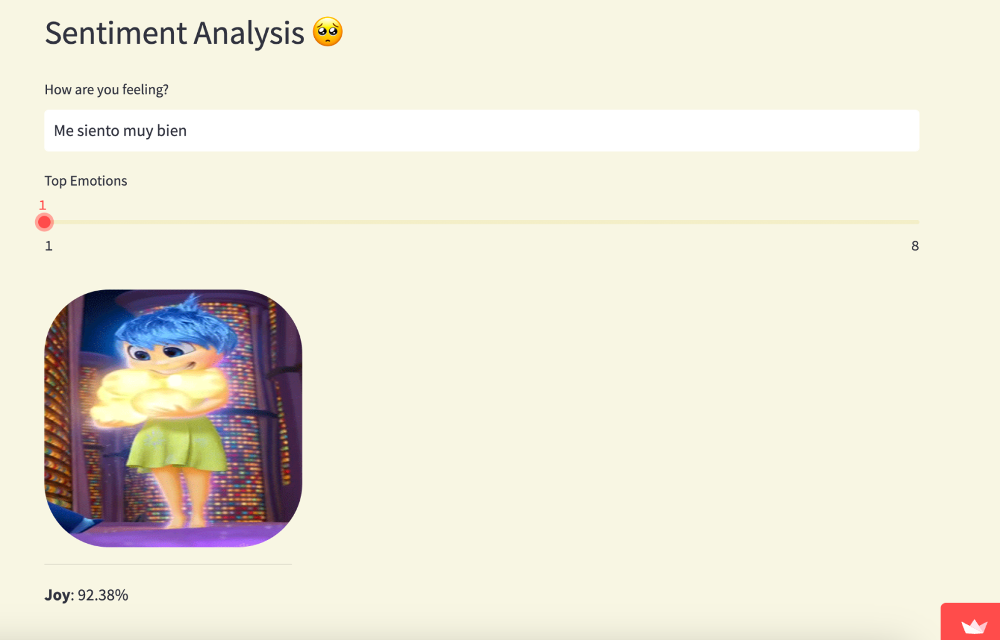

This chapter has been created by Amr Kayid, a Machine Learning Engineer at Cohere.


## Introduction

In this chapter you'll use multilingual embeddings to create a sentiment analysis classifier that works in multiple languages.




Emotional expression is subjective. It’s shaped by cultural background, emotional intelligence, individual personality traits and characteristics, and more. While we can communicate emotions clearly in verbal communication due to nuances of tone and inflection, it’s harder to determine how a person feels and what emotions they’re expressing through words alone.

Fortunately we can use sentiment analysis to determine the tone—and by extension, the emotion—that text conveys. In this demonstration, we’re creating an app that uses sentiment analysis to determine what emotions a person is experiencing based on the text input.

The steps for building the Sentiment Analysis application are:

- Step 1: Gather Emotion Data
- Step 2: Train the Emotion Classifier
- Step 3: Get User Input
- Step 4: Embed the Input
- Step 5: Classify Sentiment
- Step 6: Display Results
- Step 7: Put It All together

## Github Repo

The repository for this project is <a target="_blank" href="https://github.com/AmrMKayid/co-sentiment">here</a>, and we encourage you to follow the code along with this tutorial.

## Step-by-Step Guide

We’ll use the `embed-multilingual-v3.0` model via the Cohere API—specifically the `Embed` endpoint—to generate embeddings for user-provided text in real time. The `embed-multilingual-v3.0` model generates embeddings for text data in over 100 languages. Then, we’ll use these embeddings to train a classifier to predict the emotions the user expressed.

### Step 1: Gather Emotion Data

We’ll use the <a target="_blank" href="https://github.com/Helsinki-NLP/XED">XED dataset,</a> consisting of 8 emotion categories, to train the emotion classifier. For this app, the embeddings for this dataset have already been created and stored as `xed_with_embeddings.json`, along with the labels for each data point.

### Step 2: Train the Emotion Classifier

The bulk of the code that drives this application is stored in the `sentiment.py` file. Let’s open it and examine the `train_and_save function` line by line.

First, the function reads `xed_with_embeddings.json` into a data frame. In this data frame, column `df.embeddings` contains the embeddings for each sample and column `df.labels_text` contains the emotion label for each sample. The function transforms the embeddings for each sample into a list, forming data matrix `X`.

The function uses `MultiLabelBinarizer` from `scikit-learn` to one-hot encode `df.labels_text` and form `y`, which is a one-hot encoded label matrix. Next, the function executes the train-test split with the test set size configured at 1 percent of the total set. Afterwards, it instantiates a chain of classifiers with logistic regression as the base classifier.

A classifier chain is a technique for multi-label classification that involves training a chain of binary classifiers, one for each label. The output of each classifier serves as the input to the next classifier in the chain. Consequently, the final output is a vector of binary labels indicating the presence or absence of each emotion. This demo uses a chain of classifiers instantiated with logistic regression as the base classifier via `ClassifierChain` and `LogisticRegression` from scikit-learn. This allows us to predict the probability of each emotion class for each sample with `chain_model.predict_proba` in Step 5.

Subsequently, the `train_and_save` function fits the classifier on the train set and evaluates it with `chain.score`. This calculates the mean accuracy relative to the test set. In the last line, the function saves the trained classifier for determining emotion in a pickle file `emotion_chain.pkl`. A pickle file is a way of serializing and saving Python objects, such as trained machine learning models. By saving a trained model as a pickle file, we can reuse the model later without retraining it from scratch.

Then, we save the trained classifier for determining emotion into a pickle file named `emotion_chain.pkl`. To load the saved model later, we can simply use the `pickle.load` function in Python.

```
def train_and_save():  
  full_df = pd.read_json("./data/xed_with_embeddings.json", orient='index')  
  df = full_df  
  mlb = MultiLabelBinarizer()  
  X = np.array(df.embeddings.tolist())  
  y = mlb.fit_transform(df.labels_text)  
  classes = mlb.classes_  
  classes_mapping = {index: emotion for index, emotion in enumerate(mlb.classes_)}  
  X_train, X_test, y_train, y_test = train_test_split(X, y, test_size=0.01, random_state=42)  
  base_lr = LogisticRegression(solver='lbfgs', random_state=0)  
  chain = ClassifierChain(base_lr, order='random', random_state=0)  
  chain.fit(X_train, y_train)  
  print(chain.score(X_test, y_test))  
  pickle.dump(chain, open("./data/models/emotion_chain.pkl", 'wb'))
```

### Step 3: Get User Input

Streamlit functions facilitate user input. Calling `st.text_input` creates a page object that asks the user “How are you feeling?” and captures the user’s text response. It then presents the user a slider via `st.slider`, which they use to select the number of top emotions they’d like to be presented (k).

```
feeling_text = st.text_input("How are you feeling?", "")  
top_k = st.slider("Top Emotions", min_value=1, max_value=len(classes_mapping), value=1, step=1)
```

### Step 4: Embed the Input

The beginning of function `score_sentence` embeds the user input text into embeddings and converts it into a torch-based tensor.

```
embeddings = torch.as_tensor(get_embeddings(co=co, model_name=model_name, texts=[text]), dtype=torch.float32)
```

The function imports get_embeddings from the utils.py file. Then, the `get_embeddings` function calculates the embeddings by calling the `embed-multilingual-v3.0`model.

```
def get_embeddings(co: cohere.Client,
                   texts: List[str],
                   model_name: str = 'embed-multilingual-v3.0',
                   input_type = "search_document",
                   truncate: str = 'RIGHT',
                   batch_size: int = 2048) -> List[float]:

    @limiter.ratelimit("blobheart", delay=True)
    def get_embeddings_api(texts_batch: List[str]):

        for i in range(N_MAX_RETRIES):
            try:
                output = co.embed(model=model_name, input_type=input_type, texts=texts_batch, truncate=truncate)
                break
            except Exception as e:
                if i == (N_MAX_RETRIES - 1):
                    print(f"Exceeded max retries with error {e}")
                    raise f"Error {e}"
        return output.embeddings
    st_pbar = tqdm(range(0, len(texts), batch_size))
    for index in st_pbar:
        texts_batch = texts[index:index + batch_size]
        embeddings_batch = get_embeddings_api(texts_batch)  #list(pool.imap(get_embeddings_api, [texts_batch]))
        embeddings.append(embeddings_batch)
    return np.concatenate(embeddings, axis=0).tolist()

```

### Step 5: Classify Sentiment

In the function setup within the `sentiment.py` tile, you can access the trained classifier model from `emotion_chain.pkl` where we saved it in Step 1.

```
def setup():  
…  
 chain_model = pickle.load(open(model_path, 'rb'))
```

With the model stored as `chain_model`, we access it in `score_sentence` after acquiring the embeddings. The function then executes the model on the float tensor of embeddings to predict probabilities of emotion class(es), determined for each sample with `chain_model.predict_proba`. Then, `torch.sort` sorts the probability outputs for the emotion(s) associated with the user text input in ascending order.

In the last step, we convert the tensor of probabilities and tensor of associated indices from GPU-based to CPU-based, allowing for each tensor to be configured into a NumPy array. This then reverses both NumPy arrays such that the emotion with the highest probability is first. This sets up the loop we’ll run to display the images associated with the determined top k emotions experienced by the user.

```
outputs = torch.as_tensor(chain_model.predict_proba(embeddings), dtype=torch.float32) probas, indices = torch.sort(outputs)  
probas = probas.cpu().numpy()[0][::-1]  
indices = indices.cpu().numpy()[0][::-1]
```

### Section 6: Display Results

Let’s first head back to the setup function we discussed in step 5. The first part of this function initiates `emotions2image_mapping` as a dictionary and each of the eight emotion labels are mapped with file paths corresponding to respective emotion GIFs. Then, `emotions2image_mapping` iteratively filled with the emotion gifs themselves utilizing the file paths.

```
emotions2image_mapping = {  
 'Anger': './data/emotions/anger.gif',  
 'Anticipation': './data/emotions/anticipation.gif',  
 'Disgust': './data/emotions/disgust.gif',  
 'Fear': './data/emotions/fear.gif',  
 'Joy': './data/emotions/joy.gif',  
 'Sadness': './data/emotions/sadness.gif',  
 'Surprise': './data/emotions/surprise.gif',  
 'Trust': './data/emotions/trust.gif',  
}  

for key, value in emotions2image_mapping.items():  
  with open(value, "rb") as f:  
  emotions2image_mapping[key] = f.read()
```

Now circling back to the `score_sentence` function, the call returns `emotions2image_mapping` to setup and is afterwards accessed in the loop inside `score_sentence` to display the top k emotions to the user as GIFs.

The loop iterates through each of the top k emotions, with the index and probability associated with each emotion is extracted as tuple (index, p) at each iteration of the loop. Before the start of the loop, we use Streamlit to create k columns that will display the top k emotion(s) to the user.

In the first iteration, a row of three columns is created via `st.columns`. Once three columns are filled with GIFs corresponding to ranked emotions, a new row of three columns is created in the following iteration. Structuring the GIFs to be displayed in rows of up to three emotions facilitates user readability.

```
cols = st.columns(top_k, gap="large")
for i, (index, p) in enumerate(zip(indices[:top_k], probas[:top_k])):
  if i % 3 == 0:
    cols = st.columns(3, gap="large")

    emotion = classes_mapping[index]

    i = i % 3
    image_file = emotions2image_mapping.get(emotion, None)
    if image_file:
      image_gif = base64.b64encode(image_file).decode("utf-8")
      cols[i].markdown(
        f'',
        unsafe_allow_html=True,
      )
      cols[i].markdown("---")
      cols[i].markdown(f"**{emotion}**: {p * 100:.2f}%")

      print(f"Predicted emotion: {emotion}, with probability: {p}")
```

## Conclusion

In this chapter, we learned how to use embeddings to build a text classifier that can determine emotions. It is important to note the layers of this process. We first generated the embeddings by transforming the text via the `embed-multilingual-v3.0` embedding model, and then we built the multi-label classifier. When we later predicted and displayed emotions to the user, we followed the same layered process of calculating embeddings and then applied the classifier to produce probabilities of detected emotions.
