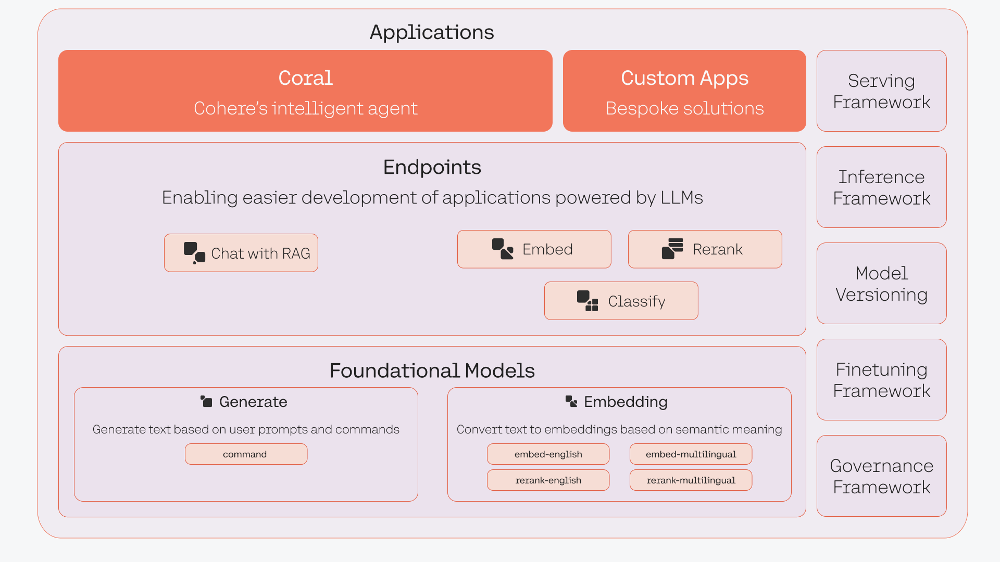

Welcome to The Cohere Platform module! I'm Meor Amer, your instructor.

By the end of this module, you will have a broad overview of the Cohere platform, including its serving framework, the types of foundation models it serves, the available endpoints, and the range of applications that can built on top of it.

Cohere serves large language models (LLM) via a fully-managed platform. These LLMs are accessible via an API, enabled by Cohere’s serving framework that handles all of the complexities around deploying, operating, and scaling LLMs. This allows developers to build applications that benefit from an LLM’s capabilities without having to deal with managing LLM deployments.

For teams that require specific security and privacy requirements in an LLM platform, Cohere provides the option to deploy our LLMs in a private deployment environment. Find more details about this in the [Serving Platform chapter](/docs/serving-platform).

The Cohere platform serves two types of models: generative and representation models. The available models within each type are detailed in the [Foundational Models chapter](/docs/foundation-models).

These models are accessed via a range of endpoints, which provides a more streamlined way to build specific use cases, such as text generation, summarization, embeddings, classification, and more. Learn more about these endpoints in the [Endpoints chapter](/docs/endpoints).

Teams build LLM-powered applications on top of these endpoints. Besides these endpoints, Cohere also provides ready-made solutions like Coral, an intelligent enterprise agent for knowledge workers. Read more in the [Applications chapter](/docs/applications).
