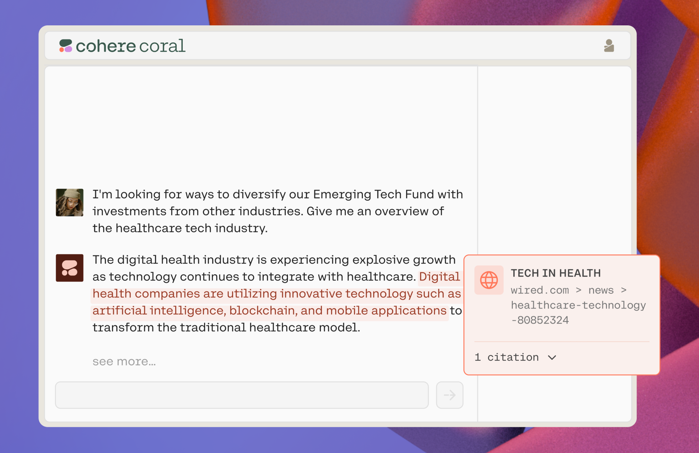

This chapter provides an overview of the possible range of applications that can be built on top of Cohere’s large language models (LLMs) and Coral, an intelligent enterprise agent for supporting knowledge workers.

### Example Applications

LLMs make it possible to build new classes of applications that leverage natural language as the interface — something not possible with the traditional software paradigm. LLMs are versatile across various tasks, and because of that, the potential range of applications is limited only by the imagination. Industry use cases include enterprise productivity, creative writing, gaming, marketing, healthcare, education, and many more.

The following are examples of what type of applications can be built with Cohere LLMs.

- **Customer Operations**
  - Automated customer service based on the customer’s product suite, experience, and language
  - Real-time AI call scripts based on conversation history and caller context
  - Post-call agent feedback on call performance, ways to optimize future calls
- **Marketing**
  - Content generation for e-commerce (product descriptions), B2B (articles optimized for SEO) in brand voice
  - Mass personalization of search, outreach, and customer nurture based on buyer profile and usage history
  - Synthesis, clustering of unstructured data to identify new trends and personas
- **Sales**
  - Custom sales outreach based on interaction history and prospect profile to free up sales representative’s time
  - Virtual sales representatives that guide prospects through offerings through to a sale
  - High propensity prospect identification through analysis of unstructured data (e.g., news)
- **Product Development**
  - Analysis, cleaning, and labeling of large volumes of data, such as user feedback, market trends, logs
  - Coding assistant to speed up development, refactoring, and systems integration
  - Testing automation through the creation of synthetic data and compilation of log data
- **Risk and Legal**
  - Contract drafting and writing acceleration based on existing best practices
  - Summarization and synthesis of large bodies of text in regulatory and other filings
  - Answering questions and citing justifications based on semantic search of large text files
- **Strategy and Finance**
  - Synthesis of unstructured data from earnings calls, analyst reports, and other sources
  - Automation of complex, context-heavy processes such as expensing
  - At-scale understanding of the market across various sources
- **E-commerce**
  - Semantic search to find relevant products, faster
  - Product descriptions at scale for product detail pages
  - Chatbots that respond to customer inquiries
  - Analysis of customer satisfaction from support calls
  - Personalized recommendations based on customer preference

### Coral

Coral is a knowledge assistant that helps enterprises supercharge the productivity of their most strategic teams. Coral is powered by Cohere's Command model, trained with chat, reasoning, and writing abilities.

Users can engage Coral with a prompt to find answers from across their documents via a retrieval augmented generation (RAG) framework. Generated responses include citations of information sources, which verifies their accuracy and mitigates LLM hallucinations.

Coral can be customized for specific teams by connecting to their internal data sources in a secure and private environment. Coral can also be deployed within a team’s secure cloud, whether through Cohere’s cloud partners or virtual private clouds. Coral data is never sent to Cohere, staying within the team’s environment.

The following are some of the key features of Coral:

- **Conversational**: With chat as its primary interface, Coral understands the intent behind conversations, remembers the history, and is simple to use.
- **Customized**: Teams can augment Coral's knowledge base through data connections. Coral supports various integrations ready to connect to data sources important to businesses.
- **Grounded**: To help verify generations, Coral can produce responses with citations from relevant data sources.
- **Private**: The data used for prompting and the chatbot's outputs will not leave a company's data perimeter. Cohere is cloud-agnostic and will support deployment on any cloud.

The benefits of knowledge assistants like Coral apply across all business functions, for example:

- Knowledge workers, such as account executives, analysts, consultants, engineers, lawyers, etc., have defined roles they need to perform efficiently and effectively. While specific tasks may vary across different teams, an internal chatbot can help them research, analyze, and recommend solutions as part of their core job functions.
- Customer support departments need product information quickly and accurately. Empowering customer support agents with an internal chatbot that knows product and support details can resolve cases faster.

To learn more, visit [the Coral webpage](https://cohere.com/coral).
