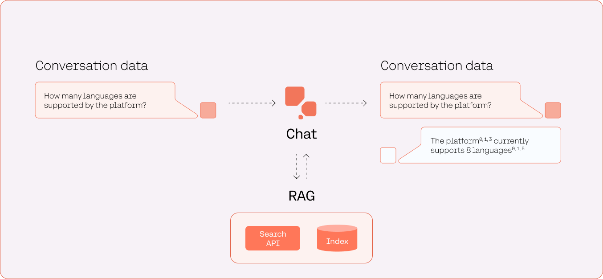
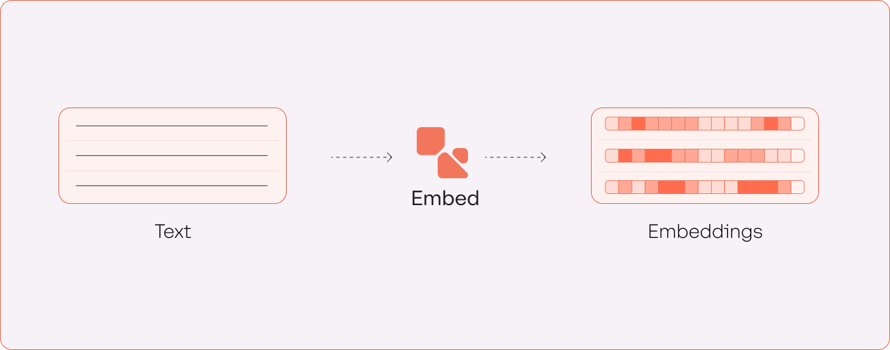
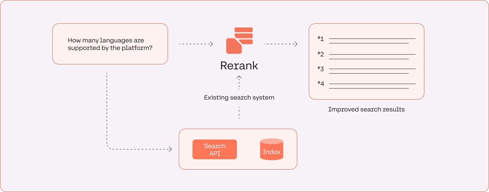
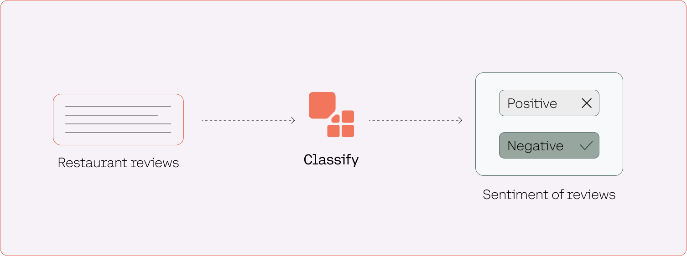

Cohere’s LLMs are accessible via the Cohere API, which also comes with SDKs for Python, Node, and Go. The API provides several endpoints, each providing abstractions to access the foundational models and streamlined to serve specific use cases. We’ll take a look at these endpoints in this chapter.

### Chat with Retrieval Augmented Generation (RAG)

The Chat endpoint endpoint enables text generation use cases. The endpoint takes an instruction-style text prompt and returns text as a response.

The endpoint produces conversational responses to user messages and maintains the state of a conversation over multiple turns. The endpoint takes a user message as input and returns a chatbot reply as a response.

The [retrieval augmented generation](/docs/retrieval-augmented-generation-rag) (RAG) feature allows the Chat endpoint to retrieve external information and synthesize it into its response. It provides access to various sources, such as web search engines and knowledge bases.

Developers can configure the API to include citations from the data sources used. Citations provide a critical benefit by delivering the generated content with verifiable references, enhancing the credibility and trustworthiness of the presented information, and allowing users to explore responses for a deeper understanding.

Example use cases:

- Knowledge assistant
- Intelligent support agent
- Research tool

Foundational model: Command

[API Reference](/reference/chat)

### Embed

The Embed endpoint enables text representation use cases. The endpoint takes a document as input and returns its embeddings as a response.

Example use cases:

- Semantic search
- Text classification
- Text clustering

Foundational model: Embed

[API Reference](/reference/embed)

### Rerank

The Rerank endpoint enhances an existing search system to ensure the most semantically relevant results appear first. The endpoint takes a query and a set of documents as inputs and returns a list of those documents, sorted from most to least relevant.

Example use cases:

- Reranking lexical search results
- Enhancing an existing semantic search
- Recommendation engine

Foundational model: Rerank

[API Reference](/reference/rerank-1)

### Classify

The Classify endpoint assigns one or more labels to a text input based on a user-defined list of classes. The endpoint takes a text input (or more) and a list of examples as inputs and returns the assigned label for the text input.

Example use cases:

- Sentiment analysis
- Intent classification
- Content moderation

Foundational model: Embed

[API Reference](/reference/classify)
