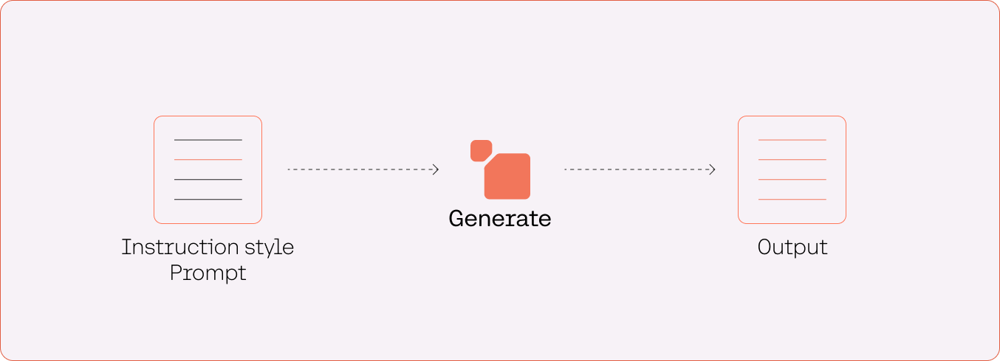
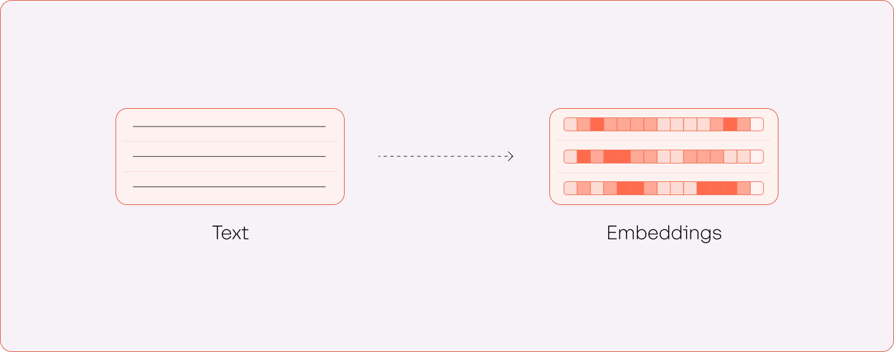

The foundational models available on the Cohere platform consist of two types: generative and representative models.

Generative models take a text input (the “prompt”) and generate text as output (the “response”). This is useful for question-answering, copywriting, text summarization, and similar use cases.

Representative models take a text input and generate its numerical representation (an “embedding”), which captures its contextual meaning. This is useful for semantic search, text classification, topic modeling, and similar use cases.

### Text Generation

#### Command

`command` is Cohere’s flagship generative model. Example use cases enabled by this model include:

- Copy generation: Draft marketing copy, emails, blog posts, product descriptions, docs, and more.
- Chat: Create chatbots to brainstorm, problem-solve, answer questions, and more. Integrate with a search system to create grounded chat powered by retrieval augmented generation.
- Text summarization: Summarize articles, transcripts, doctor’s notes, internal documents, and more.

#### Command-R

[Command-R](/docs/command-r) is an LLM that’s optimized for conversational interaction and long context tasks.

Here are some key features of Command-R:

- High-performance RAG: Retrieval-augmented generation (RAG) enables enterprises to give the model access to private knowledge that it otherwise would not have.
- Access to tools: Tool use enables enterprise developers to turn Command-R into an engine for powering the automation of tasks and workflows that require using internal infrastructure like databases and software tools, as well as external tools like CRMs, search engines, and more.
- Low latency and high throughput: Command-R targets the “scalable” category of models that balance high performance with strong accuracy, enabling companies to move beyond proof of concept and into production.
- 128k context length and lower pricing: Command-R features a longer context length, supporting up to 128k tokens in its initial release.
- Strong capabilities across 10 key languages: The model excels at 10 major languages for global business: English, French, Spanish, Italian, German, Portuguese, Japanese, Korean, Arabic, and Chinese.
- Model weights available for research and evaluation: [Cohere Labs](https://cohere.com/research) is releasing the weights for this version of [Command-R publicly](https://huggingface.co/CohereForAI/c4ai-command-r-v01), so that it can be used for research purposes.

#### Command-light

`command-light` is the smaller and faster version of `command`. Use `command-light` if you are optimizing for latency.

#### Command-nightly-\*

There are also nightly versions of `command` and `command-light` available. These models, `command-nightly` and `command-light-nightly`, are experimental versions of their default counterparts and are released on a more regular basis.

[Visit the documentation](/docs/command-beta) and the [API reference](/reference/generate) for more information about the text generation models.

### Text Representation

#### Embed-english

`embed-english` is Cohere’s most performant English text representation model that converts text into vector embeddings. The current latest version is `embed-english-v3.0`

Example use cases enabled by this model include:

- Semantic search: Search call transcripts or internal knowledge sources
- Text classification: Classify intent in customer support chat logs
- Text clustering: Identify common topics in customer reviews or news data
- Recommendation: Represent podcast descriptions as a numerical feature for use in a recommendation model

`embed-english-light` is the smaller and faster version of `embed-english`. Use `embed-english-light` if you are optimizing for latency.

#### Embed-multilingual

`Embed-multilingual` is the state-of-the-art multilingual embedding model that can convert text in over 100 languages into vector embeddings. It can be applied to the same use cases as Cohere’s English embedding models. The current latest version is `embed-multilingual-v3.0`

[Visit the documentation](/docs/multilingual-language-models) and the [API reference](/reference/embed) for more information about the embedding models.

#### Rerank-english

`Rerank-english` is used to improve the relevance of search systems by performing a second-stage ranking of search results. It can be applied to an existing search system without changing its infrastructure. The current latest version is `rerank-english-v2.0`

Example use cases enabled by this model include:

- Chatbots: Refine results for Retrieval-Augmented-Generation-based chatbots (or RAG, for short)
- Enterprise search: Improve question-answering search on enterprise knowledge bases
- Customer support: Improve the ability for users to self-serve answers from customer support documents

#### Rerank multilingual

`Rerank multilingual` is used to improve the relevance of search systems by performing a second-stage ranking of search results in 100+ languages. It can be applied to an existing search system in 100+ languages without changing the existing infrastructure. In addition, it can be applied to the same use cases as Cohere’s English Rerank models. The current latest version is `rerank-multilingual-v2.0`

[Visit the documentation](/docs/reranking) and the [API reference](/reference/rerank-1) for more information about the reranking models.
