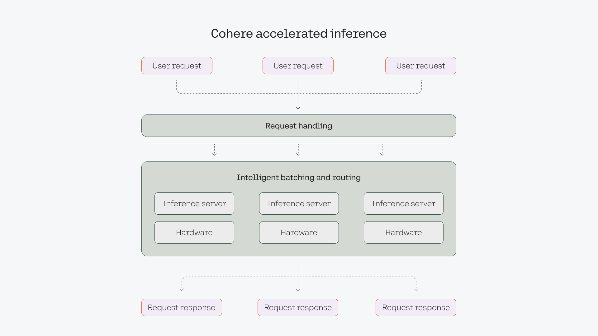
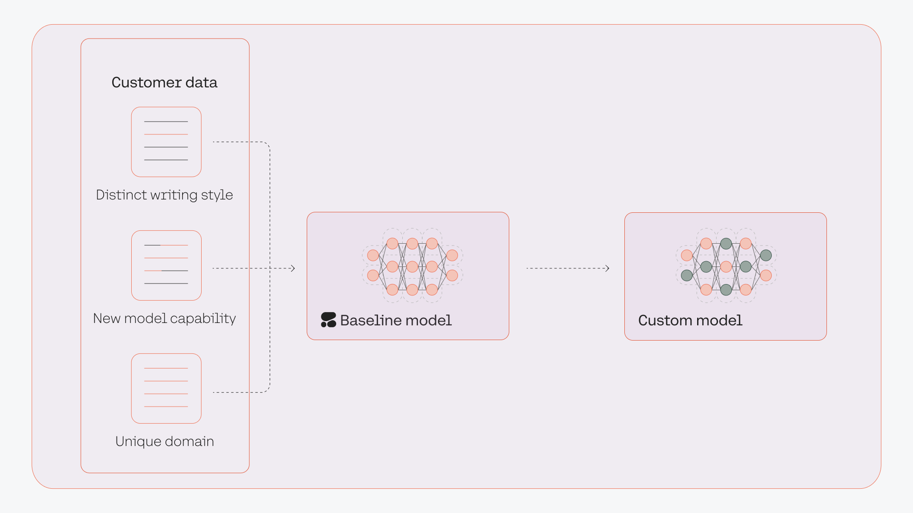
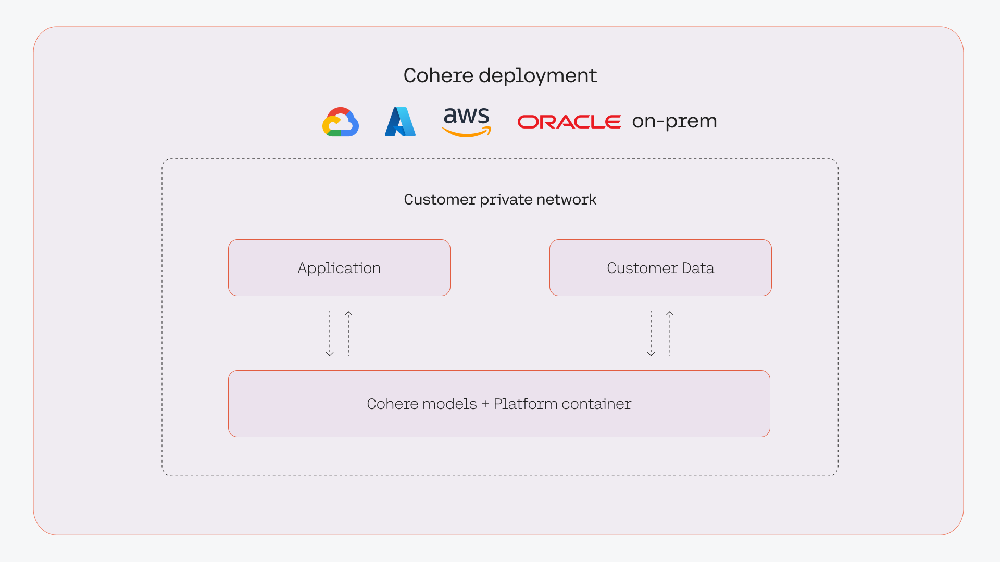

Cohere provides a fully managed platform that serves large language models (LLMs) so that teams can leverage the capabilities of LLMs without having to worry about building infrastructure and managing deployments. 

At the same time, the platform offers flexibility for teams with more specific needs, such as for training custom models and deploying LLMs in a private environment.

### Serving Framework

Cohere’s LLMs are accessible via an API, enabled by Cohere’s serving framework that handles all of the complexities around deploying, operating, and scaling LLMs. 

Notable features include:

- Intelligent batching to improve throughput and latency across various types of requests.
- Custom load balancing that handles how requests are passed to the inference servers.
- Fully Cohere-designed and controlled serving framework.
- Enables downstream tasks, such as parameter-efficient finetuning.

### Custom Models

Cohere’s LLMs are already trained on a huge volume of data, making them great at capturing patterns of information on a broad scale. However, in some cases, a task may require highly specific model properties, such as style, format, or knowledge. This requires the creation of custom models, also known as fine-tuning.

Cohere's platform enables teams to fine-tune models trained with specific datasets. FIne-tuned models can increase the quality and performance of a given task compared to a baseline model.

[Read more about creating fine-tuned models in the documentation](/docs/fine-tuning).

### Private Deployment

For teams that require specific security and privacy requirements in an LLM platform, Cohere provides the option to deploy our LLMs in a private deployment environment. Cohere’s private deployments enable teams to deploy LLMs over a secure network through their chosen cloud provider or their own environment. The data never leaves their environment and the model can be fully network-isolated.

Cohere is a cloud-agnostic provider capable of deploying our platform in private clouds and through our secure cloud partners. 

This can come in various forms, such as:

- Cloud AI Services: Procure Cohere LLMs directly through several leading managed cloud AI offerings.
- Virtual Private Cloud: Access Cohere’s LLMs in your Virtual Private Cloud.
- On-Premises: Deploy the Cohere stack in your environment and private network using your own compute.
