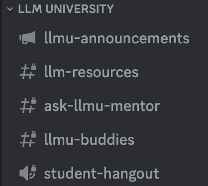

Hello! We're Sandra and Roy, and we're the moderators of the Discord Community for LLM U!

If you are interested, join our [Discord](https://discord.gg/co-mmunity) and:

1. First up, make sure to say 👋 in the **#introductions** channel.
2. Next, navigate to **LLM-UNIVERSITY** category on the left side panel to check out the following channels:    

**#llmu-announcements** for important course-specific updates.

**#llm-resources** for exchanging quality LLM educational materials with your peers.

**#ask-llmu-mentor** for reaching out to mentors with questions about the syllabus, course content, and other LLM University-related matters.

**#llmu-buddies** for finding your buddy to study the course, specifying your level, focus, and goals.

**#student-hangout** for exclusive live sessions dedicated to the course syllabus.
