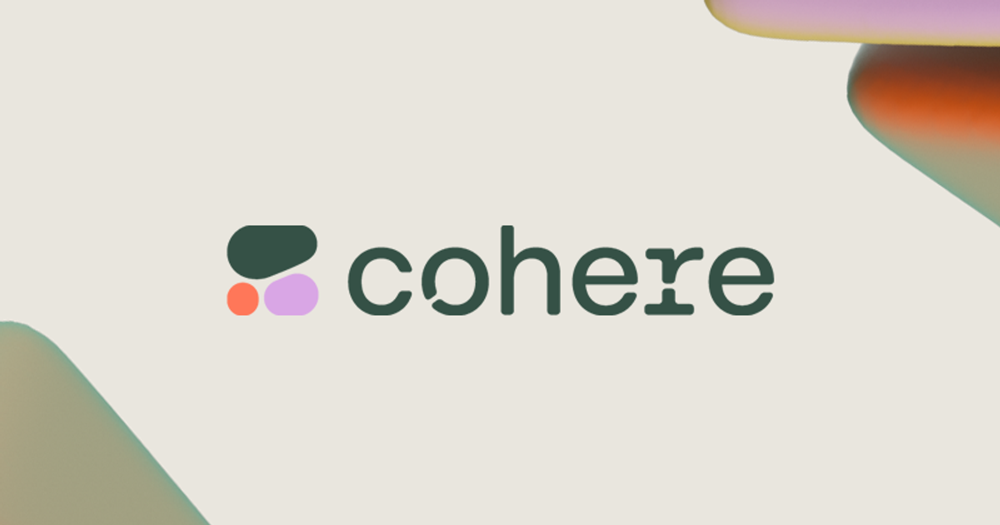
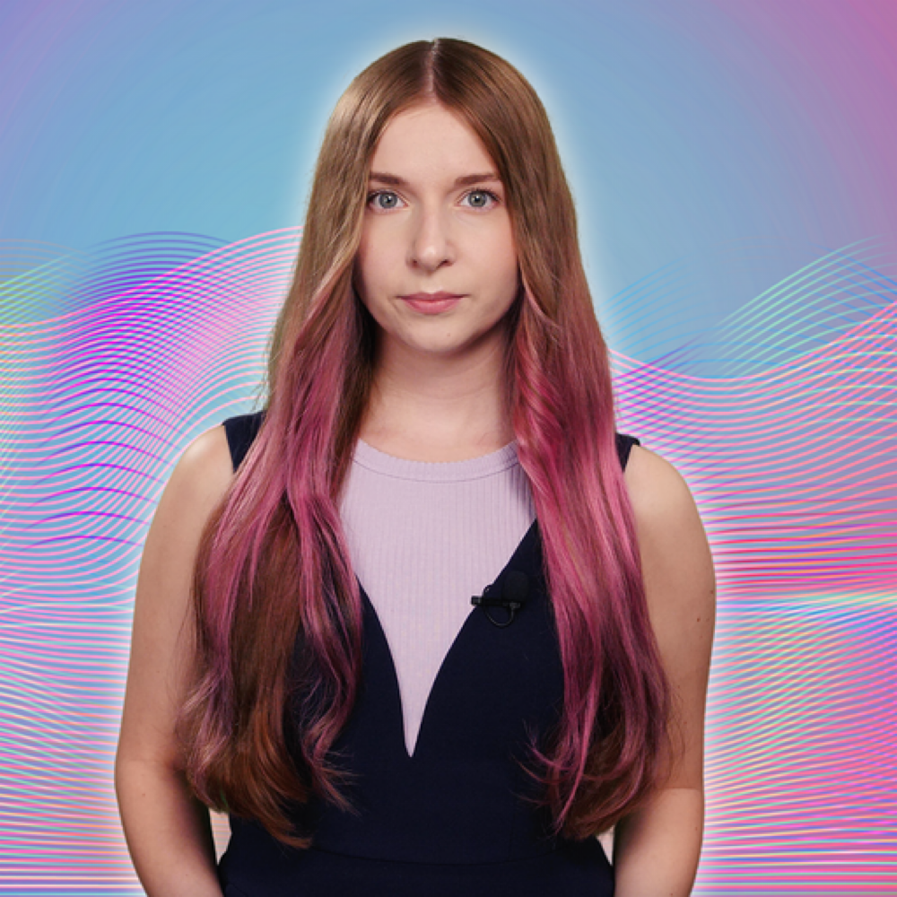

This content has been curated and prepared for you by the following instructors:

**Luis Serrano** is the Developer Relations lead at Cohere. Luis is the author of <a href="https://www.manning.com/books/grokking-machine-learning" target="_blank">Grokking Machine Learning</a>, and the creator of the popular YouTube channel <a href="https://www.youtube.com/c/LuisSerrano" target="_blank">Serrano.Academy</a>. Luis has worked as a researcher and practitioner in classical and quantum machine learning, and as an educator. He holds a PhD in mathematics from the University of Michigan, and worked in Silicon Valley at Google, Apple, among other companies. Luis has launched popular machine learning courses at Coursera, Udacity, and other platforms.

***

**Jay Alammar** is Director and Engineering Fellow at Cohere. Through his popular machine learning <a target="_blank" href="https://jalammar.github.io/">blog</a> and <a target="_blank" href="https://www.youtube.com/channel/UCmOwsoHty5PrmE-3QhUBfPQ">YouTube channel</a> Jay has helped millions of engineers visually understand machine learning tools and concepts from the basic (ending up in NumPy and pandas documentation) to the cutting-edge (The Illustrated Transformer, BERT). Jay has a Bachelors in Computer Science from the University of Kansas. He currently advises Cohere’s customers and developer communities on the applications of large language models (LLMs).

***

**Meor Amer** works in Developer Relations at Cohere. He is the author of <a href="https://kdimensions.gumroad.com/l/visualdl" target="_blank">A Visual Introduction to Deep Learning</a>. A lifelong educator, Meor is the founder of platforms that teach AI to students of all levels, such as <a href="https://kdimensions.com/" target="_blank">kDimensions</a>, a visual resource to learn AI concepts, and <a href="https://edsquare.co/" target="_blank">Edsquare</a>, an educational AI resource for youths. In addition to that, he's had many years of experience as a data scientist and solutions engineer and holds a Masters in Biomedical Engineering from Imperial College London.

***

Some of this material has been built by other guest lecturers of <a target="_blank" href="https://cohere.com/">Cohere</a>, and you'll be able to find links to the corresponding blog posts and labs.

***

### Discord Community

**Sandra Kublik** works in Developer Relations at Cohere, where she manages the Discord community and the influencer programs. She is a well-known AI popularizer, and the author of the book [GPT-3: Building Innovative NLP Products using LLMs](https://www.goodreads.com/en/book/show/59713693). Sandra maintains a very popular [YouTube Channel](https://www.youtube.com/c/technocratic) on LLMs and NLP. She is a frequent speaker at conference and guest in AI podcasts. Sandra graduated from the University of Warsaw with a Liberal Arts degree.

**Roy Lim** is the Marketing Events Manager at Cohere, where he leads the organization of enterprise programs and events. He has extensive experience as a project manager, having worked at Meta on the Reality Labs Developer Ecosystem. Roy holds a BA from the Singapore Institute of Technology.
