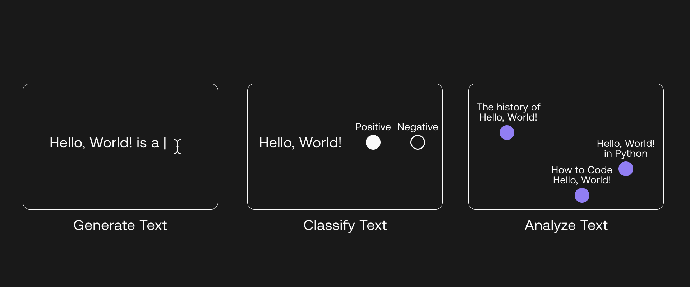
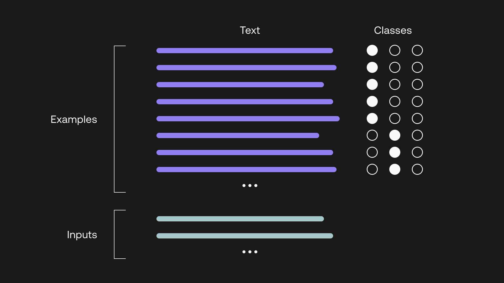
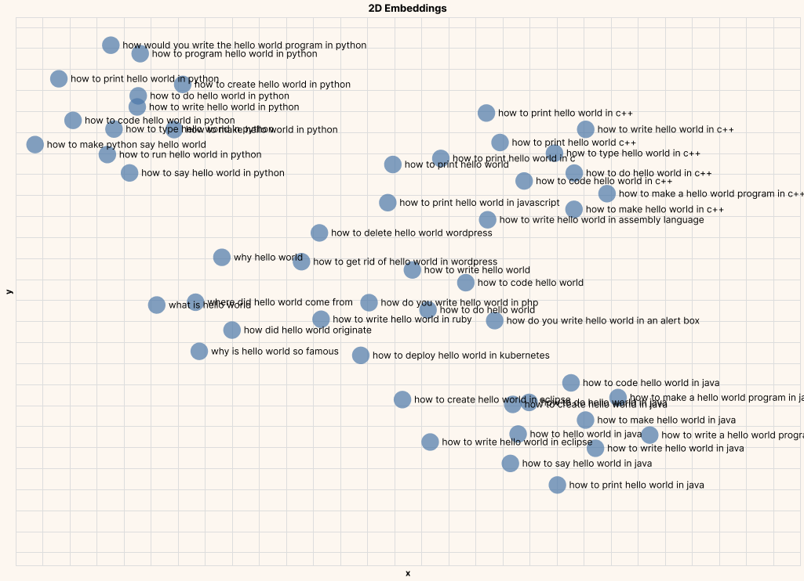
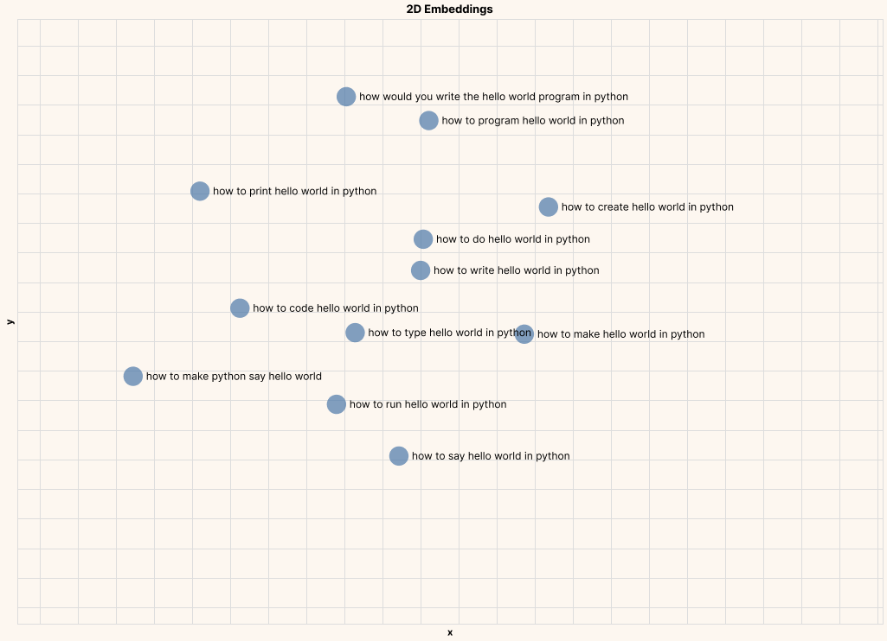
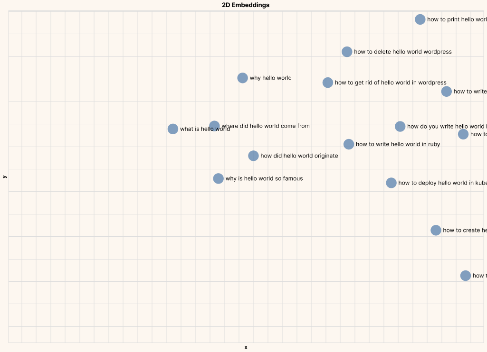

If you are a developer looking to add language processing capabilities to your project, this guide is for you. We’ll give you a quick tour of what’s possible with language AI using Cohere’s Large Language Model (LLM) API. Our guide is essentially your “Hello, World!” of language AI, and since this is all about language processing, we’ll do this by exploring the phrase Hello, World! itself!

We’ll cover three groups of tasks that you will typically work on when dealing with language data, including:

- Classifying text
- Analyzing text

There is a third one which is generating text, but we'll dedicate an entire module to it.

These map nicely to three Cohere endpoints — Generate, Classify, and Embed — which we will cover in the examples. At the end of this chapter, we’ll summarize these endpoints in a table for easy reference.




This guide assumes little or no background in machine learning or NLP. The examples are shown using Python, although Cohere also provides SDKs for Node.js, Go, and Ruby. We include only key snippets of the code used, but you can run the full version if you wish. It is hosted on Google Colaboratory, so you won’t need to go through additional setup or installation.

Before we proceed, let’s use a toolbox metaphor to try and make sense of the commonly used terms and how they compare to each other:

- Natural Language Processing (NLP): The toolkit for using computers to process, understand, and generate text.
- Language AI: A set of modern tools within that toolkit which leverage machine learning models. Some examples include text generation, classification, summarization, paraphrasing, and entity extraction.
- Large Language Models (LLM): A general-purpose type of language AI that eliminates the need for different models for different tasks. It has also achieved state-of-the-art performance in some NLP tasks. These are the kind of models you interact with using the Cohere platform

# Setting up

The first step is to install the Cohere Python SDK.

```
$ pip install cohere
```

Next, sign up for a Cohere account and create an API key, which you can generate from one of the following interfaces:

- Cohere [dashboard](https://dashboard.cohere.com/register?ref=txt.cohere.com&__hstc=14363112.89f2baed82ac4713854553225677badd.1682345384753.1682373613982.1682437866580.5&__hssc=14363112.1.1682437866580&__hsfp=2014138109)
- Cohere [CLI tool](/cli-key?ref=txt.cohere.com&__hstc=14363112.89f2baed82ac4713854553225677badd.1682345384753.1682373613982.1682437866580.5&__hssc=14363112.1.1682437866580&__hsfp=2014138109)

Once that is done, you can set up the Cohere client as follows.

```
import cohere  
co = cohere.Client(api_key)
```

# Classifying text


LLMs have been pre-trained with a vast amount of training data, allowing them to capture how words are being used and how their meaning changes depending on the context.

A very common application of this is text classification. Cohere’s Classify endpoint makes it easy to take a list of texts and predict their categories, or classes.

If you have read a little bit about text classification, you may have come across sentiment analysis, which is the task of classifying the sentiment of a text into a number of classes,  say, positive, negative, or neutral. This is useful for applications like analyzing social media content or categorizing product feedback. So, why don’t we try that with the phrase Hello, World!

A human can easily tell you that “Hello, World! What a beautiful day” conveys a positive sentiment, but let’s see if our models can do that too. And while we’re at it, let’s try classifying other phrases that you might find on social media.

## Prepare Input

A typical machine learning model requires many training examples to perform text classification, but with the Classify endpoint, you can get started with as few as five examples per class. With the Classify endpoint, the input you need to prepare is as follows:

**Examples**

These are the training examples we give the model to show the output we want it to generate.  
Each example contains the text itself and the corresponding label, or class.  
The minimum number of examples required are five per class.  
You can have as many classes as possible. If you are classifying text into two classes, that means you need a minimum of 10 examples, and if you have three, that means you need 15 examples, and so on.

**Inputs**

These are the list of text pieces you’d like to classify. We have twelve in total.




Our sentiment analysis classifier has three classes with five examples each: “Positive” for a positive sentiment, “Negative” for a negative sentiment, and “Neutral” for a neutral sentiment. The code looks as follows.

The examples:

```
from cohere.responses.classify import Example

examples = [Example("I'm so proud of you", "positive"), 
            Example("What a great time to be alive", "positive"), 
            Example("That's awesome work", "positive"), 
            Example("The service was amazing", "positive"), 
            Example("I love my family", "positive"), 
            Example("They don't care about me", "negative"), 
            Example("I hate this place", "negative"), 
            Example("The most ridiculous thing I've ever heard", "negative"), 
            Example("I am really frustrated", "negative"), 
            Example("This is so unfair", "negative"),
            Example("This made me think", "neutral"), 
            Example("The good old days", "neutral"), 
            Example("What's the difference", "neutral"), 
            Example("You can't ignore this", "neutral"), 
            Example("That's how I see it", "neutral")            
            ]
```

The inputs:

```
inputs=["Hello, world! What a beautiful day",
        "It was a great time with great people",
        "Great place to work",
        "That was a wonderful evening",
        "Maybe this is why",
        "Let's start again",
        "That's how I see it",
        "These are all facts",
        "This is the worst thing",
        "I cannot stand this any longer",
        "This is really annoying",
        "I am just plain fed up"
        ]
```

## Get output

With the Classify endpoint, setting up the model is quite straightforward. The main thing to do is to define the model type. For our example, we’ll use the default, which is `medium`.

Putting everything together with the Classify endpoint looks like the following:

```
def classify_text(inputs,examples):
  response = co.classify(
    model='medium',
    inputs=inputs,
    examples=examples)
  
  return response.classifications
```

Together with the predicted class, the endpoint also returns the confidence value of the prediction (between 0 and 1). These confidence values are split among the classes, in this case three, in which the values add up to a total of 1. The classifier then selects the class with the highest confidence value as the “predicted class.” A high confidence value for the predicted class therefore indicates that the model is very confident of its prediction, and vice versa.

Here’s a sample output returned:

```
Input: Hello, world! What a beautiful day
Prediction: positive
Confidence: 0.76
----------
Input: It was a great time with great people
Prediction: positive
Confidence: 0.85
----------
Input: Great place to work
Prediction: positive
Confidence: 0.75
----------
Input: That was a wonderful evening
Prediction: positive
Confidence: 0.82
----------
Input: Maybe this is why
Prediction: neutral
Confidence: 0.62
----------
Input: Let's start again
Prediction: neutral
Confidence: 0.42
----------
Input: That's how I see it
Prediction: neutral
Confidence: 0.69
----------
Input: These are all facts
Prediction: neutral
Confidence: 0.77
----------
Input: This is the worst thing
Prediction: negative
Confidence: 0.80
----------
Input: I cannot stand this any longer
Prediction: negative
Confidence: 0.70
----------
Input: This is really annoying
Prediction: negative
Confidence: 0.64
----------
Input: I am just plain fed up
Prediction: negative
Confidence: 0.79
----------
```

The model returned a Positive sentiment for “Hello, world! What a beautiful day,” which is what we would expect! And the predictions for all the rest look spot on too.

That was one example, but you can classify any kind of text into any number of possible classes according to your needs. We dive deeper into text classification and its use cases in a recent blog post.

As your task gets more complex, you will likely need to bring in additional training data and finetune a model. This will ensure that the model can capture the nuances specific to your task and realize performance gains. You can read more about [finetuning representation models](/finetuning-representation-models/?ref=txt.cohere.com&__hstc=14363112.89f2baed82ac4713854553225677badd.1682345384753.1682447142806.1682463578843.8&__hssc=14363112.1.1682463578843&__hsfp=2014138109) in the docs.

If you’d like to learn more about text classification, here are some additional resources:

Intuition and [use case examples](https://cohere.com/blog/text-classification-use-cases/)  
An example application: [toxicity detection](https://cohere.com/blog/toxicity-sms/)  
Evaluating a [classifier’s performance](https://cohere.com/blog/classification-eval-metrics/)  
Classify endpoint [API reference](/classify-reference?ref=txt.cohere.com&__hstc=14363112.89f2baed82ac4713854553225677badd.1682345384753.1682447142806.1682463578843.8&__hssc=14363112.1.1682463578843&__hsfp=2014138109)

# Analyzing Text


The next area in language understanding is a broad one, which is analyzing text. Cohere’s Embed endpoint takes a piece of text and turns it into a vector embedding. Embeddings represent text in the form of numbers that capture its meaning and context.

This gives you the ability to turn unstructured text data into a structured form. It opens up ways to analyze and extract insights from them. Let’s take a look at a couple of examples.

## Semantic Search

The first example is semantic search. There was a time when web search engines relied on keywords to match your search queries to the most relevant sites. But these days, you would be one frustrated user if that’s the kind experience you get, because these search engines are now able to capture semantic understanding of what you are looking for, beyond just keyword-matching.

Let’s build a simple semantic search engine. Here we have a list of 50 top web search terms about Hello, World! taken from a keyword tool. The following are a few examples:

```
df = pd.read_csv("hello-world-kw.csv", names=["search_term"])
df.head()
```

|    | Keyword                                      |
| :- | :------------------------------------------- |
| 0  | how to print hello world in python           |
| 1  | what is hello world                          |
| 2  | how do you write hello world in an alert box |
| 3  | how to print hello world in java             |
| 4  | how to write hello world in eclipse          |

Let’s pretend that these search terms make up an FAQ database. Our job now, given a new query, is to ensure that the search engine returns the most similar FAQs.

The Embed endpoint is quite straightforward to use:

- Prepare input — The input is the list of text you want to embed.
- Define model settings — The model setting is just one: the model type. But it does make a difference to your task because bigger models generate embeddings with higher dimensions. We’ll use the default which is large.
- Generate output — The output is the corresponding embeddings for the input text.

The code looks like this:

```
def embed_text(texts):
  output = co.embed(
                model="large",
                texts=texts)
  embedding = output.embeddings

  return embedding
```

Now, given the FAQs, let’s try the search term “what is the history of hello world.” This is a search term whose keyword (i.e., “history”) doesn’t exist at all in the FAQ. Let’s see how the search fares.

First we get the embeddings of all the FAQs:

```
df["search_term_embeds"] = embed_text(df["search_term"].tolist())
embeds = np.array(df["search_term_embeds"].tolist())
```

And then get the embeddings of the new query:

```
new_query = "what is the history of hello world"
new_query_embeds = embed_text(new_query)
```

Next, we compare the similarity of the embeddings of the new query with each of the embeddings of the FAQs. There are many options to do this, and one option is using cosine similarity. We’ll utilize [scikit-learn’s library](https://scikit-learn.org/stable/modules/generated/sklearn.metrics.pairwise.cosine_similarity.html?ref=txt.cohere.com) to perform this.

The steps are:

- Calculate similarity between the new query with each of the FAQs
- Sort the FAQs by descending order in similarity (the most similar first)
- Show the top FAQs with the highest similarity to the new query

The code is shown below:

```
from sklearn.metrics.pairwise import cosine_similarity

def get_similarity(target,candidates):
  # Turn list into array
  candidates = np.array(candidates)
  target = np.expand_dims(np.array(target),axis=0)

  # Calculate cosine similarity
  sim = cosine_similarity(target,candidates)
  sim = np.squeeze(sim).tolist()

  # Sort by descending order in similarity
  sim = list(enumerate(sim))
  sim = sorted(sim, key=lambda x:x[1], reverse=True)

  # Return similarity scores
  return sim

similarity = get_similarity(new_query_embeds,embeds)

# Show the top 5 FAQs with the highest similarity to the new query
for idx,score in similarity[:5]:
  print(f"Similarity: {score:.2f};", df.iloc[idx]["search_term"])
```

And the output we get is:

```
New query:
what is the history of hello world 

Similar queries:
Similarity: 0.89; how did hello world originate
Similarity: 0.87; where did hello world come from
Similarity: 0.82; what is hello world
Similarity: 0.73; why is hello world so famous
Similarity: 0.70; why hello world
```

It works! Notice that the top terms are indeed the closest in meaning to the search term (about the history and origin of Hello, World!) even though they use different kinds of words.

## Semantic Exploration

Moving on to the second example. Here, we take the same idea that we see in semantic search and take a broader look, which is exploring huge volumes of text and analyzing their semantic relationships.

Let’s keep our example simple and use the same 50 top web search terms about Hello, World! Its volume is by no means small, but it’s good enough to illustrate the idea.

We used the `large` endpoint to generate the embeddings. At the time of writing, this model generates embeddings of 4,096 dimensions. This means, for every piece of text passed to the Embed endpoint, a sequence of 4,096 numbers will be generated. Each number represents a piece of information about the meaning contained in that piece of text.

To understand what these numbers represent, there are techniques we can use to compress the embeddings down to just two dimensions while retaining as much information as possible. And once we can get it down to two dimensions, we can plot these embeddings on a 2D plot.

We can make use of the [UMAP](https://umap-learn.readthedocs.io/en/latest/?ref=txt.cohere.com) technique to do this. The code is as follows:

```
import umap

# Compress the embeddings to 2 dimensions (UMAP’s default reduction is to 2 dimensions)
reducer = umap.UMAP(n_neighbors=49) 
umap_embeds = reducer.fit_transform(embeds)

# Store the compressed embeddings in the dataframe/table
df['x'] = umap_embeds[:,0]
df['y'] = umap_embeds[:,1]
```

You can then use any plotting library to visualize these compressed embeddings on a 2D plot.

Here is the plot showing all 50 data points:




And here are a few zoomed in plots, clearly showing text of similar meaning being closer to each other.

**Example #1: Hello, World! In Python**




**Example #2: Origins of Hello, World!**




These kinds of insights enable various downstream analysis and applications, such as topic modeling, by clustering documents into groups. In other words, text embeddings allows us to take a huge corpus of unstructured text and turn it into a structured form, making it possible to objectively compare, dissect, and derive insights from all that text.

If you’d like to learn more about text analysis, here are some additional resources:

- An example application: combing for insight in 10k Hacker News posts
- Intuition about text embeddings, explained visually
- Some use case ideas with text embeddings
- Embed endpoint API reference

Additionally, as you start working with larger input sizes, it’s worth reading the [API reference](/api-reference/?ref=txt.cohere.com&__hstc=14363112.89f2baed82ac4713854553225677badd.1682345384753.1682447142806.1682463578843.8&__hssc=14363112.1.1682463578843&__hsfp=2014138109) of the three endpoints we have covered. For example, endpoints that accept a batch of inputs (Embed and Classify) have a maximum number of inputs per call. There’s also rate limits to be considered ([limited](/limited-access?ref=txt.cohere.com&__hstc=14363112.89f2baed82ac4713854553225677badd.1682345384753.1682447142806.1682463578843.8&__hssc=14363112.1.1682463578843&__hsfp=2014138109) or [full](/going-live/?ref=txt.cohere.com&__hstc=14363112.89f2baed82ac4713854553225677badd.1682345384753.1682447142806.1682463578843.8&__hssc=14363112.1.1682463578843&__hsfp=2014138109) access).

# Conclusion

Well, that wasn’t really quick as promised! But hopefully you are excited as I am to dive further into language AI and explore ways to unlock new kinds of applications. The whole category is relatively new and the boundary of what’s possible is continuously being pushed. I’m excited to see what you will build with Cohere!

The following table summarizes the two Endpoints that we have covered.

|                              | Classify                                | Embed                               |
| :--------------------------- | :-------------------------------------- | :---------------------------------- |
| Input                        | Examples and text to classify           | Text to embed                       |
| Commonly used model settings | Model type                              | Model type (affects embedding size) |
| Output                       | Predicted classes and confidence values | Embeddings                          |
