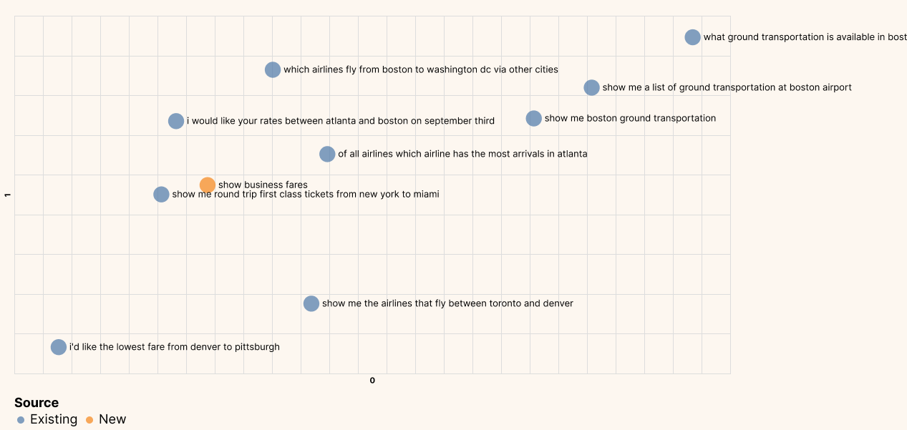
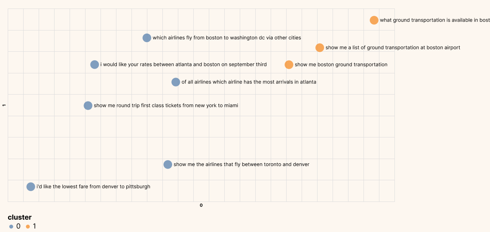
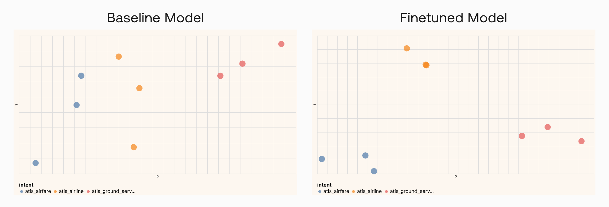

# Introduction and Codelab

You've already learned several things in module 2, including:

- Embeddings
- Similarity
- Semantic Search

In this chapter, you'll see a more in depth analysis of these, as well as some code to put them in practice. We encourage you to follow this chapter along with the [codelab](https://github.com/cohere-ai/cohere-developer-experience/blob/main/notebooks/Visualizing_Text_Embeddings.ipynb), where all these models are implemented.

For the setup, please refer to the [Setting Up](/docs/setting-up) chapter at the beginning of this module.

# A More in Depth Look at Embeddings

When you hear about large language models (LLM), probably the first thing that comes to mind is the text generation capability, such as writing an essay or creating a marketing copy.

But another thing you can get is text representation: a set of numbers that represent what the text means, and somehow capture the semantics of the text. These numbers are called text embeddings.


Text Embeddings give you the ability to turn unstructured text data into a structured form. With embeddings, you can compare two or more pieces of text, be it single words, sentences, paragraphs, or even longer documents. And since these are sets of numbers, the ways you can process and extract insights from them are limited only by your imagination.

What does this bring? It opens up many possible use cases that apply in the real world today. Embeddings power applications we interact with on a daily basis, such as modern search engines, eCommerce product recommendations, social media content moderation, email spam filtering, customer support conversational agents, and many more.

In this chapter, we take a visual approach to understand:

- The intuition behind text embeddings
- What use cases are they good for
- How we can customize them via finetuning

# Intuition

There’s no better way to understand text embeddings than by looking at examples. Throughout this article, we'll use a subset of the Airline Travel Information System (ATIS) intent classification dataset as an example [Source]. This dataset consists of inquiries coming to airline travel inquiry systems. Here are a few example data points:

```
1 - which airlines fly from boston to washington dc via other cities
2 - show me the airlines that fly between toronto and denver
3 - show me round trip first class tickets from new york to miami
4 - i'd like the lowest fare from denver to pittsburgh
5 - show me a list of ground transportation at boston airport
6 - show me boston ground transportation
7 - of all airlines which airline has the most arrivals in atlanta
8 - what ground transportation is available in boston
9 - i would like your rates between atlanta and boston on september third
```

The first thing we need to do is to turn each article's text into embeddings. We do this by calling Cohere’s [Embed endpoint](/embed-reference?ref=txt.cohere.com&__hstc=14363112.89f2baed82ac4713854553225677badd.1682345384753.1682609323660.1682611655483.15&__hssc=14363112.1.1682611655483&__hsfp=2014138109), which takes in texts as input and returns embeddings as output.

The endpoint comes with a few model-size options. Larger models have a higher number of dimensions. Each dimension stores one additional piece of information about the text, so as the number of dimensions increases, the representational power increases.

For our example, we’ll use the Medium model consisting of 2048 dimensions (at the time of writing). Here is an example of the first few dimensions given by the model for "show me boston ground transportation":

```
[0.20641953, 0.35582256, 0.6058123, -0.058944624, 0.8949609, 1.2956009, 1.2408538, -0.89241934, -0.56218493, -0.5521631, -0.11521566, 0.9081634, 1.662983, -0.9293592, -2.3170912, 1.177852, 0.35577637, ... ]
```

Let’s get some visual intuition about this by plotting these numbers on a heatmap. 2048 numbers are too many to make sense of, so what we can do is compress the dimension to a much lower number, say 10. We can do this via a technique called [Principal Components Analysis (PCA)](https://en.wikipedia.org/wiki/Principal_component_analysis?ref=txt.cohere.com), which reduces the number of dimensions in an embedding while retaining as much information as possible.

We’ll take a sample of 9 data points and represent the compressed embeddings on a heatmap. We have each data point on the y-axis and its corresponding set of 10 embedding values on the x-axis, which looks like this:


There are some patterns emerging. To see this, let’s look at a smaller number of examples.

We’ll take three of them, as below. They are all inquiries about ground transportation in Boston. And we see that their embeddings patterns are very similar.


Now, compare them to the other kinds of inquiries, such as those related to airline information (see two examples below). Notice that while the embeddings about ground transportation inquiries look very similar to each other, they are distinctive from the rest.


Here, the model was able to capture the context and meaning of each piece of text and it then represents them as embeddings. Each dimension of an embedding, called a feature, represents a certain universal characteristic about text according to how the model understands it.

How is this possible? A large language model has been pre-trained with a vast amount of text data, where the training objective is set up in such a way to encourage the model to extract contextual information about a piece of text and store it as embeddings.

We can investigate this further by compressing the embeddings to two dimensions and plotting them on a scatter plot. What we would expect is that texts of similar meaning would be closer to each other, and vice versa.

Do note that as we compress the embeddings to lower dimensions, the information retained becomes lesser. However, we can only visualize in 2D or 3D, and it turns out this is still a good enough approximation to help us gain intuition about the data.


As you can see from the plot above, texts of similar meaning are indeed located close together. We see inquiries about tickets on the left, inquiries about airlines somewhere around the middle, and inquiries about ground transportation on the top right.

So now that we’ve seen how embeddings can represent text, let’s now see the kinds of use cases that they enable.

# Use Cases

## Semantic Search/Similarity

We deal with unstructured text data on a regular basis, and one of the common needs is to search for information from a vast repository. This calls for effective search methods that, when given a query, are capable of surfacing highly relevant information.

A common approach is keyword-matching, but the problem with this is that the results are limited to the exact query entered. What if we could have a search capability that can surface results based on the context or semantic meaning of a query?

This is where we can utilize text embeddings. Embeddings can capture the meaning of a piece of text beyond keyword-matching. Let’s look at an example.

Let’s use the same 9 data points that we have and pretend that those make up a list of Frequently Asked Questions (FAQ). And whenever a new query comes in, we want to match that query to the closest FAQ so we can provide the most relevant answer. Here is the list again:

```
1 - which airlines fly from boston to washington dc via other cities
2 - show me the airlines that fly between toronto and denver
3 - show me round trip first class tickets from new york to miami
4 - i'd like the lowest fare from denver to pittsburgh
5 - show me a list of ground transportation at boston airport
6 - show me boston ground transportation
7 - of all airlines which airline has the most arrivals in atlanta
8 - what ground transportation is available in boston
9 - i would like your rates between atlanta and boston on september third
```

Let’s say a person enters the query “show business fares”. We don’t have the keyword “business” anywhere in our FAQ, so let’s see what results we get with semantic search.

Implementation-wise, there are many ways we can approach this. And in our case (more details in the notebook), we use cosine similarity to compare the embeddings of the search query with those from the FAQ and find the most similar ones.

Below are the results, showing the top 3 most similar FAQs with their similarity score (ranging from 0 to 1; higher scores are better). The top-ranked FAQ we get is an inquiry about first-class tickets, which is very relevant considering the other options. Notice that it doesn’t contain the keyword “business” and nor does the search query contain the keyword “class”. But their meanings turn out to be the most similar compared to the rest and are captured in their embeddings.

```
New inquiry:
show business fares 

Most similar FAQs:
Similarity: 0.52;  show me round trip first class tickets from new york to miami
Similarity: 0.43;  i'd like the lowest fare from denver to pittsburgh
Similarity: 0.39;  show me a list of ground transportation at boston airport
```

We can also plot this new query on a 2D plot as we did earlier. And we see that the new query is located closest to the FAQ about first-class tickets.




## Clustering

As the amount of unstructured text data increases, organizations will want to be able to derive an understanding of its contents. One example would be to discover underlying topics in a collection of documents so we can explore trends and insights. Another could be for businesses to segment customers based on preferences and activity.

These kinds of tasks fall under a category called clustering. In machine learning, clustering is a process of grouping similar documents into clusters. It is used to organize a large number of documents into a smaller number of groups. And it lets us discover emerging patterns in a collection of documents without us having to specify much information beyond supplying the data.

And now that we have text represented by their embeddings, putting them through a clustering algorithm becomes simple. Let’s look at an example using the same 9 data points.

Implementation-wise, we use the K-means algorithm to cluster these data points (more details in the [notebook](https://colab.research.google.com/github/cohere-ai/cohere-developer-experience/blob/main/notebooks/Visualizing_Text_Embeddings.ipynb?ref=txt.cohere.com)). Other than providing the embeddings, the only other key information we need to provide for the algorithm is the number of clusters we want to find. This is normally larger in actual applications, but since our dataset is small, we’ll set the number of clusters to 2.

The plot below shows the clusters that the algorithm returned. It looks to be spot on, where we have one cluster related to airline information and one cluster related to ground service information.




## Classification

Now, what if we already know the kinds of groups, or classes, that we want to group our dataset into? While clustering is an unsupervised learning algorithm where we don’t know the number of classes and what they are, classification is a supervised learning algorithm where we do know them.

Text classification enables many possible applications, and one example is helping content moderators automatically flag toxic content on their platforms. Rather than having to manually go through every post and comment, they can have a system take in text, turn them into embeddings, and classify them based on the level of toxicity.

Another example is intent classification for customer support, where we build a system that takes in a customer inquiry and classifies the right intent so the inquiry can be routed to the right places.

And this happens to be what the dataset we’re using is all about. It contains a class feature called intent, and to demonstrate a classification task, we’ll bring it in this time. We’ll keep to the same 9 data points, but our task now is to predict the class of each data point out of three options—Airfare, Airline, and Ground Service.

For this, we’ll need to first train a classifier with some training data. Implementation-wise, we take a set of training data to train a Support Vector Machine (SVM) model (more details in the [notebook](https://colab.research.google.com/github/cohere-ai/cohere-developer-experience/blob/main/notebooks/Visualizing_Text_Embeddings.ipynb?ref=txt.cohere.com)).

Once that is done, we’ll take the embeddings of the 9 data points, put them through the trained model, and get the class predictions on the other side. And with this small test dataset, we get all predictions correct.

Here we can see that all predictions match the actual classes:


# Finetuning

In practical applications, you will likely need to customize the model to your task, and in particular, the kind of data you are dealing with. Taking the content moderation example, not all online platforms define toxicity in the same way. A gaming platform, an online community for kids, and a social media platform would all have different definitions of toxicity, and their users likely talk in very different ways.

This is where [finetuning](/ft-wiki?ref=txt.cohere.com&__hstc=14363112.89f2baed82ac4713854553225677badd.1682345384753.1682609323660.1682611655483.15&__hssc=14363112.1.1682611655483&__hsfp=2014138109) comes in. A baseline model already comes pre-trained with a huge amount of text data. But finetuning can further build on that by taking in and adapting to your own data. The result is a custom model that produces outputs that are more attuned to the task you have at hand.

As an example, let’s go back to our dataset. The first step we need to do is to prepare a dataset for finetuning. Finetuning requires a minimum of 250 data points, which we’ll take from the rest of the original dataset. With Cohere, this step is a simple one where you upload the dataset on the Playground and start the finetuning process from there.

Once finetuning is complete, we’ll re-generate the embeddings, now using the finetuned model.

The resulting embeddings, compressed to 2 dimensions and plotted on a chart, are as below:

With a baseline model, which is what we’ve been using before (left plot below), we can already get a good separation between classes, which shows that it can perform well in this task.

But with a finetuned model (right plot below), the separation becomes even more apparent. Similar data points are now pushed even closer together and further apart from the rest. This indicates that the model has adapted to the additional data it receives during finetuning, hence is more likely to perform even better in this task.




# Conclusion

I hope this chapter has helped you build some intuition about what text embeddings are and how they enable a wide range of applications. Humans simply don’t have the capacity to manually handle the ever-growing unstructured text data coming at us. But with the help of Language AI techniques such as text embeddings, we can close that gap and make the data we have useful and actionable.
