Next.js is a popular React framework known for server-side and optimization benefits when building web applications. Developers commonly use Next.js for eCommerce applications, social platforms, and business-to-business (B2B) apps.

By combining Next.js and Cohere, you can easily add Natural Language Processing (NLP) features to your applications.

This tutorial shows you how to add language analysis features to an existing Next.js Hotel Review application. For this particular demo, we'll be using sentiment analysis to analyze and classify a user’s review as either positive or negative. However, you can use any of Cohere's other use cases (like content generation, topic modeling, and so on) with your Next.js app.

# Hotel Review Application

Here’s what the final Next.js Hotel Review app will look like:

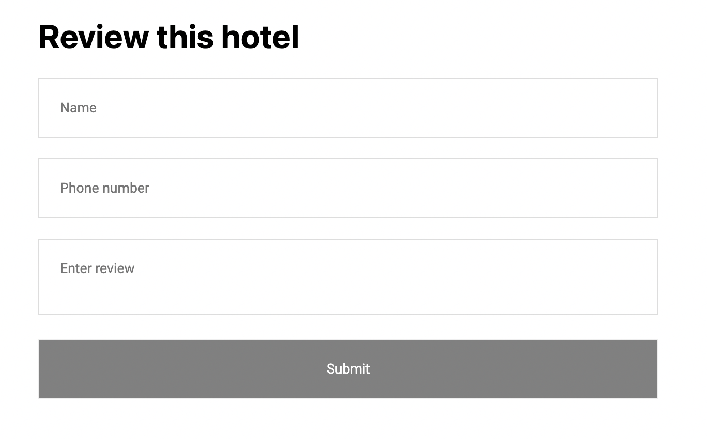


You can fill it out with some information and then click **Submit**.

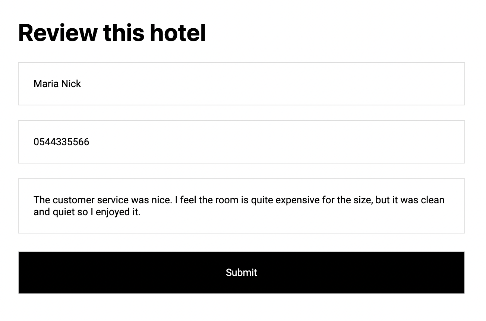
When you click **Submit**, the information is saved to a database, as shown below.

```
[
  {
    "name": "Maria Nick",
    "number": "0544335566",
    "review": "The customer service was nice. I feel the room is quite expensive for the size, but it was clean and quiet so I enjoyed it.",
    "label": "positive"
  }
]
```

We will be calling a Cohere AI Classification model to analyze reviews. In this case, it predicts that this is a positive one.

Here’s a video demo:

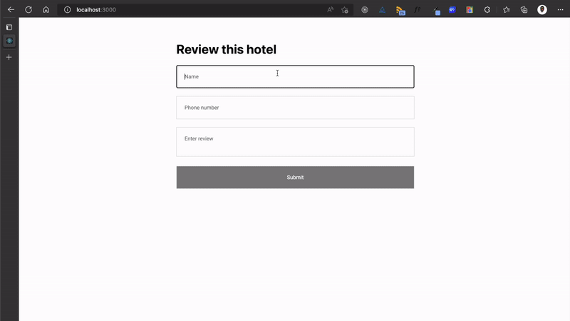


# Integrating Cohere into Next.js

This tutorial won’t show you how to build the Next.js app. It uses a simple Next.js app with the Index page showing a form that accepts three inputs: name, phone number, and review.

You can find the source code for this front-end project in [this repository](https://github.com/cohere-ai/samples/tree/main/nlp-nextjs?ref=txt.cohere.com) and clone it if you want to follow along.

Using Cohere, you can [train your system](/text-classification?ref=txt.cohere.com&__hstc=14363112.89f2baed82ac4713854553225677badd.1682345384753.1682525878579.1682537582485.12&__hssc=14363112.3.1682537582485&__hsfp=2014138109) to classify the review the user sends as positive or negative sentiment without having to prepare a huge dataset. As a company, you can then perform other operations like informing the support department or programmatically sending the user an email.


# Setting Up Cohere

Cohere provides many language processing features. You’ll make use of the [classification feature](https://cohere.ai/classify?ref=txt.cohere.com&__hstc=14363112.89f2baed82ac4713854553225677badd.1682345384753.1682525878579.1682537582485.12&__hssc=14363112.3.1682537582485&__hsfp=2014138109) in this tutorial.

To use Cohere, the first step is to create an account by visiting the [registration page](https://dashboard.cohere.com/register?ref=txt.cohere.com&__hstc=14363112.89f2baed82ac4713854553225677badd.1682345384753.1682525878579.1682537582485.12&__hssc=14363112.3.1682537582485&__hsfp=2014138109).

After creating your account, you have access to a dashboard:

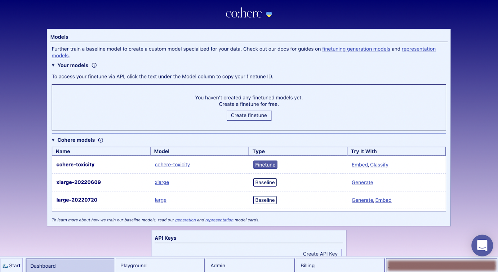


You can create different models on this dashboard, play around with presets for classifying data, and more.

Take note of your API key in this dashboard, as you use it later.

The tutorial starts by creating a simple back-end application that processes the form request from the Next.js app, and uses Cohere to analyze the review input. After analyzing the review and categorizing it into positive or negative, the back-end application saves the data to a database.

You can use any database you want for this. This tutorial uses a JSON file in the filesystem to store the data.

# Setting Up a Back-End Application with Node.js

This tutorial uses Node.js. You can use other languages for your back end, and [Cohere provides libraries for them](/api-reference/?ref=txt.cohere.com&__hstc=14363112.89f2baed82ac4713854553225677badd.1682345384753.1682525878579.1682537582485.12&__hssc=14363112.3.1682537582485&__hsfp=2014138109).

Create a back-end project folder on your device. Change your location into the directory in your terminal and run npm init.

Then, install the following dependencies:

- [Cohere-ai](https://www.npmjs.com/package/cohere-ai?ref=txt.cohere.com) is a Node.js library for interacting with the Cohere Language API
- [Express](https://www.npmjs.com/package/express?ref=txt.cohere.com) is an easy-to-use framework for creating servers and APIs in Node.js
- [CORS](https://www.npmjs.com/package/cors?ref=txt.cohere.com) is middleware for enabling cross-origin resource sharing (CORS) requests on the Express server
- [Dotenv](https://www.npmjs.com/package/dotenv?ref=txt.cohere.com) is for loading environment variables from a .env file

Now you can install Dotenv.

```
npm install cohere-ai express cors dotenv
```

Create a new file called index.js in your back-end project folder and paste the following code.

```
// imports at the top of the file
const cohere = require("cohere-ai")
const express = require("express")
const cors = require("cors")
require("dotenv").config()

// express app declaration after the imports
const app = express()

// middlewares after calling express()
app.use(cors())
app.use(express.json())

// at the end of the file
app.listen(8000)
```

This server runs on port 8000 when Node executes this file. By using the cors and express.json methods as middleware, you can create your APIs.

Next, you initialize Cohere in your application. You’ll need your API key for this, so go back to [your dashboard](https://dashboard.cohere.com/?ref=txt.cohere.com&__hstc=14363112.89f2baed82ac4713854553225677badd.1682345384753.1682525878579.1682537582485.12&__hssc=14363112.3.1682537582485&__hsfp=2014138109) to retrieve this key.  
Then, create a new file in your folder called .env. In that file, paste the following:

```
API_KEY=xxx
```

Replace the xxx in this file with your API key. Next, go back to index.js and initialize the Cohere API with this key:

```
cohere.init(process.env.API_KEY)
```

Before you can start to classify, you first need to set up your database. As stated earlier, this simple database saves data to a JSON file. Create a reviews.json file to serve as your database, and add an empty array into this file.

```
[]
```

Next, create some utility functions for adding data to this file. Create a new file called utils.js with the following code.

```
const fs = require("fs")

function readJsonFile() {
  const array = JSON.parse(fs.readFileSync("./reviews.json", "utf-8"))
  return array
}

function writeJsonFile(data) {
  return JSON.stringify(fs.writeFileSync("./reviews.json", data))
}

exports.writeToJson = function (data) {
  const existingJson = readJsonFile()
  const updatedJson = JSON.stringify(existingJson.concat(data))
  writeJsonFile(updatedJson)
}
```

You have three functions in this file:

- readJsonFile, which parses the JSON in the JSON file
- writeJsonFile, which enables you to write data to the JSON file
- An exported writeToJson function, which uses the other two functions to add new JSON data to the JSON file  
  Then, you import this function to index.js.

```
const { writeToJson } = require("./utils")
```

With your database set up, when someone adds a review, your app stores the person’s name, phone number, review, and the prediction from Cohere for that review.

Now, you’re ready to integrate Cohere.

# Adding Sentiment Analysis to Analyze Reviews

In Cohere, you can build a classifier by preparing a set of examples and saving them as a preset. Presets are datasets from which your model learns and applies the acquired knowledge to new inputs, determining what label (or category) to assign to the input.

You can create this dataset in your source code or in a table in the Cohere Playground and export the code afterward (it’s easier in the Playground).

For this tutorial, use a preset with five positive and five negative hotel reviews to train your model. The minimum data for a label is five, so you can add more if you want. The more data to train your model, the more accurate the analysis is when predicting an input category.

For this tutorial, you use the **Playground** page and the **Classify** section:

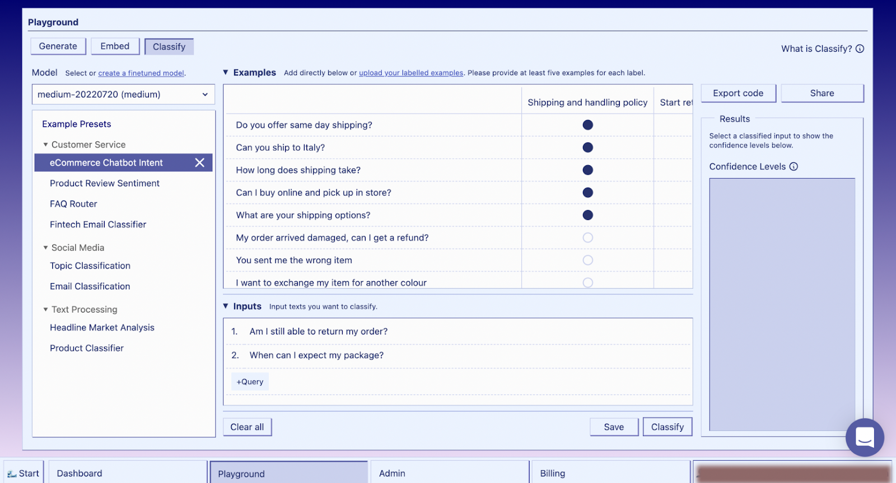


Below are the labels for this preset.

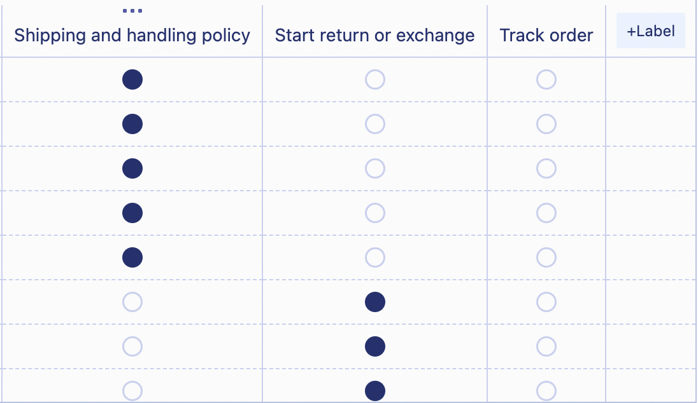
In the screenshot prior to the one above, there is a demo preset called **eCommerce Chatbot Intent** in the **Example Presets** area. This preset is to train the model, so that the model can accurately analyze the input label. By clicking **Classify**, you get the prediction results for the input: “Am I still able to return my order?”

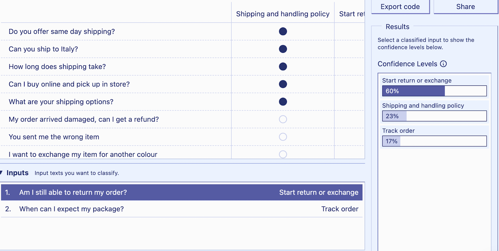


Additionally, you get the prediction results for: “When can I expect my package?”


Create a preset for your hotel reviews.

Click **Save** on the preset and enter a name like “Hotel Reviews.”

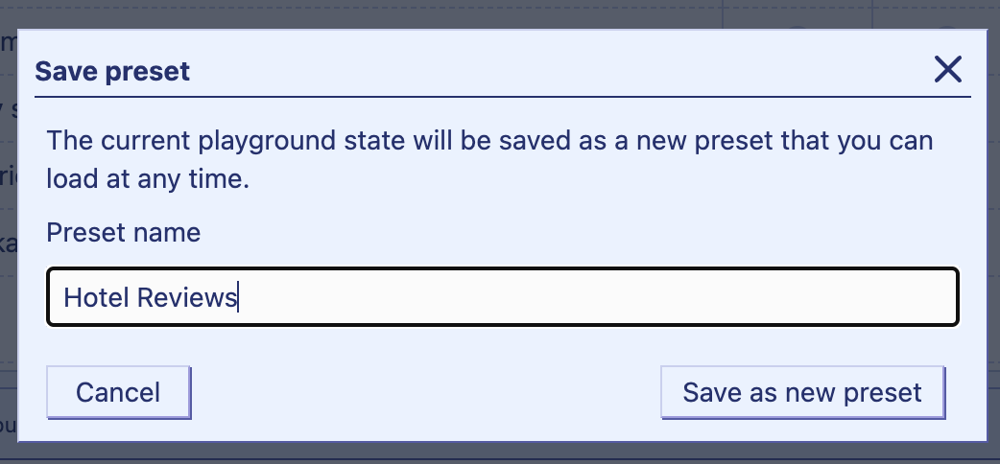


First, update the labels of this new preset by clicking each and editing the content. You can delete the last column since you only need two categories: positive and negative.


Next, delete all the rows in this preset.

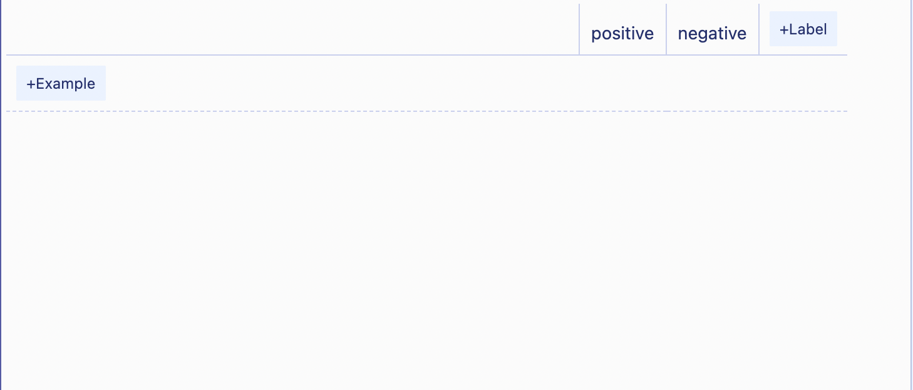
Now, you can enter the data for this preset. You can use any data of your choice, but here is the data for this tutorial. You can copy and paste the demo data or you type in your own data.

|                                                                                                                    | positive | negative |
| :----------------------------------------------------------------------------------------------------------------- | :------- | :------- |
| The reception was great. I love how your staff welcomed us and showed us our rooms.                                | X        |          |
| Your staff took us on tour around the hotel, and I really enjoyed that.                                            | X        |          |
| The bedroom we stayed in was very peaceful. Also loved the paintings on the walls.                                 | X        |          |
| The amenities in the room were great, and the rooms were also clean.                                               | X        |          |
| I have stayed in many hotels, but this one tops it for me. Enjoyed the customer service and the clean rooms.       | X        |          |
| The room was not neat or clean. There was no air conditioning system.                                              |          | X        |
| The Wi-Fi in the hotel was poor. I couldn’t use the internet while I was there.                                    |          | X        |
| The lady who showed us our room had a very rude attitude and didn’t care about our complaints while we were there. |          | X        |
| Poor customer service, and the rooms had a weird smell even though they looked clean.                              |          | X        |
| The air conditioning system was faulty, so the room was overheated. I didn’t enjoy my stay.                        |          | X        |

The preset should look like this on your dashboard:

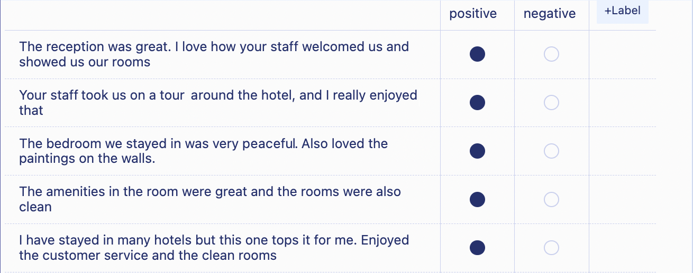
Test this preset by passing some inputs. This example uses “The room didn’t look tidy for such a high cost,” “Ugly looking rooms, but the cost is very cheap, so my expectations were not really high,” and “The room I stayed in was serene and beautiful.” Below are the confidence level results for each.

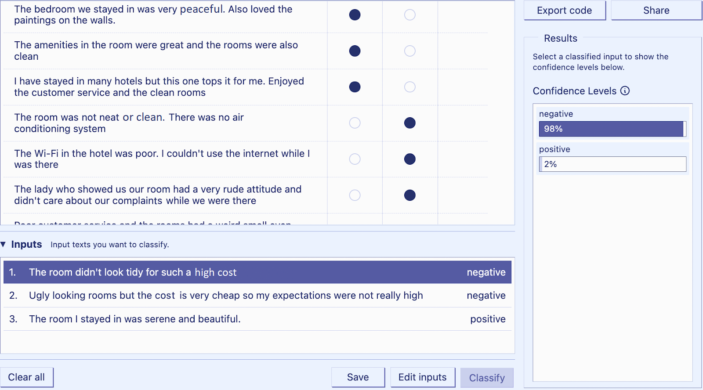
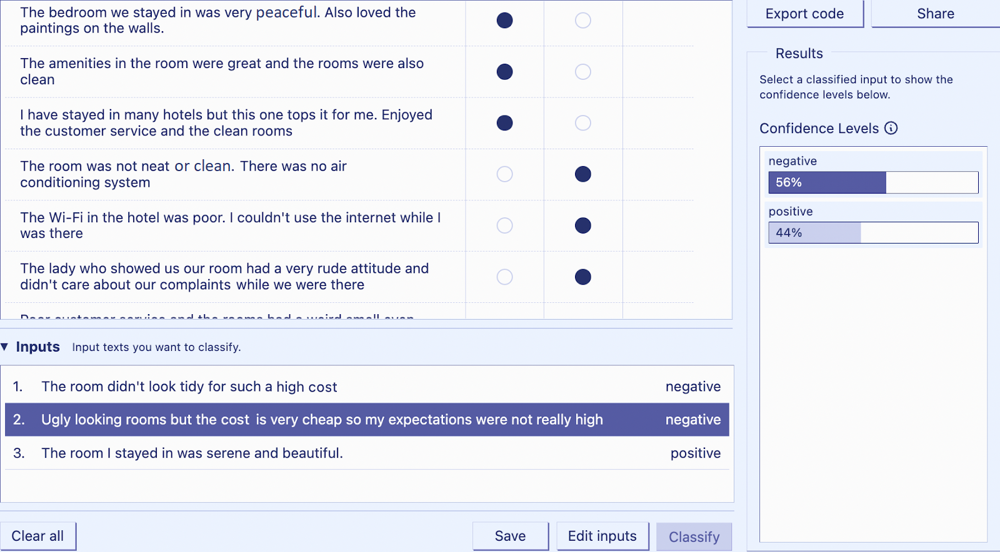
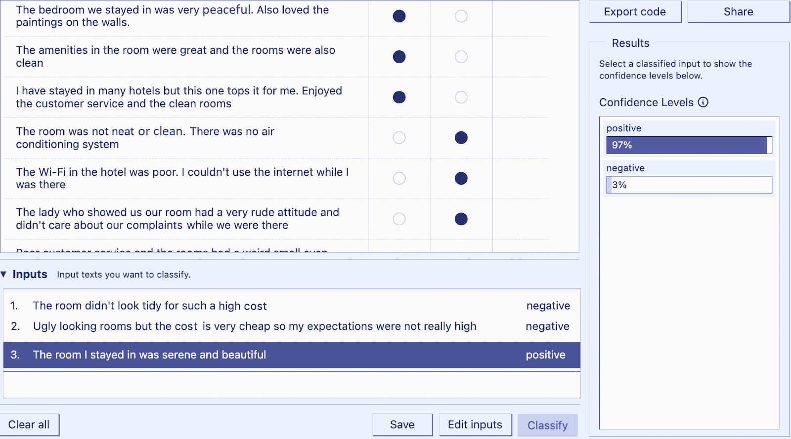
# Connecting Cohere to Your Next.js App

On the dashboard, click **Export code**, and select the **js** tab.

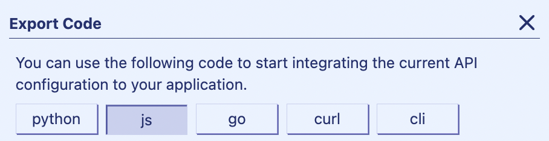
Then copy the code and paste it into your index.js file. When formatted, it looks like this:

```
const cohere = require('cohere-ai');
cohere.init('{apiKey}');
(async () => {
  const response = await cohere.classify({
    model: "medium",
    taskDescription: "",
    outputIndicator: "",
    inputs: [
      "The room didn't look tidy for such a high cost",
      "Ugly looking rooms but the cost is very cheap so my expectations were not really high",
      "The room I stayed in was serene and beautiful.",
    ],
    examples: [
      {
        text: "The reception was great. I love how your staff welcomed us and showed us our rooms",
        label: "positive",
      },
      {
        text: "Your staff took us on a tour around the hotel, and I really enjoyed that",
        label: "positive",
      },
      {
        text: "The bedroom we stayed in was very peaceful. Also loved the paintings on the walls.",
        label: "positive",
      },
      {
        text: "The amenities in the room were great and the rooms were also clean",
        label: "positive",
      },
      {
        text: "I have stayed in many hotels but this one tops it for me. Enjoyed the customer service and the clean rooms",
        label: "positive",
      },
      {
        text: "The room was not neat or clean. There was no air conditioning system",
        label: "negative",
      },
      {
        text: "The Wi-Fi in the hotel was poor. I couldn't use the internet while I was there",
        label: "negative",
      },
      {
        text: "The lady who showed us our room had a very rude attitude and didn't care about our complaints while we were there",
        label: "negative",
      },
      {
        text: "Poor customer service and the rooms had a weird smell even though they looked clean",
        label: "negative",
      },
      {
        text: "The air conditioning system was faulty, so the room was very hot. I didn't enjoy my stay",
        label: "negative",
      },
    ],
  })
  console.log(
    `The confidence levels of the labels are ${JSON.stringify(
      response.body.classifications
    )}`
  )
})()
```

This is an [immediately invoked function expression](https://developer.mozilla.org/en-US/docs/Glossary/IIFE?ref=txt.cohere.com) (IIFE) which takes in a preset (in the examples property), trains the model, and uses the gained knowledge to classify the inputs in the inputs array. If you execute this file using index.js, you get this result:

```
// The confidence levels of the labels are
// [
//   ({
//     input: "The room didn't look tidy for such an expensive amount",
//     prediction: "negative",
//     confidences: [
//       { option: "positive", confidence: 0.021679481 },
//       { option: "negative", confidence: 0.97832054 },
//     ],
//   },
//   {
//     input:
//       "Ugly looking rooms but the pay is very cheap so my expectations were not really high",
//     prediction: "negative",
//     confidences: [
//       { option: "positive", confidence: 0.43592778 },
//       { option: "negative", confidence: 0.56407225 },
//     ],
//   },
//   {
//     input: "The room I stayed in was serene and beautiful.",
//     prediction: "positive",
//     confidences: [
//       { option: "positive", confidence: 0.9702344 },
//       { option: "negative", confidence: 0.029765626 },
//     ],
//   })
// ]
```

You can see the first input having a prediction of “negative,” the second having “negative,” and the third having “positive.”

Now, create an API in the index.js file, which receives the name, phone number, and review from the front end and uses the classify method of the Cohere library to predict the category of the user’s input.

First, refactor the exported code from Cohere’s playground to look like this:

```
const POSITIVE_SAMPLES = [
  "The reception was great. I love how your staff welcomed us and showed us our rooms",
  "Your staff took us on a tour around the hotel, and I really enjoyed that",
  "The bedroom we stayed in was very peaceful. Also loved the paintings on the walls.",
  "The amenities in the room were great and the rooms were also clean",
  "I have stayed in many hotels but this one tops it for me. Enjoyed the customer service and the clean rooms.",
]

const NEGATIVE_SAMPLES = [
  "The rooms were not neat or welcoming. There was no air conditioning system",
  "The Wi-Fi in the hotel was poor. I couldn't use the internet while I was there",
  "The lady who showed us our room had a very rude attitude and didn't care about our complaints while we were there.",
  "Poor customer service and the rooms had a weird smell even though they looked clean.",
  "The air conditioning system was faulty, so the room was very hot. I didn't enjoy my stay",
]

async function classifyReview(input) {
  const response = await cohere.classify({
    model: "medium",
    taskDescription: "",
    outputIndicator: "",
    inputs: [input],
    examples: POSITIVE_SAMPLES.map((sample) => ({
      text: sample,
      label: "positive",
    })).concat(
      NEGATIVE_SAMPLES.map((sample) => ({ text: sample, label: "negative" }))
    ),
  })

  return response.body.classifications[0]
}
```

Here, you have the POSITIVE_SAMPLES array with positive review strings and the NEGATIVE_SAMPLES array with negative review strings.

Then, you create a classifyReview function that receives an input argument. By passing the POSITIVE_SAMPLES and NEGATIVE_SAMPLES arrays to the examples property, you can train the model to predict the label of the input passed to this function. The classification for the input is the first value in the classifications array from Cohere.

Now, connect to the API.

```
app.post("/", async (req, res) => {
  const { name, number, review } = req.body

  const classificationResult = await classifyReview(review)
  const label = classificationResult.prediction

  const data = { name, number, review, label }

  writeToJson(data)

  res.json({ message: "Successfully submitted" })
})
```

This post API route receives the name, number, and review data, then calls the classifyReview function with the review argument. It saves the prediction to the JSON file using the writeToJson function you created earlier.

Now, run your server by executing node index.js, then go to the front-end application and run npm run dev.

Fill out the form and click **Submit**.

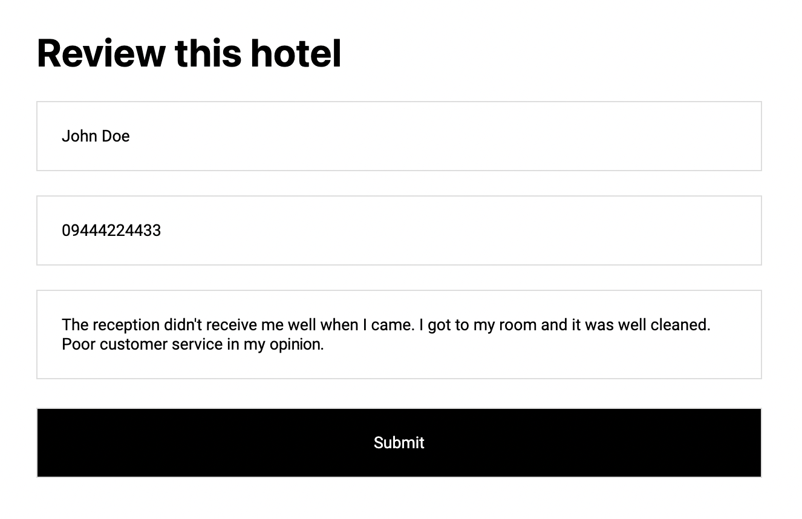
The review entered is: “The reception didn’t receive me well when I came. I got to my room, and it was well cleaned. But poor customer service in my opinion.”  
Clicking **Submit** saves the inputs to the JSON file.

```
[
  {
    "name": "John Doe",
    "number": "09444224433",
    "review": "The reception didn't receive me well when I came. I got to my room and it was well cleaned, but poor customer service in my opinion.",
    "label": "negative"
  }
]
```

You can try this with as many examples as you want.

The complete source code for the front- and back-end code is in [this repository](https://github.com/cohere-ai/samples/tree/main/nlp-nextjs?ref=txt.cohere.com).

# Conclusion

By integrating Cohere into your Next.js application, you can trigger some post-operations based on the predicted category of the user’s review. You can use Cohere’s NLP for many other use cases, including chatbots, automated emails, and more.
