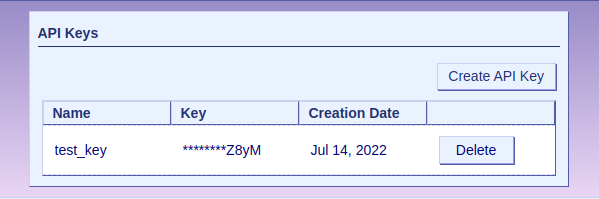
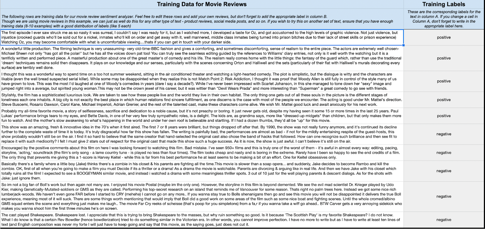
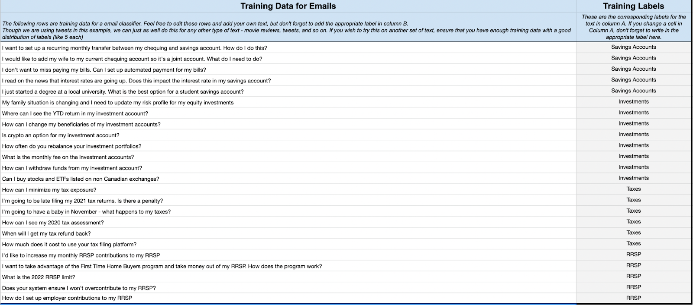
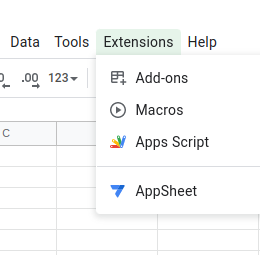
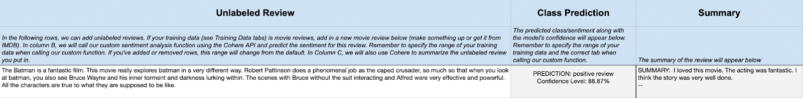

Software will come and go but there’s one thing that has always stayed the same since the start of the personal computing era - the spreadsheet. Love it or hate it, the spreadsheet is the backbone of many jobs and tasks, from organizing your day to managing the finances of a country.

And yet, the core functionality has always stayed the same. Yes, there’s been some nice bells and whistles added over the years, like images and graphs, but don’t you wish your spreadsheet could do more?

Well, with Cohere’s large language models, that’s now possible. By integrating Cohere’s language AI into your Google documents, you can now perform advanced text analysis such as categorization, sentiment analysis, summarization, and more.

This tutorial demonstrates how to use Cohere and Google Sheets Apps Script to build three custom natural language processing (NLP) functions that add text classification, sentiment analysis, and summarization features to your Google Sheets documents.

We’ll start by creating a Google Sheet (or you can simply duplicate the one we’ve set up), filling it with training data such as movie reviews, product reviews, and emails, and then building custom functions to classify, detect sentiment, and summarize any new text we add. We’ll use Apps Script, a scripting language based on JavaScript, to create these custom functions and call the Cohere API.

When everything is set up, you will be able to enter any text, like a new product review or email, and the spreadsheet will automatically tell you the classification (based on how we trained it), sentiment, and summary.

Here’s a video showing you how it will work -

<iframe
  src="https://www.loom.com/embed/06a5a5fc1747493fbb80fe0edc8c1b8a"
  width="100%"
  height="300px"
  frameBorder="0"
  allowFullScreen
></iframe>

And you can play around with [the final version here](https://docs.google.com/spreadsheets/d/1DBrp0O7JkeMHJ9nVNOHzgTVmZKXCEjPAlAdPM-C0X7s/edit?ref=txt.cohere.com#gid=11645659).

Alright, let's get started. Here's what we'll be doing:

- Creating the Cohere API Key
- Creating the Google Sheet
- Adding the Classify functionality
- Adding the Summarize functionality
- Tying it all together

# Creating the Cohere API Key

The Cohere API is what gives our spreadsheet superpowers. Create a free account if you haven’t already.

When you first access Cohere, you’ll have the opportunity to follow an introductory guide for using the Generate endpoint. The guide also shows you how to generate an API key.

If you haven’t yet created an API key, do so now by scrolling down to the API Keys section of the Dashboard page.



Click the Create API Key button and enter the required details. Store your API key safely after the generation. You’ll need this key in the next steps.

# Creating the Google Sheet

We’ve already created a Google Sheet with the instructions, training data, custom functions, and interactive demo here - [Access the Google Sheet](https://docs.google.com/spreadsheets/d/1DBrp0O7JkeMHJ9nVNOHzgTVmZKXCEjPAlAdPM-C0X7s/edit?ref=txt.cohere.com#gid=11645659)

In the steps ahead, we’ll walk you through how we built all of this. You can either follow along and start from scratch, or you can simply duplicate the sheet we created since it already contains our training data.

Whether you’re starting from scratch or using our sheet, you’ll want to fill it with some training data, like in the screenshot below.



In this example, we’re using Movie Reviews as our training data. You’ll notice we have two columns, one for the review and the other for the class or sentiment - positive or negative.

These are real movie reviews from the internet, and we have pre-labeled them. If you want to use your own data, ensure that they are labeled and there are at least 5 of each label. If you just want to predict sentiment, you just need 10 examples, with 5 each for positive and negative.

If you want to classify into multiple topics, you need 5 examples of each topic. In the Google Sheet we created, we’ve added data for an email classifier that classifies a dataset of bank emails into four categories - savings, investments, taxes, and RRSPs.



# Adding the Classify Functionality

Now we want to train our AI on the training data, and then automatically classify any new data we add to our spreadsheet.

Open the Apps Script environment from your Google Sheets. Click the **Extensions** tab. From the menu that appears, click the **Apps Script** option, which will take you to the environment.



Remember the API key you generated earlier? We’ll need that right now because we’re going to start by defining a constant to store it.

```
Const TOKEN = ‘<insert-api-key-here>’
```

Do not share this API key. If you duplicate our Google Sheet, you’ll notice that we haven’t left our key in there either, so you’ll need to add yours to make this work.

Let’s build our Classify function!

```
function classify(s_args, s_input) {
}
```

This is a basic function definition taking in two parameters. The first one (s_args) is the range of cells for our training data. The second one (s_input) is the new text we want to label or classify.

Let’s start adding our logic between the curly braces. First, we want to extract the training data from s_args and package it into something that the Cohere API can ingest.

```
let inputs = [s_input];
let examples = [];
for (let i = 0; i< s_args.length; i++) {
    //this is assuming label is always the 2nd parameter
    examples.push({"text" : s_args[i][0] , "label" : s_args[i][1]})
}
const data = {
    'examples': examples,
    'inputs' : inputs
};
```

Our ‘data’ package is ready with a list of labeled ‘examples’ and the unlabeled ‘input’ we want to classify.

Let’s call the Cohere API to classify this. We’re going to pass through our data package along with our authentication headers and other metadata to the Cohere Classify endpoint and then store the response in an aptly named ‘response’ object.

```
const options = {
    'headers' : { 'Authorization' : 'Bearer ' + TOKEN },
    'method' : 'post',
    'model' : 'medium',
    'contentType': 'application/json',
    'payload' : JSON.stringify(data)
};
const response = UrlFetchApp.fetch('https://api.cohere.ai/classify', options);
```

Now let’s parse the response and extract the class predictions and our confidence level.

```
let jsonObj = JSON.parse(response.getContentText());
let classicationObj = jsonObj.classifications[0];
let ourPrediction = classicationObj.prediction;
let confidencesArr = classicationObj.confidences;
let confidenceLvl;
if (ourPrediction == "Positive") {
    //use the second confidence level
    confidenceLvl = (parseFloat(confidencesArr[1].confidence) * 100).toFixed(2) + "%";
} else {
    //use the first confidence level
    confidenceLvl = (parseFloat(confidencesArr[0].confidence) * 100).toFixed(2) + "%";
}
```

Finally, we output this back into the cell which we call the function.

```
let displayString = "PREDICTION: " + ourPrediction + " review\n" + "Confidence Level: " + confidenceLvl + "\n";
return displayString;
```

# Adding the Summarize Functionality

The methodology is quite similar for summarizing, except we’re using the Generate Endpoint instead of the Classify Endpoint.

In the classification function, we passed in labeled examples. For summarization, we want to give examples of text and its summary as well. To keep things simple, we’ve hard-coded this into the function but you can make it dynamic as we did with classification (except you’ll need to provide your own pre-written summaries as training examples).

```
function summarize(cell_value) {
}
```

As you can see, we’re taking only one input, the text we want to summarize, as our parameter, and the following logic goes between the curly brackets.

```
let raw = JSON.stringify({
    "prompt": "TEXT: Loved it loved the style. I didn’t think I would love it. I didn’t love the trailer, but when I saw the whole movie, I was really impressed. I liked all the short stories, the mix of black and white, the humour, and comedy that was present in this movie.\n\nTLDR: I loved it, and I like all the stories in this movie.\n--\nTEXT: I read on the news that interest rates are going up. Does this impact the interest rate in my savings account?\n\nTLDR: Will rising interest rates impact my savings account?\n--\nTEXT: I went online for information about Dockers Khaki pants. The size my husband wears are very hard to find in stores. I was very impressed with the selection I had and he was thrilled to have all these pants without having them taken up in the length. The delivery was quick (especially during Christmas) and I really appreciate all the effort made to send us the selections we chose.\n\nTLDR: I was impressed by their selection and quick delivery. My husband was thrilled to have pants in his size.\n--\nTEXT: My family situation is changing and I need to update my risk profile for my equity investments.\n\nTLDR: I need to update my investment risk profile\n--\nTEXT: " + cell_value + "\n\nTLDR:",
    "max_tokens": 50,
    "temperature": 0.7,
    "k": 0,
    "p": 1,
    "frequency_penalty": 0,
    "presence_penalty": 0,
    "stop_sequences": [
        "--"
    ],
    "model": "xlarge",
    "return_likelihoods": "NONE"
});
```

The above code is where we hard-code our training examples as a prompt and package it up with other hyperparameters like temperature, max tokens, and so on.

The **Generate** endpoint has several hyperparameters, some of which are listed below:

- **Number of tokens** — This is used to set the number of tokens that will be generated.
- **Temperature** — This is used to control how randomly the model chooses tokens for a text generation. For this tutorial, use lower values as they give more accurate answers.
- **Top-K** — This is used to select the tokens with the highest probabilities of model output.
- **Top-P** — This selects the number of tokens to consider whose probabilities add up to Top-P.
- **Frequency and Presence penalty** — This is used to reduce token repetitiveness by applying penalties. Frequency applies penalties depending on how many times a token appears while Presence applies the penalties equally without bias.
- **Return likelihoods** — This, as the name suggests, is used to set if and how token likelihoods should be returned in the response.

You can [learn more about this here](https://cohere.com/blog/llm-parameters-best-outputs-language-ai/).

You’ll also notice we pass ‘--’ for our stop sequence hyperparameter. If you look carefully at the prompt, you’ll notice we use this sequence between our examples. These let Cohere know when to stop generating.

Let’s send this package, along with our authentication and metadata to the Cohere Generate Endpoint.

```
let requestOptions = {
'method': 'post',
'muteHttpExceptions': true,
'contentType': 'application/json',
'headers': {
'Authorization': 'Bearer ' + TOKEN
},
'payload': raw,
redirect: 'follow'
};
let response = UrlFetchApp.fetch("https://api.cohere.ai/generate", requestOptions)
```

And finally, let’s parse the response and output the summary.

```
let jsonObj = JSON.parse(response.getContentText());
let summarizedTxt = "SUMMARY: " + jsonObj.text + "\n";
return summarizedTxt;
```

# Tying It All Together

Now we can finally use our custom functions on any text we want!

In the ‘Interactive Demo’ tab of our Google Sheet, we’ve set up 3 columns as shown below.



The first column is our unlabeled text. This could be a movie review, product review, email, or anything else. In this example, we’re using movie reviews and I’ve pasted a review I found of The Batman in the first column.

In the second column, we want to call our classify function -

```
=classify('Movie Training Data'!$A$3:$B$12,A3)
```

Recall that this function takes in two parameters. The first one is our training data. Since I’m classifying movie reviews, my training data is in the Movie Training Data tab between cells A3 and B12. If we were doing product reviews, I would point it to where my product reviews are, and so on.

The second parameter is A3, which is our Batman review. When we hit enter, it predicts the class as you can see in the screenshot.

In the third column, we call our summarize function -

```
=summarize(A3)
```

We’re simply taking cell A3, our Batman review, and outputting the summary as you can see in the screenshot above.

# Conclusion

Dealing with numbers in a spreadsheet has always been easy, but the same couldn’t be said of text, until now!

With Cohere’s natural language processing and understanding capabilities, you can give your spreadsheets superpowers, saving you tons of time and headache.
