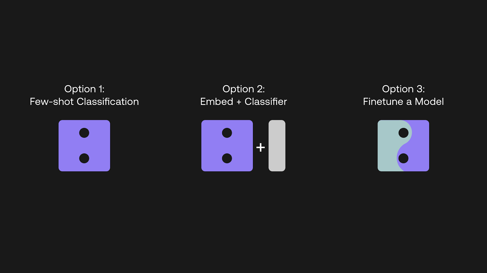
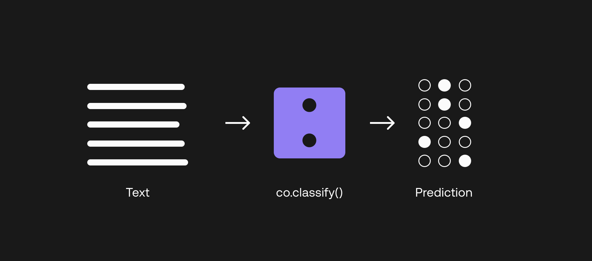
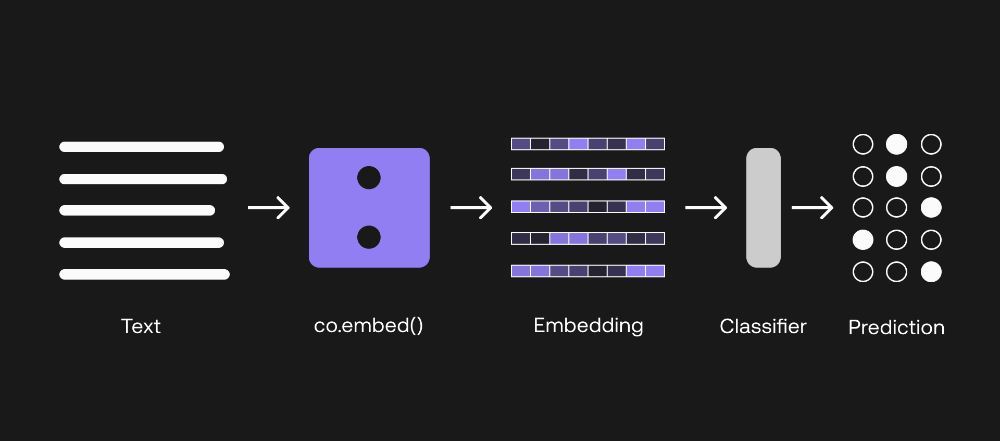
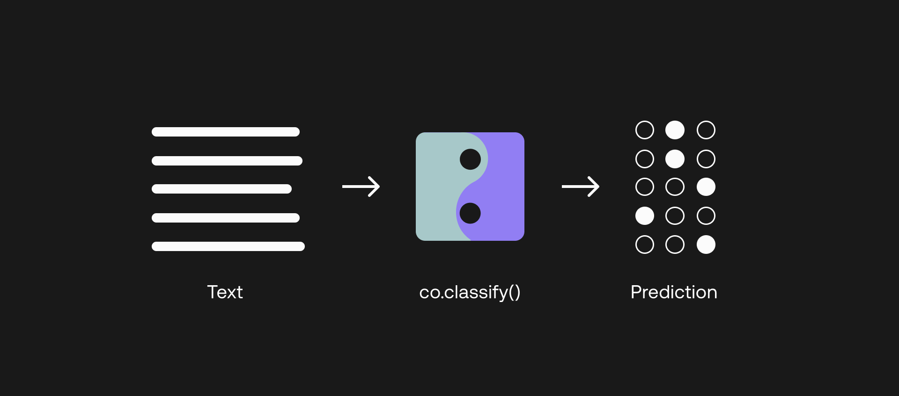
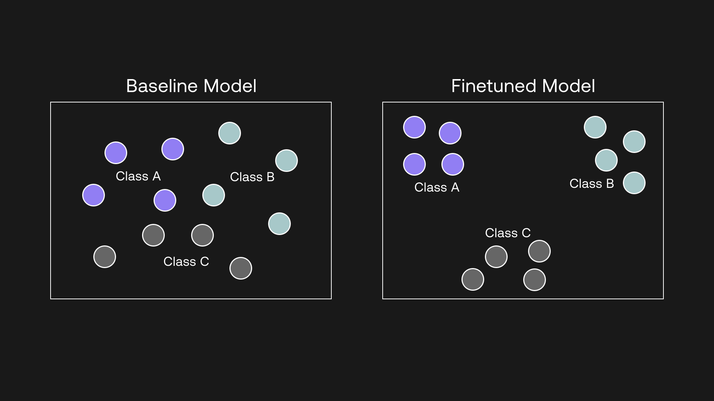
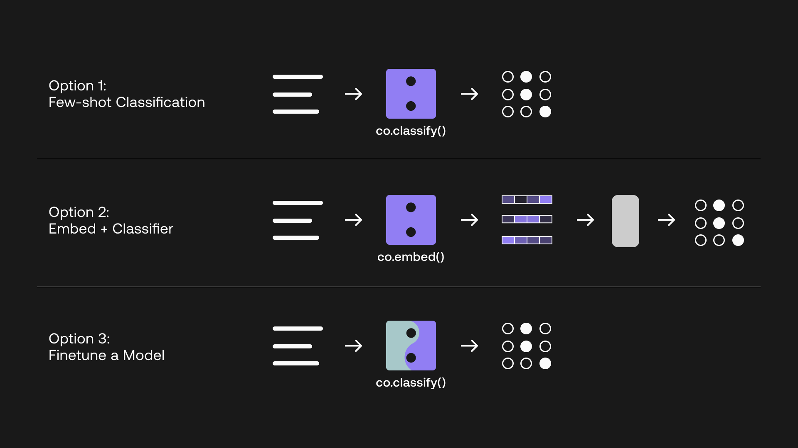

# Introduction

In one of the previous chapters, you've learned to classify text using the [classify](/reference/classify) endpoint. However, there are more ways one can use LLMs for classification tasks. In this chapter, you'll learn two more ways to classify, using embeddings and finetuning. Then you'll be able to compare the three of them based on performance.

TEST TEST TEST CHECK STAGING TEST TEST

# Text Classification with LLMs

In the text classification space, a trend is emerging where developers and teams are leveraging large language models (LLM) when building an AI-based classifier system. This is opposed to building a system from scratch on their own, which first, requires the team to have the know-how in machine learning and engineering, and second, requires a huge amount of labeled training data to build a working solution.

With LLMs, instead of having to prepare thousands of training data points, you can get up and running with just a handful of examples, called few-shot classification (more on this later). Think about the sudden drop in the associated costs, time, and effort to collect and build a training dataset. This means that more teams can now think about deploying their own text classification systems, whereas they would not have considered it before.

Having said that, you probably want to have some level of control over how you train a classifier, and especially, how to get the best performance out of a model. For example, if you do happen to have a large dataset at your disposal, you will want to make full use of it when training a classifier. With the Cohere API, we want to give this flexibility to developers.

In this chapter, we will look at three different options for building a text classifier with the Cohere API. By the end, you will be able to evaluate which of these options best suits your objectives.


As an overview, here are the three options:

- Few-shot classification with the Classify endpoint
- Build your own classifier with the Embed endpoint
- Finetuning a model




This article shows snippets of a Python notebook which you can find the complete version below.

<Note> 
View the complete notebook [here](https://colab.research.google.com/github/cohere-ai/notebooks/blob/main/notebooks/Three_Ways_to_Build_a_Text_Classifier_with_Cohere.ipynb?ref=txt.cohere.com).
</Note>

# Prepare the Dataset

For our demonstration, we'll use a subset of the Airline Travel Information System (ATIS) intent classification [dataset](https://www.kaggle.com/datasets/hassanamin/atis-airlinetravelinformationsystem?select=atis_intents_train.csv&ref=txt.cohere.com) as an example \[[source](https://aclanthology.org/H90-1021/?ref=txt.cohere.com)]. This dataset consists of inquiries coming into airline travel inquiry systems. Here are a few example data points:


Our goal is to train the classifier so it can predict the class of a new customer inquiry out of eight classes, as follows:

- atis_flight
- atis_airfare
- atis_airline
- atis_ground_service
- atis_abbreviation
- atis_quantity
- atis_aircraft
- atis_flight_time

For demonstration purposes, we’ll take just a small portion of the dataset: 1,000 data points in total. The first thing we need is to create a training dataset, to be used for building the classifier, and a test dataset, to be used for testing the classifier performance. We will use 800 and 200 data points for these datasets respectively.

```
# Load the dataset to a dataframe
df = pd.read_csv("atis_subset.csv")

# Split the dataset into training and test portions
X, y = df["query"], df["intent"]
X_train, X_test, y_train, y_test = train_test_split(X, y, test_size=200, random_state=21)
```

And to prepare for the coming sections, let’s set up Cohere’s Python SDK client.

```
import cohere
co = cohere.Client(“api_key”)
```

# Option 1 - Few-Shot Classification with the Classify Endpoint




With LLMs, one option we have is to build a classifier via few-shot classification. Few-shot here means that we just need to supply a few examples per class to have a decent classifier working. The reason it works is because LLMs are extremely large models that have been pre-trained with a huge amount of text data, capturing deep context about language. What’s needed now is to just prompt the model with the specific task we need it to perform, which is what we are doing here.

Let’s see how to do this. With Cohere’s [Classify endpoint](/classify-reference/?ref=txt.cohere.com&__hstc=14363112.89f2baed82ac4713854553225677badd.1682345384753.1682447142806.1682463578843.8&__hssc=14363112.4.1682463578843&__hsfp=2014138109), the “training” dataset is referred to as examples. The minimum number of examples per class is 5, where each example consists of a text (in our case, the `query`), and a label (in our case, the `label`).

At the time of writing, there is a limit of 50 examples for few-shot classification. So in our case, let’s create 6 examples per class, making it 48 examples in total. We won’t need all of the training data points that we’d created earlier — these are needed later for the other two options. So, we just need to sample 40 out of the 800 as shown below:

```
# Set the number of examples per category
EX_PER_CAT = 6

# Create list of examples containing texts and labels - sample from the dataset
ex_texts, ex_labels = [], []
for intent in intents:
  y_temp = y_train[y_train == intent]
  sample_indexes = y_temp.sample(n=EX_PER_CAT, random_state=42).index
  ex_texts += X_train[sample_indexes].tolist()
  ex_labels += y_train[sample_indexes].tolist()
```

Now that we have the examples ready, we can build the classifier via the Python SDK. First, we use the `Example` module to collate the examples in the format required by the SDK. Next, we call the Classify endpoint via the `co.classify()` method. The code looks as follows.

```
# Collate the examples via the Example module
from cohere.responses.classify import Example
examples = list()
for txt, lbl in zip(ex_texts,ex_labels):
  examples.append(Example(txt,lbl))
  
# Perform classification
def classify_text(text,examples):
  classifications = co.classify(
    model='medium',
    inputs=[text],
    examples=examples
    )
  return classifications.classifications[0].prediction
```

Now that the classifier is ready, we can test the 100 data points on it and get the class predictions.

```
# Generate classification predictions on the test dataset (this will take a few minutes)
y_pred = X_test.apply(classify_text, args=(examples,)).tolist()
```

We’ll use Accuracy and F1-score to evaluate the classifier against this test dataset (more on how to [evaluate a classifier here](https://txt.cohere.com/classification-eval-metrics/).

```
# Compute metrics on the test dataset
accuracy = accuracy_score(y_test, y_pred)
f1 = f1_score(y_test, y_pred, average='weighted')
```

And we got 83.00% `Accuracy` and 84.66% `F1-score`. Considering we provided just six examples per class, this outcome is quite impressive. But there’s definitely room for improvement.

# Option 2 -  Build Your Own Classifier with the Embed Endpoint




\\While we got a decent result in the previous section, sometimes we need more. And remember, we were only using a small subset of the data for this demonstration, and in the real world, it’s going to be much more challenging. So, we still need to find ways to improve on it.

Let’s say you actually have a decent amount of training dataset at your disposal. In the remaining two options, we’ll look at how we can use these data points to build a potentially better-performing classifier.

In this section, we’ll look at option number 2, which is how we can utilize the Embed endpoint to build a classifier. Do note that this section does require a little bit of machine learning understanding to come up with a model.

This time, we’ll use the full 800 training data points that we prepared earlier. The first step is to turn the training and test inputs (i.e., the airline queries) into embeddings.

What exactly are embeddings? You can read [more about it in this chapter](https://cohere.com/llmu/text-embeddings/), but in summary, it is a set of numbers that represent what a piece of text means, capturing its context and semantics. In our case, we are using the medium model, which generates embeddings of size 2096. So for each text we input, we will get an embedding consisting of 2096 numbers, which looks like the following:

**[0.20641953, 0.35582256, 0.6058123, -0.058944624, 0.8949609, 1.2956009, 1.2408538, -0.89241934, -0.56218493, -0.5521631, -0.11521566, 0.9081634, 1.662983, -0.9293592, -2.3170912, 1.177852, 0.35577637, ... ]**

We implement this by calling the Embed endpoint via the `co.embed()` method. We then transform the embeddings into an array, which we’ll need in the next step. It looks as follows:

```
# Get embeddings
def embed_text(text):
  output = co.embed(
                model='medium',
                texts=text)
  return output.embeddings

# Embed and prepare the inputs
X_train_emb = np.array(embed_text(X_train.tolist()))
X_test_emb = np.array(embed_text(X_test.tolist()))
```

For the next step, we are going to build a classification model using these embeddings as inputs. We’ll use the Support Vector Machine (SVM) algorithm, utilizing the implementation in the scikit-learn library. The method is called `SVC`, which you can [read all about it here](https://scikit-learn.org/stable/modules/generated/sklearn.svm.SVC.html?ref=txt.cohere.com).

The following shows a snippet of our implementation (full version in the [notebook](https://colab.research.google.com/github/cohere-ai/notebooks/blob/main/notebooks/Three_Ways_to_Build_a_Text_Classifier_with_Cohere.ipynb?ref=txt.cohere.com#scrollTo=SAbu-iuGZg_3)). In summary, we fit the training dataset to the model, and then use this trained model to predict the classes of the test dataset.

```
# Initialize the model
svm_classifier = SVC(class_weight='balanced')

# Fit the training dataset to the model
svm_classifier.fit(X_train_emb, y_train_le)

# Generate classification predictions on the test dataset
y_pred_le = svm_classifier.predict(X_test_emb)
```

What we are doing here is to use the embeddings as the features to train a machine learning model. The model then learns about the mapping between the features, which contain the semantic information about the input texts, and the labels, which gives the information about the class each input text belongs to.

Again, we’ll use `Accuracy` and `F1-score` to evaluate the classifier against this test dataset. This time, we got 91.50% for Accuracy and 91.01% F1-score.

That's an improvement from the previous approach. But can we make it even better?

# Option 3 - Finetune a Model




Finetuning with the Cohere API is a powerful concept, and here’s the reason. In the previous section, we used the output of an Embed endpoint to build a classifier, but note — we were still using a baseline model. But with finetuning, you can actually alter the model itself and customize it according to your task.

This means that what you get is a custom model that’s finetuned to excel at a specific task, and potentially can outperform the previous two approaches we have seen. And this is what we are going to do in this section.

The more data points you have, the better, but as an example, we will finetune a model using the same 800 training data points we had prepared earlier.

[This documentation](/finetuning-representation-models?ref=txt.cohere.com&__hstc=14363112.89f2baed82ac4713854553225677badd.1682345384753.1682447142806.1682463578843.8&__hssc=14363112.4.1682463578843&__hsfp=2014138109) contains a step-by-step guide on how to finetune a _representation model_, which is the same kind of model behind the Embed endpoint. This article will therefore not cover the finetuning steps and will assume that you have already got a finetuned model ready.

When you finetune a representation model, behind the scenes, what happens is the model would pull examples of the same class closer to each other, and conversely, push examples from different classes further apart from each other. It does this by learning the relationship between the inputs (i.e., embeddings) and the outputs (labels), capturing the patterns within the data.




Once you have a model finetuned, get the model ID, which you can retrieve either [from the Playground](/finetune-troubleshooting?ref=txt.cohere.com&__hstc=14363112.89f2baed82ac4713854553225677badd.1682345384753.1682447142806.1682463578843.8&__hssc=14363112.4.1682463578843&__hsfp=2014138109#using-your-finetuned-model) or directly from your Cohere Dashboard.

To use this finetuned model, you can call the same Classify endpoint, via the _co.classify()_ method that we used earlier. The way you call the endpoint is the same, except now you enter the finetuned model UUID in the argument instead of the baseline version. Here is the code snippet, which as you can see, takes only a few lines.

```
# Perform classification using the finetuned model
def classify_text_finetune(text):
  classifications = co.classify(
    model='eeba7d8c-61bd-42cd-a6b5-e31db27403cc-ft',
    inputs=text
    )
  return classifications.classifications

# Generate classification predictions on the test dataset
y_pred_raw = classify_text_finetune(X_test.tolist())
y_pred = [y.prediction for y in y_pred_raw]
```

Notice that because the model has been finetuned with the training dataset, calling the Classify endpoint now doesn’t require you to enter the examples anymore as we did in the first option. The whole implementation is now much cleaner.

Importantly, what this also means is that for a developer not very familiar with machine learning, all the complexities of dealing with embeddings have been removed. Everything now happens in the backend, and what you need to know now are just two steps — and that’s it.

- Finetune a model
- Call the finetuned model using the Classify endpoint.

This time, we got 94.50% for `Accuracy` and 94.53% `F1-score`. A clear upgrade!

# Conclusion

The following visual summarizes the three options that we covered in this chapter.




I hope the examples have provided you with an idea of how the different options compare. We saw how few-shot classification removed the need to spend time building a training dataset, and we also saw how finetuning gave the best performance. Of course, this will not always be the case given a different dataset and task, but broadly speaking, this is the pattern you would expect.

And crucially, what’s important to note is the level of control that you have when working with the Classify endpoint.

If you are limited in training data, but need to get a text classifier set up quickly with the least effort, the few-shot option can get you there with respectable performance.

And if maximizing performance is paramount, you can build a dataset and finetune a model off it, all without having to deal with the complexities of machine learning.

Finally, if you do want to get your hands dirty with machine learning and want to decide for yourself the best classification algorithm for your task, you can go for the embeddings option.

Test them out yourself [on the Cohere platform](https://dashboard.cohere.com/register?ref=txt.cohere.com&__hstc=14363112.89f2baed82ac4713854553225677badd.1682345384753.1682447142806.1682463578843.8&__hssc=14363112.4.1682463578843&__hsfp=2014138109).
