In the #grounded-qa-bot channel in the [Cohere co:mmunity on Discord](https://discord.gg/co-mmunity?ref=txt.cohere.com), there’s a bot that will answer your questions. Ask any question in the chat, add the question mark emoji, and the `co_search` bot will attempt to answer the question. This answer, however, is not simply a GPT model’s output to an input prompt. It is informed by a web search.

There have been recent large language models (LLMs) from research labs that are trained on using a database or have the ability to search the web for information. Unlike those custom models, this is a bot that you, a developer who does not necessarily work at a giant tech company, can build today.

This post is the recipe.

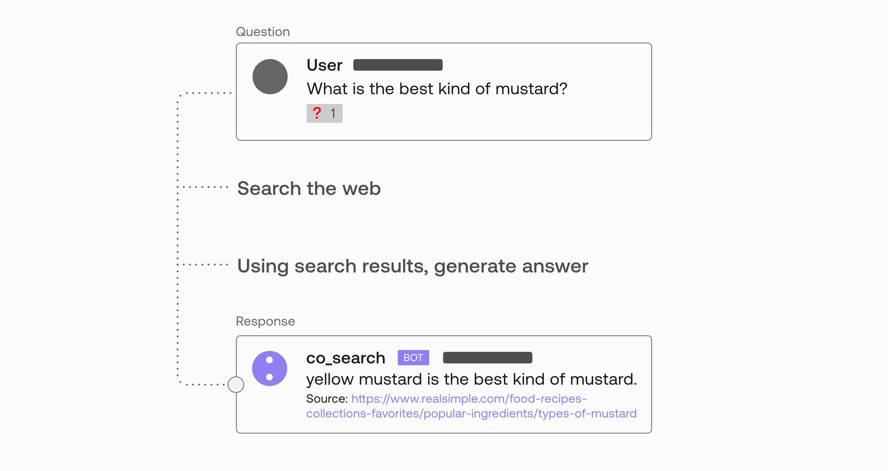


In this article, we go over the components that make up the `co_search` bot. It’s a great showcase for building Language AI systems because different steps are tackled by different prompts, as well as the combination of generation and embedding models. It also involves web search via an external search API.


#### Specify the Question and Its Context

By the nature of conversations, the questions we ask tend to reference previous context. A question might be impossible to answer without knowing the context.

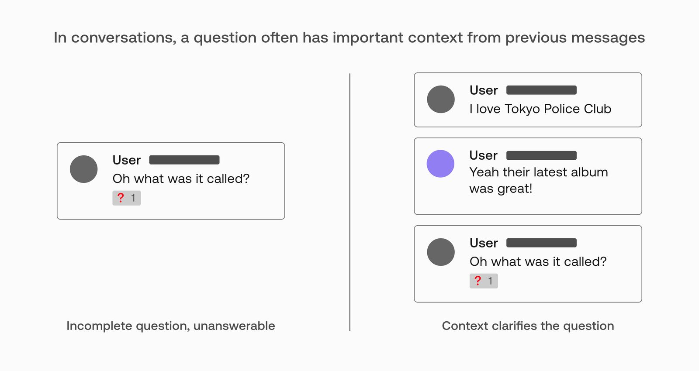


This is why we need to consider a number of the messages preceding the question. But how do we best search for the information we need? It’s not ideal, for example, to use the whole conversation as a search query.

We can, however, have a language model rewrite the question to incorporate the context.

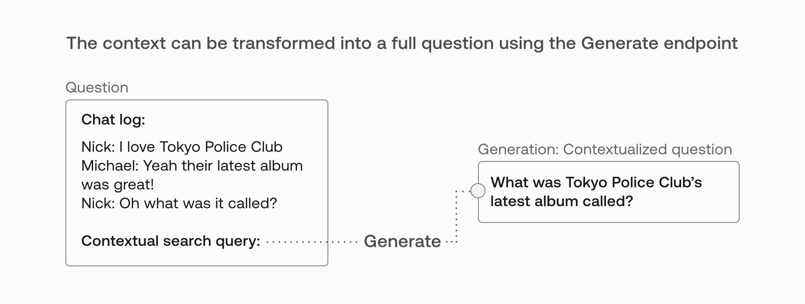


In conversational settings, a question often references context from previous messages. The first step in the pipeline is for a generation model to create the contextualized question out of the last few messages of the dialog.

The prompt used here uses examples like this:

```
Nick: How much does a watermelon weigh?
Jim: The average watermelon weighs about 20 - 25 pounds
Nick: where do they grow?
- Contextual search query: where do watermelons grow?
```

Five examples are in the prompt before presenting the current conversation and question to the model.

#### Search the Web for an Answer

The bot then hits a search API to search Google with the contextualized question as the query. Possible options for search APIs include [duckduckgo-search](https://pypi.org/project/duckduckgo-search/?ref=txt.cohere.com) and [SerpApi](https://serpapi.com/?ref=txt.cohere.com) (which is what we use).

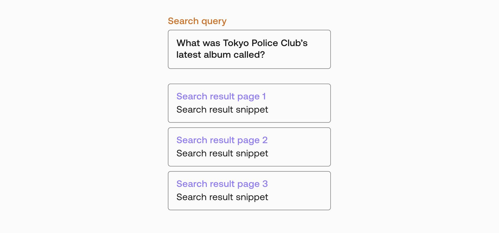


The bot doesn’t present the search results to the user. Rather, it tries to find the actual answer by grabbing the text of the pages, and using semantic search to try to find the answer. That is done by breaking each result page into multiple sections to find the relevant section.

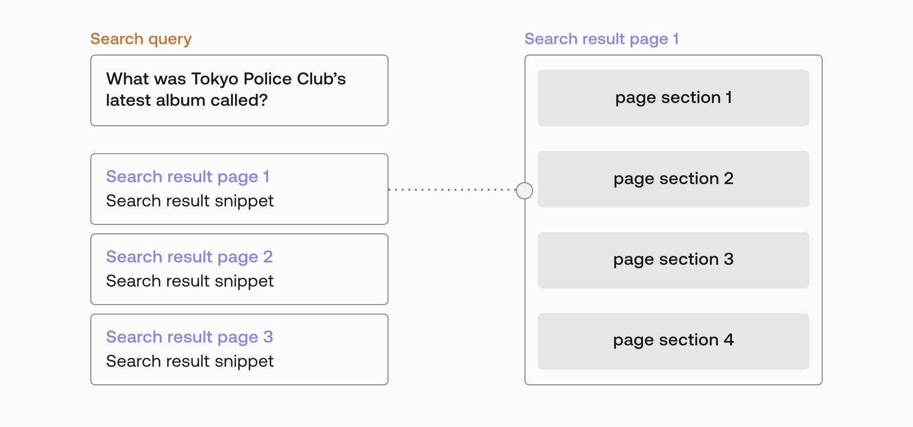


#### Identifying the Most Relevant Paragraphs from Search Results

The bot then embeds the sections of the pages and compares their embeddings to the embedding of an example answer created by the model.

For example, we set the system to look at the top three pages in the search result. The system splits the HTML page into paragraphs (e.g., by using BeautifulSoup to parse the HTML code and get the text inside <p> elements). In this example, we’d have eight paragraphs.

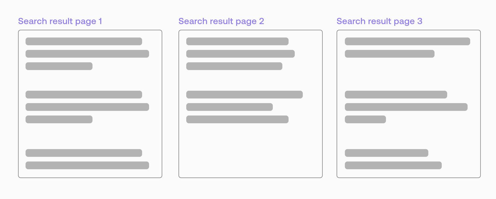


The system can then embed each paragraph — we can then use those embeddings to find the most relevant paragraph for the question.

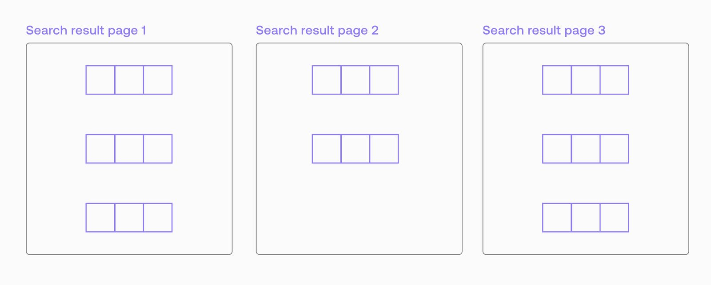


The most intuitive way to find the relevant passages is to compare the embedding of the search query and the embeddings of the paragraphs. This process raises a common question for semantic search systems. Are questions and their answers always semantically similar?

So, instead of comparing the similarity of the question with the paragraphs, the system generates a fake answer, and the embedding of that answer is compared against the paragraphs to identify the most relevant paragraph. Aside from using it for this comparison, the system ignores the fake answer.

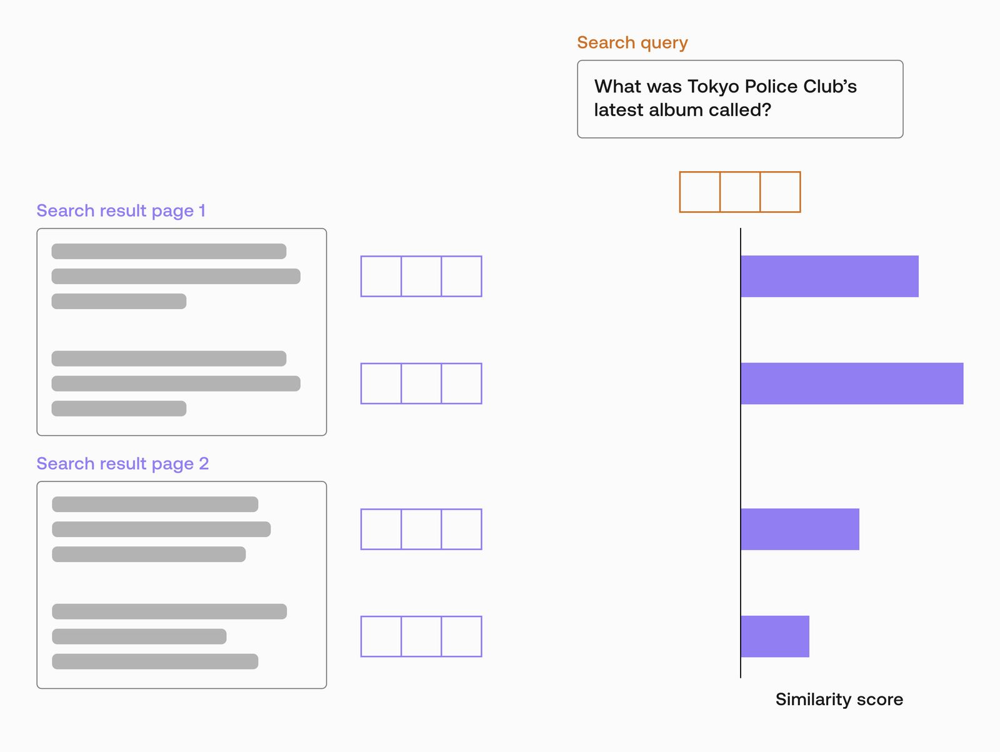


From this comparison, we arrive at the most relevant paragraphs produced by the search. How many paragraphs to use is a design option for the system. We can, for example, use the top two paragraphs.

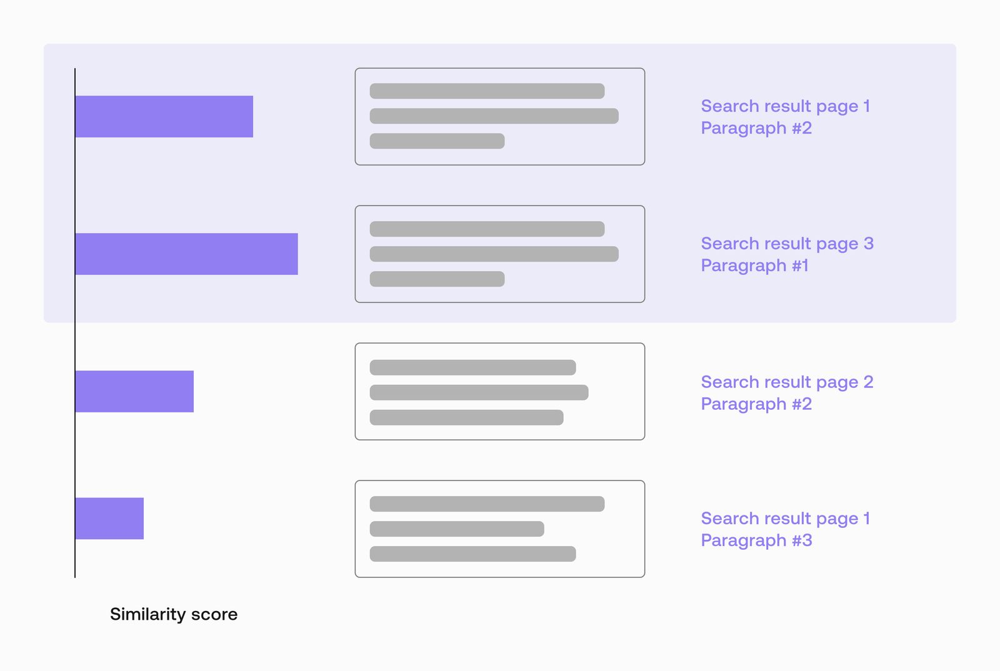


In the next step, we use their text to inform the answer.

#### Ask a Generative Model

Now that we have relevant results, we can add them to a prompt and pose the question to the generative model.

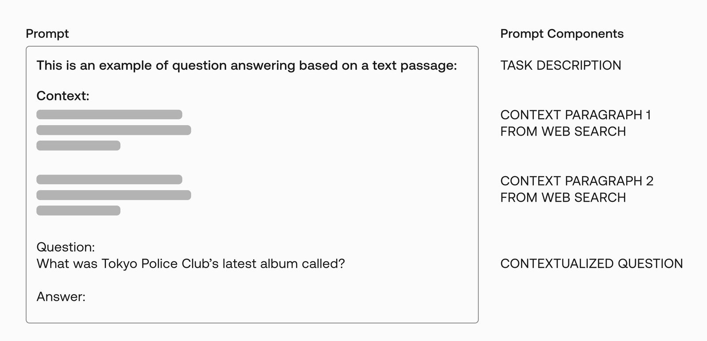


Because we’re aiming for factual information, we set a low temperature value (0.3) to reduce the creativity of the model in generating this answer.

The response generated by the model is posted as an answer alongside the URLs of the web pages that informed it.

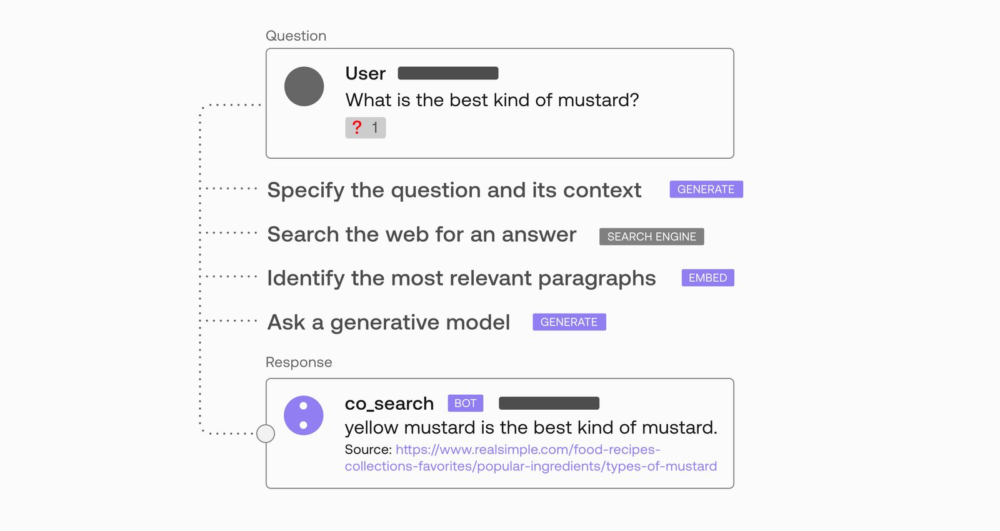


#### System Recap

The previous visual is also a good recap of the components of the system and its steps:

- Specifying the question and its context using Generate
- Searching the web using a search engine API
- Identifying the most relevant paragraphs (using Embed for semantic similarity)
- Asking the generative model to answer the question given the context provided in the prompt

An approach like this is expected to produce better factual generations than would be the case when asking a generative model directly. It still will not perfectly answer everything you ask it. It’s also advisable to always be mindful of the [responsible use of LLMs](/responsible-use/?ref=txt.cohere.com&__hstc=14363112.89f2baed82ac4713854553225677badd.1682345384753.1682525878579.1682537582485.12&__hssc=14363112.5.1682537582485&__hsfp=2014138109).

### The Design Space

Notice that this system is not one monolithic model that answers a question. It’s a multi-step pipeline that surgically applies Language AI where it can be useful. That vastly expands the design space of possible intelligent conversational agents that one can build using such pipelines.

#### What Triggers the Bot to Activate or Answer a Question?

Co-search is triggered when anyone adds the question mark emoji to a message in the Discord channel. Other possible triggers one can set to trigger such a system include:

- When the bot is mentioned
- When a certain Discord action is typed (e.g., /ask )
- Having the bot listen to a channel, and detect questions it can answer (step 1: question classification, step 2: semantic search against an FAQ archive)

#### Customizing Search Parameters to Limit Results to Certain Pages

Web search APIs have all the options that search engines provide. So, a bot can be restricted to only retrieve from Wikipedia, or university pages, or to a certain specific domain (e.g., Harry Potter Fandom portal for a bot specialized in specific lore).

#### Verify Answers with Another Prompt

Even supplied with relevant information, a model can provide wrong answers to a question. This is another area where a prompt can determine if a generated answer is supported by the context or not. This brings up the tradeoff of latency and performance. How much is a user willing to wait for an answer in different UI scenarios? Discord users might be a little more forgiving than Siri users who are waiting for an immediate answer. The Discord user experience also allows for another bot to be the fact checker.

### Conclusion

This has been a demonstration of a Language AI system that shows some of the possibilities of pipelines using generation and embedding in successive steps.

### Original Source

This material comes from the post [Building a Search-Based Discord Bot with Language Models](https://txt.cohere.com/building-a-search-based-discord-bot-with-language-models/) by [Nick Frosst](https://txt.cohere.com/author/nicholas/) (a cofounder of Cohere) and [Jay Alammar](https://txt.cohere.com/author/jay/).
