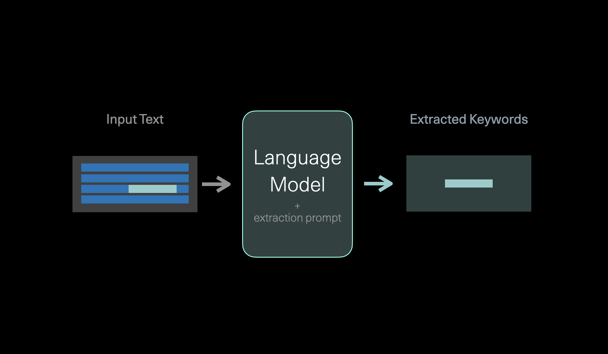
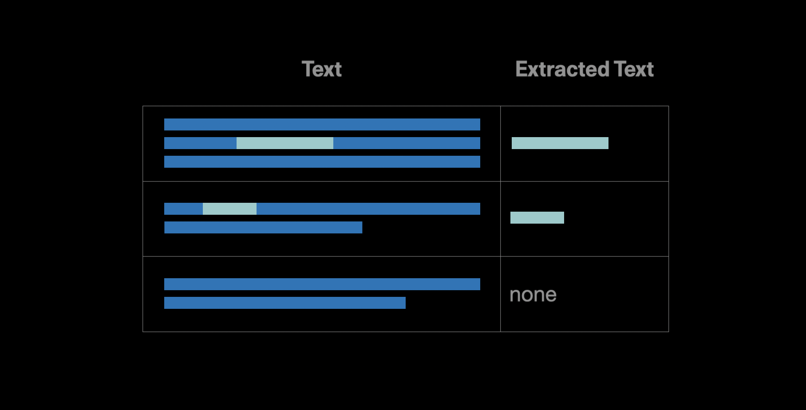
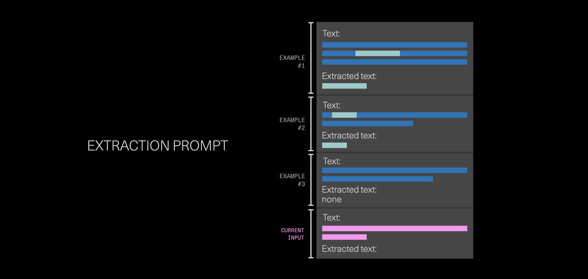

### Codelab

This chapter comes with a corresponding <a target="_blank" href="https://github.com/cohere-ai/cohere-developer-experience/blob/main/notebooks/Entity_Extrcation_with_Generative_Language_Models.ipynb">codelab</a>, and we encourage you to follow it along as you read the chapter.

### Entity Extraction

In this chapter you'll learn how to use generative models to extract the name of a film from the title of an article. This demonstrates Named Entity Recognition (NER) of entities which are harder to isolate using other NLP methods (and where pre-training provides the model with some context on these entities). This also demonstrates the broader usecase of sturctured generation based on providing multiple examples in the prompt.


We'll use post titles from the r/Movies subreddit. And for each title, we'll extract which movie the post is about. If the model is unable to detect the name of a movie being mentioned, it will return "none".

### Preparing Examples for the Prompt

In our prompt, we'll present the model with examples for the type of output we're after. We basically get a set of subreddit article titles, and label them ourselves. The label here is the name of the movie mentioned in the title (and "none" if no movie is mentioned).

The following are examples of the prompts we give the model. Notice that the first element in each tuple is the title of the movie, and the second one is a post about that movie. These examples will instruct the model to extract the movie title from the post. Notice that some of the posts don't contain a movie title, and the first element of the tuple is 'none'.
```
movie_examples = [  
("Deadpool 2", "Deadpool 2 | Official HD Deadpool's "Wet on Wet" Teaser | 2018"),  
("none", "Jordan Peele Just Became the First Black Writer-Director With a $100M Movie Debut"),  
("Joker", "Joker Officially Rated “R”"),  
("Free Guy", "Ryan Reynolds’ 'Free Guy' Receives July 3, 2020 Release Date - About a bank teller stuck in his routine that discovers he’s an NPC character in brutal open world game."),  
("none", "James Cameron congratulates Kevin Feige and Marvel!"),  
("Guardians of the Galaxy", "The Cast of Guardians of the Galaxy release statement on James Gunn"),  
]
```

# Creating the extraction prompt

We'll create a prompt that demonstrates the task to the model. The prompt contains the examples above, and then presents the input text and asks the model to extract the movie name.


The prompt containing the examples above looks like this:

```
Deadpool 2 | Official HD Deadpool's "Wet on Wet" Teaser | 2018  
extract the movie title from the post:Deadpool 2
```

***

Jordan Peele Just Became the First Black Writer-Director With a $100M Movie Debut  
extract the movie title from the post:none

***

Joker Officially Rated “R”  
extract the movie title from the post:Joker

***

Ryan Reynolds’ 'Free Guy' Receives July 3, 2020 Release Date - About a bank teller stuck in his routine that discovers he’s an NPC character in brutal open world game.  
extract the movie title from the post:Free Guy

***

James Cameron congratulates Kevin Feige and Marvel!  
extract the movie title from the post:none

***

The Cast of Guardians of the Galaxy release statement on James Gunn  
extract the movie title from the post:Guardians of the Galaxy

***

<input text here>
extract the movie title from the post:
```

Think of this prompt as the training set. We feed this prompt to the generator, and that's what instructs it to extract the movie title from each of the posts. As you can see, it's quite a small training set for a model, in particular, a generative one! But you'll see that it works quite well due to the power of the large language model.

### Getting the data

Now we'll make the API call to get the top posts for 2021 from r/movies.

```
num_posts = 10

movies_list = get_post_titles(size=num_posts, 
      after=str(int(datetime.datetime(2021,1,1,0,0).timestamp())), 
      before=str(int(datetime.datetime(2022,1,1,0,0).timestamp())), 
      subreddit="movies", 
      sort_type="score", 
      sort="desc")

# Show the list
movies_list
```

The result is the following:

```
['Hayao Miyazaki Got So Bored with Retirement He Started Directing Again ‘in Order to Live’',
 "First poster for Pixar's Luca",
 'New images from Space Jam: A New Legacy',
 'Official Poster for "Sonic the Hedgehog 2"',
 'Ng Man Tat, legendary HK actor and frequent collborator of Stephen Chow (Shaolin Soccer, God of Gambler) died at 70',
 'Zack Snyder’s Justice League has officially been Rated R for for violence and some language',
 'HBOMax and Disney+ NEED to improve their apps if they want to compete with Netflix.',
 'I want a sequel to Rat Race where John Cleese’s character dies and invites everyone from the first film to his funeral, BUT, he’s secretly set up a Rat Maze to trap them all in. A sort of post-mortem revenge on them for donating all his wealth to charity.',
 "'Trainspotting' at 25: How an Indie Film About Heroin Became a Feel-Good Classic",
 '‘Avatar: The Last Airbender’ Franchise To Expand With Launch Of Nickelodeon’s Avatar Studios, Animated Theatrical Film To Start Production Later This Year']
```

### Running the model

And now we loop over the posts and process each one of them with our extractor.

```
results = []
for text in tqdm(movies_list):
    try:
        extracted_text = cohereMovieExtractor.extract(text)
        results.append(extracted_text)
    except Exception as e:
        print('ERROR: ', e)
```

### Results

Here are some of the results of this model, as you can see, it extracts keywords from each article referring to the movie.

| text                                                                                                                                                                                                                                                            | extracted text             |
| :-------------------------------------------------------------------------------------------------------------------------------------------------------------------------------------------------------------------------------------------------------------- | :------------------------- |
| Hayao Miyazaki Got So Bored with Retirement He Started Directing Again ‘in Order to Live’                                                                                                                                                                       | none                       |
| First poster for Pixar's Luca                                                                                                                                                                                                                                   | Pixar's Luca               |
| New images from Space Jam: A New Legacy                                                                                                                                                                                                                         | Space Jam: A New Legacy    |
| Official Poster for "Sonic the Hedgehog 2"	Sonic the Hedgehog 2                                                                                                                                                                                                 | Sonic the Hedgehog 2       |
| Ng Man Tat, legendary HK actor and frequent collborator of Stephen Chow (Shaolin Soccer, God of Gambler) died at 70                                                                                                                                             | none                       |
| Zack Snyder’s Justice League has officially been Rated R for for violence and some language                                                                                                                                                                     | Justice League             |
| HBOMax and Disney+ NEED to improve their apps if they want to compete with Netflix.                                                                                                                                                                             | none                       |
| I want a sequel to Rat Race where John Cleese’s character dies and invites everyone from the first film to his funeral, BUT, he’s secretly set up a Rat Maze to trap them all in. A sort of post-mortem revenge on them for donating all his wealth to charity. | Rat Race                   |
| 'Trainspotting' at 25: How an Indie Film About Heroin Became a Feel-Good Classic                                                                                                                                                                                | Trainspotting              |
| ‘Avatar: The Last Airbender’ Franchise To Expand With Launch Of Nickelodeon’s Avatar Studios, Animated Theatrical Film To Start Production Later This Year                                                                                                      | Avatar: The Last Airbender |

Looking at these results, the model got 9/10 correctly. It didn't pick up on Shaolin Soccer and God of Gambler in example #4. It also called the second example "Pixar's Luca" instead of "Luca". But maybe we'll let this one slide.

When experimenting with extrction prompts, we'll often find edge-cases along the way. What if a post has two movies mentioned, for example? The more we run into such examples, the more examples we can add to the prompt that address these cases.

### How well does this work?

We can better measure the performance of this extraction method using a larger labeled dataset. So let's load a test set of 100 examples:

```
test_df = pd.read_csv('https://raw.githubusercontent.com/cohere-ai/cohere-developer-experience/main/notebooks/data/movie_extraction_test_set_100.csv',index_col=0)
test_d
```

|     | text                                                                                         | label                                |
| :-- | :------------------------------------------------------------------------------------------- | :----------------------------------- |
| 0   | Disney's streaming service loses some movies due to old licensing deals                      | none                                 |
| 1   | Hi, I’m Sam Raimi, producer of THE GRUDGE which hits theaters tonight. Ask Me Anything!      | The Grudge                           |
| 2   | 'Parasite' Named Best Picture by Australia's AACTA Awards                                    | Parasite                             |
| 3   | Danny Trejo To Star In Vampire Spaghetti Western ‘Death Rider in the House of Vampires’      | Death Rider in the House of Vampires |
| 4   | I really wish the 'realistic' CGI animal trend would end.                                    | none                                 |
| ... |                                                                                              | ...                                  |
| 95  | Hair Love \| Oscar Winning Short Film (Full)                                                 | Hair Love                            |
| 96  | First image of Jason Alexander in Christian film industry satire 'Faith Based'               | Faith Based                          |
| 97  | 'Borderlands' Movie in the Works From Eli Roth, Lionsgate                                    | Borderlands                          |
| 98  | Taika Waititi putting his Oscar "away" after winning best adapted screenplay for JOJO RABBIT | Jojo Rabbit                          |
| 99  | Oscar-Winning 'Parasite' Lands One-Week IMAX Release Starting February 21 in 200+ Theaters   | Parasite                             |

We an run the extractor on this entire dataset, and compare the extracted label with the actual label. Here are the first five rows, notice that the model got 4 of them correctly.

|    | text                                                                                    | label                                | extracted_text |
| :- | :-------------------------------------------------------------------------------------- | :----------------------------------- | :------------- |
| 0  | Disney's streaming service loses some movies due to old licensing deals                 | none                                 | none           |
| 1  | Hi, I’m Sam Raimi, producer of THE GRUDGE which hits theaters tonight. Ask Me Anything! | The Grudge                           | The Grudge     |
| 2  | 'Parasite' Named Best Picture by Australia's AACTA Awards                               | Parasite                             | Parasite       |
| 3  | Danny Trejo To Star In Vampire Spaghetti Western ‘Death Rider in the House of Vampires’ | Death Rider in the House of Vampires | Death Rider    |
| 4  | I really wish the 'realistic' CGI animal trend would end.                               | none                                 | none           |

When we calculate the accuracy, we get 89.0%, meaning that out of the 100 posts, it extracted the correct name of the movie 89 times. So it seems this prompt works well on this small test set. It's not guaranteed it will do as well on other sets, however. The prompt can be improved by trying on more data, discovering edge cases, and adding more examples to the prompt.

Let's take a look at the 11 examples it got wrong.

|    | text                                                                                                                                     | label                                | extracted_text     | correct |
| :- | :--------------------------------------------------------------------------------------------------------------------------------------- | :----------------------------------- | :----------------- | :------ |
| 2  | Danny Trejo To Star In Vampire Spaghetti Western ‘Death Rider in the House of Vampires’                                                  | Death Rider in the House of Vampires | Death Rider        | 0       |
| 6  | De Niro recreating a scene from Goodfellas to test Irishman deaging (3:30 in)                                                            | Goodfellas                           | none               | 0       |
| 12 | Is there anyway way I could get a copy of 1917 for my dying father in law?                                                               | 1917                                 | none               | 0       |
| 30 | How Uncut Gems Won Over the Diamond District                                                                                             | Uncut Gems                           | none               | 0       |
| 31 | Michael J. Fox and Christopher Lloyd posing for the Back to the Future II poster in 1989 that would later be illustrated by Drew Struzan | Back to the Future II                | Back to the Future | 0       |
| 39 | 2019 in film - with 'Movies' by Weyes Blood                                                                                              | none                                 | Movies             | 0       |
| 57 | The Mad Max franchise is my all time favorite movie series. I finally watched Waterworld tonight. Oh man why didnt I see this sooner?    | Mad Max                              | Waterworld         | 0       |
| 69 | How A New Hope created Pixar Animation Studios                                                                                           | Star Wars                            | none               | 0       |
| 75 | A scene from the movie 1917 was recreated from the stroyboards.                                                                          | 1917                                 | none               | 0       |
| 82 | New Wonder Woman image                                                                                                                   | Wonder Woman                         | none               | 0       |
| 88 | Thoughts on the Irishman ...                                                                                                             | The Irishman                         | none               | 0       |

It indeed failed to pick up a few examples. Sometimes this uncovers edge cases and understandable mistakes (e.g. two films are mentioned in the text).

### Conclusion

In this chapter, you learned how to use the Generate model to extract entities from text. This type of extraction is interesting because it doesn't just blindly look at the text. The model has picked up on movie information during its pretraining process and that helps it understand the task from only a few examples. We encourage you to extend this to other subreddits or other datasets, and extract different kinds of entities and information!

### Original Source

This material comes from the codelab <a target="_blank" href="https://txt.cohere.com/generative-ai-part-5/">Entity Extraction with Generative Models</a>
