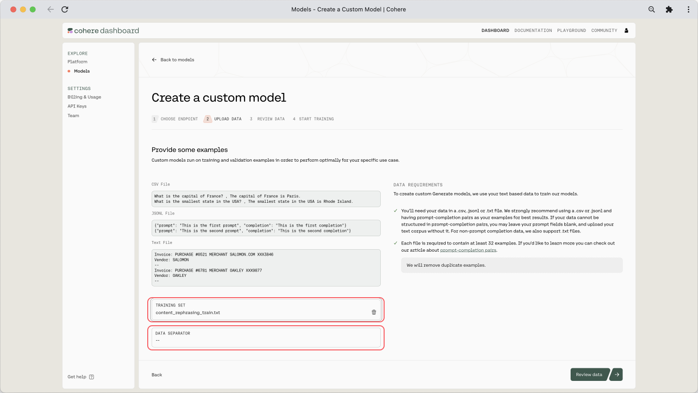
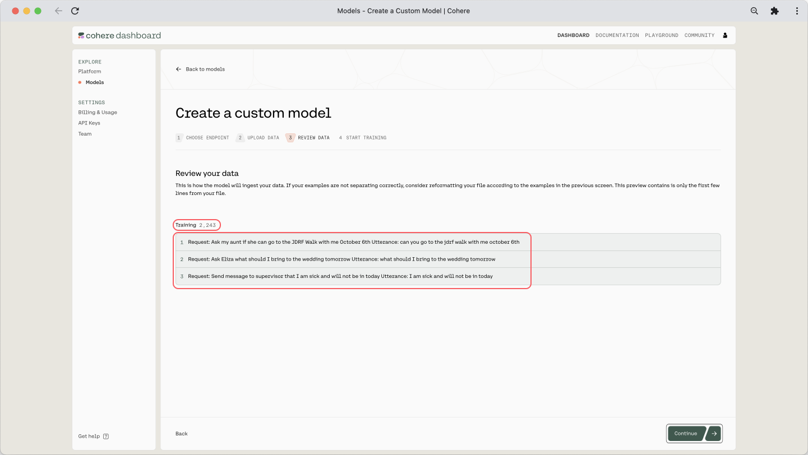
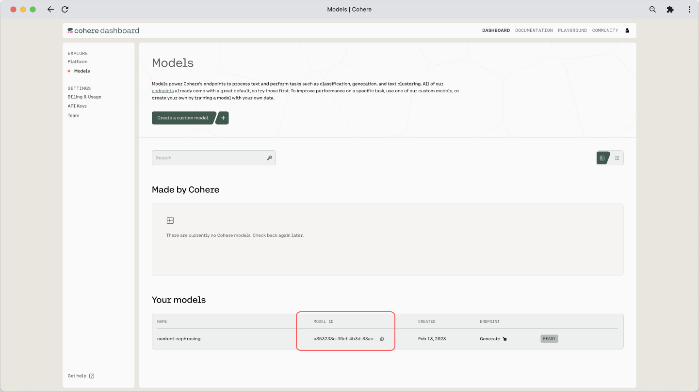
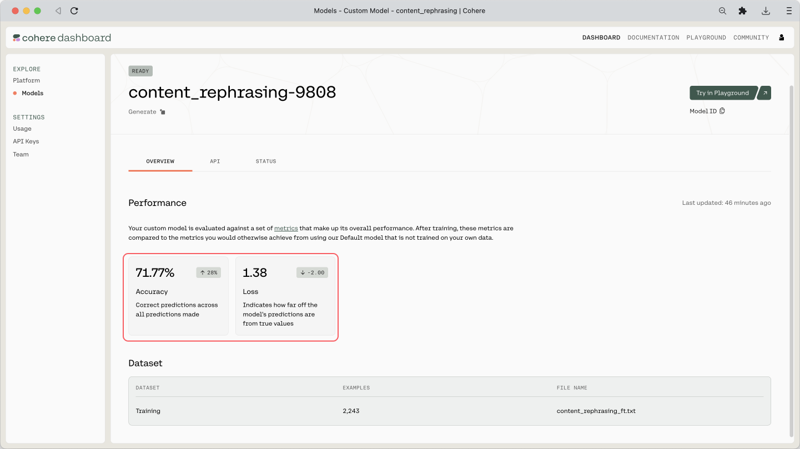

In the previous chapter, we explored the Generate endpoint and used it to experiment with prompts. We tried a range of parameter values to understand the combinations that best serve our goals. The next question is then: can we make the model perform even better at a given task?

The answer is yes, and we can do that via custom models. In this chapter, we’ll look at how we can take the baseline generative model and train our own model on top of it, all without having to have machine learning skills.

This option provides a nice balance —  while the Cohere API makes it easy for you to interface with large language models (LLMs) minus all the complexities, you still have the ability to customize a model to your specific task.

In this chapter, we will cover the following:

- What are custom models?
- Training a custom model
  - Prepare your dataset
  - Initiate training
- Evaluating a custom model
  - Check metrics
  - Make sample calls
  - Measure likelihood

But first, let’s see why, and when, you might want to create your own custom models.

A generative model is already trained on a huge volume of data, making it great at capturing patterns of information on a broad scale. But sometimes, your task contains nuances that are highly specific to that scenario. Here are some examples:

- **Specific styles:** Generating text with a certain style or voice, e.g., when generating product descriptions that represent your company’s brand
- **Specific formats:** Parsing information from a unique format or structure, e.g., when extracting information from specific types of invoices, resumes, or contracts
- **Specific domains:** Dealing with text in highly specialized domains such as medical, scientific, or legal, e.g., when summarizing text dense with technical information
- **Specific knowledge:** Generating text that closely follows a certain theme, e.g., when generating playing cards that are playable, like what we did with <a target="_blank" href="https://cohere.com/blog/urzas-ai/">Magic the Gathering</a>

In these cases, with enough examples in the prompt, you might still be able to make the generation work. But there is an element of unpredictability — something you want to eliminate when looking to deploy your application beyond a basic demo.

In these kinds of scenarios, you may want to experiment with custom models and compare how they perform against the baseline model, and then decide on the best option.

### What are Custom Models?

To understand what a custom model is and how it works, it’s good to know a couple of terms commonly used in LLMs: pre-training and finetuning.

Pre-training is the process of training a language model on a large amount of text data to learn the general patterns and structures of language. By doing this, the model is able to learn how to generate text that is coherent.

Finetuning, on the other hand, involves taking a pre-trained language model and training it on a smaller, more specific dataset to adapt it to a particular task. Finetuning allows the model to be customized for a specific use case, which can result in better performance on that task.

If you think of this as the process of building a house, pre-training can be compared to the process of building its foundation and basic building blocks. Just as a strong foundation is necessary for a house to stand, pre-training is necessary to build a solid foundation for a language model. Finetuning, on the other hand, focuses on customizing that house with specific features, which can differ based on the exact needs and preferences of a person.

At Cohere, we refer to our pre-trained models as baseline models (at the time of writing, these are `command-light-nightly`, `base`, and `base-light`). We refer to finetuned models as custom models.

### Training a Custom Model

The finetuning feature runs on the `command` model family, trained to follow user commands and to be instantly useful in practical applications.

The finetuning format takes JSONL files. We provide for each training example a formatted prompt, alongside a completion. Here is what it the file should look like:

