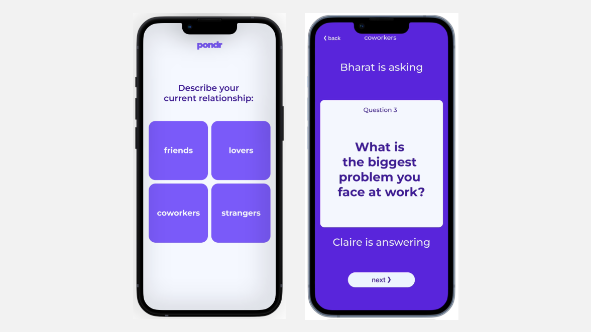

# Introduction and Code Repo

In this chapter you'll use the generate endpoint in order to build a game to spark conversations between two players. You'll then deploy it with Next.js.

The repository for this project is [here](https://github.com/cohere-ai/examples/tree/main/pondr), and we encourage you to follow the code along with this tutorial.

We tend to chat all the time with friends new and olds, but often it feels like we’re just scratching at the surface, or defaulting to predictable, mundane conversations. Really good conversations — ones that introduce an element of vulnerability, spur a moment of fun, or create a deep sense of closeness — are few and far between. And when we have those types of conversations, we remember them.

Pondr is a game that turns strangers into friends, and friends into besties, by fostering connection and closeness through really good conversations. Using Cohere, Pondr generates question prompts on command that are uniquely tailored to the players’ setting. Whether you’re looking to deepen a connection with someone you’ve known forever, or you’re just hoping to become more familiar with a new friend, Pondr will help you drive the right sort of conversation.

You can build your own version of Pondr by following these simple steps:

- Step 1: Generate potential conversation questions
- Step 2: Rank the generated questions
- Step 3: Put the generation and classification behind an interface

Read on for more details on each of these steps.

# Step 1: Generate Potential Conversation Questions

Players begin the game by inputting the setting in which the game is being played (e.g., meeting an old friend from high school). The Cohere generation model then generates a list of potential questions that players may want to ask each other to spark conversation that is appropriate for their setting.

The first step in the development process is to create a prompt. Using the Cohere Generate endpoint, we’ll input the following prompt to generate a list of potential questions. The prompt is dynamically updated based on a player’s selections and input in the game. Here is the general template:

```
{Statement about the player relationships}. {Setting, entered by the user}. I want to ask some interesting questions. {Statement about depth of the questions}.
Here are 10 interesting questions to ask:
1)
```

Here is an example of a prompt based on user interaction and the above template:

```
I am meeting up with a friend. We are having a reunion at a fancy restaurant after having not seen each other since high school. I want to ask some interesting questions. These questions should be somewhat deep.
Here are 10 interesting questions to ask:
1)
```

The relationship statement has four different options, and depth statements have three different options. The setting input is a free-form text field.

We’ll then feed the prompt into the Cohere Generate endpoint using the following line of code.

```
const generations = await cohere.generate({
  model: model || 'xlarge',
  prompt: prompt,
  max_tokens: 150,
  temperature: 1,
});
```

# Step 2: Rank the Generated Questions

From the above prompt, ten candidate questions are generated to provide a decent amount of variety, but not all questions are generated equally. The most engaging questions are those that have a high degree of “interestingness” and specificity. Therefore, we’ll use the Cohere Classify endpoint and a handful of samples to classify the candidate questions on those two dimensions.

The examples included in the co.classify call are model generated and then hand labeled. We’ll add samples until we’re happy with the classification results on a variety of questions. Here are some samples for each co.classify call:

```
const INTERESTINGNESS_EXAMPLES = [
  {
    text: 'What do you think is the hardest part of what I do for a living?',
    label: 'Not Interesting',
  },
  {
    text: "What's the first thing you noticed about me?",
    label: 'Interesting',
  },
  {
    text: 'Do you think plants thrive or die in my care?',
    ...

const SPECIFICITY_EXAMPLES = [
  {
    text: "What's the first thing you noticed about me?",
    label: 'Specific',
  },
  {
    text: 'Do you think plants thrive or die in my care?',
    label: 'Specific',
  },
  {
    text: 'Do I seem like more of a creative or analytical type?',
    ...
```

We’ll then use the following line of code to perform the classification on the list of questions. The attribute is either the list of “interestingness” or "specificity" examples.

```
const classificationsInterestingness = await cohere.classify({
  model: 'medium',
  examples: INTERESTINGNESS_EXAMPLES,
  inputs: fiveQuestions,
});

const classificationsSpecificity = await cohere.classify({
  model: 'medium',
  examples: SPECIFICITY_EXAMPLES,
  inputs: fiveQuestions,
});
```

# Step 3: Put Generation and Classification Behind an Interface

The final step is to create a web interface where players can enter their names and their specific setting to get relevant questions. The interface also manages the flow of the game to let players go back and forth asking questions to each other.

We’ll translate the main question generation and selection code from Python into TypeScript with a `generateQuestion` function written as a Next.js API route:

```
  });
  const classificationsSpecificity = await cohere.classify({
    model: 'medium',
    examples: SPECIFICITY_EXAMPLES,
    inputs: fiveQuestions,
  });

  const question = getQuestion(
    fiveQuestions,
    classificationsInterestingness.body['classifications'],
    classificationsSpecificity.body['classifications'],
  );

  res.status(200).json({ question });
};

export default generateQuestion;


We’ll then write a react-query hook to make calls to the generateQuestion API from the browser.

// components/useCohereQuestion.ts

export const useCohereQuestion = (
  {
    relationship,
    setting,
    depth,
    model,
  }: { relationship: Relationship; setting: string; depth: number; model?: string },
) => {
  const { data, error, isLoading } = useQuery(
    ['question', relationship, setting, depth, model],
    async () => {
      const response = await fetch('/api/generateQuestion', {
        method: 'POST',
        body: JSON.stringify({ relationship, setting, depth, model }),
      });
      if (!response.ok) {
        throw new Error('Network response was not ok');
      }
      return response.json();
    },
  );

  return { question: data?.question, isLoading, error };
};
```

We’ll then write a react-query hook to make calls to the generateQuestion API from the browser.

```
// components/useCohereQuestion.ts

export const useCohereQuestion = (
  {
    relationship,
    setting,
    depth,
    model,
  }: { relationship: Relationship; setting: string; depth: number; model?: string },
) => {
  const { data, error, isLoading } = useQuery(
    ['question', relationship, setting, depth, model],
    async () => {
      const response = await fetch('/api/generateQuestion', {
        method: 'POST',
        body: JSON.stringify({ relationship, setting, depth, model }),
      });
      if (!response.ok) {
        throw new Error('Network response was not ok');
      }
      return response.json();
    },
  );

  return { question: data?.question, isLoading, error };
};
```

A few more lines of code and the result is a fluid game interface and a UI that looks like this:



# Conclusion

And there you have it! In three simple steps, we’ve created a fun and useful game that helps people connect and build relationships through the power of conversation. Here is a notebook that walks through the Python code for the first two parts. Learn more by checking out the working version of the game. And be sure to create a free Cohere account to get started building your own version.
