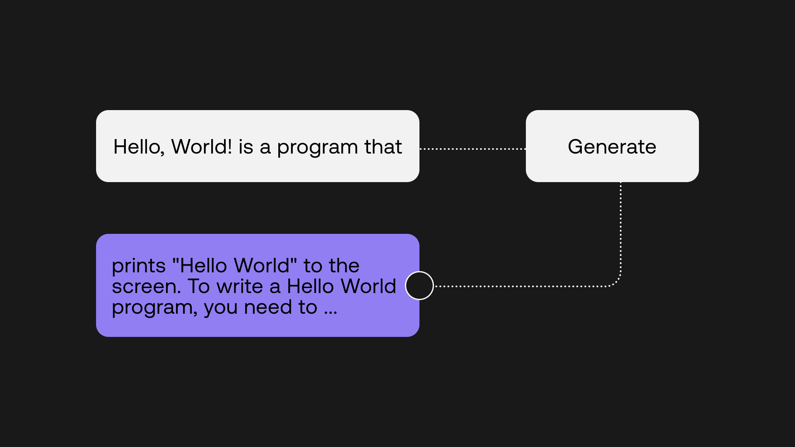
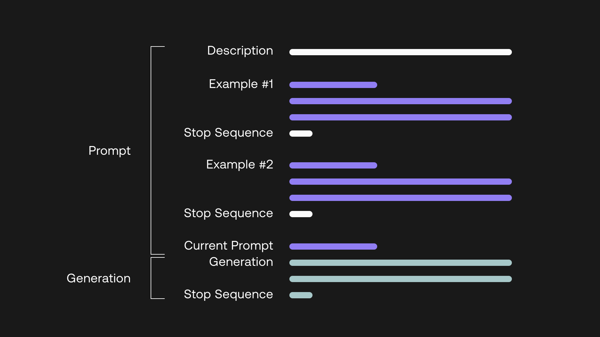

# Introduction and Codelab

In this chapter you'll learn the basics of using the generate endpoint to generate text using a prompt.

This chapter comes with a corresponding [codelab](https://colab.research.google.com/github/cohere-ai/notebooks/blob/main/notebooks/Hello_World_Meet_Language_AI.ipynb?ref=txt.cohere.com#scrollTo=T3ZMwoPnjuIM), and we encourage you to follow it along as you read the chapter.

## Generating text


There are two broad themes in language processing — language generation and language understanding. This part covers the former, which is the capability that you can access by calling Cohere’s Generate endpoint.

Cohere’s language AI endpoints produce different types of outputs, but there is a similar pattern in how you work with them. This can be broken into three steps:

- Prepare input
- Define model settings
- Get output

### Prepare input

The Cohere Generate endpoint generates text given an input, called a “prompt.”




The prompt provides a context for the text that we want the model to generate. To illustrate this, let’s start with a simple prompt as the input.

```
prompt = "Hello World is a program that"
```

### Define model settings

Next, we’ll define some model settings. There are a number of settings that you can modify with the Generate endpoint, but we’ll start with four:

- model — the model size, which ranges from small, medium, large, and xlarge. Generally smaller models are faster, while larger models will perform better. We’ll use the default which is xlarge.
- prompt — the input string to be used.
- max_tokens — the number of tokens to be generated. Translating tokens into words, one word contains approximately 2-3 tokens.
- temperature — a number between 0 and 5. Lower temperature will cause the model to output text that is more predictable, while higher temperature means that the output will be more creative. There is no one right setting as it depends on your task and it requires some experimentation. In most cases, somewhere between 0 and 1 works fine, and for our case, we’ll use 0.4.

### Generate output

Finally, we’ll generate the output, giving us the generations response. Putting everything together, we get the code below.

```
prompt = "Hello World is a program that"

response = co.generate(  
  model='xlarge',  
  prompt=prompt,  
  max_tokens=75,  
  temperature=0.4)

output = response.generations[0].text
```

Here’s a sample output returned:

_prints "Hello World" to the screen.  To write a Hello World  
program, you need to create a new file and save it as HelloWorld.py.  
Then, you can write the following code into the file:  
print("Hello World!")  Save the file and run it using Python.  
If you don't have Python installed,_

The output is not bad, but it could be better. If we were writing a blog post for example, the tone of the generated output wouldn’t fit very well. Also, there is no natural ending to the generated text, which looks like it could continue for quite some time.

We need to find a way to make the output tighter and closer to how we want it to be, which is where we leverage prompt engineering.

### Create a better prompt

[Prompt engineering](/prompt-engineering-wiki?ref=txt.cohere.com&__hstc=14363112.89f2baed82ac4713854553225677badd.1682345384753.1682373613982.1682437866580.5&__hssc=14363112.1.1682437866580&__hsfp=2014138109) is a fascinating topic. It is about figuring out the optimal way to prompt a model for a particular task, so we can shape the output to be how we want it to be. There are many creative prompts that have proven effective out there, and the whole topic is an active area of research. Having said that, the basic format that generally works well is as follows:

- A short description about the overall context
- A few examples of prompts and completions; usually two to three examples are sufficient but for more challenging tasks, you will need more
- A short sequence of characters or “stop sequence” to give the model a hint to create a complete passage and then stop




Let’s say we are writing a blog about Hello, World! Specifically, we want to write an introductory paragraph about Learning to Code with Hello, World!

For this, we can create a prompt consisting of:

- A short description about what this “program” is about
- A couple of examples of the blog title and its first paragraph
- A stop sequence, which we use “--”

The prompt is as follows:

```
prompt = """  
This program will generate the first paragraph of a blog post given  
a blog title.  
--  
Blog Title: Best Activities in Toronto  
First Paragraph: Looking for fun things to do in Toronto?  
When it comes to exploring Canada's largest city, there's an  
ever-evolving set of activities to choose from. Whether you're  
looking to visit a local museum or sample the city's varied  
cuisine, there is plenty to fill any itinerary. In this blog  
post, I'll share some of my favorite recommendations  
--  
Blog Title: Mastering Dynamic Programming  
First Paragraph: In this piece, we'll help you understand  
the fundamentals of dynamic programming, and when to apply  
this optimization technique. We'll break down bottom-up and  
top-down approaches to solve dynamic programming problems.  
--  
Blog Title: Learning to Code with Hello, World!  
First Paragraph:  
"""
```

Using the new prompt and adding a stop sequence, our generation code now looks like this:

```

```

Here’s a sample output returned:

_Coding is a fun and exciting way to learn the basics of computer science.  
In this article, we'll review the fundamentals of programming, including  
variables, functions, conditional statements, and loops. We'll also  
discuss how to use Python to write code that prints "Hello, World!" --_

This looks much better! Because we have created a couple of examples with the tone of a blog post, the model captured that context and was then able to generate something with a similar tone. There is also a natural ending to the piece, which you notice ends with the stop sequence.

## Automate the process

In actual applications, you will likely need to produce these text generations on an ongoing basis, given different inputs. Let’s simulate that with our example.

Automating generations from multiple prompts  
Automating generations from multiple prompts  
First, we create a list of new topics, so we can iterate on them and get the paragraphs generated. We then make some tweaks to the earlier prompt: we create a base prompt containing the examples, and then we append it to the current prompt, which is the new topic. These steps are shown below.

The list of topics:

```
topics = ["How to Grow in Your Career",  
          "What Makes a Great Software Developer",  
          "Ideas for a Relaxing Weekend"]
```

The base prompt:

```
prompt = """  
This program will generate the first paragraph of a blog post given  
a blog title.  
--
Blog Title: Best Activities in Toronto  
First Paragraph: Looking for fun things to do in Toronto?  
When it comes to exploring Canada's largest city, there's an  
ever-evolving set of activities to choose from. Whether you're  
looking to visit a local museum or sample the city's varied  
cuisine, there is plenty to fill any itinerary. In this blog  
post, I'll share some of my favorite recommendations  
--  
Blog Title: Mastering Dynamic Programming  
First Paragraph: In this piece, we'll help you understand  
the fundamentals of dynamic programming, and when to apply  
this optimization technique. We'll break down bottom-up and  
top-down approaches to solve dynamic programming problems.  
--  
Blog Title:"""
```

Set up the model:

```
def generate_text(base_prompt, current_prompt):  
  response = co.generate(  
    model='xlarge',  
    prompt = base_prompt + current_prompt,  
    max_tokens=75,  
    temperature=0.4,  
    stop_sequences=["--"])  
  generation = response.generations[0].text

  return generation
```

Iterate on the topics:

```
for topic in topics:  
  current_prompt = " " + topic + "\\n" + "First Paragraph:"  
  para = generate_text(base_prompt, current_prompt)
```

And here’s a sample output returned:

\_Topic: How to Grow in Your Career  
First Paragraph: If you've been working in the same position for  
a while, you may be wondering how to grow in your career. In this  
article, we'll discuss how to advance your career and take your  
skills to the next level. We'll cover how to get promoted, how to  
get a raise, and how to find a new job.

***

Topic: The Habits of Great Software Developers  
First Paragraph: What makes a great software developer? What  
separates them from the rest? What are the habits of great software  
developers? In this post, I will share with you the habits of great  
software developers.

***

Topic: Ideas for a Relaxing Weekend  
First Paragraph: If you're looking for ideas for a relaxing weekend,  
there are plenty of options available. Whether you're hoping to spend  
some time with friends or family, or you're looking for a quiet  
weekend at home, you can find a relaxing weekend activity that fits  
your needs. Here are some ideas for a relaxing weekend.

***

\_

We have covered one example, but the ways to construct a prompt are only limited by your creativity. It is also highly dependent on the task at hand. Prompt engineering can be used not only in text completion, but also to do any form of text generation, for example:

- Summarizing text
- Rewriting text
- Extracting key information from text

There are more model settings that we have not covered, some of which are worth exploring:

- num_generations — instead of generating one output per call, you can generate up to a maximum of 5
- return_likelihoods — enable this to also receive the likelihood of the tokens generated  
  and more, which you can find in the API reference

We have taken a quick tour of text generation, but there is so much more to explore. Here are some additional resources:

- A guide to [prompt engineering](/prompt-engineering-wiki?ref=txt.cohere.com&__hstc=14363112.89f2baed82ac4713854553225677badd.1682345384753.1682373613982.1682437866580.5&__hssc=14363112.1.1682437866580&__hsfp=2014138109)
- Controlling [generation outputs](/token-picking?ref=txt.cohere.com&__hstc=14363112.89f2baed82ac4713854553225677badd.1682345384753.1682373613982.1682437866580.5&__hssc=14363112.1.1682437866580&__hsfp=2014138109)
- Some [use case ideas](https://cohere.com/blog/llm-use-cases/) with text generation
- The [Generate API reference](/generate-reference?ref=txt.cohere.com&__hstc=14363112.89f2baed82ac4713854553225677badd.1682345384753.1682373613982.1682437866580.5&__hssc=14363112.1.1682437866580&__hsfp=2014138109)
