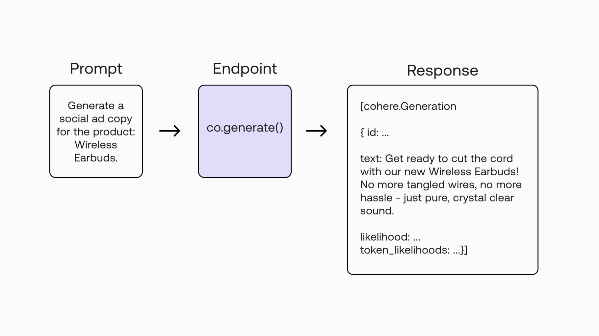
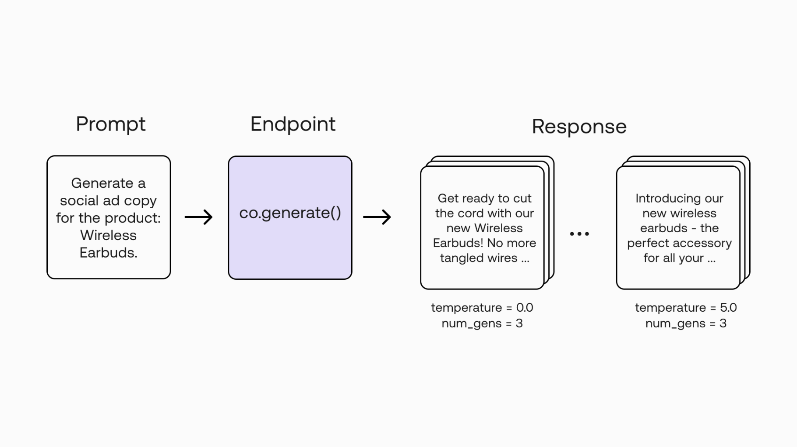

In the previous two chapters, we looked at how we can use the Playground to experiment with ideas in text generation. And let’s say we have now found that idea which we want to build on, so what’s next?  In this chapter, we will begin our exploration of the <a target="_blank" href="https://docs.cohere.ai/reference/generate?ref=txt.cohere.com&amp;__hstc=14363112.fb39cf5aec47995e64cd26603e2e04d9.1682489949734.1683517385804.1683567328678.32&amp;__hssc=14363112.3.1683567328678&amp;__hsfp=3887566761">Cohere Generate endpoint</a>, one of the endpoints available from the <a target="_blank" href="https://docs.cohere.ai/reference/about?ref=txt.cohere.com&amp;__hstc=14363112.fb39cf5aec47995e64cd26603e2e04d9.1682489949734.1683517385804.1683567328678.32&amp;__hssc=14363112.3.1683567328678&amp;__hsfp=3887566761">Cohere API</a>. We’ll move from the Playground to code, in this case via the Python SDK, and learn how to use the endpoint.

### Codelab

This article comes with a  for reference.

Here’s a quick look at how to generate a piece of text via the endpoint. It’s quite straightforward.

We enter a prompt:

