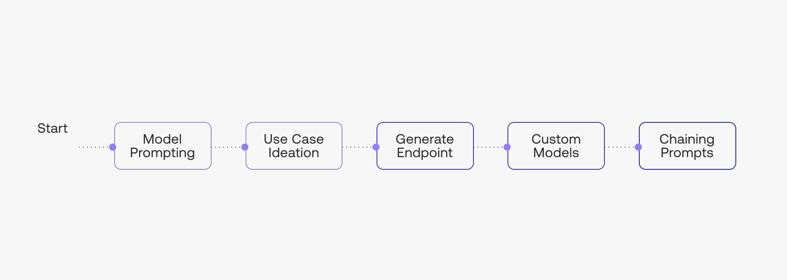

The following chapters are about prompt engineering.

Here is what we’ll cover throughout the next few chapters:

- Prompt Engineering
- Use Case Ideation
- The Generate Endpoint
- Creating Custom Models
- Chaining Prompts

