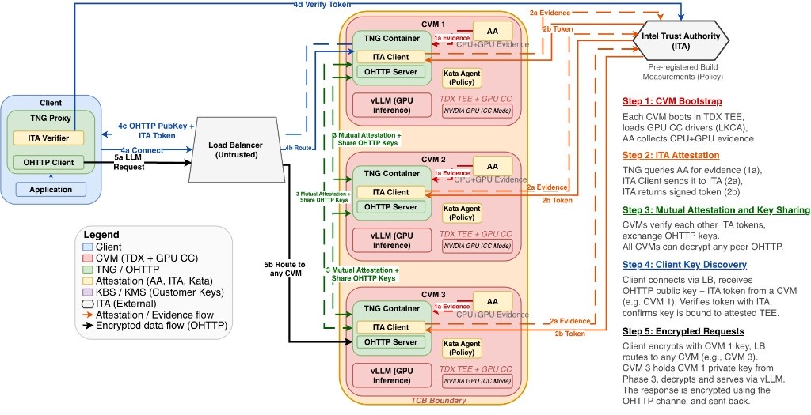

Remote attestation lets you cryptographically confirm that a Model Vault Encrypted deployment is a
genuine trusted execution environment (TEE) running the exact code you expect, before you send any
data. It turns "trust us" into "verify it yourself."

For background on TEEs, see the
[Confidential Computing Primer](/docs/model-vault/encrypted/confidential-computing).

## What attestation proves

When a TEE starts, the hardware measures what is loaded into it and produces a signed **attestation
report**. Model Vault Encrypted uses **composite attestation** that covers both the CPU and the GPU,
answering three questions:

- **Is this genuine TEE hardware?** The evidence is rooted in keys embedded by the hardware manufacturers (Intel for the TDX CPU, NVIDIA for the GPU), so it cannot be forged by software pretending to be a secure environment.
- **Is it configured securely?** The report confirms the security-critical configuration: that the Intel TDX VM is not debuggable, that the GPU booted with secure boot enabled and debug disabled, and that confidential-computing mode is active.
- **Is it running the expected code?** The report contains cryptographic measurements (in effect, a fingerprint) of the firmware, kernel, inference workload, and container policy that were loaded, plus the GPU's firmware and driver measurements. If anything differs, the fingerprint differs.

## The Passport model with Intel Trust Authority

Model Vault Encrypted uses the **Passport attestation model**. Each confidential VM obtains a signed
attestation token (its "passport") from **Intel Trust Authority (ITA)**, an external attestation
service operated by Intel. Clients and peers then verify that passport rather than re-evaluating raw
hardware evidence themselves.

End-to-end encryption between the client and the deployment uses **Oblivious HTTP (OHTTP)**, so the
load balancer and network only ever see ciphertext. The OHTTP keys are generated inside the confidential
VMs and are never shared with Cohere.

### Components

- **Client**: runs a **TNG proxy** that handles OHTTP encryption/decryption and attestation verification. The proxy embeds an **ITA verifier** that uses ITA's public keys to confirm attestation tokens were genuinely signed by ITA. The client never talks to a confidential VM directly; all traffic goes through the load balancer.
- **Untrusted load balancer**: a standard cloud load balancer that routes OHTTP traffic. It is **not** part of the trusted computing base and cannot read, modify, or decrypt any payload. In OHTTP the payload stays encrypted while headers remain in the clear, so the model name is promoted to a header to let the load balancer route to the right pool of nodes.
- **Confidential VM (PeerPod), N replicas**: an Intel TDX confidential VM with an NVIDIA GPU passed through in confidential-computing mode. Inside it run:
  - **Kata Agent**: enforces the container policy delivered via `initdata`, restricting which container images, configuration, processes, and syscalls are allowed.
  - **Attestation Agent (AA)**: collects composite CPU (TDX) + GPU (confidential-computing) evidence at boot.
  - **TNG container**: contains the ITA client, the OHTTP server, and key management. It acquires attestation tokens, performs mutual attestation with peers, handles OHTTP encryption/decryption, and rotates OHTTP keys.
  - **vLLM container**: runs model inference on the confidential CPU and GPU.
- **Intel Trust Authority (ITA)**: validates the authenticity of CPU + GPU evidence against the hardware vendors' keys, verifies it against a pre-registered policy of expected build measurements, and issues a signed token that binds to the TEE's measurements (MRTD, RTMRs, GPU firmware).

## End-to-end attestation and request flow

<Steps>
### Confidential VM bootstrap

The VM boots as a TDX-enabled confidential VM with GPU passthrough. The image boots from a read-only
`squashfs` root protected by `dm-verity`, and the Kata Agent enforces the container policy from
`initdata`. The NVIDIA driver establishes an SPDM-authenticated, encrypted channel to the GPU, and the
GPU enters confidential-computing mode (locked on). The TNG and vLLM containers start. At this point the
VM is running but not yet attested.

### ITA attestation (per VM)

The TNG container generates an OHTTP key pair locally and asks the Attestation Agent to collect
composite TDX + GPU evidence with the OHTTP public key bound into it. The ITA client sends this
evidence to ITA, which validates authenticity against the hardware vendors' keys and checks it against
the registered policy (PodVM image hash, kernel and `initrd` measurements, firmware versions, and
confidential-computing mode state for both the CPU and GPU). If it matches, ITA returns a signed token.
The token is refreshed periodically.

### Mutual attestation and OHTTP key sharing

Once attested, replicas discover each other through a **Serf gossip** mesh. Each presents its
ITA-signed token, and each peer verifies it against ITA's published signing keys (JWKS), confirming the
peer runs an identical approved stack on verified hardware. Only after this mutual check do verified
peers exchange their OHTTP key pairs over the attested channel, and they keep exchanging keys as they
rotate. In other words, a replica only shares its keys with peers it has cryptographically confirmed to
be genuine, attested CVMs. These keys live and move only inside the trusted environment; Cohere and the
host never have access to them. As a result, any verified replica can decrypt a request that was
encrypted to any other verified replica's public key, which lets the load balancer route freely and
lets the fleet scale dynamically.

### Client key discovery

The client's TNG proxy connects through the load balancer, which routes the first request to one VM
(say, replica #1). That VM returns its OHTTP public key and its ITA attestation token. The client's ITA
verifier confirms the token is validly signed by ITA and that the OHTTP public key is cryptographically
bound to the attested TEE in the token. The client now trusts that key, and because keys are shared only
among mutually attested replicas, trusting one attested replica means the client can trust any replica
that holds the matching key, without re-attesting against each one individually.

### Encrypted request serving

The client encrypts the request with OHTTP using the attested public key and sends it through the load
balancer. The payload stays encrypted end to end; only selected routing metadata, such as the model
name, is exposed in the OHTTP headers so the load balancer can route to the right pool of nodes. The
load balancer may route the request to any available replica (say, replica #3). That replica already
holds the matching private key (from the key-sharing step), decrypts the request inside the confidential
environment, runs inference in the vLLM container on the confidential GPU, encrypts the response with
OHTTP, and returns it. The client's TNG proxy decrypts the response. The load balancer never sees
plaintext at any point.
</Steps>

## How Intel Trust Authority verifies

ITA issues each attestation token as a **JSON Web Token (JWT) signed with PS384**. Your client verifies
that token's signature against ITA's published public keys (JWKS), so it can confirm the result without
trusting Cohere or the host. A non-empty set of matched policies is the single most important signal: it
means the hardware was genuine and the measured software matched the approved values. If the policy did
not match, no token is issued and the client fails closed.

<Note title="Verifying the verifier">
Intel also offers a **Faithful Verification** service: you can submit an attestation token to Intel and
receive cryptographic proof (SGX quotes) that every ITA microservice that issued it was running
unmodified code inside genuine Intel SGX enclaves. This protects you even against a compromised or rogue
attestation operator.
</Note>

## Binding the connection to the environment

Attestation also protects against a host that tries to sit in the middle of the connection and
impersonate the environment:

- At startup, the confidential VM generates an OHTTP encryption key pair. The private key stays inside the TEE's protected memory, and the public key is bound into the attestation evidence (carried in the report's data field).
- The client encrypts requests to the attested public key, so only a genuine, attested TEE can decrypt them.

Because the public key is covered by the signed attestation, the client knows the key really belongs to
the attested environment and not to the host or load balancer. Possessing a shared OHTTP private key is
itself proof of having passed attestation, which is how trust extends across the replica fleet without
re-attesting on every request.

## Matching measurements to expected code

A fingerprint is only meaningful if you know what it is supposed to be. The ITA policy encodes the
expected measurements for a given software version, produced by a reproducible build of the vault image
and registered before deployment, so a passing attestation means your vault is running exactly that
approved stack. The token also reports supporting detail you can inspect, such as the TDX measurement
registers (MRTD, RTMR0 to RTMR3), the GPU firmware and driver measurement results, the TEE's
security-version and patch level, and the policy that was evaluated. See
[Verifying Your Deployment](/docs/model-vault/encrypted/verifying-deployment) for what each field means.

## When attestation runs

- **Per session**: the client verifies attestation before exchanging any data, and **fails closed** (it refuses to connect) if the evidence is invalid or the measurements do not match.
- **Short-lived and refreshed**: attestation tokens are valid for only a few minutes and are refreshed periodically, so the result reflects the environment's current state rather than a one-time check at deploy time.
- **In the dashboard**: an encrypted vault carries a verification badge that reflects its current attestation status, so you can see it at a glance alongside your other vaults.
- **Available through the API**: verification is not limited to the dashboard. Every inference response can include an attestation certificate that your client can check programmatically, confirming proof of the policy, CPU, GPU, and software before you trust a response.

## Related pages

- [Verifying Your Deployment](/docs/model-vault/encrypted/verifying-deployment)
- [Security Model](/docs/model-vault/encrypted/security-model)
- [Confidential Computing Primer](/docs/model-vault/encrypted/confidential-computing)
