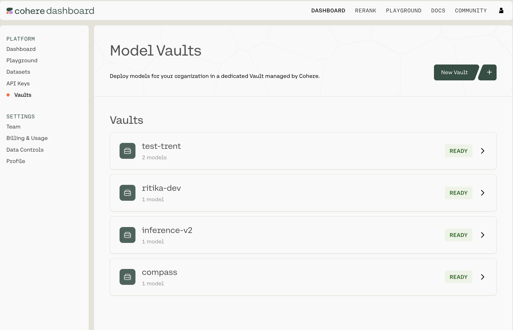

All of your vaults live in one place. Navigate to
[https://dashboard.cohere.com/](https://dashboard.cohere.com/) and select **Vaults** from the
left-hand menu.

This opens the **Model Vaults** page, where you can:

- View and manage existing Vaults — both Standard and Encrypted
- Create new Vaults

Each Vault will have a status tag with one of the following values:

- Pending
- Deploying
- Ready
- Degraded

<Note>
Encrypted vaults also carry a verification badge that reflects their
[remote attestation](/docs/model-vault/encrypted/attestation) status — see
[Encrypted Vaults](/docs/model-vault/encrypted).
</Note>

## Next steps

- [Creating a Vault](/docs/model-vault/creating-a-vault)
- [Managing Vaults](/docs/model-vault/managing-vaults)
