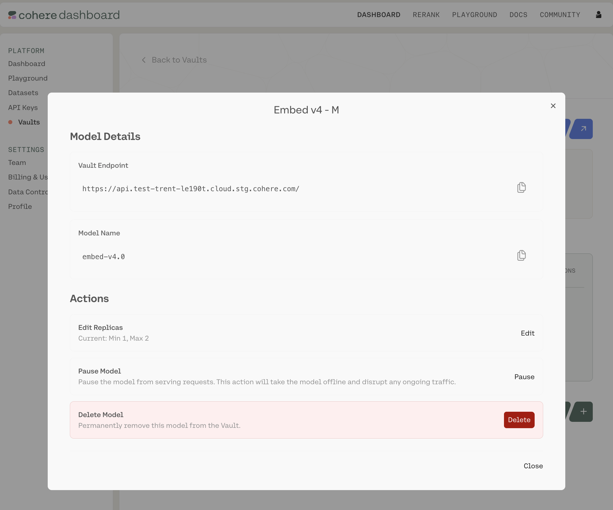

Clicking into any of the Vaults opens up a summary page like this:

You can see the URL (which you'll need to interact with this Vault over an API), the Vault's status,
when it was last updated, which models it contains, and the configuration details for each.

For each row, there is a gear icon under the `Actions` column. Clicking it opens a pop-up model card
with model-specific information:

Here, you can:

- Copy various pieces of technical information (the API endpoint for this Vault, the model name, etc.)
- Edit the model configuration (changing the minimum and maximum replicas)
- Pause/resume the model (CAUTION: pausing shuts down the model's replicas and halts all ongoing traffic)
- Delete the model

<Note>
For encrypted vaults, editing or resuming re-attests the deployment, and clients re-verify
[remote attestation](../../docs/model-vault/encrypted/attestation) on the next connection.
</Note>

## Next steps

- [Calling a Vault over the API](../../docs/model-vault/standard/api-access)
- [Monitoring](../../docs/model-vault/monitoring)
