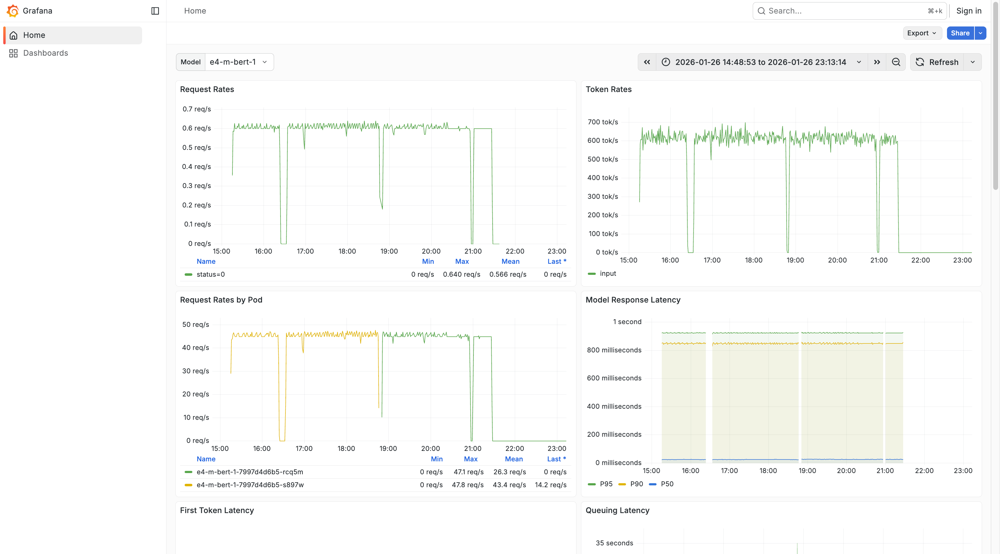

If you click into a Vault, you will see a `Monitoring` button in the top-right corner. Clicking it
opens a Grafana dashboard which offers various analytics into the performance of this particular
Vault, such as:

- First Token Latency
- Queuing Latency
- Average GPU Duty Cycle
- Etc.

This lets you gather analytics related to specific models, modify the time range over which your
analytics are gathered, inspect various on-page graphs, or export and share your data.

You can change the model with the `Model` dropdown in the top-left corner, use the **Search** bar at
the top of the screen to find particular pieces of information quickly and easily, and refresh your
data by clicking **Refresh** at the top of the screen.

<Note>
Performance monitoring is available for all vaults. For encrypted vaults, these operational metrics
are derived from infrastructure telemetry and do not expose the contents of your prompts or responses,
which remain protected inside the trusted execution environment.
</Note>

## Next steps

- [Managing Vaults](/docs/model-vault/managing-vaults)
- [Calling a Vault over the API](/docs/model-vault/standard/api-access)
