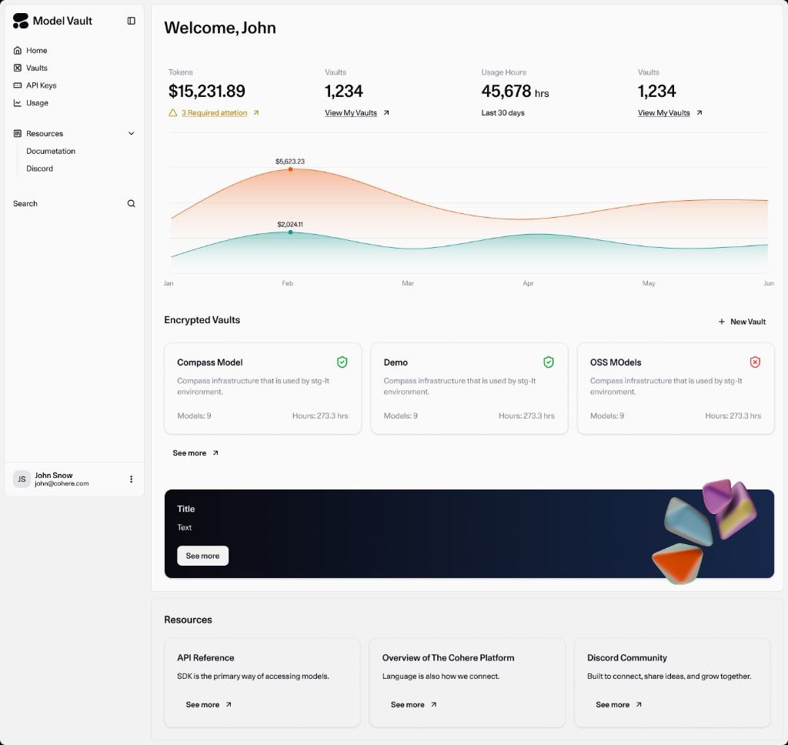
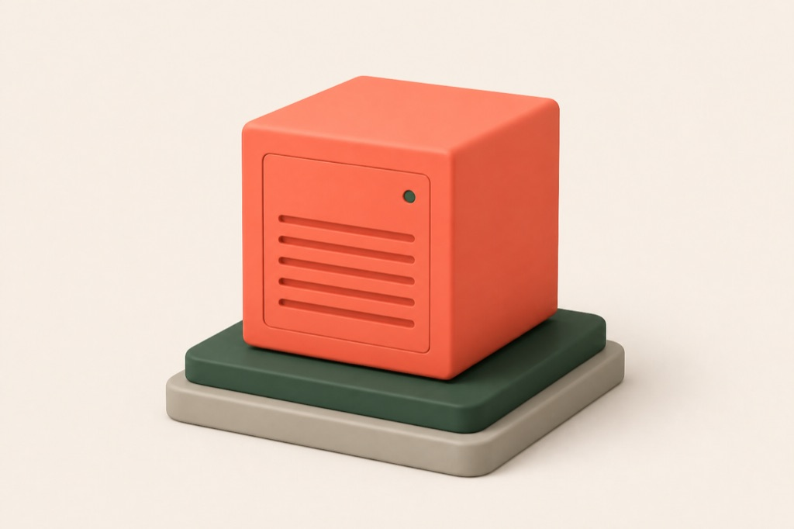

Model Vault is a Cohere-managed inference environment for deploying and serving Cohere models in an
isolated, single-tenant setup. It provides dedicated infrastructure with full control over model
selection, scaling, and performance monitoring, without you operating the underlying serving stack.

Because your infrastructure isn't shared with other tenants, you get the security and isolation of
private hosting with the convenience of an API: no noisy neighbors, no rate limits, and predictable
performance at scale.

You manage all of your vaults in one place from the Model Vault app, where you can track spend, usage
hours, and activity across them. Model Vault comes in two types, **Standard** and **Encrypted**. The
deployment and management experience is the same; the only difference is the level of data protection
(see [how they compare](#how-they-compare) below).

  

    

      
      
      
      vault.cohere.com
    

    
  

## Why Model Vault

  

    
    

      <h3>Dedicated and single-tenant</h3>
      
Your load balancer, serving middleware, inference servers, and GPU accelerators are dedicated to you, so there are no noisy neighbors competing for capacity.

    

  

  

    
    

      <h3>Fully managed</h3>
      
Create a vault from the Model Vault app and let Cohere handle maintenance, deployments, updates, and scaling. There's no serving stack for you to operate.

    

  

  

    
    

      <h3>Models and performance tiers</h3>
      
Pick a model and a size tier (S, M, L, XL) to match your latency and throughput needs.

    

  

  

    
    

      <h3>Elastic, unthrottled capacity</h3>
      
Set a minimum and maximum replica range (1–25 per model), with autoscaling available. You get dedicated throughput with no rate limits, and only pay for what you use.

    

  

  

    
    

      <h3>Built for production</h3>
      
Real-time monitoring of request rates, latency, token throughput, and GPU utilization helps you tune capacity for production workloads.

    

  

  

    
    

      <h3>Standalone or with North</h3>
      
Call a vault directly over the API, or use it as the inference backend for <a href="/docs/model-vault/model-vault-with-north">North</a>.

    

  

## How it works

<Steps>
### Create a vault

In the [Model Vault app](/docs/model-vault/vault-home), [create a vault](/docs/model-vault/creating-a-vault): name it, choose a model and performance tier, and set its replica range.

### Get your endpoint

Once the vault is `Ready`, copy its **endpoint URL** and **model name** from the vault's details page (see [Managing Vaults](/docs/model-vault/managing-vaults)).

### Call it with the Cohere SDK

Point the SDK's `base_url` at your vault endpoint and send chat, embed, or rerank requests (see [Calling a Vault over the API](/docs/model-vault/standard/api-access)).
</Steps>

## Two types of vault

  <a className="mv-card" href="/docs/model-vault/standard">
    
    

      <h3>Standard Vault</h3>
      
A Cohere-managed, single-tenant deployment with data protected in transit and at rest. Best when you want dedicated inference without managing the serving stack.

    

    EXPLORE STANDARD VAULT →
  </a>
  <a className="mv-card" href="/docs/model-vault/encrypted">
    
    

      <h3>Encrypted Vault</h3>
      
Everything in a Standard Vault, plus confidential computing: prompts, responses, and everything in between stay protected end to end inside hardware-backed trusted execution environments, with verifiable remote attestation. Best for regulated or highly sensitive workloads.

    

    EXPLORE ENCRYPTED VAULT →
  </a>

## How they compare

| | Standard Vault | Encrypted Vault |
| --- | --- | --- |
| Managed, single-tenant deployment | Yes | Yes |
| Home page, monitoring, usage & billing | Yes | Yes |
| Use standalone or with North | Yes | Yes |
| Data protected in transit and at rest | Yes | Yes |
| Data protected **in use** (confidential computing) | No | Yes |
| Verifiable **remote attestation** | No | Yes |
| Compliance support (GDPR, HIPAA, SOC 2) | Supported | Supported, plus verifiable attestation evidence |
| Supported models | [Standard vault models](/docs/model-vault/standard/supported-models) | [Encrypted vault models](/docs/model-vault/encrypted/supported-models) |
| Pricing | [Standard vault pricing](/docs/model-vault/standard/pricing) | [Encrypted vault pricing](/docs/model-vault/encrypted/pricing) |

## How this documentation is organized

Start with the shared sections that cover the day-to-day flow for **every vault**, regardless of type:

- **Deploy & manage**: [Home Page](/docs/model-vault/vault-home), [Creating a Vault](/docs/model-vault/creating-a-vault), and [Managing Vaults](/docs/model-vault/managing-vaults).
- **Operate & observe**: [Monitoring](/docs/model-vault/monitoring).

Then dive into the section for your vault type for what's specific to it, including how to call it over
the API:

- **[Standard Vault](/docs/model-vault/standard)**: supported models, [calling the API](/docs/model-vault/standard/api-access) (Cohere SDK, raw HTTP, or OpenAI-compatible), and pricing.
- **[Encrypted Vault](/docs/model-vault/encrypted)**: supported models, [calling the API](/docs/model-vault/encrypted/api-usage) through the attestation-verifying Cohere OHTTP proxy, the confidential-computing deep dive (confidential computing, security model, remote attestation, key management, compliance), and pricing.

And to connect a vault to North:

- **[Model Vault with North](/docs/model-vault/model-vault-with-north)**: use a vault as the inference backend for North.

## Get started

- New to Model Vault? Start with the [Quickstart](/docs/model-vault/quickstart).
- Need confidential computing? See [Encrypted Vaults](/docs/model-vault/encrypted).
